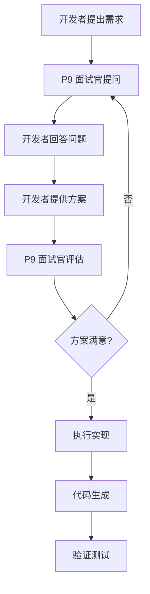

# 📘 最佳用法五：P9 面试官模式

> **面试引导 → 方案评估 → 优化建议 → 执行实现**  
> **适用场景**: 需要技术决策、希望提升技术思维的任务

---

## 📋 核心理念

**从"执行者"到"引导者"的思维升级**

传统模式：开发者说需求 → AI 直接执行
面试官模式：开发者说需求 → AI 提问引导 → 开发者思考方案 → AI 评估优化 → 共同实现

---

## 🎯 使用场景

| 场景 | 是否适合面试官模式 | 原因 |
|------|------------------|------|
| 简单 CRUD | ❌ | 需求明确，无需引导 |
| 复杂业务逻辑 | ✅ | 需要考虑边界情况 |
| 架构设计 | ✅ | 需要权衡多种方案 |
| 性能优化 | ✅ | 需要深入分析瓶颈 |
| 并发处理 | ✅ | 需要设计防护策略 |
| 新技术选型 | ✅ | 需要评估优缺点 |

---

## 🔄 工作流程



---

## 💡 使用示例

### 示例 1：实现订单创建功能

**开发者**: 我要实现一个订单创建功能。

**P9 面试官**:
> 好的，在开始设计之前，我想先了解几个问题：
> 
> 1. **订单创建的核心流程是什么？** 比如，是从购物车创建，还是直接购买？
> 2. **库存扣减的时机是什么？** 创建时扣减，还是支付后扣减？
> 3. **如何处理并发下单？** 比如，库存只剩1件，但有10个人同时下单。
> 4. **订单金额如何计算？** 是否涉及优惠券、满减等复杂计算？
> 
> 请先回答这些问题，然后给出你的技术方案。

**开发者**: 
> 1. 从购物车创建
> 2. 创建时扣减库存
> 3. 使用 Redis 分布式锁
> 4. 需要支持优惠券

**开发者提供方案**:
> 我的方案是：
> - 使用 DB::transaction 保证原子性
> - 使用 Redis 分布式锁防止并发
> - 订单号使用 Redis 原子递增
> - 金额计算在 Service 层处理

**P9 面试官评估**:
> 感谢你的方案，我来分析一下：
> 
> **优点：**
> - ✅ 使用了事务保证数据一致性
> - ✅ 考虑了并发控制
> 
> **待优化：**
> - ⚠️ Redis 分布式锁需要考虑锁超时和死锁问题
> - ⚠️ 订单号生成需要考虑 Redis 故障时的降级方案
> - ⚠️ 建议将库存扣减拆分为独立的服务
> 
> **我的建议：**
> ```
> 1. 分布式锁：使用 Redis SETNX + 过期时间 + 唯一标识
> 2. 订单号：Redis 原子递增 + 数据库唯一索引双重保障
> 3. 库存扣减：乐观锁 + 悲观锁组合策略
> 4. 幂等性：基于请求ID的幂等键
> ```
> 
> 你觉得这个建议如何？如果没问题，我们可以开始实现了。

---

### 示例 2：设计库存扣减方案

**开发者**: 我要设计一个库存扣减方案，需要支持高并发。

**P9 面试官**:
> 高并发库存扣减是个经典问题，让我先了解几个关键点：
> 
> 1. **预期的并发量是多少？** 比如，每秒多少个扣减请求？
> 2. **库存扣减的业务场景是什么？** 是秒杀、普通下单、还是预售？
> 3. **对一致性的要求是什么？** 允许超卖吗？还是必须精确扣减？
> 4. **现有技术栈是什么？** Redis、MySQL、消息队列等
> 
> 这些信息会影响方案选择。

**开发者**: 
> 1. 每秒约1000个请求
> 2. 普通下单场景
> 3. 不允许超卖，必须精确扣减
> 4. 使用 Redis 7.0 + MySQL 8.0

**P9 面试官**:
> 明白了，基于你的场景，我推荐以下方案：
> 
> **方案：Redis 预扣减 + MySQL 最终一致**
> 
> ```
> 1. 预扣减：用户下单时，先在 Redis 中扣减库存
> 2. 订单创建：Redis 扣减成功后，创建订单
> 3. 最终一致：支付成功后，同步到 MySQL
> 4. 补偿机制：定时任务检查 Redis 和 MySQL 的差异
> ```
> 
> **为什么选择这个方案？**
> - Redis 单线程模型天然保证原子性
> - 预扣减可以快速响应用户
> - 最终一致性足够满足业务需求
> 
> **风险点：**
> - Redis 故障时如何处理？（降级到 MySQL 悲观锁）
> - 如何防止超卖？（Lua 脚本原子操作）
> 
> 你觉得这个方案如何？

---

## 📊 评估维度

| 维度 | 权重 | 评估要点 |
|------|------|---------|
| **正确性** | 30% | 方案是否能满足需求 |
| **性能** | 25% | 方案的性能表现 |
| **可维护性** | 20% | 代码的可读性和可维护性 |
| **可扩展性** | 15% | 方案的扩展能力 |
| **安全性** | 10% | 方案的安全考虑 |

---

## 🔧 提问框架

### 第一轮：理解需求
```
1. 这个需求的核心目标是什么？
2. 有哪些关键的业务约束？
3. 预期的用户量/并发量是多少？
4. 有哪些技术约束（现有架构、团队技能等）？
```

### 第二轮：方案设计
```
1. 你打算如何实现这个功能？
2. 为什么选择这个方案而不是其他方案？
3. 这个方案的核心数据流是什么？
4. 如何处理边界情况和异常？
```

### 第三轮：深度追问
```
1. 如果并发量增加10倍，你的方案还能支撑吗？
2. 这个方案的性能瓶颈在哪里？
3. 如何保证数据一致性？
4. 监控和报警如何设计？
```

### 第四轮：方案评估
```
1. 你的方案有哪些优点？
2. 有哪些潜在的风险或缺点？
3. 如果重新设计，你会做什么不同的选择？
4. 这个方案的可扩展性如何？
```

---

## 🎯 总结

| 模式 | 适用场景 | 优点 | 缺点 |
|------|---------|------|------|
| **直接执行** | 需求明确、技术清晰 | 快速、高效 | 缺乏思考过程 |
| **面试引导** | 需要技术决策、希望提升 | 深入、全面 | 耗时较长 |

**建议：**
- 简单任务使用直接执行模式
- 复杂任务使用面试引导模式
- 定期使用面试引导模式提升技术思维

---

**版本**: v1.0 | **更新日期**: 2026-04-27
