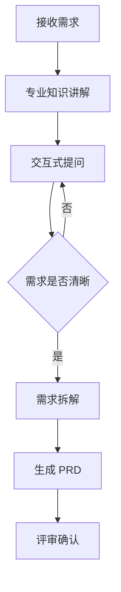

# 📘 模式四：需求分析模式

> **专业知识讲解 + 交互式澄清 + 结构化 PRD**

---

## 📋 概述

**适用场景**: 需求模糊，需要专业分析

**核心价值**: 
- 学习需求分析方法论
- 通过提问澄清模糊需求
- 输出结构化的 PRD 文档

---

## 🎯 工作流程



---

## 📝 使用方式

### 方式一：直接使用母版提示词

将以下提示词复制到 AI 工具：

```
我收到一个需求：{你的需求描述}

请帮我进行专业的需求分析：
1. 讲解需求分析的专业知识（5W2H、用户故事等）
2. 通过提问引导我澄清需求
3. 输出结构化的 PRD 文档
4. 讲解每个设计决策的原因

请开始提问。
```

### 方式二：分步引导

**步骤 1：需求理解**
```
我有一个需求：{需求描述}
请先用自己的话复述一下，确认你理解了需求。
```

**步骤 2：专业知识讲解**
```
请讲解需求分析的 5W2H 方法，并用这个方法分析我的需求。
```

**步骤 3：交互式澄清**
```
请通过提问帮我澄清需求中的模糊点。
```

**步骤 4：输出 PRD**
```
请基于澄清后的需求，输出结构化的 PRD 文档，包括：
- 业务目标
- 用户故事
- 验收标准
- 技术约束
```

---

## 💡 专业知识讲解

### 5W2H 分析法

| 要素 | 问题 | 示例 |
|------|------|------|
| **What** | 是什么？做什么？ | 订单管理系统 |
| **Why** | 为什么做？ | 提升订单处理效率 |
| **Who** | 谁来做？谁用？ | 管理员、用户 |
| **When** | 什么时候做？ | 2周内上线 |
| **Where** | 在哪里做？ | Web 端 |
| **How** | 怎么做？ | Laravel + Filament |
| **How much** | 做多少？成本？ | 3个核心模块 |

### 用户故事三要素

```
作为 <角色>
我想要 <功能>
以便 <价值>
```

**示例：**
```
作为 管理员
我想要 查看订单列表
以便 及时处理订单
```

### 验收标准 (Given-When-Then)

```
Given <前置条件>
When  <触发操作>
Then  <预期结果>
```

**示例：**
```
Given 订单状态为 pending
When  管理员点击"发货"按钮
Then  订单状态变为 shipped
```

---

## 📊 输出示例

### 需求分析报告

```markdown
# 需求分析报告

## 📋 基本信息
- 需求名称: 订单管理系统
- 提出人: 运营经理
- 优先级: P0

## 🎯 业务目标
提升订单处理效率，减少人工操作

## 👥 目标用户
- 管理员：处理订单、发货
- 用户：下单、查看订单

## 📦 功能范围
### MVP 功能
1. 订单列表查看
2. 订单状态管理
3. 订单发货操作

### 后续迭代
1. 订单导出
2. 订单统计
3. 退款处理

## 📊 用户故事
### US-001: 查看订单列表
**作为** 管理员
**我想要** 查看订单列表
**以便** 及时处理订单

**验收标准：**
- Given 管理员进入订单页面
- When 页面加载完成
- Then 显示所有订单，支持筛选和排序

## 🔧 技术约束
- 性能要求: 列表响应 < 500ms
- 安全要求: 仅管理员可访问
```

---

**版本**: v1.0 | **更新日期**: 2026-04-27
