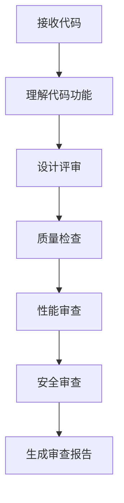

# 📘 模式五：Code Review 模式

> **专业知识讲解 + 四维度审查 + 优化建议**

---

## 📋 概述

**适用场景**: 代码已完成，需要质量审查

**核心价值**:
- 学习 Code Review 专业知识
- 从四个维度审查代码
- 获取具体的优化建议

---

## 🎯 工作流程



---

## 📝 使用方式

### 方式一：完整审查

```
请对以下代码进行 Code Review：

{粘贴代码}

要求：
1. 讲解 Code Review 的专业知识
2. 从设计、质量、性能、安全四个维度审查
3. 给出具体的改进建议
4. 对比优化前后的代码

请开始审查。
```

### 方式二：特定维度审查

```
请从性能角度审查以下代码：

{粘贴代码}

重点关注：
1. 数据库查询效率
2. 缓存使用
3. 并发处理

请给出优化建议。
```

### 方式三：对比审查

```
请对比以下两种实现方式，选择更优的方案：

方案 A:
{代码 A}

方案 B:
{代码 B}

请从设计、性能、可维护性三个维度对比。
```

---

## 💡 专业知识讲解

### Code Review 四个维度

| 维度 | 评估要点 | 常见问题 |
|------|---------|---------|
| **设计合理性** | 架构设计、职责分离、扩展性 | 违反 SOLID 原则 |
| **代码质量** | 规范性、可读性、复杂度 | 命名不清晰、方法过长 |
| **性能** | 查询效率、并发处理、缓存 | N+1 查询、缺少索引 |
| **安全性** | 权限控制、数据验证、SQL注入 | 未验证输入、未转义输出 |

### 评分标准

```
⭐⭐⭐⭐⭐ (5分) - 优秀：完全符合最佳实践
⭐⭐⭐⭐ (4分) - 良好：有小问题可优化
⭐⭐⭐ (3分) - 一般：有明显问题需要改进
⭐⭐ (2分) - 较差：存在严重问题
⭐ (1分) - 很差：需要重写
```

### 审查检查清单

**设计检查：**
- [ ] 是否遵循单一职责原则？
- [ ] 是否遵循开闭原则？
- [ ] 职责分离是否清晰？

**代码质量检查：**
- [ ] 命名是否清晰？
- [ ] 方法长度是否合理？
- [ ] 是否有重复代码？

**性能检查：**
- [ ] 是否有 N+1 查询？
- [ ] 是否有缓存优化空间？
- [ ] 是否有并发问题？

**安全检查：**
- [ ] 是否有 SQL 注入风险？
- [ ] 是否有 XSS 漏洞？
- [ ] 权限控制是否完善？

---

## 📊 输出示例

### Code Review 报告

```markdown
## 📋 Code Review 报告

### 基本信息
- 审查范围: OrderService.php
- 代码行数: 150 行

### 总体评分
- 设计合理性: ⭐⭐⭐⭐ (4/5)
- 代码质量: ⭐⭐⭐⭐ (4/5)
- 性能: ⭐⭐⭐ (3/5)
- 安全性: ⭐⭐⭐⭐⭐ (5/5)
- **综合评分: 4.0/5**

### 优点
1. ✅ 使用了依赖注入
2. ✅ 异常处理完善
3. ✅ 类型声明完整

### 问题

#### 🔴 严重问题
1. **N+1 查询**
   - 文件: OrderService.php:45
   - 问题: 循环中查询用户信息
   - 建议: 使用 with('user') 预加载

#### 🟡 建议改进
1. **方法过长**
   - 文件: OrderService.php:80
   - 建议: 拆分为更小的方法

### 优化前后对比

#### 优化前
```php
$orders = Order::all();
foreach ($orders as $order) {
    echo $order->user->name;
}
```

#### 优化后
```php
$orders = Order::with('user')->get();
foreach ($orders as $order) {
    echo $order->user->name;
}
```
```

---

**版本**: v1.0 | **更新日期**: 2026-04-27
