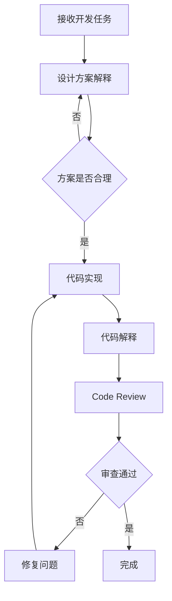

# 📘 BestPractice 最佳用法指南

> **基于 doc/ 目录文档** | **强制面试模式** | **设计原理解释 + Code Review**

---

## 📋 文档结构

```
doc/
├── BestPractice/                    # 最佳实践指南
│   ├── README.md                    # 本文档（总结）
│   ├── 00-overview.md               # 三种用法对比总结
│   ├── 01-prd-to-code.md            # 用法一：基于 PRD 快速开发
│   ├── 02-new-requirement-workflow.md    # 用法二：新需求的提示词设计
│   ├── 03-prompt-assembly-quickref.md    # 提示词组装速查手册
│   ├── 04-ai-ide-integration.md     # AI IDE 集成指南
│   └── 05-p9-interviewer-mode.md    # 用法三：P9 面试官模式
│
└── design/                          # 系统架构与设计
    ├── 01-architecture-spec.md      # 系统架构规范
    └── 02-testing-strategy.md       # 软件测试方案与最佳实践
```

---

## 🎯 核心理念

### 每一次开发任务都是一次技术面试

> "不仅要写出代码，更要讲清楚为什么这样设计"

### 强制规则

```yaml
rules:
  - rule: "每次开发前必须解释设计方案"
    description: "在写代码前，先说明整体设计思路"
    
  - rule: "每个关键决策必须解释原因"
    description: "为什么选择这个方案而不是其他方案"
    
  - rule: "必须说明数据流向"
    description: "数据从哪里来，到哪里去，如何转换"
    
  - rule: "必须说明异常处理"
    description: "边界情况、错误处理、降级策略"
    
  - rule: "必须说明性能考虑"
    description: "时间复杂度、空间复杂度、并发处理"
    
  - rule: "代码完成后必须进行 Code Review"
    description: "审查代码质量、设计合理性、性能、安全"
```

---

## 🔄 强制工作流程



---

## 📝 强制输出格式

### 每次开发必须输出

```markdown
## 🎯 设计方案

### 1. 需求理解
{用自己的话复述需求，确认理解正确}

### 2. 整体架构
{画出架构图或数据流图}

### 3. 核心设计决策
| 决策点 | 选择方案 | 为什么选择 | 为什么不用其他方案 |
|--------|---------|-----------|-------------------|
| {决策1} | {方案A} | {原因} | {方案B的缺点} |

### 4. 数据模型设计
{ER图或表结构设计}

### 5. 接口设计
{API接口定义}

### 6. 异常处理
{边界情况和错误处理策略}

### 7. 性能考虑
{时间复杂度、并发处理、缓存策略}

---

## 💻 代码实现

### 1. 核心代码
{实现代码}

### 2. 代码解释
{解释关键代码的设计思路}

---

## 🔍 Code Review

### 审查报告
{代码审查结果}
```

---

## 🎭 三种用法

### 用法一：基于 PRD 快速开发

**适用场景**: 项目启动初期，已有 PRD 文档

**核心流程**:
```
PRD 文档（已有） → 按模块拆解 → 设计方案解释 → 代码实现 → Code Review
```

**详细指南**: [01-prd-to-code.md](./01-prd-to-code.md)

---

### 用法二：新需求的提示词设计

**适用场景**: 收到新需求后，快速定义需求并开发实现

**核心流程**:
```
新需求输入 → 需求拆解 → PRD 生成 → 设计方案解释 → 代码实现 → Code Review
```

**详细指南**: [02-new-requirement-workflow.md](./02-new-requirement-workflow.md)

---

### 用法三：P9 面试官模式

**适用场景**: 需要技术决策、希望提升技术思维的任务

**核心流程**:
```
开发者提出需求 → P9 面试官提问 → 开发者回答 → 开发者提供方案 → P9 面试官评估优化 → 代码实现 → Code Review
```

**详细指南**: [05-p9-interviewer-mode.md](./05-p9-interviewer-mode.md)

---

## 🧪 测试方案

### 完整测试策略文档

**位置**: [doc/design/02-testing-strategy.md](../design/02-testing-strategy.md)

**核心内容**:
- ✅ 测试金字塔设计（Unit 70% + Integration 25% + E2E 5%）
- ✅ 数据库迁移管理方案（避免清空生产库）
- ✅ DDD 分层测试实践（Service/API/Filament）
- ✅ CI/CD 集成方案（GitHub Actions）
- ✅ 性能与安全测试

**快速参考 Skill**: [.ai/skills/testing-best-practices/SKILL.md](../../.ai/skills/testing-best-practices/SKILL.md)

---

## 📊 效率提升

| 指标 | 传统方式 | 使用提示词库 | 提升 |
|------|---------|------------|------|
| 需求定义时间 | 2天 | 0.5天 | 75% |
| 代码生成时间 | 5天 | 2天 | 60% |
| 测试编写时间 | 2天 | 0.5天 | 75% |
| 总体开发周期 | 2周 | 3天 | 78% |

---

**版本**: v3.0 | **更新日期**: 2026-04-27
