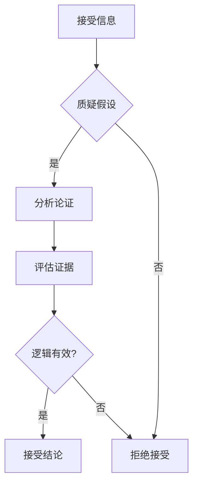
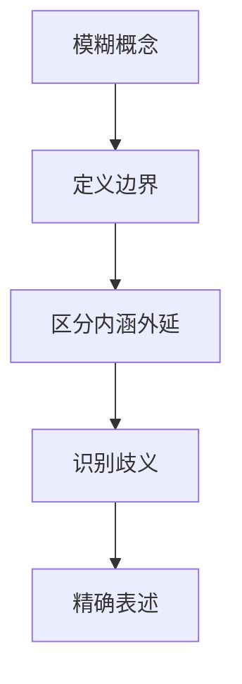
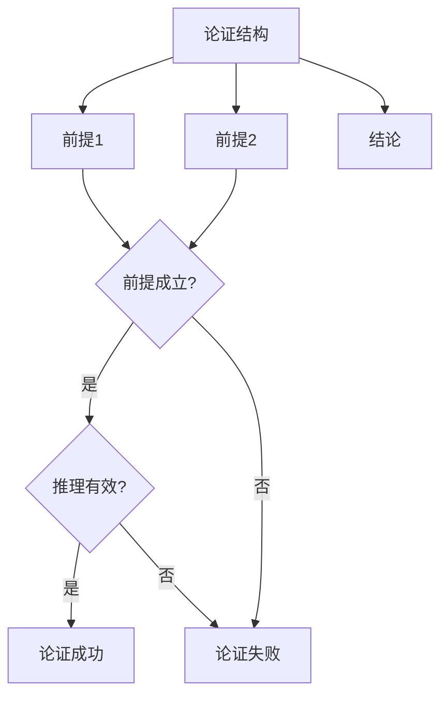
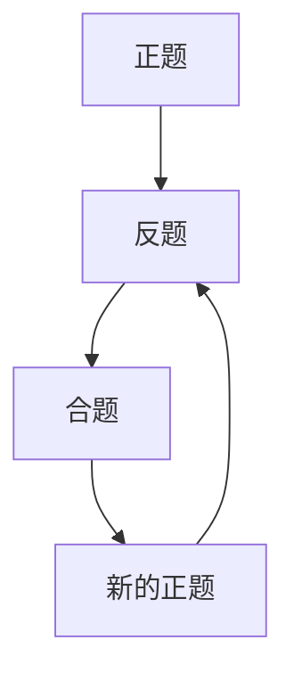
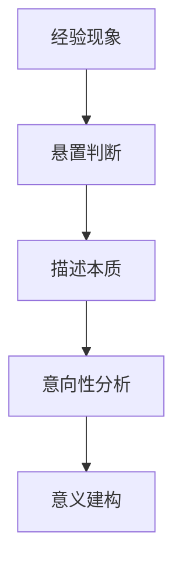

# 🧠 哲学思维方法论

> **哲学门类** | **批判性思维** | **概念分析** | **论证方法**

---

## 📋 概述

**学科定义：** 研究存在、知识、价值、理性等基本问题的学科

**核心价值：** 提供思考问题的基本框架和方法论

---

## 🎯 外行人常误解的常识

### 误区 1：哲学就是"空想"

**误解：** 哲学是脱离实际的空想，没有实用价值

**事实：**
> 哲学是最实用的学科之一，它提供了：
> - 清晰思考的工具
> - 论证推理的方法
> - 概念分析的框架
> - 价值判断的标准

**哲学家观点：**
> "未经审视的人生不值得过。" —— 苏格拉底

---

### 误区 2：哲学没有标准答案

**误解：** 哲学问题没有对错之分

**事实：**
> 虽然哲学问题可能没有唯一答案，但有：
> - 逻辑上一致的答案
> - 有充分论据支持的答案
> - 能够经受批判性审视的答案

---

### 误区 3：哲学与科学对立

**误解：** 哲学和科学是两种对立的认知方式

**事实：**
> 哲学与科学是互补的：
> - 科学回答"是什么"和"如何做"
> - 哲学回答"为什么"和"应该怎样"
> - 科学提供方法，哲学提供框架

---

## 🔧 核心方法论

### 1. 批判性思维



**应用方法：**
```
1. 识别论证的前提
2. 检验前提是否成立
3. 分析推理过程是否有效
4. 评估证据是否充分
5. 得出合理结论
```

**示例：**
```
论证："所有天鹅都是白色的，所以这只天鹅是白色的"

批判性分析：
1. 前提："所有天鹅都是白色的" → 事实错误（有黑天鹅）
2. 结论：虽然逻辑有效，但前提错误
3. 结论：不可靠
```

---

### 2. 概念分析



**应用方法：**
```
1. 明确概念的内涵（本质属性）
2. 确定概念的外延（适用范围）
3. 识别概念的歧义
4. 建立概念之间的关系
```

**示例：**
```
概念："自由"

内涵分析：
- 消极自由：不受外部干涉
- 积极自由：能够自我实现

外延分析：
- 言论自由
- 行动自由
- 思想自由

歧义识别：
- "自由"在不同语境下含义不同
- 需要明确讨论的是哪种自由
```

---

### 3. 论证分析



**论证类型：**
| 类型 | 结构 | 示例 |
|------|------|------|
| **演绎论证** | 一般→特殊 | 所有人会死→苏格拉底是人→苏格拉底会死 |
| **归纳论证** | 特殊→一般 | 这只天鹅是白的→所有天鹅都是白的 |
| **类比论证** | A类似B | A有属性X→B类似A→B也有属性X |

---

### 4. 辩证法



**核心思想：**
- 任何观点都有其对立面
- 对立面的斗争推动发展
- 矛盾的统一产生新事物

**应用：**
```
正题：市场竞争促进效率
反题：市场竞争导致垄断
合题：适度竞争+政府监管
```

---

### 5. 现象学方法



**核心思想：**
- 悬置对事物的预设判断
- 直接描述事物的本质
- 分析意识的意向性结构

---

## 💡 跨界应用

### 1. 产品设计中的哲学思维

```
问题：如何设计一个"好"的产品？

哲学分析：
1. 定义"好"的内涵（功能好？体验好？价值好？）
2. 区分不同用户对"好"的理解
3. 找到各利益相关方的平衡点
4. 设计满足核心需求的产品
```

### 2. 商业决策中的逻辑论证

```
决策：是否进入新市场？

论证分析：
前提1：新市场规模为100亿（需验证）
前提2：我们有竞争优势（需验证）
前提3：竞争强度适中（需验证）
结论：应该进入新市场

批判性检验：
- 每个前提是否有充分证据？
- 推理过程是否有效？
- 有没有遗漏重要因素？
```

### 3. 问题定义中的概念分析

```
问题：用户留存率低

概念分析：
- "留存率"的定义是什么？（次日/7日/30日）
- "低"的标准是什么？（低于行业平均？低于历史数据？）
- "用户"的范围是什么？（新用户？所有用户？）

精确表述：
- 新用户7日留存率低于30%
```

---

## 📚 核心概念速查

| 概念 | 定义 | 应用场景 |
|------|------|---------|
| **演绎** | 从一般到特殊 | 逻辑推理 |
| **归纳** | 从特殊到一般 | 经验总结 |
| **类比** | A类似B | 创新借鉴 |
| **辩证** | 矛盾统一 | 问题分析 |
| **现象学** | 直面本质 | 用户研究 |
| **存在主义** | 自由选择 | 产品设计 |
| **实用主义** | 有效即真理 | 决策制定 |

---

**版本**: v1.0 | **更新日期**: 2026-04-30
