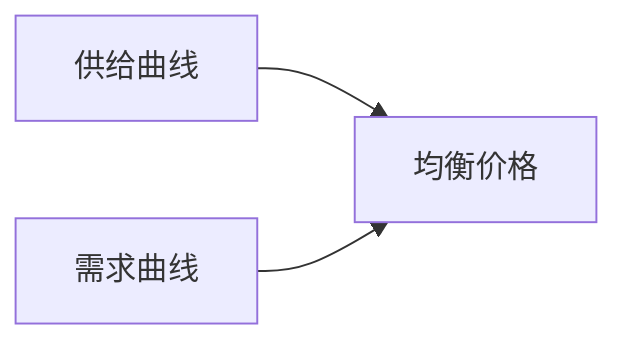
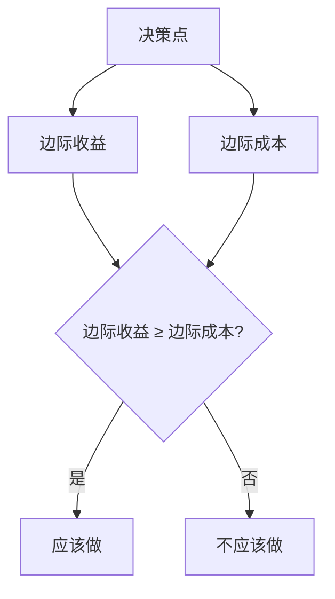
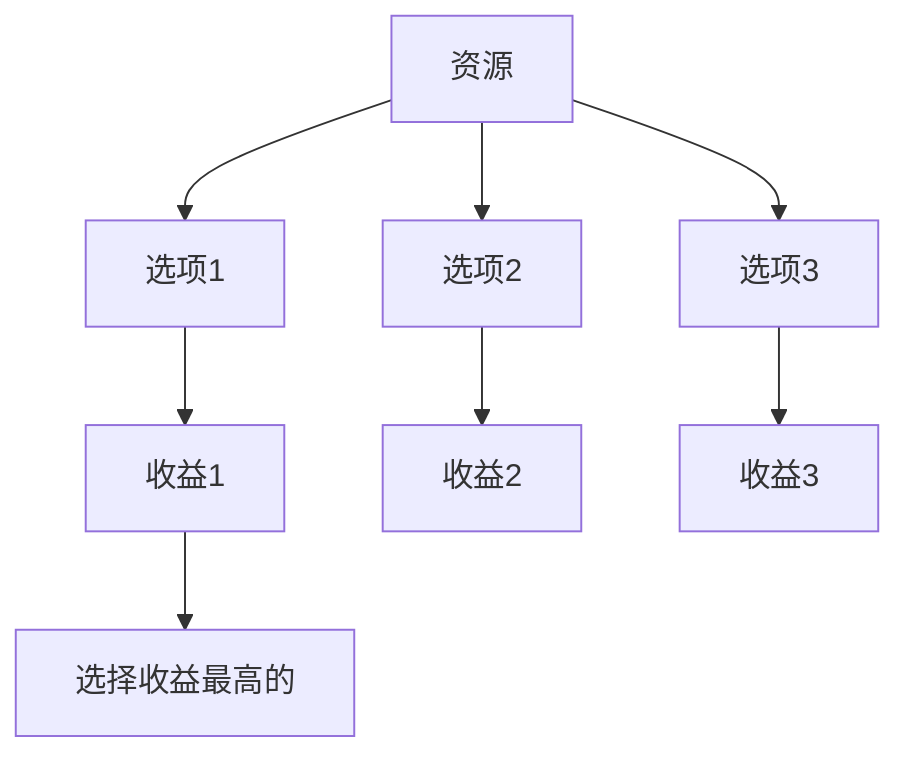
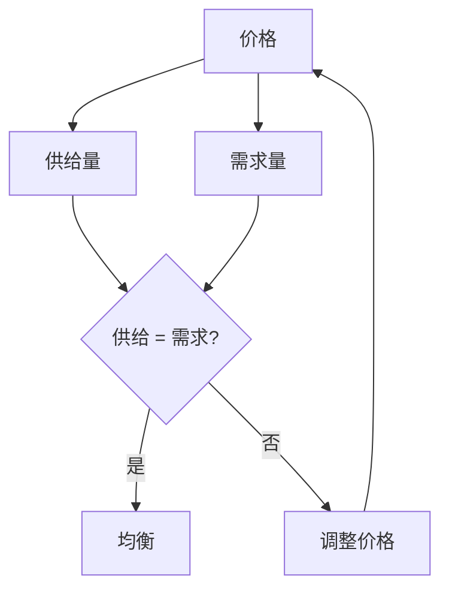
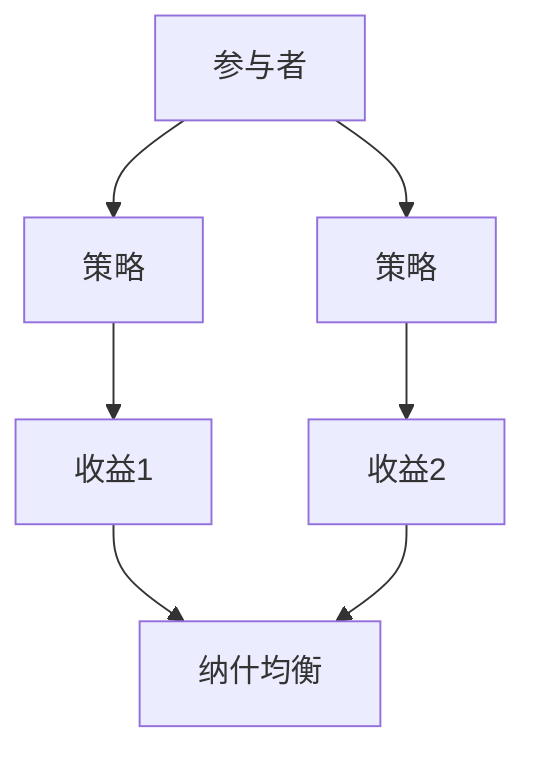
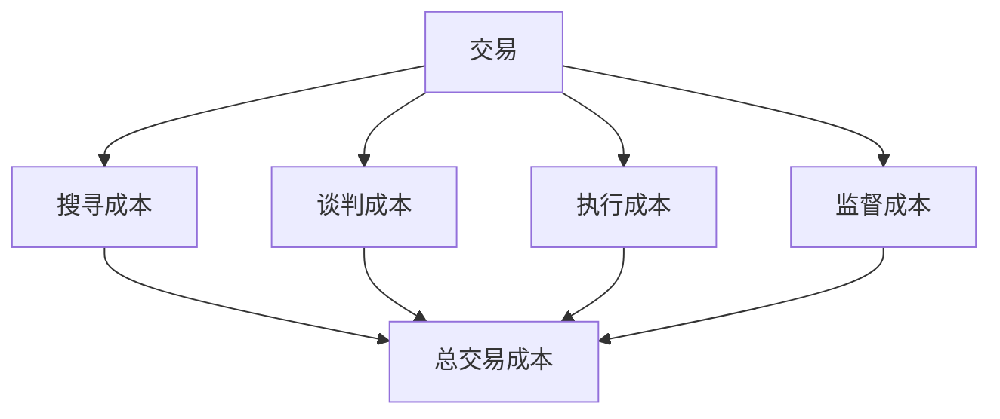

# 💰 经济学原理与方法

> **经济学门类** | **边际分析** | **成本收益** | **理性决策**

---

## 📋 概述

**学科定义：** 研究资源配置、市场运行、经济行为的学科

**核心价值：** 提供理性决策的分析框架

---

## 🎯 外行人常误解的常识

### 误区 1：经济学就是研究钱的学问

**误解：** 经济学就是研究如何赚钱

**事实：**
> 经济学研究的是**稀缺资源的配置**：
> - 不仅包括金钱，还包括时间、精力、注意力
> - 不仅研究个人决策，还研究市场机制
> - 不仅研究如何赚钱，还研究如何最优配置

**经济学家观点：**
> "经济学是研究人类如何在稀缺条件下做出选择的科学。" —— 萨缪尔森

---

### 误区 2：价格由成本决定

**误解：** 商品价格 = 成本 + 利润

**事实：**
> 价格由**供需关系**决定：
> - 成本决定供给曲线
> - 效用决定需求曲线
> - 均衡价格由供需交点决定



---

### 误区 3：理性人假设不现实

**误解：** 人不是完全理性的，所以经济学没用

**事实：**
> 理性人假设是**分析工具**，不是现实描述：
> - 提供基准参照
> - 可以分析偏离理性的行为
> - 行为经济学正是研究非理性行为

---

### 误区 4：GDP 增长等于福利增长

**误解：** GDP 增长说明人民生活水平提高了

**事实：**
> GDP 有其局限性：
> - 不包括非市场活动（家务、志愿服务）
> - 不考虑收入分配
> - 不反映环境成本
> - 不包括幸福感

---

## 🔧 核心方法论

### 1. 边际分析



**核心思想：**
> 做决策时，看**额外一单位**的收益和成本

**应用示例：**
```
问题：是否应该多生产一件产品？

边际收益：额外一件产品的售价 = 100元
边际成本：额外一件产品的成本 = 80元

决策：100 > 80，应该生产
```

**实际应用：**
- 定价策略：边际成本定价
- 产量决策：边际收益 = 边际成本
- 时间分配：每小时边际产出最大化

---

### 2. 机会成本



**核心思想：**
> 选择一个方案的代价 = 放弃的最高价值替代方案

**应用示例：**
```
你有 10 万元，三个投资选项：
- 股票：预期收益 15%
- 基金：预期收益 8%
- 存款：预期收益 3%

选择股票的机会成本 = 8%（基金收益）
选择基金的机会成本 = 15%（股票收益）
```

**实际应用：**
- 时间管理：时间的机会成本
- 投资决策：资金的机会成本
- 职业选择：职业的机会成本

---

### 3. 供需分析



**供需规律：**
| 情况 | 供给 | 需求 | 价格变化 |
|------|------|------|---------|
| 供不应求 | 不变 | 增加 | 上涨 |
| 供过于求 | 不变 | 减少 | 下跌 |
| 供给增加 | 增加 | 不变 | 下跌 |
| 需求增加 | 不变 | 增加 | 上涨 |

---

### 4. 博弈论



**核心概念：**
- **纳什均衡**：没有人能通过单方面改变策略而获益
- **囚徒困境**：个体理性导致集体非理性
- **重复博弈**：合作可以在重复博弈中产生

**应用示例：**
```
价格战的囚徒困境：

商家A          商家B
降价    不降价
降价   (3,3)    (5,0)
不降价 (0,5)    (4,4)

纳什均衡：都降价（3,3）
但最优结果：都不降价（4,4）
```

---

### 5. 交易成本理论



**核心思想：**
> 市场交易不是免费的，存在各种交易成本

**交易成本类型：**
| 类型 | 说明 | 示例 |
|------|------|------|
| **搜寻成本** | 找到交易对象 | 搜索供应商 |
| **谈判成本** | 达成协议 | 合同谈判 |
| **执行成本** | 履行合同 | 物流配送 |
| **监督成本** | 监督履约 | 质量检验 |

---

## 💡 跨界应用

### 1. 产品定价策略

```
传统思维：成本 + 利润 = 价格

经济学思维：
1. 分析需求曲线（用户愿意支付多少）
2. 分析供给曲线（竞争者的定价）
3. 找到利润最大化的价格点
4. 考虑价格弹性（提价/降价的影响）
```

### 2. 时间管理

```
传统思维：列出所有任务，按顺序完成

经济学思维：
1. 计算每个任务的机会成本
2. 优先处理机会成本高的任务
3. 委托机会成本低的任务
4. 略过机会成本太高的任务
```

### 3. 商业决策

```
传统思维：这个项目能赚钱吗？

经济学思维：
1. 计算项目的边际收益和边际成本
2. 考虑机会成本（资金的其他用途）
3. 分析沉没成本（已投入不可回收的成本）
4. 评估风险和不确定性
```

---

## 📚 核心概念速查

| 概念 | 定义 | 应用场景 |
|------|------|---------|
| **边际** | 额外一单位 | 决策分析 |
| **机会成本** | 放弃的最高价值 | 资源配置 |
| **供需** | 供给与需求的关系 | 定价、市场分析 |
| **均衡** | 供需平衡点 | 市场分析 |
| **博弈** | 策略互动 | 竞争策略 |
| **交易成本** | 市场交易的费用 | 组织设计 |
| **外部性** | 对第三方的影响 | 政策设计 |
| **信息不对称** | 信息分布不均 | 合同设计 |

---

**版本**: v1.0 | **更新日期**: 2026-04-30
