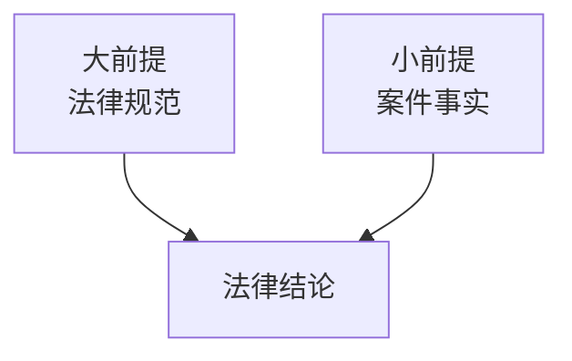
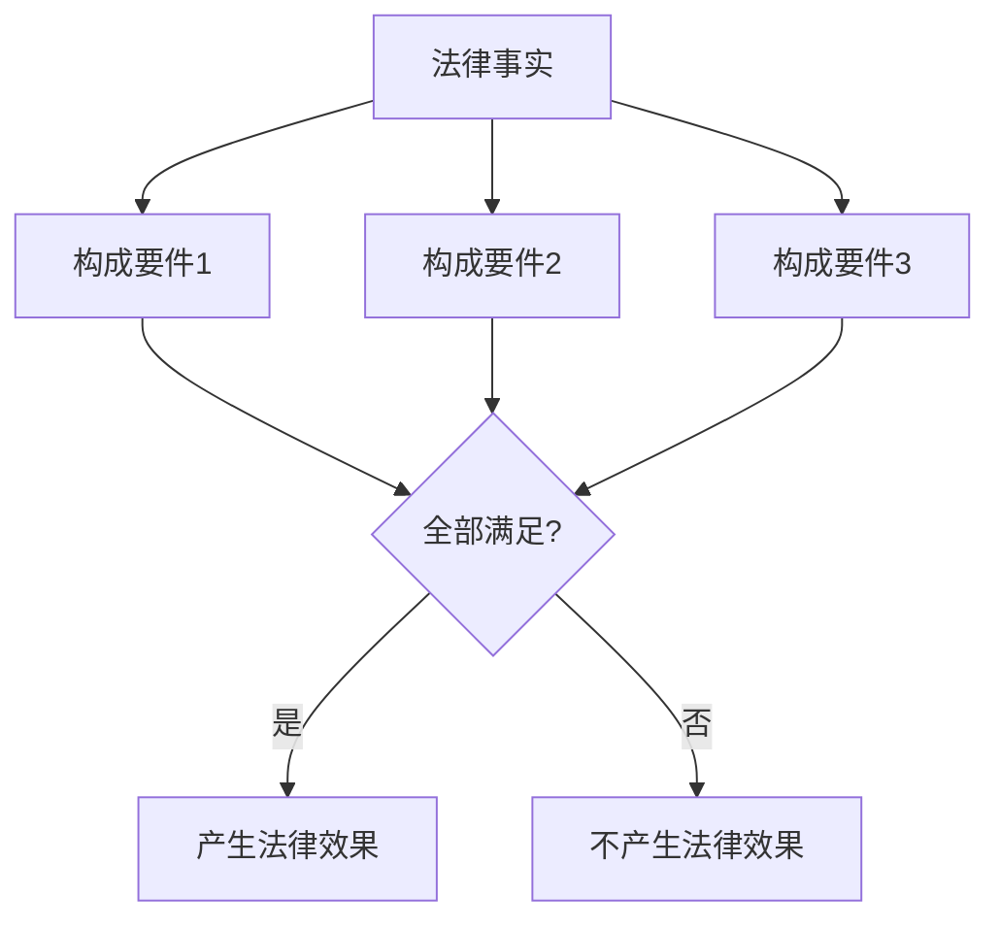
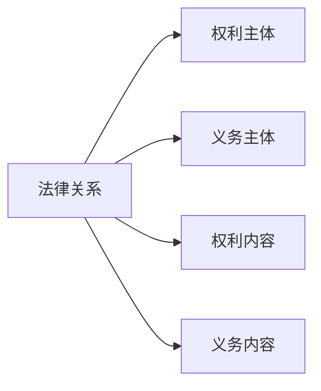
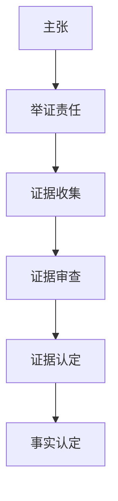
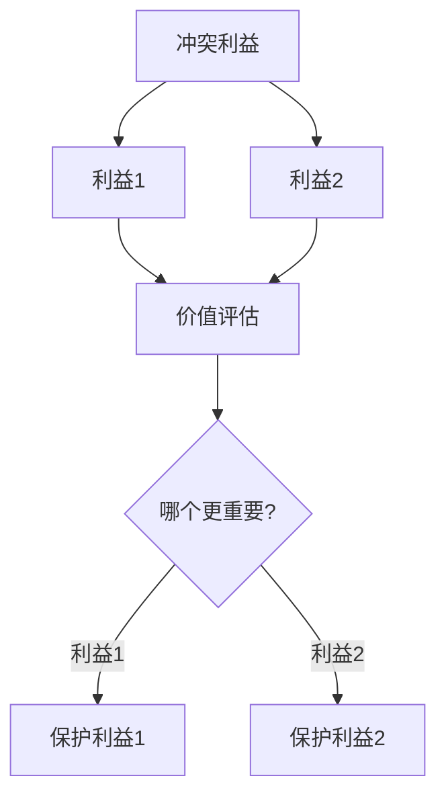

# ⚖️ 法学思维方法

> **法学门类** | **规则思维** | **权利义务** | **证据意识**

---

## 📋 概述

**学科定义：** 研究法律规范、法律制度、法律现象的学科

**核心价值：** 提供规则化、程序化的思维方式

---

## 🎯 外行人常误解的常识

### 误区 1：法律就是条文

**误解：** 法律就是写在纸上的条文

**事实：**
> 法律是一个完整的体系：
> - 宪法：根本大法
> - 法律：全国人大及其常委会制定
> - 行政法规：国务院制定
> - 地方性法规：地方人大制定
> - 规章：国务院部委、地方政府制定
> - 司法解释：最高法院、最高检察院制定

---

### 误区 2：合法就一定合理

**误解：** 只要合法就是对的

**事实：**
> 合法性与合理性是两个维度：
> - 合法：符合法律规定
> - 合理：符合公平正义
> - 有时合法但不合理（如某些过时的法律）
> - 有时合理但不合法（如紧急避险）

---

### 误区 3：打官司就是找关系

**误解：** 打官司靠关系，不靠法律

**事实：**
> 司法公正有制度保障：
> - 立案登记制
> - 庭审公开
> - 裁判文书公开
> - 司法责任制
> - 员额制改革

---

### 误区 4：合同只要签字就有效

**误解：** 双方签字的合同一定有效

**事实：**
> 合同有效需要满足多个条件：
> - 主体适格
> - 意思表示真实
> - 内容合法
> - 不违反公序良俗
> - 形式合法（如需要书面形式）

---

## 🔧 核心方法论

### 1. 法律三段论



**应用方法：**
```
1. 找到适用的法律规范（大前提）
2. 确认案件事实（小前提）
3. 将事实代入法律规范
4. 得出法律结论
```

**示例：**
```
大前提：《合同法》规定，违约应承担违约责任
小前提：被告未按合同约定交付货物
结论：被告应承担违约责任
```

---

### 2. 要件分析法



**应用方法：**
```
1. 确定法律效果（如：合同成立）
2. 找出构成要件（如：要约、承诺、合意）
3. 逐一检验每个要件
4. 全部满足则产生法律效果
```

---

### 3. 权利义务分析



**核心思想：**
> 法律关系 = 权利 + 义务

**分析框架：**
```
1. 谁享有权利？（权利主体）
2. 谁承担义务？（义务主体）
3. 享有什么权利？（权利内容）
4. 承担什么义务？（义务内容）
```

---

### 4. 证据思维



**证据规则：**
| 规则 | 说明 |
|------|------|
| **谁主张谁举证** | 提出主张的人提供证据 |
| **举证责任倒置** | 特定情况下由对方举证 |
| **证据优先级** | 原始证据 > 传来证据 |
| **证据三性** | 合法性、真实性、关联性 |

---

### 5. 利益衡量



**应用方法：**
```
1. 识别冲突的利益
2. 评估每个利益的价值
3. 比较利益的重要性
4. 选择保护更重要的利益
```

---

## 💡 跨界应用

### 1. 合同设计

```
传统思维：把双方约定写清楚

法学思维：
1. 识别合同主体资格
2. 明确权利义务
3. 设定违约责任
4. 预见争议解决
5. 考虑法律风险
```

### 2. 风险管理

```
传统思维：出了问题再处理

法学思维：
1. 识别法律风险
2. 评估风险概率和影响
3. 设计风险防范措施
4. 建立风险应对机制
5. 定期风险审查
```

### 3. 决策支持

```
传统思维：这个决定对不对？

法学思维：
1. 有没有法律依据？
2. 是否合法合规？
3. 有没有法律风险？
4. 如何留存证据？
5. 争议如何解决？
```

---

## 📚 核心概念速查

| 概念 | 定义 | 应用场景 |
|------|------|---------|
| **权利** | 法律赋予的行为自由 | 权益保护 |
| **义务** | 法律要求的行为 | 合规管理 |
| **合同** | 双方合意 | 交易协议 |
| **证据** | 证明事实的材料 | 争议解决 |
| **时效** | 法律保护的期限 | 权利行使 |
| **管辖** | 法院受理案件的权限 | 诉讼策略 |
| **执行** | 强制实现判决 | 债权实现 |

---

**版本**: v1.0 | **更新日期**: 2026-04-30
