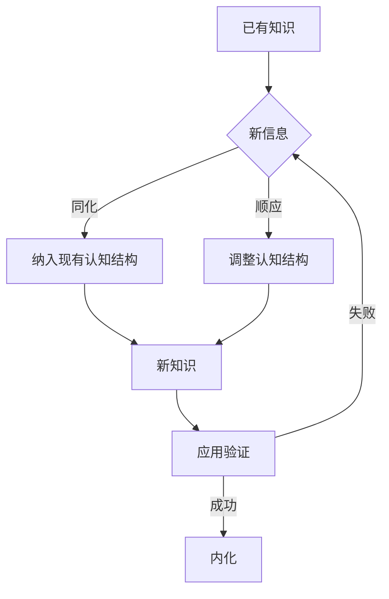
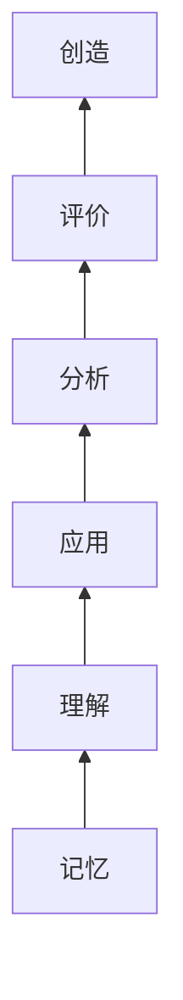
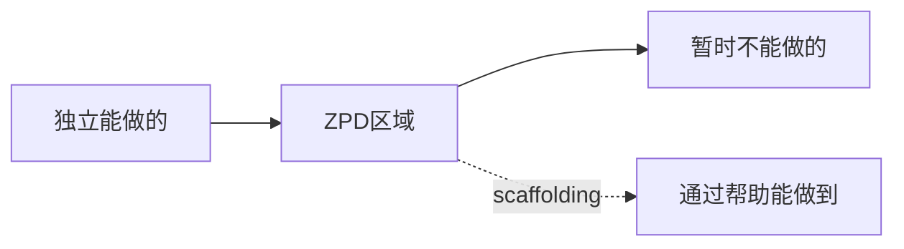
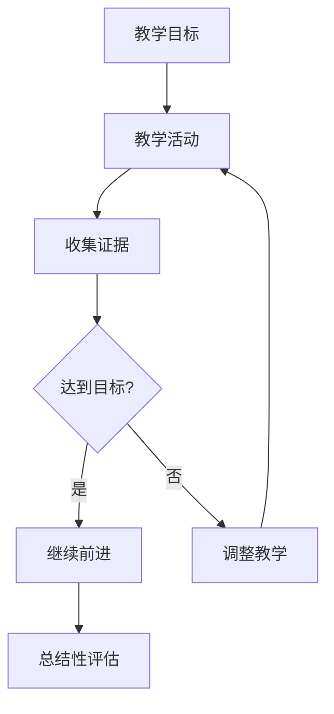
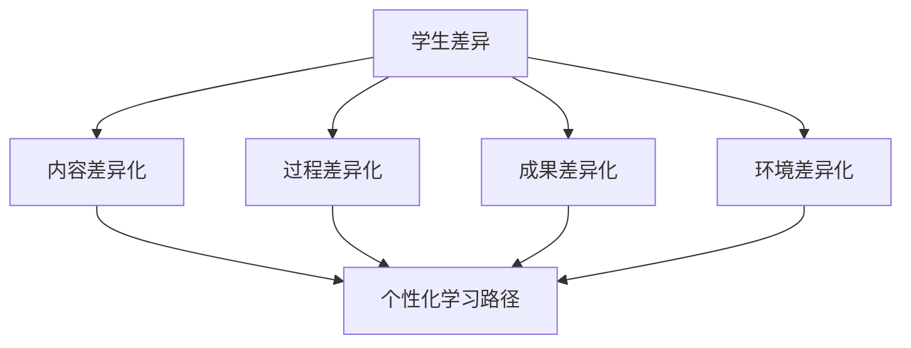

# 🎓 教育学思维方法论

> **教育门类** | **学习科学** | **教学设计** | **认知发展**

---

## 📋 概述

**学科定义：** 研究教与学的规律、方法和实践的学科

**核心价值：** 提供知识传递、技能培养和认知发展的系统化方法

---

## 🎯 外行人常误解的常识

### 误区 1：教学就是"讲清楚"

**误解：** 老师讲得越清楚，学生学得越好

**事实：**
> 学习效果取决于：
> - 学生的主动建构（而非被动接收）
> - 适当的挑战和反馈
> - 知识的迁移和应用
> - 元认知能力的培养

**教育家观点：**
> "教育不是灌满一桶水，而是点燃一把火。" —— 叶芝

---

### 误区 2：重复练习就能掌握

**误解：** 题海战术是最有效的学习方式

**事实：**
> 有效学习需要：
> - **刻意练习**：有针对性的、有反馈的练习
> - **间隔重复**：分散学习比集中学习更有效
> - **变式练习**：在不同情境下应用知识
> - **反思总结**：理解为什么这样做

---

### 误区 3：天赋决定学习能力

**误解：** 有些人天生就擅长学习，有些人不行

**事实：**
> 研究表明：
> - **成长型思维**比固定型思维更能促进学习
> - 努力策略比天赋更重要
> - 任何人都可以通过正确方法提升能力
> - "聪明"是可以通过训练获得的

---

## 🔧 核心方法论

### 1. 建构主义学习理论



**应用方法：**
```
1. 激活先验知识（学生已经知道什么？）
2. 创设认知冲突（挑战现有理解）
3. 提供支架支持（脚手架）
4. 引导自主建构（学生自己发现）
5. 促进迁移应用（在新情境中使用）
```

**示例：**
```
传统教学：直接讲解勾股定理公式
建构主义：
1. 让学生测量不同直角三角形的边长
2. 引导学生发现边长关系的规律
3. 学生自己总结出 a² + b² = c²
4. 应用到实际问题中
```

---

### 2. 布鲁姆分类法



**六个认知层次：**

| 层次 | 关键词 | 教学活动 | 评估方式 |
|------|--------|---------|---------|
| **记忆** | 识别、回忆 | 背诵、默写 | 填空、选择 |
| **理解** | 解释、举例 | 复述、类比 | 简答、解释 |
| **应用** | 执行、实施 | 练习、操作 | 应用题、实操 |
| **分析** | 区分、组织 | 比较、分类 | 分析题、案例 |
| **评价** | 检查、批判 | 辩论、评审 | 评论、判断 |
| **创造** | 生成、计划 | 设计、创作 | 项目、作品 |

**应用原则：**
```
- 从低阶到高阶循序渐进
- 确保基础层次掌握后再进入高层次
- 不同学科侧重不同层次
- 高阶思维需要更多时间和支持
```

---

### 3. 最近发展区（ZPD）



**核心思想：**
- **实际发展水平**：学生独立完成的能力
- **潜在发展水平**：在帮助下能达到的能力
- **最近发展区**：两者之间的差距，是教学的最佳切入点

**应用方法：**
```
1. 诊断学生的当前水平
2. 设定略高于当前水平的目标
3. 提供适当的支持（支架）
4. 逐渐撤除支持，促进独立
5. 进入下一个发展区
```

**支架类型：**
- 示范：展示如何做
- 提示：给出线索
- 问题：引导思考
- 模板：提供框架
- 同伴：合作学习

---

### 4. 形成性评估



**与传统评估的区别：**

| 维度 | 形成性评估 | 总结性评估 |
|------|-----------|-----------|
| **时机** | 学习过程中 | 学习结束后 |
| **目的** | 改进教学和学习 | 评定成绩 |
| **频率** | 持续、频繁 | 偶尔、定期 |
| **反馈** | 及时、具体 | 延迟、概括 |
| **使用者** | 教师和学生 | 教师和管理者 |

**常用方法：**
```
- 退出票（Exit Ticket）：课末快速检测
- 概念图：可视化知识结构
- 同伴互评：相互学习和反馈
- 自我评估：培养元认知
- 观察记录：行为和能力表现
```

---

### 5. 差异化教学



**差异化维度：**

**内容差异化：**
- 难度调整（简化或深化）
- 兴趣导向（选择主题）
- 学习风格（视觉、听觉、动觉）

**过程差异化：**
- 分组策略（同质/异质）
- 学习时间（弹性安排）
- 支持程度（不同程度支架）

**成果差异化：**
- 表现形式（报告、演示、作品）
- 复杂度要求（基础/拓展）
- 评估标准（分层标准）

---

## 💡 跨界应用

### 1. 企业培训中的教学设计

```
问题：如何设计有效的员工培训？

教育学方法：
1. 需求分析（学员已有知识、学习目标）
2. 内容设计（布鲁姆分类法确定深度）
3. 活动设计（建构主义：案例分析、角色扮演）
4. 评估设计（形成性：小测验；总结性：实操考核）
5. 反馈机制（及时调整培训内容）

效果：
- 培训参与度提升 40%
- 知识保留率提高 60%
- 工作应用率增加 50%
```

### 2. 产品设计中的用户学习曲线

```
问题：如何让新用户快速上手产品？

教育学原理：
1. 最近发展区：功能难度略高于用户当前能力
2. 支架设计：新手引导、工具提示、教程
3. 渐进式披露：先展示核心功能，再展示高级功能
4. 即时反馈：操作后立即显示结果
5. 错误预防：预判用户可能的错误并提供指导

案例：
- Figma：交互式教程 + 实时协作
- Duolingo：游戏化学习 + 间隔重复
- Notion：模板库 + 社区资源
```

### 3. 知识管理中的认知负荷理论

```
问题：如何组织知识库便于理解和检索？

认知负荷理论：
1. 内在负荷：知识本身的复杂度
   → 分解复杂概念为小块
   
2. 外在负荷：呈现方式造成的负担
   → 清晰的导航和结构
   → 一致的术语和格式
   
3. 相关负荷：促进学习的认知投入
   → 建立知识之间的联系
   → 提供应用场景和案例

实践：
- 使用思维导图展示知识结构
- 提供"入门路径"和"进阶路径"
- 每个文档包含"前置知识"和"后续阅读"
```

---

## 📚 核心概念速查

| 概念 | 定义 | 应用场景 |
|------|------|---------|
| **建构主义** | 学习者主动建构知识 | 课程设计、培训开发 |
| **最近发展区** | 潜在发展水平与现有水平的差距 | 目标设定、支架设计 |
| **布鲁姆分类** | 认知层次的六级分类 | 目标制定、评估设计 |
| **形成性评估** | 过程中的持续性评估 | 教学调整、学习反馈 |
| **差异化教学** | 根据学生差异调整教学 | 个性化学习、包容性教育 |
| **元认知** | 对自身认知的认知 | 学习策略、自我调节 |
| **刻意练习** | 有目标、有反馈的练习 | 技能培养、能力提升 |
| **成长型思维** | 能力可通过努力提升 | 动机激发、挫折应对 |

---

## 🔗 延伸阅读

- 《人是如何学习的》- John Bransford
- 《刻意练习》- Anders Ericsson
- 《可见的学习》- John Hattie
- 《追求理解的教学设计》- Grant Wiggins

---

**版本**: v1.0 | **更新日期**: 2026-05-02
