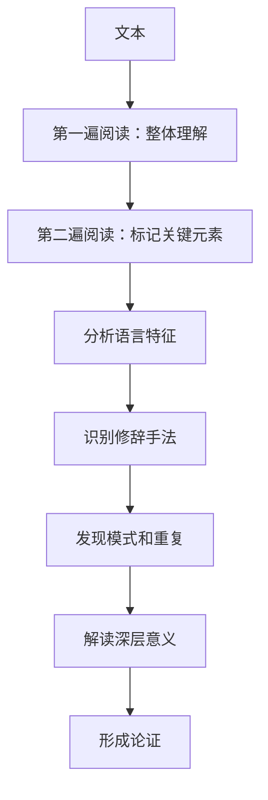
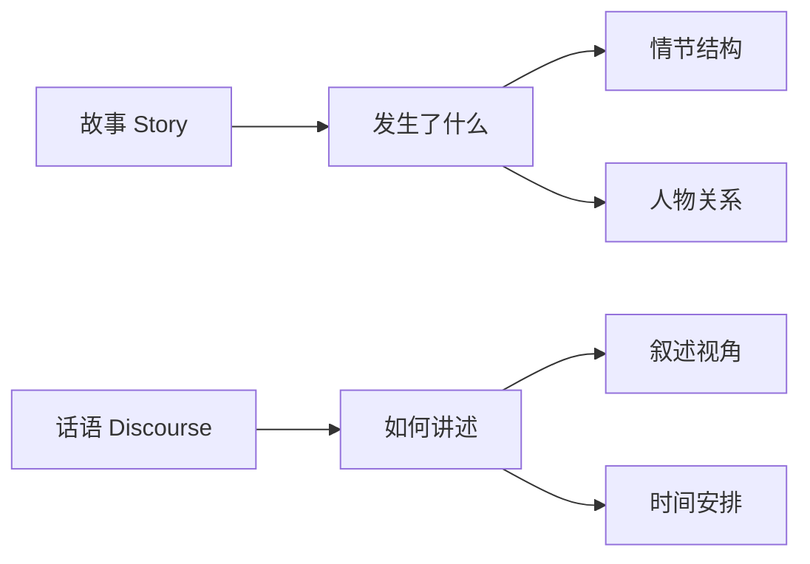
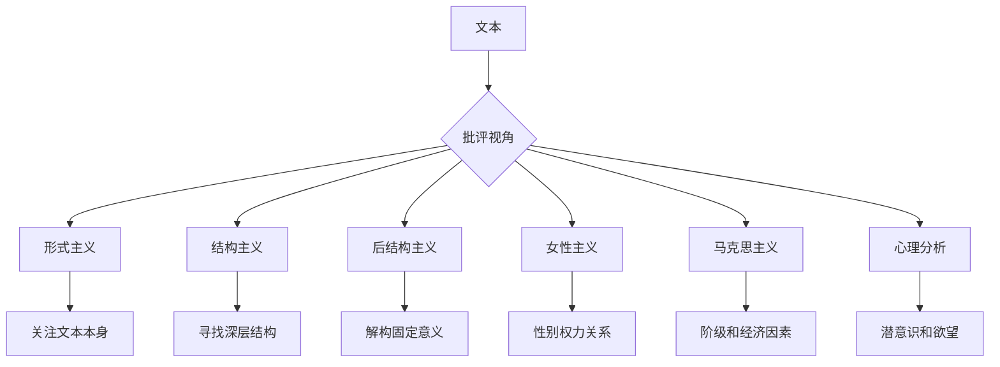
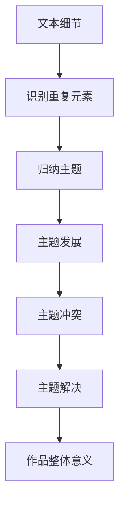
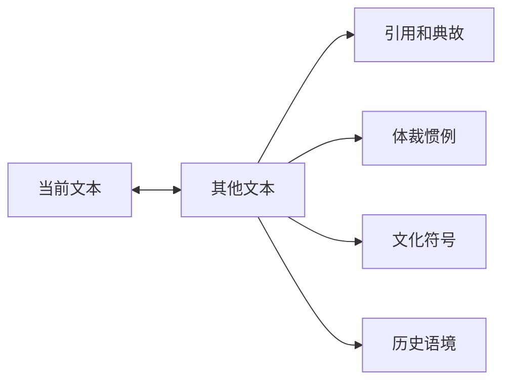

# 📖 文学分析思维方法论

> **文学门类** | **文本解读** | **叙事分析** | **批评理论**

---

## 📋 概述

**学科定义：** 研究文学作品的形式、内容、意义和价值的学科

**核心价值：** 提供深度阅读、意义解读和批判性思考的系统方法

---

## 🎯 外行人常误解的常识

### 误区 1：文学分析就是"过度解读"

**误解：** 文学评论家总是从作品中读出作者没有想到的意思

**事实：**
> 文学分析的核心原则：
> - **文本证据**：所有解读必须基于文本本身
> - **语境理解**：考虑历史、文化、社会背景
> - **多重意义**：文本可以有多个合理解读
> - **读者反应**：读者的经验影响解读，但不等于任意解读

**文学理论家观点：**
> "作者已死" —— 罗兰·巴特（意指文本一旦完成，作者的意图不再是唯一权威）

---

### 误区 2：好作品必须有明确的道德教训

**误解：** 文学的价值在于传达正确的价值观

**事实：**
> 文学的功能包括：
> - **反映现实**：展现人性的复杂性
> - **提出问题**：引发思考而非给出答案
> - **审美体验**：语言艺术和情感共鸣
> - **文化记录**：保存时代精神和集体记忆

---

### 误区 3：经典作品过时了，不再相关

**误解：** 古代文学作品与现代生活无关

**事实：**
> 经典的永恒价值：
> - **人性共通**：爱、死亡、权力、身份等主题跨越时代
> - **原型模式**：英雄之旅、悲剧结构等叙事模式反复出现
> - **历史镜像**：通过过去理解现在
> - **语言典范**：文学语言的创新和影响力

---

## 🔧 核心方法论

### 1. 细读法（Close Reading）



**分析维度：**

| 维度 | 关注点 | 示例问题 |
|------|--------|---------|
| **词汇选择** | 用词的精确性和暗示 | 为什么用这个词而不是同义词？ |
| **句式结构** | 长短句、主动被动 | 句式如何影响节奏和重点？ |
| **意象和象征** | 视觉、听觉等感官描写 | 意象传达了什么情感或主题？ |
| **修辞手法** | 比喻、拟人、反讽等 | 修辞如何增强表达效果？ |
| **语气和态度** | 叙述者的立场 | 语气如何变化？为什么？ |

**示例分析：**
```
原文："夜色如墨，吞噬了最后一丝光亮。"

细读分析：
- 比喻："如墨" → 强调黑暗的浓重和不可穿透
- 动词："吞噬" → 赋予夜色主动性，暗示威胁感
- 对比："最后一丝" → 强调光亮的微弱和绝望
- 主题暗示：黑暗vs光明，可能象征希望vs绝望
```

---

### 2. 叙事学分析



**核心概念：**

**叙述视角：**
- **全知视角**：叙述者知道一切
- **限知视角**：叙述者只知道部分信息
- **第一人称**："我"的视角，主观性强
- **第二人称**："你"的视角，罕见但有力
- **第三人称**："他/她"的视角，可灵活切换

**时间结构：**
- **顺叙**：按时间顺序
- **倒叙**：回忆过去
- **插叙**：插入相关事件
- **预叙**：提前透露未来

**示例分析：**
```
《了不起的盖茨比》：
- 叙述者：尼克（第一人称限知视角）
- 效果：读者只能通过尼克的观察了解盖茨比
- 限制：尼克的理解可能有偏差
- 优势：创造神秘感和距离感
```

---

### 3. 文学批评理论



**主要批评流派：**

| 流派 | 核心关注 | 关键问题 |
|------|---------|---------|
| **形式主义** | 文本的形式和技巧 | 作品如何通过语言和结构产生意义？ |
| **结构主义** | 普遍的叙事模式 | 作品遵循哪些原型和结构？ |
| **后结构主义** | 意义的不确定性 | 文本有哪些自相矛盾之处？ |
| **女性主义** | 性别和权力 | 作品如何表现性别角色和关系？ |
| **马克思主义** | 阶级和经济 | 作品反映了哪些社会矛盾？ |
| **心理分析** | 潜意识和欲望 | 人物的行为揭示了什么心理动机？ |
| **后殖民主义** | 殖民和文化身份 | 作品如何处理文化冲突和身份认同？ |

**应用示例：**
```
《简·爱》的女性主义解读：
- 简的独立性挑战了维多利亚时代的女性规范
- "阁楼上的疯女人"伯莎象征被压抑的女性愤怒
- 罗切斯特的残疾象征父权制的削弱
- 结局：简获得经济独立和平等地位
```

---

### 4. 主题分析



**常见文学主题：**
- 爱与失落
- 身份与自我发现
- 自由与束缚
- 善与恶
- 生与死
- 个人与社会
- 现实与幻想

**分析方法：**
```
1. 收集与主题相关的文本证据
2. 分析主题如何在不同场景中发展
3. 识别人物对主题的不同态度
4. 考察主题的冲突和张力
5. 总结作品对主题的最终立场
```

---

### 5. 互文性分析



**核心思想：**
- 任何文本都不是孤立的
- 文本之间存在对话和呼应
- 理解需要参照其他文本和文化背景

**分析类型：**
- **直接引用**：明确提到其他作品
- **典故**：间接引用神话、历史、文学
- **戏仿**：模仿并颠覆原作
- **体裁惯例**：遵循或打破类型规则

**示例：**
```
《尤利西斯》与《奥德赛》：
- 乔伊斯的小说是对荷马史诗的现代重写
- 布鲁姆对应奥德修斯
- 都柏林对应地中海
- 一天的经历对应十年的漂泊
- 通过对比凸显现代生活的平庸和荒诞
```

---

## 💡 跨界应用

### 1. 品牌叙事中的文学技巧

```
问题：如何让品牌故事更有感染力？

文学方法：
1. 人物塑造：品牌作为有性格的"角色"
   - Apple：创新者、叛逆者
   - Nike：激励者、胜利者
   
2. 冲突设置：问题vs解决方案
   - 用户的痛点（冲突）
   - 产品的价值（解决）
   
3. 叙事弧：起承转合
   - 现状描述
   - 问题出现
   - 方案引入
   - 美好未来
   
4. 象征和隐喻：
   - Nike的"勾"=胜利
   - Apple的"苹果"=知识和创新

案例：Airbnb "Belong Anywhere"
- 主题：归属感
- 叙事：从陌生人到家人
- 情感：温暖、连接、家的感觉
```

### 2. 用户研究中的深度访谈技巧

```
问题：如何从用户访谈中获得深层洞察？

文学分析方法：
1. 细读法：仔细分析用户的措辞和表达
   - 注意重复出现的词汇
   - 关注语气和情感变化
   - 识别隐含的假设
   
2. 叙事分析：理解用户的故事结构
   - 用户如何组织自己的经历？
   - 哪些事件被视为转折点？
   - 用户如何解释自己的行为？
   
3. 主题分析：从多个访谈中提取共同主题
   - 跨用户寻找模式
   - 识别矛盾和张力
   - 构建用户心智模型

实践：
- 转录访谈录音
- 编码关键语句
- 绘制用户旅程图
- 提炼核心洞察
```

### 3. 内容营销中的修辞策略

```
问题：如何让营销文案更有说服力？

修辞手法应用：
1. 比喻和类比：将抽象概念具体化
   - "云存储就像无限容量的U盘"
   
2. 排比：增强节奏感和记忆点
   - "更快、更强、更智能"
   
3. 反问：引发读者思考
   - "你真的愿意错过这个机会吗？"
   
4. 对比：突出产品优势
   - "别人做加法，我们做减法"
   
5. 故事化：用叙事代替说教
   - 用户案例故事
   - 品牌起源故事

A/B测试：
- 版本A：直接陈述功能
- 版本B：使用隐喻和故事
- 结果：版本B转化率高30%
```

---

## 📚 核心概念速查

| 概念 | 定义 | 应用场景 |
|------|------|---------|
| **细读** | 深入分析文本的语言和结构 | 内容审核、文案优化 |
| **叙述视角** | 谁在讲故事，知道多少 | 品牌叙事、用户故事 |
| **主题** | 作品的核心思想和关切 | 内容策划、价值传递 |
| **互文性** | 文本之间的关联和对话 | 文化营销、IP开发 |
| **象征** | 用具体事物代表抽象概念 | 品牌标识、视觉传达 |
| **反讽** | 表面意思与实际意思相反 | 幽默营销、社会评论 |
| **原型** | 普遍存在的叙事模式 | 故事框架、角色设计 |
| **接受美学** | 读者如何理解和回应文本 | 用户体验、受众分析 |

---

## 🔗 延伸阅读

- 《文学理论入门》- Terry Eagleton
- 《叙事学导论》- Mieke Bal
- 《如何阅读一本书》- Mortimer Adler
- 《故事的解剖》- Robert McKee

---

**版本**: v1.0 | **更新日期**: 2026-05-02
