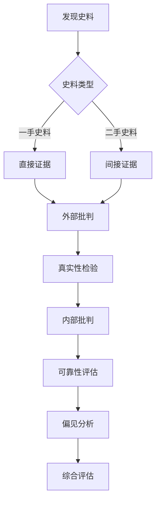
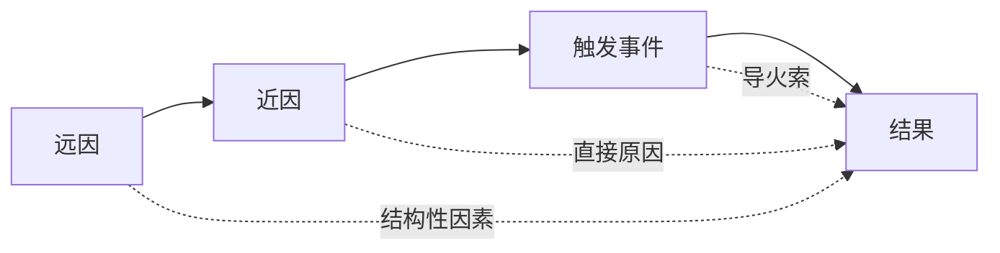
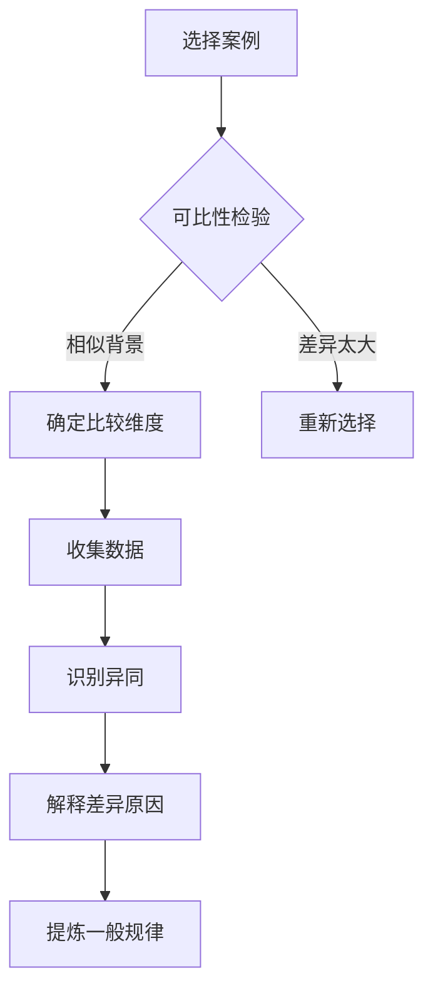
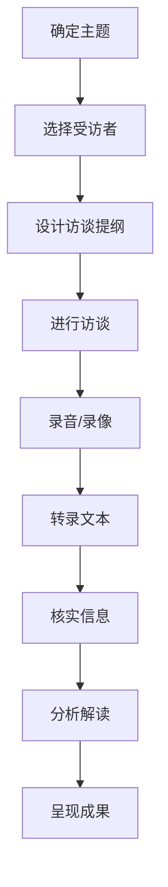
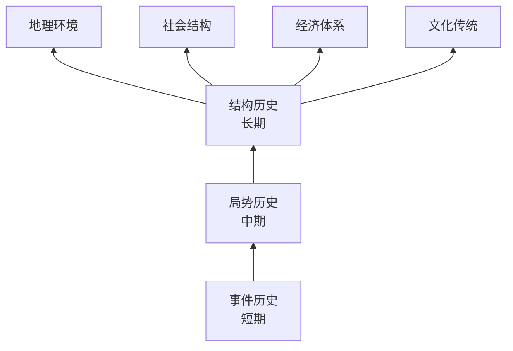

# 📜 历史研究思维方法论

> **历史门类** | **史料考证** | **因果分析** | **历史解释**

---

## 📋 概述

**学科定义：** 研究过去事件、人物和社会变迁的学科

**核心价值：** 提供证据评估、因果推理和长远视角的思维工具

---

## 🎯 外行人常误解的常识

### 误区 1：历史就是记住日期和事件

**误解：** 学历史就是背诵谁在什么时候做了什么

**事实：**
> 历史学的核心是：
> - **解释**：为什么事件会发生？
> - **论证**：基于证据构建合理的解释
> - **批判**：评估史料的可靠性和偏见
> - **综合**：将碎片信息整合成连贯叙事

**历史学家观点：**
> "历史不是关于过去的知识，而是关于现在的理解。" —— E.H. Carr

---

### 误区 2：历史是客观的事实集合

**误解：** 历史学家只是记录发生了什么

**事实：**
> 历史研究的特性：
> - **选择性**：不可能记录所有事件，必须选择
> - **解释性**：同样的事实可以有不同解读
> - **时代性**：每个时代重写自己的历史
> - **立场性**：历史学家的背景影响其视角

---

### 误区 3：历史没有实用价值

**误解：** 了解过去对解决现在的问题没有帮助

**事实：**
> 历史思维的价值：
> - **模式识别**：发现重复出现的社会现象
> - **长远视角**：超越短期波动看趋势
> - **复杂性理解**：避免简单因果论
> - **批判思维**：质疑官方叙事和流行观点

---

## 🔧 核心方法论

### 1. 史料批判（Source Criticism）



**外部批判（真实性）：**
- **作者**：谁写的？有资格吗？
- **时间**：何时写的？ contemporaneous?
- **地点**：在哪里写的？
- **目的**：为什么写？给谁看？
- **完整性**：是否被篡改或删减？

**内部批判（可靠性）：**
- **一致性**：内容是否自相矛盾？
- **合理性**：是否符合已知事实？
- **细节**：是否有具体、可验证的细节？
- **语气**：是否过于情绪化或偏激？
- **佐证**：有其他史料支持吗？

**示例分析：**
```
史料：《史记·项羽本纪》

外部批判：
- 作者：司马迁（西汉史官，距项羽时代约100年）
- 来源：参考了秦朝档案、口述历史
- 目的：记录历史，也有道德教化意图

内部批判：
- 优点：细节丰富，人物生动
- 局限：受汉代正统观念影响
- 偏见：对失败者项羽有同情，对刘邦有批评

结论：有价值但需结合其他史料交叉验证
```

---

### 2. 历史因果分析



**因果层次：**

| 层次 | 特征 | 示例（法国大革命） |
|------|------|------------------|
| **结构性原因** | 长期、深层、系统性 | 封建制度危机、社会不平等 |
| **促成因素** | 中期、累积性 | 财政危机、启蒙思想传播 |
| **直接原因** | 短期、具体事件 | 三级会议召开、巴士底狱陷落 |
| **偶然因素** | 个人决策、突发事件 | 路易十六的犹豫、天气影响 |

**分析方法：**
```
1. 区分必要条件和充分条件
2. 识别多重因果关系
3. 避免后此谬误（post hoc ergo propter hoc）
4. 考虑反事实：如果没有X，Y还会发生吗？
5. 评估各因素的相对重要性
```

**常见谬误：**
- **单一因果论**：认为一个原因导致结果
- **决定论**：认为结果不可避免
- **目的论**：认为历史有预定目标
- **现时主义**：用现代价值观评判过去

---

### 3. 历史比较法



**比较类型：**

**横向比较（同一时期不同地区）：**
- 英国工业革命 vs 日本明治维新
- 美国民主 vs 法国民主

**纵向比较（不同时期同一地区）：**
- 罗马共和国 vs 罗马帝国
- 中国唐朝 vs 宋朝

**主题比较（跨时空的共同主题）：**
- 各文明的帝国兴衰
- 各国的现代化路径

**应用原则：**
```
1. 确保案例具有可比性
2. 明确比较的目的和问题
3. 控制变量：保持某些因素不变
4. 注意语境差异：避免生搬硬套
5. 从比较中提炼理论洞见
```

---

### 4. 口述历史方法



**优势：**
- 补充官方记录的不足
- 记录普通人的经历和感受
- 捕捉情感和主观体验
- 保存即将消失的记忆

**挑战：**
- **记忆偏差**：时间久远导致遗忘或扭曲
- **选择性回忆**：只记得重要或愉快的事
- **事后合理化**：用现在的理解重构过去
- **采访者影响**：问题方式影响回答

**最佳实践：**
```
1. 三角验证：与其他史料对照
2. 多次访谈：减少一次性访谈的偏差
3. 开放性问题：避免引导性提问
4. 记录非语言信息：表情、语气、停顿
5. 尊重受访者：知情同意、隐私保护
```

---

### 5. 长时段历史（Longue Durée）



**布罗代尔的三个时间层次：**

| 层次 | 时间跨度 | 研究对象 | 变化速度 |
|------|---------|---------|---------|
| **事件历史** | 天/月/年 | 政治事件、战争、革命 | 快速 |
| **局势历史** | 十年/百年 | 经济周期、人口趋势 | 中等 |
| **结构历史** | 世纪/千年 | 地理、气候、文明模式 | 缓慢 |

**核心思想：**
- 短期事件往往受长期结构制约
- 真正的历史变革来自深层结构的转变
- 关注"几乎不动的历史"（地理、气候）
- 避免被表面事件迷惑

**应用示例：**
```
理解中国近代史：

事件层面：鸦片战争、太平天国、辛亥革命
局势层面：白银流入流出、人口增长、城市化
结构层面：农耕文明、儒家文化、中央集权传统

洞察：
- 短期事件是长期结构压力的爆发
- 现代化转型需要结构层面的改变
- 文化传统的惯性远超政治变革
```

---

## 💡 跨界应用

### 1. 商业战略中的历史思维

```
问题：如何预测行业趋势和制定长期战略？

历史方法：
1. 长时段分析：识别行业的结构性特征
   - 技术范式（如摩尔定律）
   - 用户行为模式
   - 监管环境演变
   
2. 历史比较：借鉴其他行业的经验
   - 互联网行业 vs 电力行业（基础设施化）
   - 智能手机 vs 个人电脑（平台生态）
   
3. 因果分析：理解成功/失败的根本原因
   - 诺基亚衰落：不仅是iPhone的竞争
   - 深层原因：生态系统、开发者关系、用户体验

案例：Netflix的战略演进
- DVD租赁 → 流媒体 → 内容制作
- 每次转型都基于对技术趋势的长远判断
- 借鉴了有线电视、好莱坞的历史经验
```

### 2. 政策制定中的历史教训

```
问题：如何避免重蹈历史覆辙？

历史思维：
1. 案例研究：分析类似政策的成败
   - 其他国家的教育改革
   - 历史上的经济刺激计划
   
2. 情境分析：考虑时代差异
   - 当时的社会条件
   - 技术水平的限制
   - 国际环境的影响
   
3. 意外后果：预见可能的副作用
   - 价格管制导致黑市
   - 福利政策影响工作激励

实例：2008年金融危机后的监管改革
- 回顾1929年大萧条的应对
- 借鉴日本"失去的二十年"的教训
- 平衡金融创新与风险控制
```

### 3. 产品设计中的用户历史研究

```
问题：如何理解用户的深层需求和行为模式？

历史方法：
1. 用户旅程考古：追溯用户使用习惯的形成
   - 为什么用户这样操作？
   - 历史遗留的工作流程
   - 旧系统的惯性影响
   
2. 代际差异：不同年龄段用户的差异
   - 数字原生代 vs 数字移民
   - 成长环境塑造的使用习惯
   
3. 技术采纳曲线：借鉴历史扩散模式
   - 早期采用者的特征
   - 临界点的到来
   - 阻力和促进因素

实践：企业软件 redesign
- 调研用户过去10年的工作流程变化
- 识别哪些是真正的需求，哪些是习惯
- 渐进式改进 vs 颠覆式创新
```

---

## 📚 核心概念速查

| 概念 | 定义 | 应用场景 |
|------|------|---------|
| **史料批判** | 评估史料的真实性和可靠性 | 信息验证、来源审核 |
| **因果分析** | 识别多层次的原因 | 问题诊断、根因分析 |
| **历史比较** | 跨时空的案例对比 | 基准测试、最佳实践 |
| **口述历史** | 通过访谈记录个人经历 | 用户研究、组织记忆 |
| **长时段** | 关注长期结构和趋势 | 战略规划、趋势预测 |
| **反事实推理** | 假设历史的不同走向 | 情景规划、风险评估 |
| **现时主义** | 用现代标准评判过去（应避免） | 文化敏感性、多元视角 |
| **路径依赖** | 历史选择限制未来选项 | 技术锁定、制度惯性 |

---

## 🔗 延伸阅读

- 《历史是什么？》- E.H. Carr
- 《菲利普二世时代的地中海和地中海世界》- 费尔南·布罗代尔
- 《枪炮、病菌与钢铁》- 贾雷德·戴蒙德
- 《历史的终结与最后的人》- 弗朗西斯·福山

---

**版本**: v1.0 | **更新日期**: 2026-05-02
