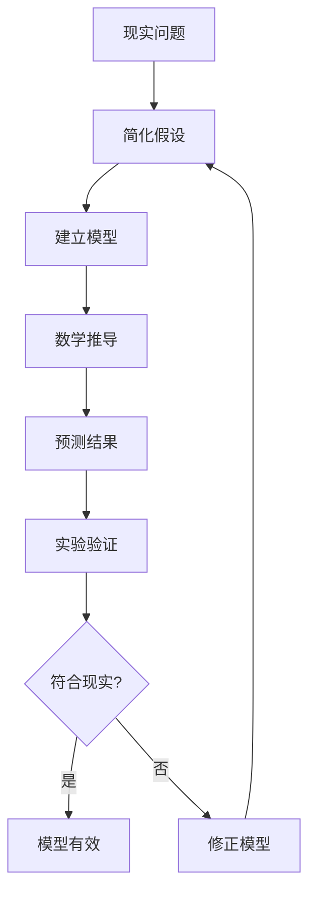
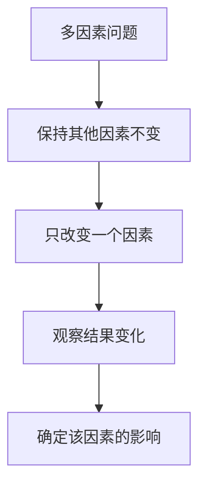
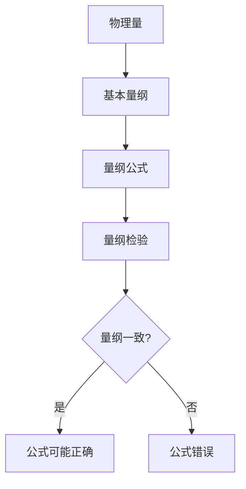
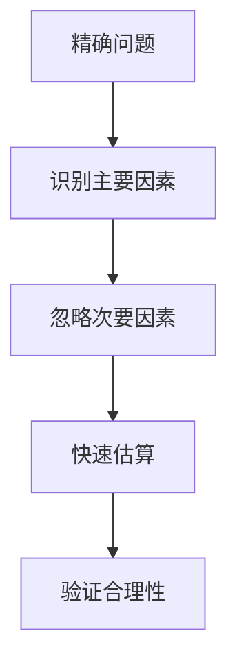
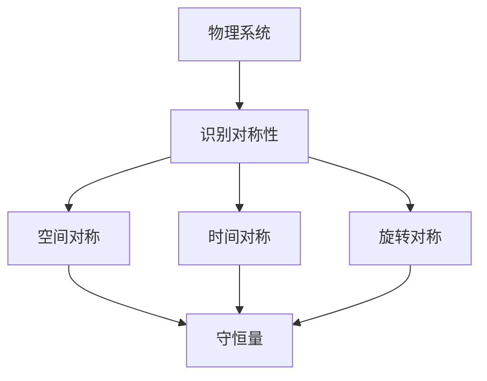

# 📐 物理学思维

> **理学门类** | **建模思维** | **实验验证** | **第一性原理**

---

## 📋 概述

**学科定义：** 研究物质、能量、空间、时间的基本规律

**核心价值：** 提供建模、实验、量化的科学方法

---

## 🎯 外行人常误解的常识

### 误区 1：物理就是公式计算

**误解：** 物理就是套公式算答案

**事实：**
> 物理学的核心是**理解自然规律**：
> - 公式只是描述规律的工具
> - 重要的是理解公式背后的物理意义
> - 物理直觉比公式记忆更重要

**物理学家观点：**
> "物理学不是关于公式的学科，而是关于理解自然的学科。" —— 费曼

---

### 误区 2：物理模型就是现实

**误解：** 物理模型描述的就是真实世界

**事实：**
> 模型是对现实的**简化和抽象**：
> - 所有模型都是错的，但有些是有用的
> - 模型的价值在于预测能力
> - 不同情境需要不同模型

---

### 误区 3：物理是确定性的

**误解：** 物理学可以精确预测一切

**事实：**
> 现代物理承认不确定性：
> - 量子力学的不确定性原理
> - 混沌系统的敏感依赖性
> - 复杂系统的涌现现象

---

## 🔧 核心方法论

### 1. 建模思维



**建模步骤：**
```
1. 识别关键变量
2. 做出合理简化
3. 建立数学关系
4. 求解方程
5. 预测结果
6. 实验验证
```

**示例：自由落体模型**
```
1. 关键变量：高度、时间、重力加速度
2. 简化假设：忽略空气阻力
3. 数学关系：h = ½gt²
4. 预测：从10米高落下需要1.43秒
5. 验证：实验测量
```

---

### 2. 控制变量法



**应用方法：**
```
1. 识别所有影响因素
2. 保持其他因素不变
3. 只改变一个因素
4. 观察结果变化
5. 确定该因素的影响
```

**示例：**
```
问题：影响物体下落速度的因素有哪些？

实验：
- 实验1：相同高度，不同质量 → 速度相同（质量无影响）
- 实验2：不同高度，相同质量 → 高度越高，速度越快
- 结论：下落速度与高度有关，与质量无关
```

---

### 3. 量纲分析



**基本量纲：**
| 量纲 | 符号 | 说明 |
|------|------|------|
| 长度 | L | 米 |
| 质量 | M | 千克 |
| 时间 | T | 秒 |

**应用：**
```
检查：F = ma 的量纲

[F] = MLT⁻²（力的量纲）
[m][a] = M × LT⁻² = MLT⁻²

量纲一致，公式可能正确
```

---

### 4. 近似与估算



**费米估算：**
```
问题：芝加哥有多少钢琴调音师？

估算过程：
1. 芝加哥人口：约300万
2. 家庭数：约100万（平均3人/家）
3. 有钢琴的家庭：约10%（10万）
4. 每年调音次数：1次
5. 每次调音时间：2小时
6. 调音师工作时间：2000小时/年

计算：10万次/年 ÷ (2000小时/年 ÷ 2小时/次) ≈ 100人
```

---

### 5. 对称性分析



**诺特定理：**
> 每一种对称性对应一个守恒量

| 对称性 | 守恒量 |
|--------|--------|
| 空间平移 | 动量 |
| 时间平移 | 能量 |
| 旋转对称 | 角动量 |

---

## 💡 跨界应用

### 1. 产品设计

```
传统思维：用户需要什么功能？

物理思维：
1. 建立用户行为模型
2. 识别关键变量
3. 控制变量测试
4. 量化用户体验
5. 数据驱动优化
```

### 2. 系统优化

```
传统思维：哪里慢优化哪里

物理思维：
1. 识别系统瓶颈（关键变量）
2. 建立性能模型
3. 控制变量测试
4. 量化优化效果
5. 找到最优解
```

### 3. 问题解决

```
传统思维：尝试各种方法

物理思维：
1. 建立问题模型
2. 识别关键因素
3. 估算量级
4. 设计验证实验
5. 迭代优化
```

---

## 📚 核心概念速查

| 概念 | 定义 | 应用场景 |
|------|------|---------|
| **模型** | 现实的简化抽象 | 问题建模 |
| **控制变量** | 保持其他因素不变 | 实验设计 |
| **量纲** | 物理量的基本单位 | 公式检验 |
| **近似** | 快速估算 | 费米估算 |
| **对称性** | 变换下的不变性 | 守恒定律 |
| **守恒** | 某量保持不变 | 系统分析 |
| **涌现** | 整体大于部分之和 | 复杂系统 |

---

**版本**: v1.0 | **更新日期**: 2026-04-30
