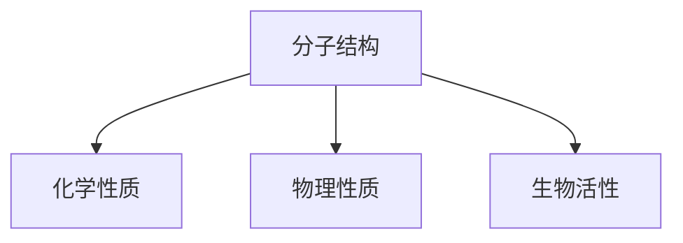
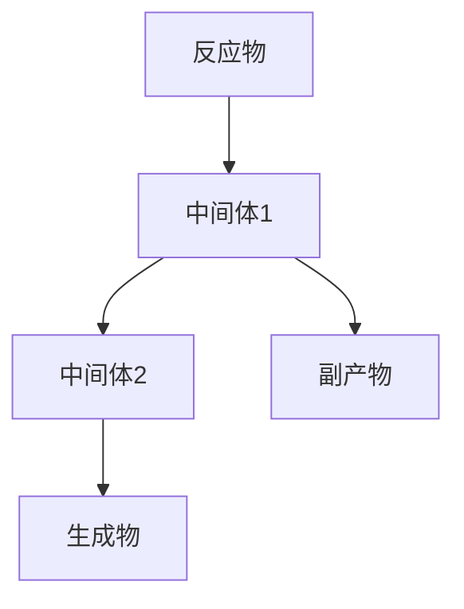
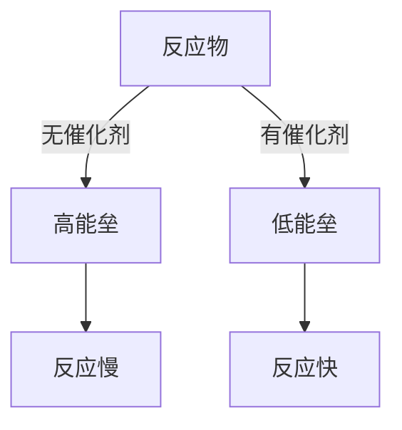

# 🧪 化学思维

> **理学门类** | **物质变化** | **反应机理** | **结构决定性质**

---

## 📋 概述

**学科定义：** 研究物质的组成、结构、性质、变化规律

**核心价值：** 提供理解物质变化和设计新材料的思维方法

---

## 🎯 外行人常误解的常识

### 误区 1：化学就是做实验

**误解：** 化学就是在实验室里做实验

**事实：**
> 现代化学是**理论与实验并重**的学科：
> - 计算化学：用计算机模拟分子行为
> - 理论化学：用数学模型描述化学过程
> - 实验化学：传统的实验验证

---

### 误区 2：化学物质都是有害的

**误解：** 化学品 = 有害物质

**事实：**
> 化学物质是中性的：
> - 水是化学物质
> - 空气是化学物质混合物
> - 人体本身就是化学系统
> - 关键在于使用方式和剂量

---

### 误区 3：化学反应是瞬间完成的

**误解：** 化学反应一混合就完成

**事实：**
> 化学反应有速率：
> - 有些反应瞬间完成（爆炸）
> - 有些反应需要很长时间（铁生锈）
> - 反应速率受温度、浓度、催化剂影响

---

## 🔧 核心方法论

### 1. 结构决定性质



**核心思想：**
> 了解物质的结构，就能预测其性质

**应用示例：**
```
乙醇 (C₂H₅OH) 和二甲醚 (CH₃OCH₃)

分子式相同：C₂H₆O
结构不同：
- 乙醇：有羟基 (-OH)，能形成氢键，沸点高
- 二甲醚：无羟基，不能形成氢键，沸点低

结论：结构决定性质
```

---

### 2. 化学平衡


**勒夏特列原理：**
> 如果改变影响平衡的条件，平衡会向减弱这种改变的方向移动

**应用：**
| 条件变化 | 平衡移动方向 |
|---------|-------------|
| 增加反应物浓度 | 向生成物方向移动 |
| 升高温度 | 向吸热方向移动 |
| 增加压力 | 向体积减小方向移动 |

---

### 3. 反应机理



**核心思想：**
> 化学反应是分步进行的，理解机理才能控制反应

**应用：**
```
优化化学反应：
1. 识别反应步骤
2. 找出速率控制步骤
3. 优化控制步骤的条件
4. 提高反应效率
```

---

### 4. 催化剂原理



**核心思想：**
> 催化剂降低反应活化能，加速反应

**应用：**
```
催化剂设计：
1. 理解反应机理
2. 设计活性位点
3. 优化载体材料
4. 调控反应选择性
```

---

## 💡 跨界应用

### 1. 产品配方设计

```
传统思维：混合各种成分

化学思维：
1. 分析成分的分子结构
2. 理解成分间的相互作用
3. 预测配方的稳定性
4. 优化配比达到最佳效果
```

### 2. 工艺优化

```
传统思维：多试几次找到最佳条件

化学思维：
1. 建立反应动力学模型
2. 分析影响因素
3. 找到速率控制步骤
4. 针对性优化条件
```

### 3. 新材料开发

```
传统思维：尝试各种材料

化学思维：
1. 确定目标性质
2. 设计分子结构
3. 预测性质
4. 合成验证
```

---

## 📚 核心概念速查

| 概念 | 定义 | 应用场景 |
|------|------|---------|
| **结构** | 分子的原子排列 | 性质预测 |
| **平衡** | 正逆反应速率相等 | 反应控制 |
| **机理** | 反应的分步过程 | 反应优化 |
| **催化** | 降低活化能 | 加速反应 |
| **热力学** | 反应的可能性 | 条件选择 |
| **动力学** | 反应的速率 | 条件优化 |
| **选择性** | 生成特定产物 | 产品纯度 |

---

**版本**: v1.0 | **更新日期**: 2026-04-30
