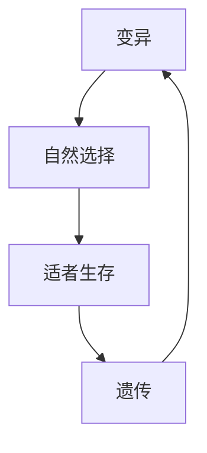
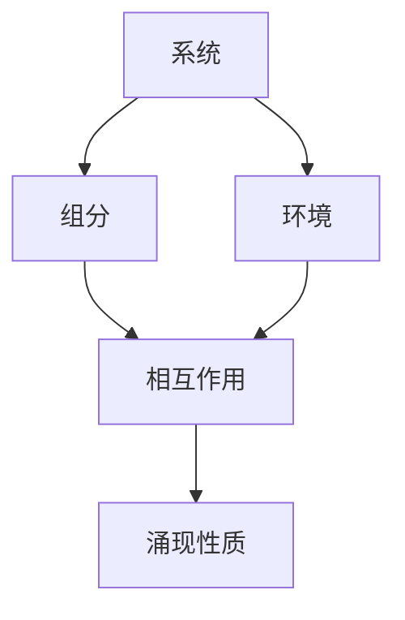
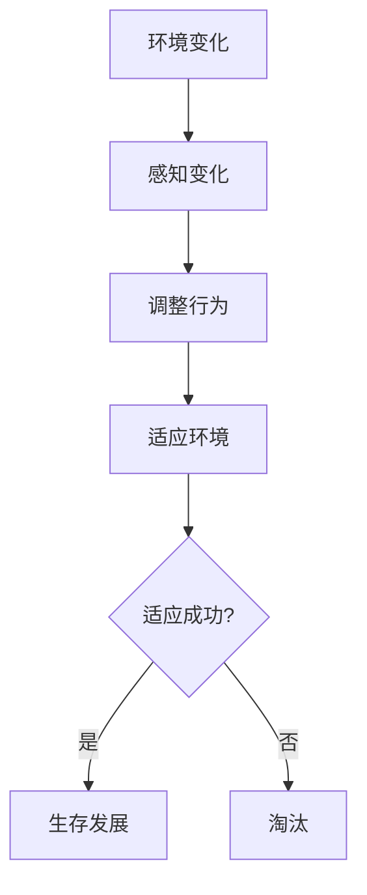
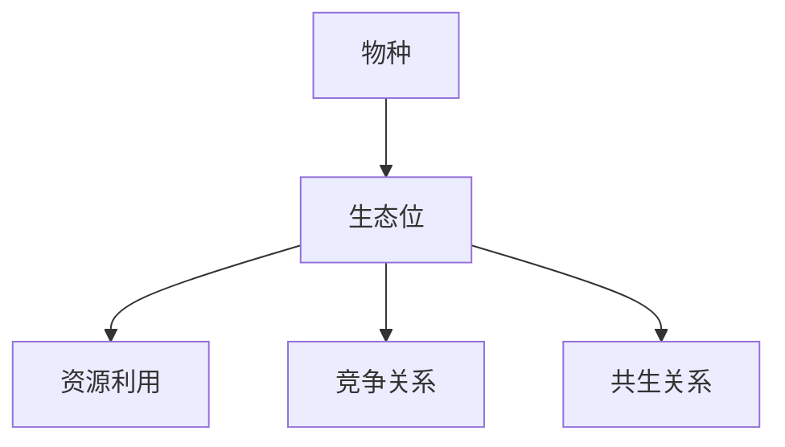

# 🧬 生物学思维

> **理学门类** | **进化思维** | **系统思维** | **适应性**

---

## 📋 概述

**学科定义：** 研究生命现象、生命活动规律的学科

**核心价值：** 提供理解复杂系统和适应性变化的思维方法

---

## 🎯 外行人常误解的常识

### 误区 1：进化是"从低到高"

**误解：** 进化是线性的，从简单到复杂，从低级到高级

**事实：**
> 进化是**分支树状**的：
> - 物种分化，不是线性进步
> - 适应环境才是关键，不一定更复杂
> - 人类不是进化的"终点"

---

### 误区 2：生物都有"目的"

**误解：** 长颈鹿的脖子是为了吃高处的树叶

**事实：**
> 进化没有目的，只有结果：
> - 变异是随机的
> - 自然选择是筛选
> - 适者生存，不适者淘汰
> - 不是"为了什么"，而是"碰巧适应了"

---

### 误区 3：基因决定一切

**误解：** 基因决定了人的所有特征

**事实：**
> 基因与环境共同作用：
> - 基因提供可能性，环境决定表达
> - 表观遗传学：环境可以影响基因表达
> - 行为也会影响基因表达

---

## 🔧 核心方法论

### 1. 进化思维



**核心思想：**
> 随机变异 + 非随机选择 = 适应

**应用：**
```
产品进化：
1. 产生变异（新功能、新设计）
2. 投放市场（自然选择）
3. 用户选择（适者生存）
4. 迭代优化（遗传+变异）
```

---

### 2. 系统思维



**核心思想：**
> 整体大于部分之和

**应用：**
```
组织管理：
1. 识别组织的组分（部门、人员）
2. 分析组分间的相互作用
3. 理解环境的影响
4. 预测涌现的性质
```

---

### 3. 适应性思维



**核心思想：**
> 适者生存，不适者淘汰

**应用：**
```
企业生存：
1. 感知市场变化
2. 调整产品策略
3. 适应竞争环境
4. 持续迭代优化
```

---

### 4. 生态位思维



**核心思想：**
> 每个物种都有其独特的生存位置

**应用：**
```
市场定位：
1. 识别市场生态位
2. 找到差异化定位
3. 避免直接竞争
4. 建立共生关系
```

---

## 💡 跨界应用

### 1. 产品迭代

```
传统思维：开发完美产品

生物学思维：
1. 快速推出最小可行产品（MVP）
2. 投放市场验证（自然选择）
3. 收集用户反馈（环境反馈）
4. 迭代优化（进化）
```

### 2. 组织设计

```
传统思维：设计最优组织结构

生物学思维：
1. 保持组织多样性
2. 允许试错和变异
3. 建立反馈机制
4. 让好的实践自然传播
```

### 3. 个人成长

```
传统思维：制定完美计划

生物学思维：
1. 尝试多种可能（变异）
2. 在实践中验证（自然选择）
3. 保留有效方法（遗传）
4. 持续迭代优化（进化）
```

---

## 📚 核心概念速查

| 概念 | 定义 | 应用场景 |
|------|------|---------|
| **进化** | 适者生存的变化过程 | 产品迭代 |
| **变异** | 随机的差异 | 创新尝试 |
| **选择** | 筛选适应者 | 市场验证 |
| **适应** | 与环境匹配 | 策略调整 |
| **生态位** | 生存位置 | 市场定位 |
| **共生** | 相互依存 | 合作关系 |
| **涌现** | 整体性质 | 系统设计 |

---

**版本**: v1.0 | **更新日期**: 2026-04-30
