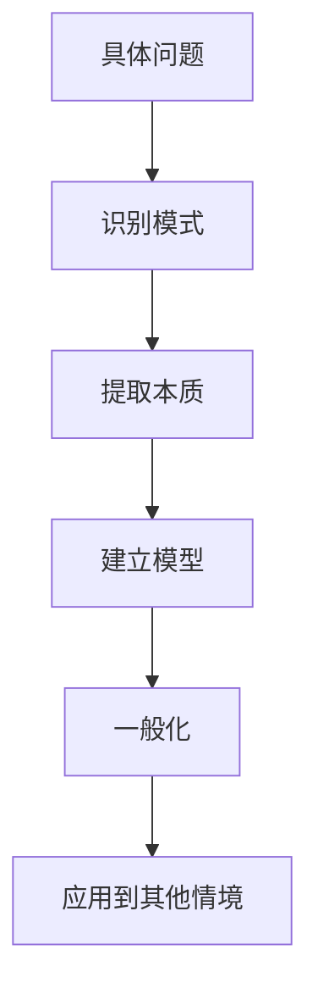
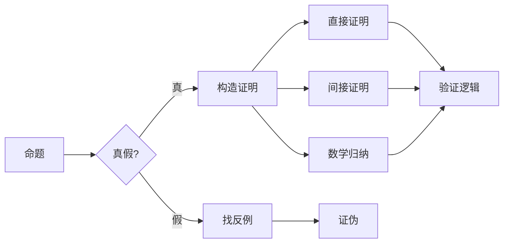
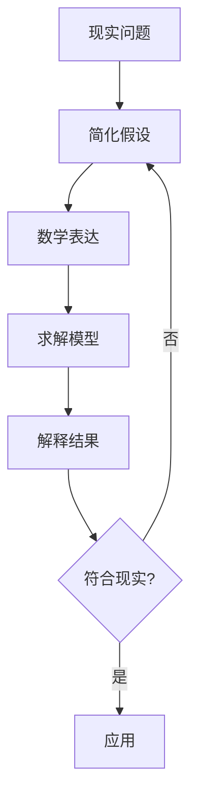
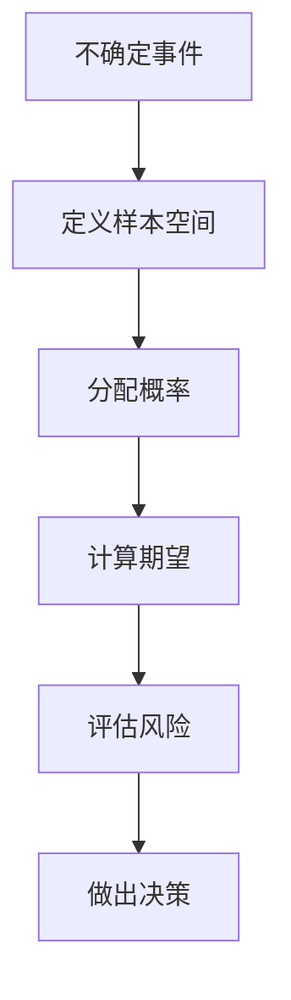
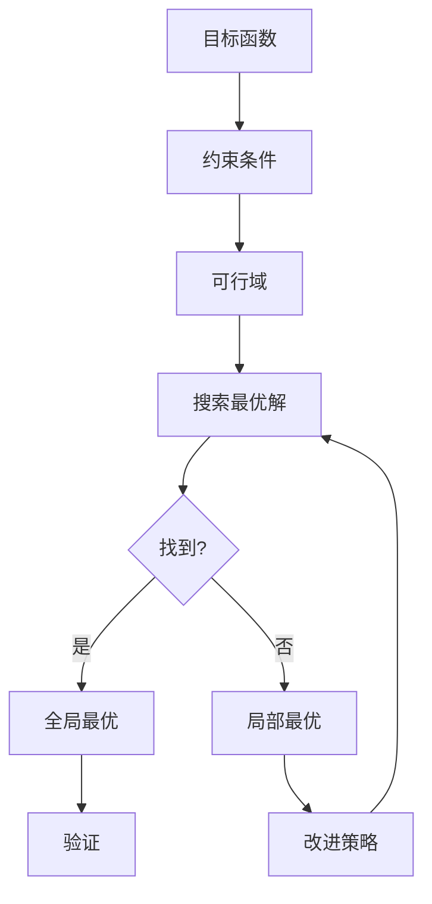

# 🔢 数学思维方法论

> **理学门类** | **抽象思维** | **逻辑推理** | **量化分析**

---

## 📋 概述

**学科定义：** 研究数量、结构、变化和空间的抽象科学

**核心价值：** 提供精确思考、逻辑推理和量化分析的通用工具

---

## 🎯 外行人常误解的常识

### 误区 1：数学就是计算

**误解：** 数学的主要工作是做算术题

**事实：**
> 数学的本质是**抽象和模式识别**：
> - 计算只是工具，不是目的
> - 核心是发现和理解模式
> - 培养的是逻辑思维和问题解决能力
> 
> **数学家观点：**
> "数学不是关于数字，而是关于理解。" —— William Paul Thurston

---

### 误区 2：数学天才都是天生的

**误解：** 只有天赋异禀的人才能学好数学

**事实：**
> 研究表明：
> - **成长型思维**比天赋更重要
> - 刻意练习可以显著提升数学能力
> - 大多数人数学不好是因为方法不对，而非能力不足
> - 数学思维可以通过训练获得

---

### 误区 3：数学与现实无关

**误解：** 高等数学在日常生活中用不到

**事实：**
> 数学思维无处不在：
> - **概率思维**：风险评估、决策制定
> - **优化思维**：资源配置、时间管理
> - **逻辑思维**：论证、推理、批判性思考
> - **抽象思维**：问题建模、系统设计

---

## 🔧 核心方法论

### 1. 抽象化思维



**抽象层次：**

| 层次 | 示例 | 特点 |
|------|------|------|
| **具体** | 3个苹果 + 2个苹果 = 5个苹果 | 依赖具体对象 |
| **算术** | 3 + 2 = 5 | 脱离具体对象 |
| **代数** | a + b = c | 引入变量 |
| **函数** | f(x) = x + 2 | 关注关系 |
| **结构** | 群、环、域 | 关注整体性质 |

**应用方法：**
```
1. 从具体实例出发
2. 寻找共同特征
3. 去除无关细节
4. 定义核心概念
5. 建立一般规律

示例：
具体问题：如何最快从A到B？
抽象：最短路径问题
模型：图论中的最短路算法
应用：网络路由、物流优化、社交网络
```

---

### 2. 证明思维



**证明策略：**

**直接证明：**
```
从已知条件出发，通过逻辑推理得出结论

示例：
命题：偶数 + 偶数 = 偶数
证明：
设 a = 2m, b = 2n（m,n为整数）
a + b = 2m + 2n = 2(m+n)
因为 m+n 是整数，所以 a+b 是偶数
```

**反证法：**
```
假设结论不成立，推出矛盾

示例：
命题：√2 是无理数
证明：
假设 √2 = p/q（p,q互质）
则 2 = p²/q² → p² = 2q²
→ p² 是偶数 → p 是偶数
设 p = 2k，则 4k² = 2q² → q² = 2k²
→ q 也是偶数
与 p,q 互质矛盾
因此 √2 是无理数
```

**数学归纳法：**
```
1. 基础步骤：证明 n=1 时成立
2. 归纳步骤：假设 n=k 时成立，证明 n=k+1 时也成立
3. 结论：对所有正整数 n 成立

应用：
- 算法正确性证明
- 递归关系求解
- 序列性质证明
```

**思维价值：**
```
证明思维培养的 capacity：
- 严谨的逻辑推理
- 清晰的表达能力
- 批判性审视假设
- 系统性思考问题
```

---

### 3. 建模思维



**建模流程：**

**1. 问题定义：**
```
- 明确目标和约束
- 识别关键变量
- 确定成功标准

示例：预测疫情传播
关键变量：感染率、恢复率、接触率
目标：预测峰值时间和规模
```

**2. 简化假设：**
```
原则：抓住主要矛盾，忽略次要因素

示例（自由落体）：
- 忽略空气阻力
- 重力加速度恒定
- 物体视为质点

注意：
- 假设必须明确说明
- 评估假设的合理性
- 知道模型的适用范围
```

**3. 数学表达：**
```
选择合适的数学工具：
- 微分方程：动态系统
- 线性代数：多变量关系
- 概率统计：不确定性
- 优化理论：最佳决策

示例（SIR模型）：
dS/dt = -βSI
dI/dt = βSI - γI
dR/dt = γI
```

**4. 验证与迭代：**
```
- 与实测数据对比
- 敏感性分析
- 调整参数和假设
- 改进模型

George Box名言：
"所有模型都是错的，但有些是有用的。"
```

---

### 4. 概率思维



**核心概念：**

**贝叶斯思维：**
```
P(A|B) = P(B|A) × P(A) / P(B)

含义：
- 根据新证据更新信念
- 先验概率 → 后验概率
- 持续学习和调整

应用：
- 医学诊断：症状出现时疾病概率
- 垃圾邮件过滤：关键词出现时是垃圾邮件的概率
- A/B测试：新方案更好的概率
```

**期望值思维：**
```
E[X] = Σ (xi × pi)

决策原则：
- 选择期望值最高的选项
- 考虑风险偏好
- 长期重复下的平均结果

示例（投资决策）：
方案A：80%概率赚100万，20%概率亏50万
E[A] = 0.8×100 + 0.2×(-50) = 70万

方案B：100%概率赚60万
E[B] = 60万

→ 风险中性者选A，风险厌恶者选B
```

**大数定律：**
```
核心思想：
- 单次结果随机，大量重复趋于稳定
- 短期波动，长期规律

应用：
- 保险公司：单个客户理赔不确定，整体可预测
- 赌场：单局输赢随机，长期稳赚
- 投资：分散风险，长期收益稳定
```

**常见谬误：**
```
❌ 赌徒谬误：连续5次正面，下次反面概率更大
✅ 事实：每次独立，概率仍是50%

❌ 幸存者偏差：只看到成功的案例
✅ 事实：失败的案例同样重要

❌ 基数谬误：忽略基础概率
✅ 事实：罕见事件的阳性结果很可能是假阳性
```

---

### 5. 优化思维



**优化类型：**

**线性规划：**
```
目标：最大化/最小化线性函数
约束：线性不等式

应用：
- 生产计划：最大化利润
- 资源分配：最小化成本
- 运输问题：最小化运费

工具：单纯形法、内点法
```

**贪心算法：**
```
策略：每一步选择局部最优

优点：简单、快速
缺点：不一定得到全局最优

应用：
- 找零钱问题
- 最小生成树
- 哈夫曼编码
```

**动态规划：**
```
核心思想：
- 将大问题分解为子问题
- 保存子问题的解（记忆化）
- 避免重复计算

应用：
- 最短路径
- 背包问题
- 编辑距离
- 股票买卖最佳时机
```

**启发式方法：**
```
当精确解太难时：
- 模拟退火
- 遗传算法
- 粒子群优化
- 蚁群算法

权衡：
- 解的质量 vs 计算时间
- 接受近似解换取效率
```

---

## 💡 跨界应用

### 1. 商业决策中的数学思维

```
问题：如何制定定价策略？

数学方法：
1. 建模思维
   - 需求函数：Q = a - bP
   - 收入函数：R = P × Q = P(a - bP)
   - 求导找最大值：dR/dP = a - 2bP = 0
   - 最优价格：P* = a/(2b)
   
2. 概率思维
   - 不同价格点的购买概率
   - 客户价值分布
   - 期望利润最大化
   
3. 优化思维
   - 约束：成本、竞争、品牌定位
   - 目标：利润最大化或市场份额
   - 多目标权衡

案例：航空公司动态定价
- 基于历史数据的 demand curve
- 实时调整价格
- 收益提升 15-20%
```

### 2. 个人生活中的量化思维

```
问题：如何优化时间管理？

数学方法：
1. 优先级量化
   - Eisenhower矩阵：重要性×紧急性
   - 打分系统：1-10分
   - 加权排序
   
2. 时间分配优化
   - 帕累托原则：20%任务产生80%价值
   - 时间块：批量处理类似任务
   - 边际效用：额外时间的价值递减
   
3. 习惯养成建模
   - 复合效应：每天进步1%，一年后37倍
   - 指数增长 vs 线性增长
   - 临界点：坚持到习惯自动化

实践：
- 追踪时间使用（数据收集）
- 分析时间投入产出比（ROI）
- 持续优化（迭代改进）
```

### 3. 产品设计中的抽象思维

```
问题：如何设计通用的UI组件库？

数学抽象：
1. 提取共性
   - 按钮：文本、图标、状态、事件
   - 输入框：值、验证、提示、错误
   - 卡片：内容、标题、操作
   
2. 参数化设计
   - Props接口定义
   - 默认值和自定义
   - 组合而非继承
   
3. 组合数学
   - 原子设计：原子→分子→组织→模板→页面
   - 组件组合爆炸管理
   - 设计 token 系统

成果：
- 减少重复代码 70%
- 开发效率提升 50%
- 一致性保证
```

---

## 📚 核心概念速查

| 概念 | 定义 | 应用场景 |
|------|------|---------|
| **抽象** | 提取本质，忽略细节 | 问题建模、系统设计 |
| **证明** | 逻辑推导验证真伪 | 论证、质量控制 |
| **建模** | 用数学描述现实 | 预测、优化、仿真 |
| **概率** | 量化不确定性 | 风险评估、决策 |
| **期望值** | 长期平均结果 | 投资决策、博弈 |
| **贝叶斯** | 根据证据更新信念 | 机器学习、诊断 |
| **优化** | 在约束下找最优 | 资源配置、调度 |
| **归纳法** | 从特殊到一般 | 算法证明、模式识别 |
| **反证法** | 假设反面推出矛盾 | 逻辑推理、debug |
| **大数定律** | 大量重复趋于稳定 | 保险、统计、投资 |

---

## 🔗 延伸阅读

- 《怎样解题》- George Pólya
- 《思考，快与慢》- Daniel Kahneman（概率思维）
- 《信号与噪声》- Nate Silver
- 《算法导论》- Cormen et al.
- 《数学之美》- 吴军

---

**版本**: v1.0 | **更新日期**: 2026-05-02
