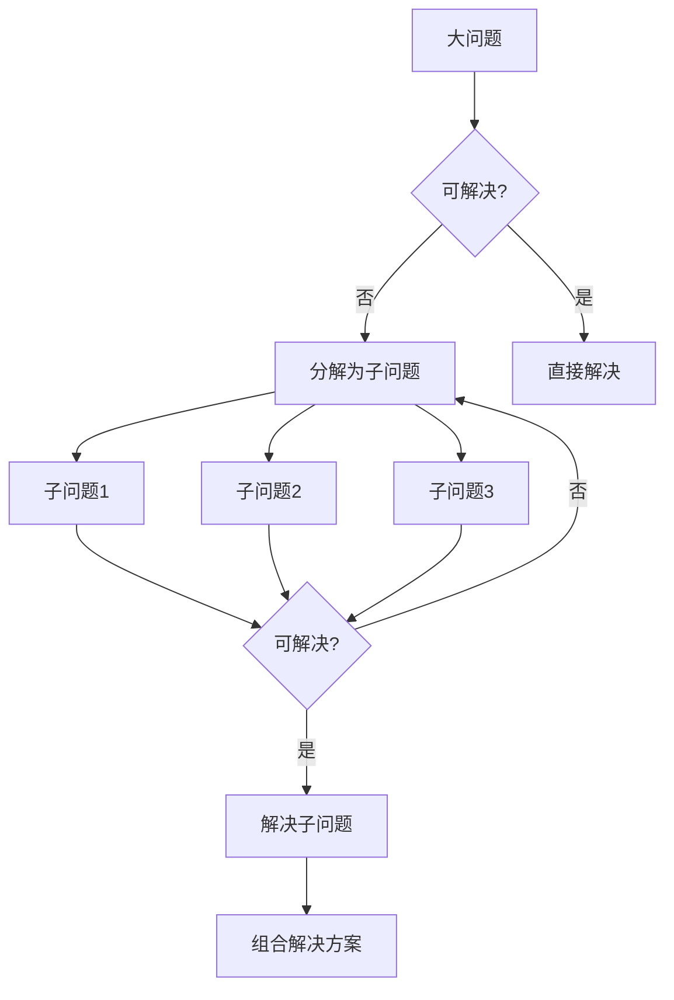
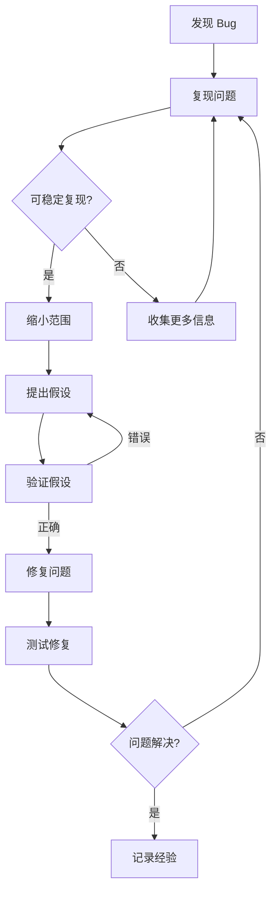
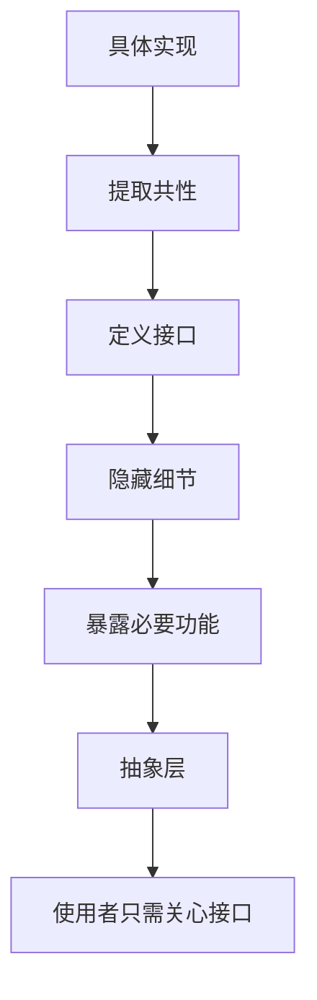
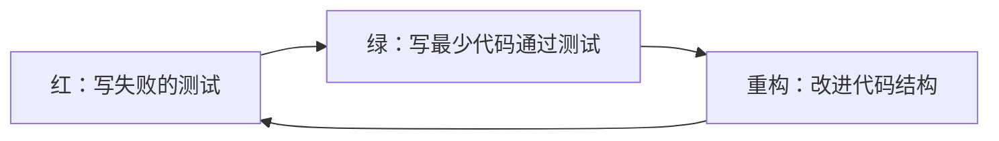
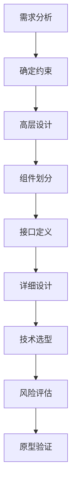

# 💻 软件工程思维方法论

> **工学门类** | **系统思维** | **问题分解** | **调试逻辑**

---

## 📋 概述

**学科定义：** 应用工程原则设计、开发、测试和维护软件系统的学科

**核心价值：** 提供系统化解决问题、管理复杂性和保证质量的方法论

---

## 🎯 外行人常误解的常识

### 误区 1：编程就是写代码

**误解：** 软件开发的主要工作是敲键盘写代码

**事实：**
> 软件工程的实际时间分配：
> - **需求分析**：20-30%（理解问题）
> - **设计**：20-25%（规划方案）
> - **编码**：15-20%（实现方案）
> - **测试**：20-25%（验证正确性）
> - **维护**：持续进行（修复和改进）

**软件工程格言：**
> "编程只是软件工程的一小部分，就像砌砖只是建筑的一小部分。"

---

### 误区 2：好的程序员写得快

**误解：** 编程速度是衡量程序员能力的标准

**事实：**
> 优秀软件工程师的特质：
> - **可读性**：代码易于理解和维护
> - **可靠性**：正确处理边界情况和错误
> - **可扩展性**：便于添加新功能
> - **可测试性**：容易编写自动化测试
> - **简洁性**：用最简单的方式解决问题

**Kent Beck（极限编程创始人）：**
> "任何傻瓜都能写出计算机能理解的代码。好的程序员写出人类能理解的代码。"

---

### 误区 3：Bug 越少越好

**误解：** 零 Bug 是软件质量的最高标准

**事实：**
> 现实中的权衡：
> - **完美主义陷阱**：追求零 Bug 导致无限延期
> - **风险分级**：关键 Bug 必须修复，次要 Bug 可以接受
> - **成本效益**：修复最后一个 Bug 的成本可能超过其价值
> - **迭代改进**：通过持续发布和反馈逐步完善

**Linus Torvalds（Linux 创始人）：**
> "足够多的眼睛，就可让所有问题浮现。"（林纳斯定律）

---

## 🔧 核心方法论

### 1. 问题分解（Decomposition）



**分解策略：**

**功能分解：**
```
电商系统
├── 用户模块
│   ├── 注册登录
│   ├── 个人资料
│   └── 权限管理
├── 商品模块
│   ├── 商品列表
│   ├── 商品详情
│   └── 库存管理
└── 订单模块
    ├── 购物车
    ├── 下单支付
    └── 订单追踪
```

**数据流分解：**
```
输入 → 处理1 → 处理2 → 处理3 → 输出
       ↓        ↓        ↓
     验证     转换     存储
```

**分层分解：**
```
表现层（UI）
  ↓
业务逻辑层
  ↓
数据访问层
  ↓
数据库
```

**最佳实践：**
```
1. 每个子问题应该相对独立
2. 子问题的接口应该清晰定义
3. 避免过度分解（保持可管理性）
4. 考虑子问题之间的依赖关系
5. 从高层抽象开始，逐步细化
```

---

### 2. 调试思维（Debugging）



**调试策略：**

**二分法调试：**
```
问题出现在哪一半？
1. 在代码中间添加日志/断点
2. 检查变量状态
3. 确定问题在前半段还是后半段
4. 继续二分，直到定位具体行
```

**橡皮鸭调试法：**
```
1. 向别人（或橡皮鸭）解释代码
2. 逐行说明代码的意图和行为
3. 在解释过程中往往自己发现问题
4. 关键在于强制自己理清思路
```

**对比调试：**
```
1. 找到正常工作的类似代码
2. 对比两者的差异
3. 识别可能导致问题的不同点
4. 逐一验证假设
```

**调试工具链：**
- **日志**：记录程序运行状态
- **断点**：暂停执行检查变量
- **性能分析器**：找出瓶颈
- **版本控制**：回溯到正常工作版本
- **单元测试**：隔离问题模块

---

### 3. 抽象与封装



**抽象层次：**

| 层次 | 示例 | 隐藏的细节 |
|------|------|-----------|
| **硬件抽象** | 文件系统 API | 磁盘扇区、磁头移动 |
| **网络抽象** | HTTP 请求 | TCP 握手、数据包路由 |
| **数据抽象** | 数据库 ORM | SQL 语句、索引优化 |
| **业务抽象** | 支付服务 | 银行接口、加密算法 |

**封装原则：**
```
1. 信息隐藏：外部不需要知道内部实现
2. 接口稳定：内部变化不影响外部使用
3. 单一职责：每个模块只做一件事
4. 最小知识：模块只了解必要的信息
```

**示例：**
```python
# 不好的设计：暴露实现细节
class UserService:
    def get_user_from_mysql(self, user_id):
        connection = mysql.connect(...)
        cursor = connection.cursor()
        cursor.execute("SELECT * FROM users WHERE id = %s", (user_id,))
        return cursor.fetchone()

# 好的设计：抽象接口
class UserRepository:
    def find_by_id(self, user_id: int) -> User:
        """根据 ID 查找用户"""
        pass  # 实现细节对外部透明

# 使用者只关心接口
user = repo.find_by_id(123)
```

---

### 4. 测试驱动开发（TDD）



**TDD 循环：**

**Red（红）阶段：**
```python
# 1. 写一个测试，预期它失败
def test_add_numbers():
    assert add(2, 3) == 5  # add 函数还不存在

# 运行测试 → FAIL
```

**Green（绿）阶段：**
```python
# 2. 写最少的代码让测试通过
def add(a, b):
    return 5  # 硬编码，但测试通过

# 运行测试 → PASS
```

**Refactor（重构）阶段：**
```python
# 3. 改进代码，保持测试通过
def add(a, b):
    return a + b  # 正确的实现

# 运行测试 → PASS
# 代码更清晰、更可维护
```

**TDD 的优势：**
- ✅ 确保代码符合需求
- ✅ 提供即时反馈
- ✅ 促进模块化设计
- ✅ 自动生成测试用例
- ✅ 减少回归错误

**适用场景：**
- 业务逻辑复杂的模块
- 需要长期维护的代码
- 团队协作的项目
- 对可靠性要求高的系统

---

### 5. 系统设计思维



**设计原则（SOLID）：**

| 原则 | 含义 | 示例 |
|------|------|------|
| **S**ingle Responsibility | 单一职责 | 一个类只做一件事 |
| **O**pen/Closed | 开闭原则 | 对扩展开放，对修改关闭 |
| **L**iskov Substitution | 里氏替换 | 子类可以替换父类 |
| **I**nterface Segregation | 接口隔离 | 小而专一的接口 |
| **D**ependency Inversion | 依赖倒置 | 依赖抽象而非具体 |

**系统考量维度：**

**可扩展性（Scalability）：**
- 垂直扩展：增加单机资源
- 水平扩展：增加机器数量
- 负载均衡：分发请求
- 缓存策略：减少计算

**可用性（Availability）：**
- 冗余设计：多副本
- 故障转移：自动切换
- 降级策略：部分功能可用
- 监控告警：及时发现问题

**一致性（Consistency）：**
- 强一致性：所有节点数据相同
- 最终一致性：允许短暂不一致
- CAP 定理：只能满足两个

**安全性（Security）：**
- 认证：你是谁？
- 授权：你能做什么？
- 加密：数据传输和存储
- 审计：记录操作日志

---

## 💡 跨界应用

### 1. 项目管理中的模块化思维

```
问题：如何管理大型复杂项目？

软件工程方法：
1. 工作分解结构（WBS）
   - 将项目分解为可管理的任务
   - 定义任务之间的依赖关系
   - 估算每个任务的时间和资源
   
2. 接口定义
   - 明确团队之间的协作边界
   - 定义交付物的格式和质量标准
   - 减少沟通成本和误解
   
3. 迭代开发
   - 小步快跑，快速反馈
   - 每个迭代交付可用的成果
   - 根据反馈调整后续计划
   
4. 风险管理
   - 识别潜在的技术风险
   - 制定应对预案
   - 建立监控机制

案例：大型活动策划
- 模块化：场地、餐饮、宣传、嘉宾邀请
- 接口：各模块的负责人和交付时间
- 迭代：每周例会检查进度
- 风险：备用场地、应急预案
```

### 2. 个人知识管理中的抽象思维

```
问题：如何高效组织和检索知识？

软件工程方法：
1. 分层抽象
   - 原始笔记（具体信息）
   - 主题笔记（归纳总结）
   - 概念笔记（抽象原理）
   
2. 标签系统（元数据）
   - 多维度分类
   - 交叉引用
   - 快速检索
   
3. 模板化（设计模式）
   - 读书笔记模板
   - 会议记录模板
   - 项目复盘模板
   
4. 版本控制
   - 记录知识的演进
   - 保留历史版本
   - 分支实验想法

工具实践：
- Obsidian：双向链接、图谱视图
- Notion：数据库、模板
- Git：版本管理、分支
```

### 3. 决策制定中的调试思维

```
问题：如何解决复杂的决策困境？

调试方法：
1. 复现问题
   - 明确决策的背景和约束
   - 收集所有相关信息
   - 识别利益相关方
   
2. 缩小范围
   - 排除明显不可行的选项
   - 聚焦关键因素
   - 简化决策模型
   
3. 提出假设
   - 如果选择 A，会发生什么？
   - 如果选择 B，会发生什么？
   - 预测各种可能的结果
   
4. 验证假设
   - 小规模试点
   - 咨询专家意见
   - 参考类似案例
   
5. 迭代改进
   - 做出初步决策
   - 监控结果
   - 根据需要调整

实例：职业选择
- 列出所有选项（大公司、创业公司、自由职业）
- 评估每个选项的利弊
- 短期实习或兼职体验
- 根据反馈调整方向
```

---

## 📚 核心概念速查

| 概念 | 定义 | 应用场景 |
|------|------|---------|
| **问题分解** | 将大问题拆分为小问题 | 项目管理、任务规划 |
| **调试思维** | 系统化定位和解决问题 | 故障排查、根因分析 |
| **抽象封装** | 隐藏复杂性，暴露接口 | API 设计、模块划分 |
| **TDD** | 先写测试再写代码 | 质量保证、设计规范 |
| **SOLID** | 面向对象设计原则 | 代码架构、系统设计 |
| **DRY** | Don't Repeat Yourself | 代码复用、效率提升 |
| **KISS** | Keep It Simple, Stupid | 简化设计、降低复杂度 |
| **YAGNI** | You Aren't Gonna Need It | 避免过度设计 |

---

## 🔗 延伸阅读

- 《代码大全》- Steve McConnell
- 《设计模式：可复用面向对象软件的基础》- GoF
- 《重构：改善既有代码的设计》- Martin Fowler
- 《人月神话》- Frederick Brooks
- 《Clean Code》- Robert C. Martin

---

**版本**: v1.0 | **更新日期**: 2026-05-02
