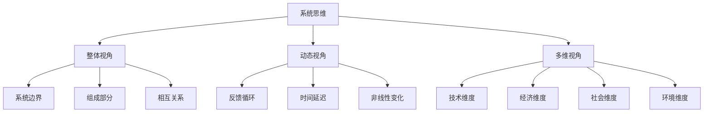
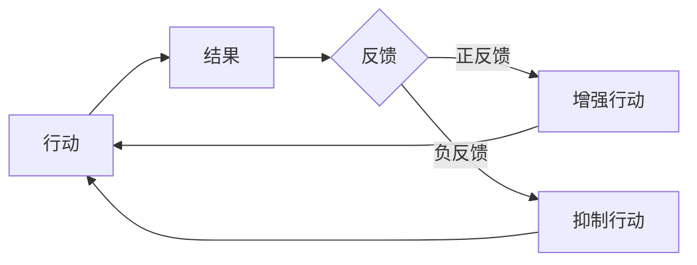
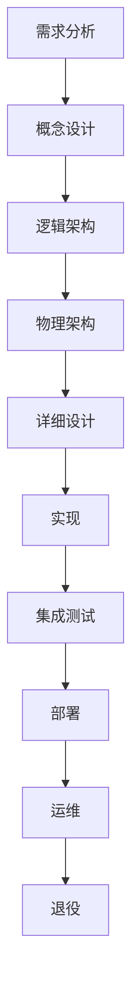
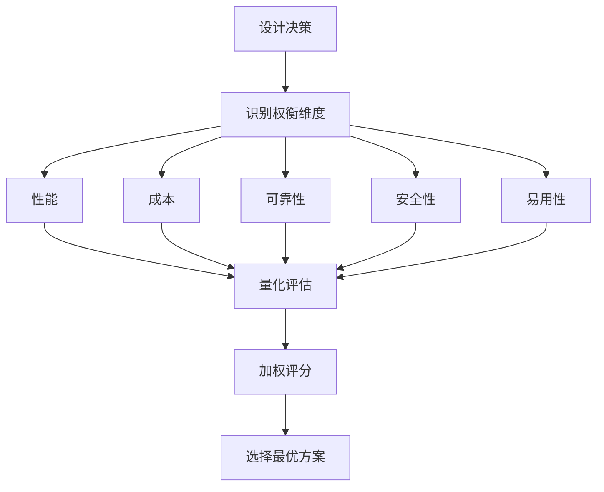
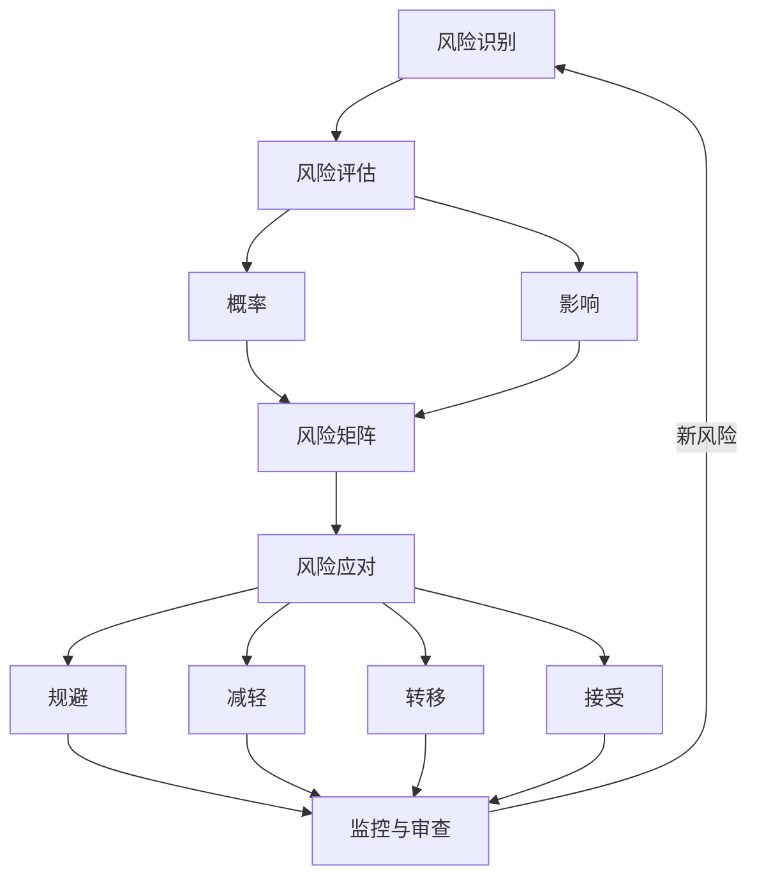
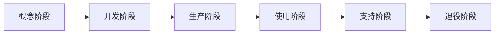

# ⚙️ 系统工程思维方法论

> **工学门类** | **整体优化** | **权衡分析** | **复杂系统管理**

---

## 📋 概述

**学科定义：** 研究如何设计、管理和优化复杂系统的跨学科学科

**核心价值：** 提供全局视角、多维度权衡和系统生命周期管理的方法论

---

## 🎯 外行人常误解的常识

### 误区 1：优化每个部分就能优化整体

**误解：** 把每个组件做到最好，系统就会最好

**事实：**
> 系统思维的核心原则：
> - **局部最优 ≠ 全局最优**：过度优化某部分可能损害整体
> - **瓶颈理论**：系统性能由最弱环节决定
> - ** emergent properties **：整体具有部分没有的特性
> - **反馈循环**：改变一处会影响多处
> 
> **示例：**
> - 汽车：最强的发动机 + 最轻的车身 ≠ 最好的车
> - 需要平衡：动力、安全、舒适、成本、燃油效率
> 
> **Goldratt（约束理论创始人）：**
> "系统的性能不由其最强部分决定，而由其最弱部分决定。"

---

### 误区 2：复杂问题需要复杂解决方案

**误解：** 问题越复杂，解决方案应该越复杂

**事实：**
> 系统工程的原则：
> - **KISS 原则**：Keep It Simple, Stupid
> - **奥卡姆剃刀**：如无必要，勿增实体
> - **简单性带来可靠性**：越少部件，越少故障点
> - **优雅的设计**：用简单方法解决复杂问题
> 
> **爱因斯坦：**
> "凡事应该尽可能简单，但不能过于简单。"
> 
> **案例：**
> - iPhone：一个按钮 vs 黑莓的键盘
> - Google 搜索：简单搜索框 vs 门户网站的复杂界面

---

### 误区 3：系统完成后就稳定了

**误解：** 系统设计好后就不会有大变化

**事实：**
> 系统的动态特性：
> - **环境变化**：需求、技术、法规不断变化
> - **演化而非革命**：系统通过持续改进演化
> - **技术债务**：短期妥协积累成长期问题
> - **适应性**：好系统能应对未知变化
> 
> **最佳实践：**
> - 模块化设计：便于替换和升级
> - 开放标准：避免供应商锁定
> - 向后兼容：保护既有投资
> - 持续监控：及时发现问题

---

## 🔧 核心方法论

### 1. 系统思维框架



**核心概念：**

**系统边界：**
```
定义：什么在系统内，什么在系统外

考虑因素：
- 控制范围：你能直接影响什么？
- 影响范围：你的决策影响什么？
- 接口：系统与环境的交互点

示例（电商平台）：
系统内：网站、数据库、支付系统
系统外：物流公司、银行、用户设备
接口：API、数据交换协议
```

**反馈循环：**


**正反馈（增强）：**
- 网络效应：用户越多→价值越大→更多用户
- 复利：利息产生更多利息
- 病毒传播：分享带来新用户

**负反馈（平衡）：**
- 恒温器：温度高→关闭加热
- 市场调节：价格高→需求降→价格降
- 身体调节：体温高→出汗降温

**涌现特性（ Emergence ）：**
```
定义：整体具有的、部分没有的特性

示例：
- 蚁群：单个蚂蚁简单，群体智能复杂
- 大脑：单个神经元简单，意识复杂
- 交通：单辆车简单，交通流复杂
- 市场：个人理性，群体可能非理性

启示：
- 不能通过分析部分完全理解整体
- 需要观察系统层面的行为模式
- 干预时要考虑二阶、三阶效应
```

---

### 2. 系统架构设计



**架构层次：**

**1. 概念架构：**
```
目标：定义系统要做什么

内容：
-  stakeholders ：利益相关方及其需求
-  use cases ：主要使用场景
-  constraints ：约束条件（预算、时间、法规）
-  success criteria ：成功标准

工具：
-  stakeholder map
-  user journey map
-  requirements matrix
```

**2. 逻辑架构：**
```
目标：定义系统如何实现功能

内容：
-  functional decomposition ：功能分解
-  data flow ：数据流向
-  interfaces ：模块间接口
-  abstraction layers ：抽象层次

原则：
-  高内聚：相关功能放在一起
-  低耦合：减少模块间依赖
-  单一职责：每个模块做一件事
-  信息隐藏：暴露最小必要接口
```

**3. 物理架构：**
```
目标：定义系统的物理实现

内容：
-  hardware ：服务器、网络设备
-  software ：操作系统、中间件、应用
-  deployment ：部署拓扑
-  scalability ：扩展策略

考虑：
-  性能要求
-  可靠性要求
-  安全性要求
-  成本约束
```

**架构风格：**

| 风格 | 特点 | 适用场景 |
|------|------|---------|
| **分层架构** | 层次分明，上层依赖下层 | 企业应用、Web 系统 |
| **微服务** | 小服务独立部署 | 大型分布式系统 |
| **事件驱动** | 异步通信，松耦合 | 实时系统、IoT |
| **管道-过滤器** | 数据流经处理链 | 数据处理、编译器等 |
| **客户端-服务器** | 集中式服务 | 传统企业系统 |

---

### 3. 权衡分析（ Trade-off Analysis ）



**常见权衡维度：**

**性能 vs 成本：**
```
高性能方案：
- 优点：快速响应、高吞吐
- 缺点：昂贵硬件、高能耗

低成本方案：
- 优点：初期投资少
- 缺点：可能性能瓶颈

决策方法：
- 确定性能底线（SLA）
- 计算 ROI
- 考虑未来扩展需求
```

**可靠性 vs 复杂性：**
```
高可靠性方案：
- 冗余设计：多副本、故障转移
- 优点：高可用性
- 缺点：系统复杂、维护成本高

简化方案：
- 优点：易于理解和维护
- 缺点：单点故障风险

决策方法：
- 评估故障后果严重性
- 计算 MTBF（平均无故障时间）
- 考虑可接受的停机时间
```

**安全性 vs 易用性：**
```
高安全性：
- 多因素认证、严格权限
- 优点：降低安全风险
- 缺点：用户体验差、效率低

高易用性：
- 优点：用户满意、 adoption rate 高
- 缺点：可能被滥用或攻击

决策方法：
- 风险评估：威胁模型
- 用户调研：容忍度
- 分层安全：关键操作加强，日常操作简化
```

**权衡分析工具：**

**Pugh Matrix（普氏矩阵）：**
```
步骤：
1. 列出备选方案
2. 确定评估标准
3. 为每个标准分配权重
4. 以基准方案为参照评分
5. 计算加权总分
6. 选择最高分方案

示例（选择云服务商）：
                AWS   Azure  GCP
成本 (0.3)       +1    0      -1
性能 (0.3)       +1    +1     0
易用性 (0.2)     0     +1     +1
支持 (0.2)       +1    +1     -1
---------------------------------
加权总分         0.7   0.8    -0.1

→ 选择 Azure
```

** Pareto 分析：**
```
80/20 原则：
- 80% 的效果来自 20% 的努力
- 识别关键的少数因素

应用：
- 哪些功能被 80% 用户使用？
- 哪些 bug 导致 80% 的问题？
- 哪些客户贡献 80% 的收入？

决策：
- 优先优化关键少数
- 接受非关键部分的不完美
```

---

### 4. 风险管理



**风险识别方法：**

**头脑风暴：**
```
参与者：项目团队、领域专家、 stakeholders
方法：自由提出可能的风险
分类：技术、进度、成本、质量、外部
```

**检查表：**
```
基于历史项目的经验教训
常见风险类别：
- 技术风险：新技术不成熟
- 资源风险：人员流失、预算不足
- 进度风险：依赖延误、范围蔓延
- 外部风险：法规变化、市场波动
```

**FMEA（失效模式与影响分析）：**
```
步骤：
1. 识别可能的失效模式
2. 评估严重度（S）：1-10
3. 评估发生概率（O）：1-10
4. 评估可检测度（D）：1-10
5. 计算 RPN = S × O × D
6. 优先处理高 RPN 的风险
```

**风险评估矩阵：**

```
        影响
        低    中    高
概  低  🟢   🟡   🟡
率  中  🟡   🟠   🔴
    高  🟡   🔴   🔴

🟢 低风险：监控即可
🟡 中等风险：制定应对计划
🟠 高风险：立即行动
🔴 极高风险：重新设计方案
```

**风险应对策略：**

**1. 规避（ Avoid ）：**
```
方法：改变计划消除风险
示例：
- 不使用未验证的新技术
- 选择有经验的供应商
- 缩小项目范围

适用：高风险、高影响的情况
```

**2. 减轻（ Mitigate ）：**
```
方法：降低概率或影响
示例：
- 原型验证降低技术风险
- 培训提高团队能力
- 冗余设计提高可靠性
- 分阶段交付降低进度风险

适用：无法完全避免但可降低的风险
```

**3. 转移（ Transfer ）：**
```
方法：将风险转给第三方
示例：
- 购买保险
- 外包给专业公司
- 合同条款（ penalty clauses ）

适用：他人更能管理的风险
```

**4. 接受（ Accept ）：**
```
方法：承认风险但不主动应对
示例：
- 小概率、小影响的风险
- 应对成本超过潜在损失
- 建立应急储备

适用：低风险或应对不经济的情况
```

---

### 5. 系统生命周期管理



**各阶段重点：**

**1. 概念阶段：**
```
活动：
- 需求收集和分析
- 可行性研究
- 概念设计
- 商业论证

输出：
- 需求规格说明书
- 系统架构图
- 项目计划
- 预算估算

关键决策：
- go/no-go decision
- 技术路线选择
- 合作伙伴选择
```

**2. 开发阶段：**
```
活动：
- 详细设计
- 原型开发
- 测试验证
- 迭代改进

方法：
- 敏捷开发：快速迭代
- V-model：验证和确认
- 原型法：早期验证概念

质量控制：
- 代码审查
- 单元测试
- 集成测试
- 用户验收测试
```

**3. 生产阶段：**
```
活动：
- 批量生产
- 质量控制
- 供应链管理
- 成本控制

重点：
- 规模化效率
- 一致性保证
- 成本管理
- 持续改进
```

**4. 使用阶段：**
```
活动：
- 部署安装
- 用户培训
- 运行维护
- 性能监控

指标：
- 可用性（ uptime ）
- 性能指标
- 用户满意度
- 故障率
```

**5. 支持阶段：**
```
活动：
- 技术支持
- bug 修复
- 版本更新
- 备件供应

策略：
- SLA（服务级别协议）
- 知识库建设
- 远程支持
- 现场服务
```

**6. 退役阶段：**
```
活动：
- 数据迁移
- 系统下线
- 资源回收
- 知识归档

考虑：
- 数据安全：彻底删除敏感数据
- 环境影响：电子废物处理
- 法律合规：数据保留要求
- 经验总结： lessons learned
```

---

## 💡 跨界应用

### 1. 组织变革管理

```
问题：如何成功推动大型组织变革？

系统工程方法：
1. 系统边界定义
   - 受影响部门：直接和间接
   - stakeholders：员工、管理层、客户、股东
   - 外部因素：市场、法规、竞争
   
2. 反馈循环分析
   - 正反馈：早期成功案例激励更多人
   - 负反馈：阻力、惯性、既得利益
   - 延迟效应：变革效果需要时间显现
   
3. 权衡分析
   - 短期痛苦 vs 长期收益
   - 标准化 vs 灵活性
   - 速度 vs 质量
   - 集中控制 vs 自主权
   
4. 风险管理
   - 阻力管理：沟通、参与、激励
   - 能力缺口：培训、招聘、外部支持
   - 文化冲突：价值观对齐
   - 执行风险：试点、分阶段推进
   
5. 生命周期规划
   - 准备阶段：诊断、愿景、计划
   - 启动阶段：沟通、培训、试点
   - 实施阶段：全面推行、监控调整
   - 固化阶段：制度化、文化建设
   - 评估阶段：效果评估、持续改进

案例：微软文化转型（Satya Nadella）
- 从" know-it-all "到" learn-it-all "
- 从内部竞争到协作
- 从 Windows first 到 cloud first
- 方法：领导示范、激励机制、组织结构
- 结果：市值从 3000 亿到 2 万亿+
```

### 2. 城市交通系统优化

```
问题：如何缓解城市交通拥堵？

系统思维：
1. 整体视角
   - 不只是修路，而是整个交通生态系统
   - 考虑：私家车、公交、地铁、自行车、步行
   - 关联：土地利用、城市规划、就业分布
   
2. 反馈循环
   - 正反馈：修路→短期缓解→吸引更多车→更堵
   - 负反馈：拥堵→改用公共交通→缓解
   - 延迟：基础设施建设需要多年
   
3. 多维度权衡
   - 效率 vs 公平：快速路 vs 公交优先
   - 成本 vs 效益：地铁 vs BRT
   - 短期 vs 长期：临时措施 vs 根本解决
   - 私人便利 vs 公共利益
   
4. 杠杆点识别
   - 高效杠杆：拥堵费、停车管理、公交优先
   - 低效杠杆：单纯增加车道
   
5. 综合方案
   - 供给侧：增加公共交通容量
   - 需求侧：拥堵费、错峰出行
   - 管理侧：智能信号、潮汐车道
   - 规划侧： TOD （公共交通导向发展）

案例：新加坡
- ERP（电子道路收费）：动态定价
- COE（拥车证）：控制车辆总量
- 世界级公共交通：地铁 + 公交
- 结果：尽管人口密度高，交通流畅
```

### 3. 个人知识管理系统

```
问题：如何构建可持续的个人知识管理体系？

系统工程方法：
1. 系统架构
   - 输入层：阅读、课程、经验
   - 处理层：笔记、整理、连接
   - 存储层：数字工具、分类体系
   - 输出层：写作、分享、应用
   
2. 反馈循环
   - 正反馈：知识越多→学习能力越强→学得更快
   - 负反馈：信息过载→焦虑→回避学习
   - 平衡：摄入 vs 消化 vs 输出
   
3. 权衡分析
   - 完整性 vs 速度：详细笔记 vs 快速记录
   - 结构化 vs 灵活：严格分类 vs 标签系统
   - 工具复杂度 vs 易用性： Notion vs Apple Notes
   
4. 瓶颈识别
   - 瓶颈通常在输出环节
   - 解决：强制输出（写作、教学）
   - Feynman 技巧：用简单语言解释
   
5. 演化策略
   - 从小系统开始
   - 根据实际使用调整
   - 定期回顾和优化
   - 避免过度工程化

实践：
- Zettelkasten：卡片盒笔记法
- PARA： Projects, Areas, Resources, Archives
- Building a Second Brain： CODE 方法
- 工具： Obsidian, Roam Research, Logseq
```

---

## 📚 核心概念速查

| 概念 | 定义 | 应用场景 |
|------|------|---------|
| **系统思维** | 整体、动态、多维的视角 | 复杂问题分析、战略规划 |
| **反馈循环** | 输出影响输入的循环 | 行为改变、市场动态 |
| **涌现** | 整体具有部分没有的特性 | 组织文化、生态系统 |
| **权衡分析** | 在多目标间找到平衡 | 设计决策、资源配置 |
| **瓶颈理论** | 系统性能由最弱环节决定 | 流程优化、能力提升 |
| **风险管理** | 识别、评估、应对不确定性 | 项目管理、投资决策 |
| **生命周期** | 系统从诞生到退役的全过程 | 产品管理、职业规划 |
| **架构设计** | 系统的结构和组织方式 | 软件开发、组织建设 |
| **模块化** | 将系统分解为独立模块 | 团队协作、系统维护 |
| **80/20 法则** | 少数因素产生多数结果 | 优先级排序、资源分配 |

---

## 🔗 延伸阅读

- 《系统之美》- Donella Meadows
- 《第五项修炼》- Peter Senge
- 《目标》- Eliyahu Goldratt
- 《复杂》- Melanie Mitchell
- 《思考，快与慢》- Daniel Kahneman

---

**版本**: v1.0 | **更新日期**: 2026-05-02
