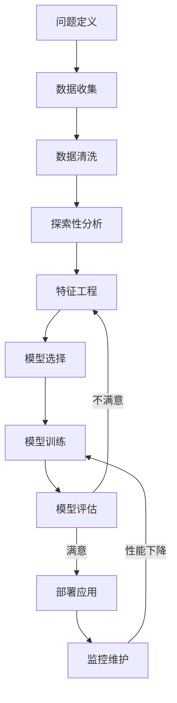
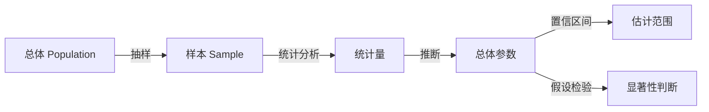
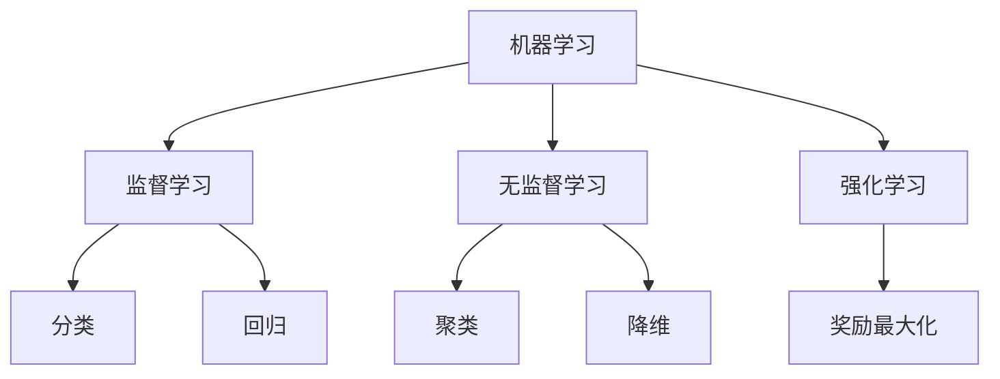
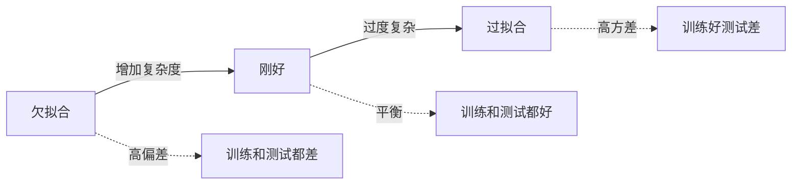
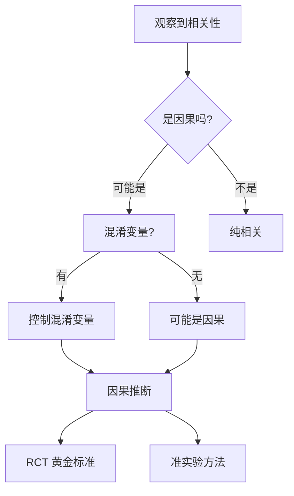
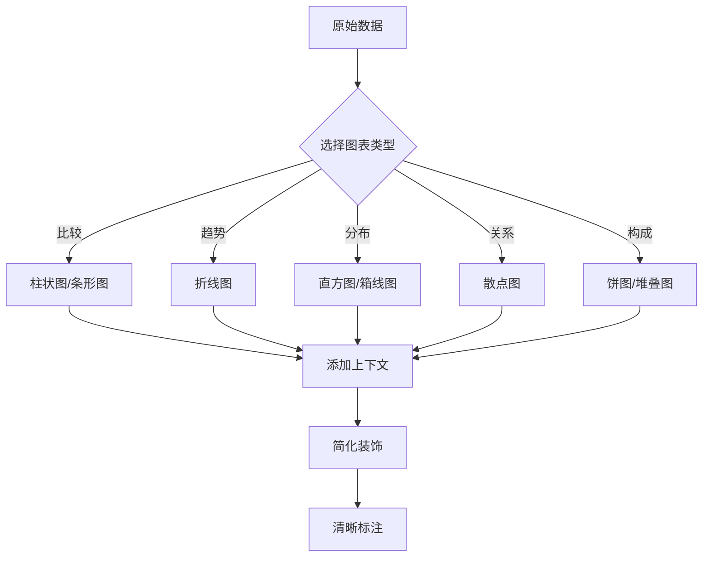

# 📊 数据科学思维方法论

> **工学门类** | **数据分析** | **统计推断** | **机器学习**

---

## 📋 概述

**学科定义：** 从数据中提取知识、发现模式并支持决策的跨学科学科

**核心价值：** 提供基于证据的决策方法、模式识别能力和预测分析工具

---

## 🎯 外行人常误解的常识

### 误区 1：数据不会说谎

**误解：** 只要有数据，结论就是客观真实的

**事实：**
> 数据可能被误导的方式：
> - **选择偏差**：样本不代表总体
> - **确认偏差**：只寻找支持预设观点的数据
> - **相关≠因果**：两个变量相关不一定有因果关系
> - **数据挖掘偏见**：从噪声中找出虚假模式
> - **可视化误导**：图表设计影响解读

**统计学家警告：**
> "世界上有三种谎言：谎言、该死的谎言，以及统计数据。" —— 马克·吐温

---

### 误区 2：更多数据总是更好

**误解：** 数据量越大，分析结果越准确

**事实：**
> 数据质量比数量更重要：
> - **垃圾进，垃圾出**（GIGO）：低质量数据产生错误结论
> - **维度灾难**：过多特征降低模型性能
> - **计算成本**：大数据需要更多资源
> - **隐私风险**：收集不必要的数据带来法律风险

**最佳实践：**
```
- 明确分析问题，只收集相关数据
- 重视数据清洗和预处理
- 平衡数据量和代表性
- 考虑数据的时效性和相关性
```

---

### 误区 3：AI/机器学习是万能的

**误解：** 机器学习可以解决任何问题

**事实：**
> 机器学习的局限性：
> - **需要大量标注数据**：很多领域缺乏高质量数据
> - **黑盒问题**：复杂模型难以解释
> - **过拟合风险**：在训练数据上表现好，在新数据上差
> - **偏见放大**：模型可能继承和放大数据中的偏见
> - **不适用于所有问题**：规则明确的问题用传统方法更好

---

## 🔧 核心方法论

### 1. 数据科学工作流程



**各阶段关键任务：**

**问题定义：**
```
- 业务目标是什么？
- 可以用数据解决的问题吗？
- 成功标准是什么？
- 有哪些约束条件？
```

**数据收集：**
```
- 内部数据：数据库、日志、CRM
- 外部数据：API、公开数据集、爬虫
- 数据格式：结构化、半结构化、非结构化
- 数据权限：隐私、合规、许可
```

**数据清洗（占 60-80% 时间）：**
```python
# 常见清洗任务
- 处理缺失值：删除、填充、插值
- 去除重复记录
- 修正异常值
- 统一格式：日期、单位、编码
- 数据类型转换
```

**探索性数据分析（EDA）：**
```
- 描述性统计：均值、中位数、标准差
- 分布分析：直方图、箱线图
- 相关性分析：散点图、相关系数
- 分组比较：按类别统计
- 时间序列：趋势、季节性
```

---

### 2. 统计推断思维



**核心概念：**

**抽样理论：**
- **随机抽样**：每个个体被选中的概率相等
- **分层抽样**：按特征分层后抽样
- **样本量**：越大越精确，但有边际递减
- **抽样误差**：样本统计量与总体参数的差异

**假设检验：**
```
1. 建立假设
   - 零假设 H₀：没有效应/差异
   - 备择假设 H₁：有效应/差异
   
2. 选择检验方法
   - t 检验：比较均值
   - 卡方检验：分类变量独立性
   - ANOVA：多组均值比较
   
3. 计算 p 值
   - p < 0.05：拒绝零假设（显著）
   - p ≥ 0.05：不能拒绝零假设
   
4. 注意陷阱
   - p 值不等于效应大小
   - 统计显著 ≠ 实际重要
   - 多重检验问题
```

**置信区间：**
```
95% 置信区间的含义：
- 如果重复抽样 100 次
- 约 95 次的区间会包含真实参数
- 不是"参数有 95% 概率在这个区间"

示例：
用户平均消费 = ¥100 ± ¥10 (95% CI)
→ 我们有 95% 的把握认为真实平均值在 ¥90-¥110 之间
```

---

### 3. 机器学习范式



**监督学习（有标签数据）：**

| 任务 | 算法示例 | 应用场景 |
|------|---------|---------|
| **分类** | 逻辑回归、SVM、随机森林 | 垃圾邮件检测、疾病诊断 |
| **回归** | 线性回归、决策树 | 房价预测、销量预测 |

**无监督学习（无标签数据）：**

| 任务 | 算法示例 | 应用场景 |
|------|---------|---------|
| **聚类** | K-Means、DBSCAN | 客户分群、异常检测 |
| **降维** | PCA、t-SNE | 可视化、特征提取 |

**模型评估指标：**

**分类问题：**
```
- 准确率（Accuracy）：正确预测的比例
- 精确率（Precision）：预测为正的有多少是真的正
- 召回率（Recall）：真正的正有多少被预测出来
- F1 分数：精确率和召回率的调和平均
- ROC-AUC：不同阈值下的性能
```

**回归问题：**
```
- MAE（平均绝对误差）：预测值与真实值的平均差距
- MSE（均方误差）：惩罚大误差
- RMSE（均方根误差）：与原始数据同单位
- R²（决定系数）：模型解释的方差比例
```

**过拟合与欠拟合：**


**解决方案：**
- **正则化**：L1/L2 正则化限制模型复杂度
- **交叉验证**：K-fold 验证评估泛化能力
- **早停**：在验证集性能下降时停止训练
- **集成学习**：多个模型投票或平均

---

### 4. 因果推断



**相关 vs 因果：**

**经典例子：**
```
观察：冰淇淋销量与溺水事故正相关

错误结论：吃冰淇淋导致溺水

真实原因：
- 混淆变量：夏季高温
- 夏天 → 更多人买冰淇淋
- 夏天 → 更多人游泳 → 更多溺水

正确做法：控制温度变量后，相关性消失
```

**因果推断方法：**

**随机对照试验（RCT）：**
```
1. 随机分配实验组和对照组
2. 实验组接受干预，对照组不接受
3. 比较两组结果的差异
4. 差异即为因果效应

优点：最可靠的因果证据
缺点：成本高、伦理限制、有时不可行
```

**准实验方法：**
```
- 断点回归（RDD）：利用阈值附近的自然实验
- 双重差分（DID）：比较处理前后差异的变化
- 工具变量（IV）：找到只通过处理影响结果的变量
- 倾向得分匹配（PSM）：构造可比的控制组
```

---

### 5. 数据可视化原则



**可视化最佳实践：**

**选择正确的图表：**
```
- 比较数值 → 柱状图
- 显示趋势 → 折线图
- 展示分布 → 直方图、箱线图
- 显示关系 → 散点图
- 展示占比 → 饼图（少用）、堆叠柱状图
- 地理数据 → 地图
```

**避免误导：**
```
❌ 截断 Y 轴夸大差异
✅ 从 0 开始，或使用断裂标记

❌ 3D 图表扭曲比例
✅ 使用 2D 图表

❌ 过多的颜色和装饰
✅ 简洁、突出关键信息

❌ 不标注单位和来源
✅ 清晰的标题、轴标签、图例
```

**色彩使用：**
```
- 顺序色板：数值从小到大（蓝→红）
- 发散色板：以中性色为中心（红-白-蓝）
- 分类色板：区分不同类别（不同颜色）
- 考虑色盲友好：避免红绿对比
```

---

## 💡 跨界应用

### 1. 市场营销中的 A/B 测试

```
问题：哪个版本的广告更有效？

数据科学方法：
1. 实验设计
   - 随机分配用户到 A 组或 B 组
   - 确保样本量足够（功效分析）
   - 控制其他变量（时间、渠道等）
   
2. 指标定义
   - 主要指标：转化率
   - 次要指标：点击率、停留时间
   - 护栏指标：退订率、投诉率
   
3. 统计检验
   - 计算每组的转化率
   - 进行比例检验（z-test）
   - 计算 p 值和置信区间
   
4. 结果解读
   - p < 0.05：差异显著
   - 检查效应大小：实际意义有多大？
   - 考虑细分群体：对不同用户效果不同？

案例：电商网站按钮颜色
- A 版本：蓝色按钮，转化率 3.2%
- B 版本：橙色按钮，转化率 3.8%
- p 值：0.02（显著）
- 提升：18.75%
- 决策：采用橙色按钮
```

### 2. 产品决策中的数据驱动

```
问题：是否应该开发新功能？

数据分析框架：
1. 需求验证
   - 用户调研数据：多少人需要？
   - 行为数据：现有替代方案使用情况
   - 竞品分析：市场上是否有类似功能？
   
2. 影响预测
   - 历史数据建模：类似功能的 adoption rate
   - 用户分群：哪些用户最可能使用？
   - ROI 估算：开发成本 vs 预期收益
   
3. MVP 测试
   - 小范围发布
   - 收集使用数据
   - A/B 测试验证效果
   
4. 迭代优化
   - 监控关键指标
   - 用户反馈分析
   - 持续改进功能

实例：社交 App 的"已读"功能
- 数据发现：用户频繁询问消息状态
- MVP 测试：5% 用户灰度发布
- 结果：满意度提升 15%，但焦虑感也增加
- 优化：允许用户关闭已读提示
- 全量发布：80% 用户选择开启
```

### 3. 个人生活中的数据思维

```
问题：如何优化个人效率和健康？

数据科学应用：
1. 数据收集
   - 时间追踪：Toggl、RescueTime
   - 健康监测：智能手表、睡眠追踪
   - 习惯记录：Habitica、Loop Habit Tracker
   
2. 模式识别
   - 什么时间段效率最高？
   - 哪些因素影响睡眠质量？
   - 什么习惯最容易坚持？
   
3. 实验优化
   - A/B 测试不同的工作方法
   - 调整作息观察精力变化
   - 尝试不同的学习策略
   
4. 可视化洞察
   - 每周时间分配饼图
   - 月度习惯坚持率折线图
   - 相关性热力图

个人案例：
- 发现：下午 2-4 点效率最低
- 假设：午餐后血糖波动影响
- 实验：改为低碳水午餐
- 结果：下午效率提升 30%
- 行动：调整饮食结构
```

---

## 📚 核心概念速查

| 概念 | 定义 | 应用场景 |
|------|------|---------|
| **抽样偏差** | 样本不代表总体 | 调查设计、用户研究 |
| **p 值** | 观察到当前结果的概率（假设 H₀ 为真） | 假设检验、A/B 测试 |
| **置信区间** | 参数的可能范围 | 估计精度、风险评估 |
| **过拟合** | 模型记住噪声而非规律 | 模型选择、泛化能力 |
| **交叉验证** | 多次划分训练/测试集 | 模型评估、超参数调优 |
| **混淆变量** | 同时影响自变量和因变量的第三方变量 | 因果推断、实验设计 |
| **ROC-AUC** | 分类器性能的综合性指标 | 模型比较、阈值选择 |
| **特征工程** | 从原始数据提取有用特征 | 模型性能提升 |

---

## 🔗 延伸阅读

- 《统计学漫话》- 陈希孺
- 《赤裸裸的统计学》- Charles Wheelan
- 《机器学习实战》- Peter Harrington
- 《因果推断导论》- Miguel Hernán
- 《数据可视化之美》- Nathan Yau

---

**版本**: v1.0 | **更新日期**: 2026-05-02
