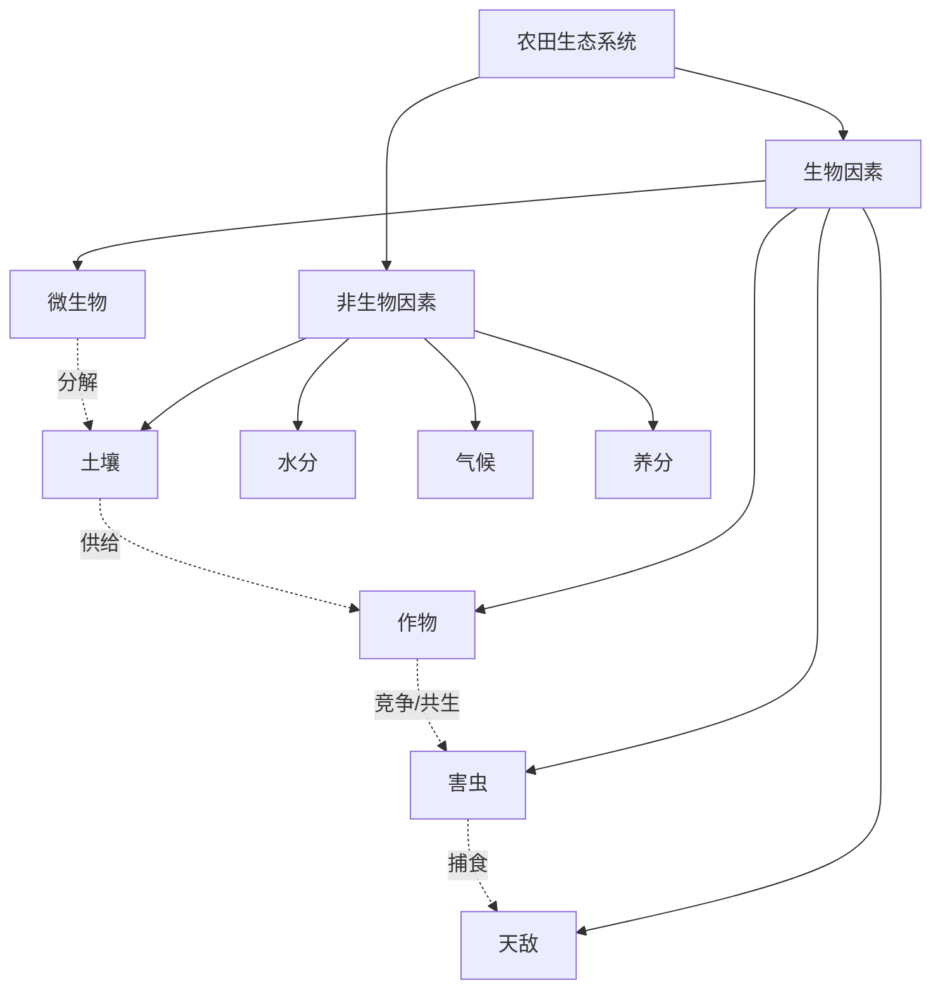
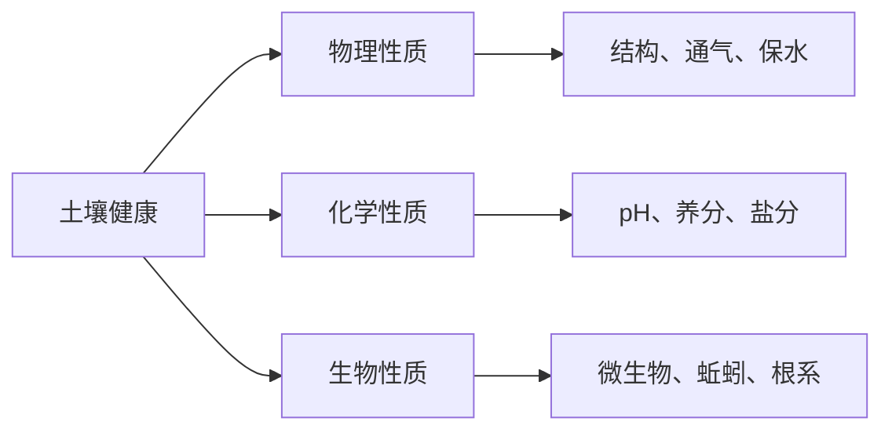
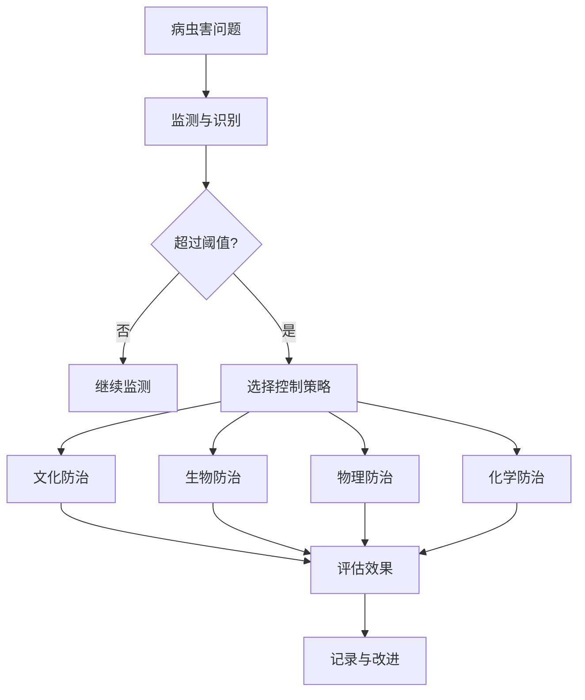
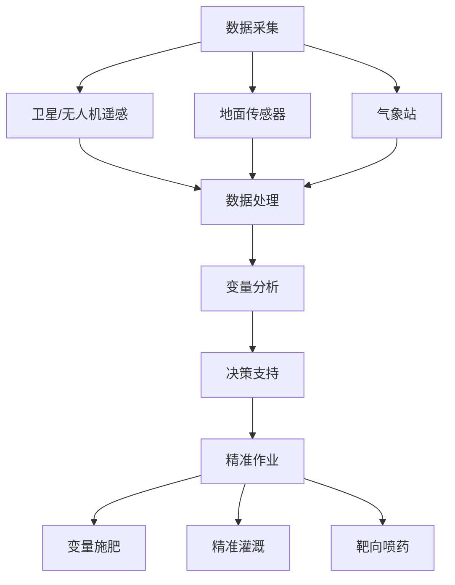
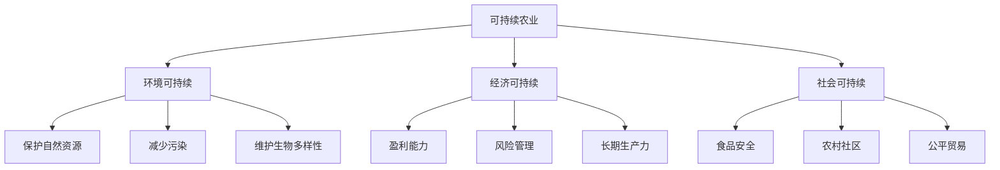

# 🌾 农学思维方法论

> **农学门类** | **生态系统** | **可持续农业** | **精准农业**

---

## 📋 概述

**学科定义：** 研究作物生产、土壤管理、农业生态和食品安全的学科

**核心价值：** 提供系统思维、资源优化和可持续发展的实践方法

---

## 🎯 外行人常误解的常识

### 误区 1：农业就是种地，技术含量低

**误解：** 农业是简单的体力劳动，不需要高科技

**事实：**
> 现代农业的核心技术：
> - **生物技术**：基因编辑、分子育种
> - **精准农业**：GPS、无人机、传感器
> - **智能灌溉**：土壤湿度监测、自动控制系统
> - **数据分析**：产量预测、病虫害预警
> - **垂直农业**：室内种植、LED 光照优化

**数据：**
> 美国农民平均年龄 58 岁，但 70% 以上使用智能手机 App 管理农场

---

### 误区 2：有机农业一定更好

**误解：** 有机食品更健康、更环保

**事实：**
> 有机农业的复杂性：
> - **产量差异**：有机作物产量通常低 20-25%
> - **土地需求**：需要更多土地才能产出相同数量食物
> - **农药使用**：有机也使用农药（天然来源），不一定更安全
> - **环境影响**：取决于具体实践，不是绝对的
> - **营养价值**：研究显示差异不大

**平衡观点：**
```
- 有机农业在某些方面更环保（减少化学合成物）
- 但可能增加碳排放（需要更多土地和运输）
- 最佳方案：根据具体情况选择，或采用综合管理
```

---

### 误区 3：转基因食品不安全

**误解：** GMO 食品对人体有害

**事实：**
> 科学共识：
> - **安全性**：主流科学机构认为已批准的 GMO 食品是安全的
> - **监管严格**：GMO 上市前经过严格测试
> - **广泛应用**：全球数十亿人食用 GMO 食品，无确凿危害证据
> - **环境效益**：减少农药使用、提高产量、降低碳足迹

**世界卫生组织（WHO）：**
> "目前在国际市场上可获得的转基因食品已通过安全性评估，并且不太可能对人类健康构成风险。"

---

## 🔧 核心方法论

### 1. 生态系统思维



**核心原则：**

**生物多样性：**
```
单一栽培的问题：
- 容易爆发大规模病虫害
- 土壤养分失衡
- 生态系统脆弱

多样化种植的优势：
- 间作：不同作物互相受益
  例：玉米 + 豆类（固氮）
- 轮作：打破病虫生命周期
  例：禾本科 → 豆科 → 蔬菜
- 覆盖作物：保护土壤、抑制杂草
```

**食物网思维：**
```
传统农业：线性思维
种子 → 作物 → 收获

生态农业：网络思维
┌─────────────────────┐
│  传粉昆虫 ←→ 作物    │
│  ↑         ↓        │
│ 天敌 ←→ 害虫        │
│  ↑         ↓        │
│ 微生物 ←→ 土壤养分   │
└─────────────────────┘

应用：
- 保留田埂野花带（吸引传粉者）
- 设置天敌栖息地（瓢虫、蜘蛛）
- 堆肥还田（增加土壤微生物）
```

---

### 2. 土壤健康管理



**土壤健康的三大支柱：**

**物理性质：**
```
关键指标：
- 土壤质地：砂土、壤土、黏土比例
- 团聚体稳定性：抵抗侵蚀的能力
- 孔隙度：通气和排水能力
- 容重：压实程度

改善方法：
- 减少耕作（保护土壤结构）
- 添加有机质（改善团聚）
- 覆盖作物（防止侵蚀）
- 避免重型机械（减少压实）
```

**化学性质：**
```
关键指标：
- pH 值：影响养分有效性
- 有机质含量：土壤肥力基础
- NPK：氮、磷、钾含量
- 微量元素：铁、锌、硼等

管理策略：
- 定期土壤测试（每 2-3 年）
- 精准施肥（根据测试结果）
- 石灰调节 pH
- 绿肥作物（自然补充养分）
```

**生物性质：**
```
关键生物：
- 细菌：分解有机物、固氮
- 真菌：形成菌根、帮助吸收养分
- 蚯蚓：改善土壤结构
- 线虫：有些有益，有些有害

促进方法：
- 减少化学农药（保护微生物）
- 添加堆肥（引入有益微生物）
- 多样化种植（支持多样生物）
- 免耕或少耕（保护生物栖息地）
```

---

### 3. 综合病虫害管理（IPM）



**IPM 金字塔（从优先到备选）：**

**1. 预防措施（最优先）：**
```
- 选择抗病品种
- 合理轮作
- 适时播种（避开病虫害高发期）
- 健康种苗（无病毒、无虫害）
- 田间卫生（清除病残体）
```

**2. 文化防治：**
```
- 调整种植密度（改善通风）
- 合理灌溉（避免过湿）
- 平衡施肥（避免过量氮肥）
- 诱集植物（吸引害虫远离主作物）
```

**3. 生物防治：**
```
- 引入天敌：瓢虫吃蚜虫、寄生蜂
- 微生物制剂：苏云金杆菌（Bt）
- 信息素诱捕：干扰交配
- 保护本地天敌：提供栖息地
```

**4. 物理防治：**
```
- 防虫网：物理隔离
- 粘虫板：诱捕飞行害虫
- 人工捕捉：适用于小规模
- 热处理：种子消毒
```

**5. 化学防治（最后手段）：**
```
原则：
- 选择性农药（只针对目标害虫）
- 最低有效剂量
- 轮换使用（避免抗药性）
- 严格遵守安全间隔期
- 记录使用情况
```

---

### 4. 精准农业技术



**核心技术：**

**遥感监测：**
```
卫星影像：
- NDVI（归一化植被指数）：评估作物健康状况
- 热红外：检测水分胁迫
- 多光谱：识别病虫害早期症状

无人机应用：
- 高分辨率成像（厘米级）
- 实时监测
- 精准喷洒
- 3D 地形建模
```

**变量_rate_ 技术：**
```
传统做法：整块田地统一施肥/灌溉

精准农业：
1. 绘制田地变异图（土壤、产量历史）
2. GPS 定位拖拉机
3. 根据位置自动调整投入量

示例：
- 肥沃区域：减少氮肥 20%
- 贫瘠区域：增加氮肥 30%
- 结果：节省成本 15%，产量提升 10%
```

**智能灌溉：**
```
传感器网络：
- 土壤湿度传感器（不同深度）
- 气象站（温度、湿度、风速、降雨）
- 植物茎流传感器（实际用水量）

自动控制：
- 基于数据的灌溉决策
- 滴灌/微喷精准供水
- 手机 App 远程监控

效益：
- 节水 30-50%
- 减少养分流失
- 提高作物品质
```

---

### 5. 可持续农业实践



**关键实践：**

**保护性耕作：**
```
传统耕作的问题：
- 土壤侵蚀
- 有机质流失
- 碳排放

保护性耕作：
- 免耕或少耕
- 作物残茬覆盖
- 常年覆盖作物

效果：
- 减少土壤侵蚀 90%+
- 增加土壤有机质
- 固碳减排
```

** agroforestry（农林复合）：**
```
模式：
- 林粮间作：树木 + 作物
- 林牧结合：树木 + 畜牧
- 防风林：保护农田

优势：
- 多样化收入来源
- 改善微气候
- 增加生物多样性
- 碳汇功能
```

**循环农业：**
```
理念：废物即资源

实践：
- 畜禽粪便 → 沼气 → 能源 + 有机肥
- 作物秸秆 → 饲料/堆肥/生物质能
- 厨余垃圾 → 堆肥 → 回到农田
- 雨水收集 → 灌溉

案例：猪-沼-果模式
养猪 → 粪便产沼气 → 沼渣肥果树 → 果实销售
```

---

## 💡 跨界应用

### 1. 企业管理中的生态系统思维

```
问题：如何构建可持续的商业生态系统？

农学启示：
1. 多样性增强韧性
   -  monoculture（单一业务）风险高
   -  多元化产品线分散风险
   -  建立合作伙伴网络
   
2. 共生关系创造价值
   -  平台 + 开发者（如 iOS App Store）
   -  供应商 + 制造商深度合作
   -  用户生成内容（UGC）
   
3. 长期土壤健康 = 组织能力
   -  投资员工培训（施肥）
   -  建立良好文化（土壤结构）
   -  知识管理系统（有机质积累）
   
4. IPM = 风险管理
   -  预防优于治疗
   -  多层次防御策略
   -  持续监控和响应

案例：小米生态链
- 核心产品（手机）+ 生态链企业
- 共享品牌、渠道、供应链
- 互相促进，形成正向循环
```

### 2. 城市规划中的精准农业技术

```
问题：如何优化城市资源分配？

精准农业方法：
1. 数据驱动决策
   - IoT 传感器网络（交通、空气质量、能耗）
   - 大数据分析识别模式
   - 预测模型优化资源配置
   
2. 差异化服务
   - 根据不同区域需求调整公共服务
   - 智能电网：动态电价
   - 智能交通：自适应信号灯
   
3. 绿色基础设施
   - 城市农业：屋顶花园、垂直农场
   - 雨水收集系统
   - 城市森林：降温、净化空气

实例：新加坡智慧国计划
- 全国传感器网络
- 实时交通管理
- 精准水资源管理
- 垂直农业解决粮食安全问题
```

### 3. 个人健康管理的可持续思维

```
问题：如何建立可持续的健康生活方式？

农学原则：
1. 土壤健康 = 身体基础
   - 均衡营养（施肥）
   - 充足睡眠（休耕）
   - 适度运动（耕作）
   
2. 多样性 = 营养全面
   - 多样化饮食（轮作）
   - 多种运动方式（间作）
   - 身心平衡（生态系统）
   
3. 预防为主 = IPM
   - 定期体检（监测）
   - 健康习惯（预防）
   - 及时干预（控制）
   
4. 可持续性 = 长期坚持
   - 避免极端节食（过度开发）
   - 循序渐进（保护性耕作）
   - 享受过程（生态平衡）

实践：
- 每周吃 30+ 种不同食物
- 运动多样化：有氧 + 力量 + 柔韧
- 80/20 原则：80% 健康，20% 灵活
- 关注整体健康，而非单一指标
```

---

## 📚 核心概念速查

| 概念 | 定义 | 应用场景 |
|------|------|---------|
| **生态系统** | 生物与非生物因素的相互作用 | 系统设计、组织管理 |
| **土壤健康** | 土壤的物理、化学、生物性质 | 基础建设、能力培养 |
| **IPM** | 综合病虫害管理 | 风险管理、问题解决 |
| **精准农业** | 基于数据的精准投入 | 资源优化、个性化服务 |
| **轮作** | 不同作物轮流种植 | 多样化、避免疲劳 |
| **覆盖作物** | 保护土壤的临时作物 | 风险缓冲、过渡策略 |
| **可持续农业** | 满足当前需求不损害未来 | 长期规划、可持续发展 |
| **生物多样性** | 物种和基因的多样性 | 创新源泉、韧性建设 |

---

## 🔗 延伸阅读

- 《寂静的春天》- Rachel Carson
- 《第四次农业革命》- Jonathan Foley
- 《精准农业手册》- Robert Grisso
- 《土壤的秘密生活》- Suzanne Simard
- 《永续农业设计手册》- Bill Mollison

---

**版本**: v1.0 | **更新日期**: 2026-05-02
