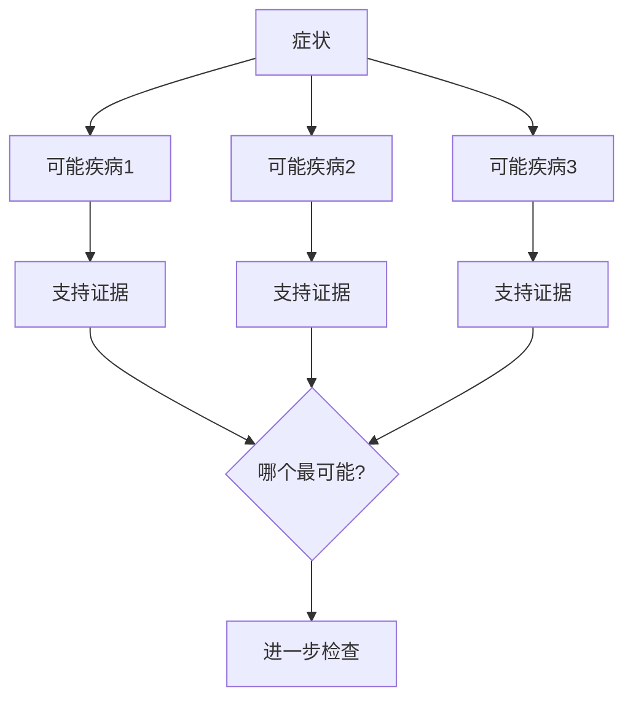
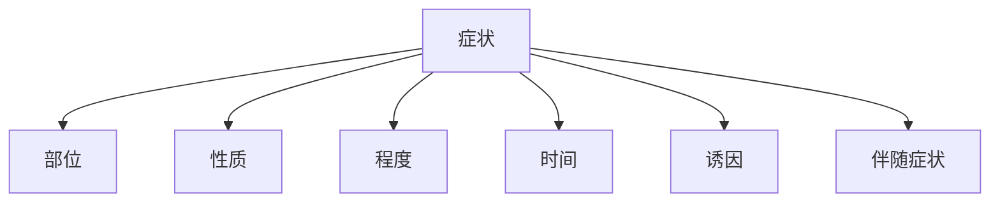
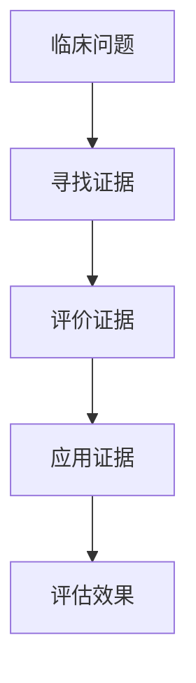
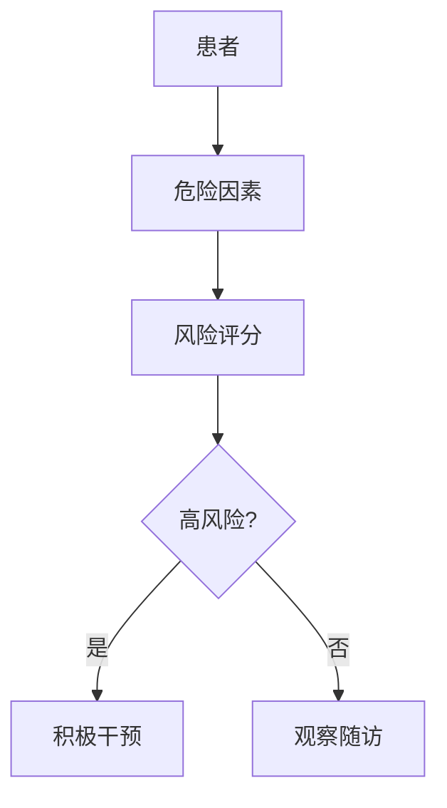

# 💊 诊断思维

> **医学门类** | **症状分析** | **鉴别诊断** | **循证医学**

---

## 📋 概述

**学科定义：** 研究疾病诊断、治疗、预防的学科

**核心价值：** 提供系统化的问题诊断和决策方法

---

## 🎯 外行人常误解的常识

### 误区 1：医生看病靠经验

**误解：** 老医生看病更准，因为经验丰富

**事实：**
> 现代医学强调**循证医学**：
> - 经验需要与证据结合
> - 最佳证据 + 临床经验 + 患者意愿
> - 不能仅凭经验，需要数据支持

---

### 误区 2：检查越多越好

**误解：** 做更多检查能发现更多问题

**事实：**
> 检查需要**合理选择**：
> - 每项检查都有假阳性/假阴性
> - 过度检查增加成本和风险
> - 应根据临床需要选择检查

---

### 误区 3：症状就是疾病

**误解：** 头痛就是头痛病

**事实：**
> 症状是**疾病的表现**，不是疾病本身：
> - 头痛可能是感冒、高血压、肿瘤等多种原因
> - 需要找出根本原因
> - 治疗原因，不只是症状

---

## 🔧 核心方法论

### 1. 鉴别诊断



**诊断思路：**
```
1. 列出所有可能的诊断
2. 收集支持/反对每个诊断的证据
3. 按可能性排序
4. 设计进一步检查
5. 逐步排除，缩小范围
```

---

### 2. 症状分析



**症状分析框架：**
| 维度 | 问题 | 示例 |
|------|------|------|
| **部位** | 在哪里？ | 头痛在前额还是后脑？ |
| **性质** | 什么感觉？ | 是刺痛还是钝痛？ |
| **程度** | 有多严重？ | 1-10分，几分？ |
| **时间** | 什么时候开始？ | 持续多久？ |
| **诱因** | 什么情况下发作？ | 运动后？饭后？ |
| **伴随** | 还有什么症状？ | 发热？恶心？ |

---

### 3. 循证医学



**循证医学步骤：**
```
1. 提出问题（PICO格式）
   - P: 患者/人群
   - I: 干预措施
   - C: 对照措施
   - O: 结局指标

2. 搜索最佳证据
3. 评价证据质量
4. 结合临床经验
5. 应用于患者
6. 评估效果
```

**PICO 示例：**
```
问题：高血压患者使用A药是否比B药更有效？

P: 原发性高血压患者
I: A药
C: B药
O: 血压控制率
```

---

### 4. 风险评估



**风险分层：**
| 风险等级 | 干预策略 |
|---------|---------|
| **低风险** | 观察、生活方式干预 |
| **中风险** | 药物治疗、定期随访 |
| **高风险** | 积极治疗、密切监测 |

---

## 💡 跨界应用

### 1. 产品问题诊断

```
传统思维：产品有问题，找技术解决

医学思维：
1. 收集症状（用户反馈、数据异常）
2. 鉴别诊断（可能的原因）
3. 设计检查（数据分析、日志查看）
4. 逐步排除，找到根本原因
5. 针对性治疗（修复方案）
```

### 2. 项目风险评估

```
传统思维：项目有风险，想办法解决

医学思维：
1. 识别危险因素
2. 进行风险评分
3. 分层管理
4. 高风险项目重点监控
5. 低风险项目常规管理
```

### 3. 问题定位

```
传统思维：出了问题，猜测原因

医学思维：
1. 症状分析（何时、何地、何种情况）
2. 鉴别诊断（列出所有可能）
3. 证据收集（日志、数据）
4. 逐步排除
5. 确诊根本原因
```

---

## 📚 核心概念速查

| 概念 | 定义 | 应用场景 |
|------|------|---------|
| **鉴别诊断** | 区分相似疾病 | 问题定位 |
| **循证医学** | 基于证据的决策 | 决策支持 |
| **风险分层** | 按风险程度分类管理 | 资源配置 |
| **预后** | 疾病的发展趋势 | 预测评估 |
| **并发症** | 伴随的其他疾病 | 风险评估 |
| **假阳性** | 实际没有但检测出有 | 检查解读 |
| **假阴性** | 实际有但检测出没有 | 检查解读 |

---

**版本**: v1.0 | **更新日期**: 2026-04-30
