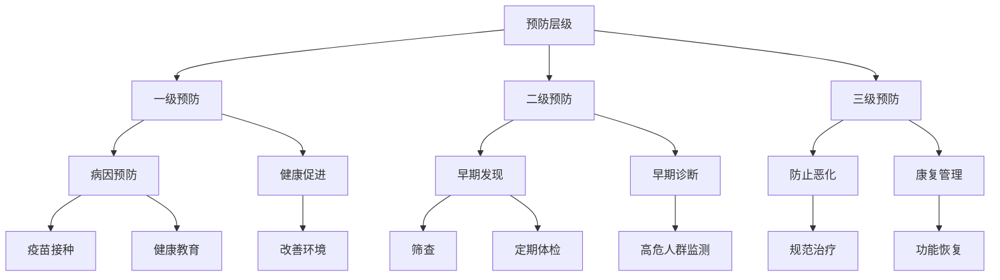
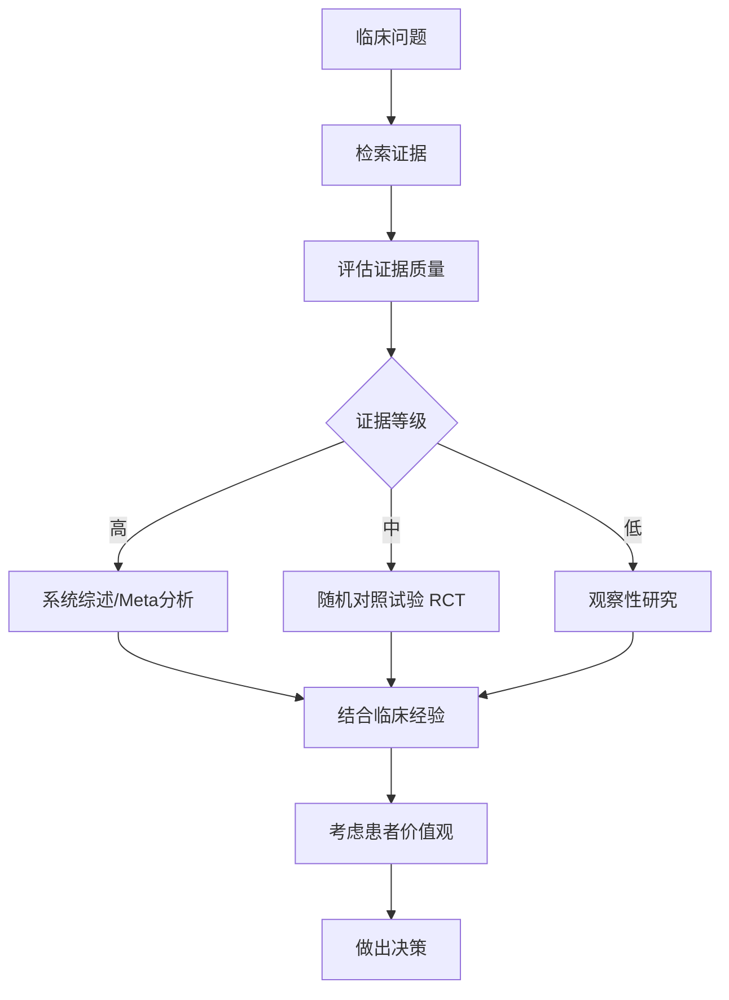
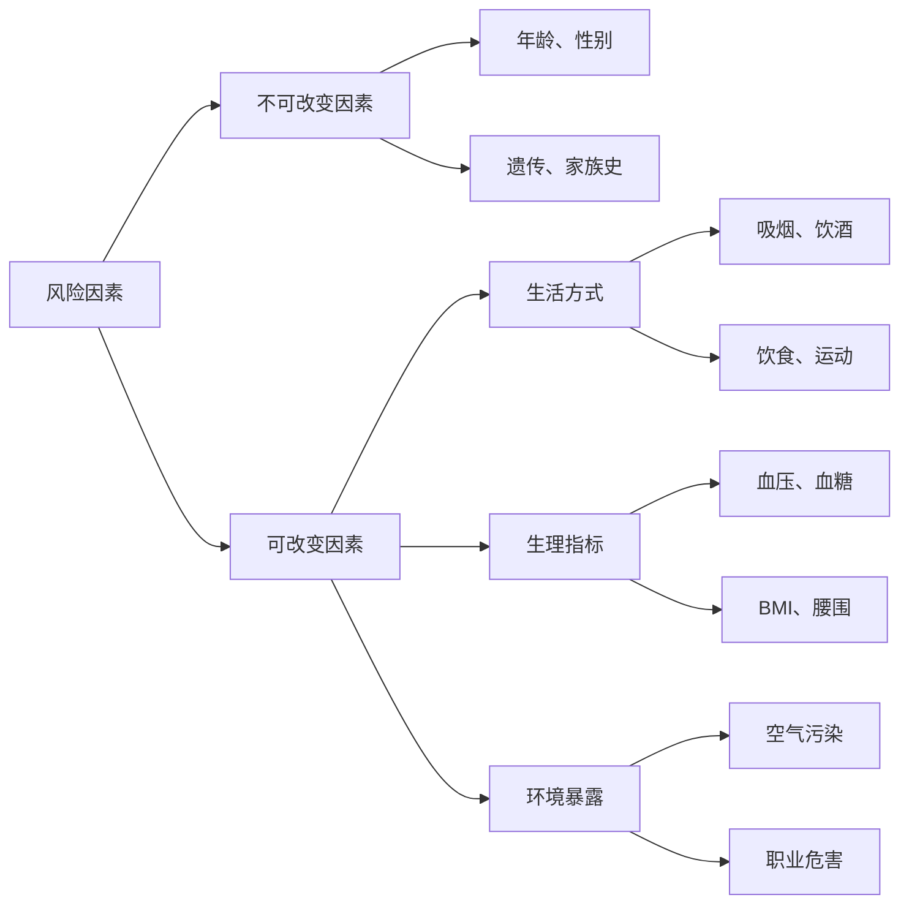
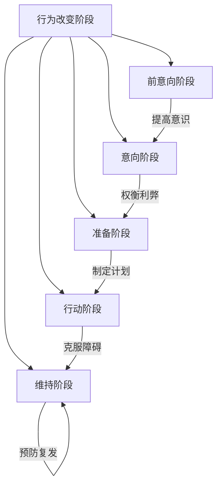
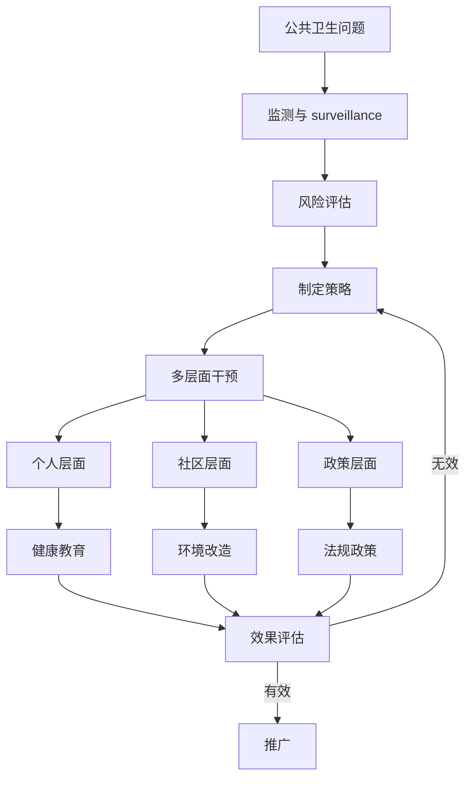

# 🏥 预防医学思维方法论

> **医学门类** | **公共卫生** | **健康管理** | **循证医学**

---

## 📋 概述

**学科定义：** 研究疾病预防、健康促进和寿命延长的医学分支

**核心价值：** 提供前瞻性健康管理、风险评估和系统性干预的方法论

---

## 🎯 外行人常误解的常识

### 误区 1：没病就是健康

**误解：** 没有症状就等于身体健康

**事实：**
> 健康的连续谱：
> ```
> 最佳健康 ←→ 亚健康 ←→ 疾病前期 ←→ 临床疾病
> ```
> 
> - **亚健康状态**：体检指标异常但无症状
> - **疾病前期**：如糖尿病前期、高血压前期
> - **早期干预**：在可逆阶段采取措施
> 
> **世界卫生组织定义：**
> "健康不仅是没有疾病，而是身体、心理和社会适应的完好状态。"

---

### 误区 2：定期体检就够了

**误解：** 每年做一次全面体检就能保证健康

**事实：**
> 体检的局限性：
> - ** snapshot **：只反映检查时的状态
> - **假阴性**：某些疾病早期检测不到
> - **过度诊断**：发现无害的"异常"导致不必要治疗
> - **缺乏连续性**：单次数据无法看出趋势
> 
> **更好的做法：**
> - 持续监测关键指标（血压、血糖、体重）
> - 建立个人健康档案
> - 关注生活方式而非仅依赖体检
> - 根据风险因素定制检查项目

---

### 误区 3：保健品能预防疾病

**误解：** 吃维生素、保健品可以替代健康生活方式

**事实：**
> 科学证据：
> - **多数保健品**：对健康人无显著益处
> - **均衡饮食**：比补充剂更有效
> - **例外情况**：特定人群需要（孕妇叶酸、老年人维生素 D）
> - **潜在风险**：过量补充可能有害
> 
> **权威研究：**
> > "没有足够证据支持健康人常规服用多种维生素来预防慢性病。"
> > —— 美国预防服务工作组（USPSTF）

---

## 🔧 核心方法论

### 1. 三级预防策略



**一级预防（病因预防）：**
```
目标：防止疾病发生

措施：
- 疫苗接种：流感、HPV、乙肝
- 健康教育：戒烟、限酒、合理膳食
- 环境保护：清洁饮水、空气质量
- 职业防护：防尘、防辐射
- 安全防护：安全带、头盔

效果：成本效益最高
```

**二级预防（早期发现）：**
```
目标：在无症状阶段发现疾病

措施：
- 癌症筛查：乳腺 X 线、结肠镜、宫颈涂片
- 慢性病筛查：血压、血糖、血脂
- 遗传筛查：家族史高风险人群
- 职业健康体检：接触有害物质者

原则：
- 针对高发疾病
- 有有效的早期治疗方法
- 筛查方法准确、安全、经济
```

**三级预防（防止恶化）：**
```
目标：减少并发症、提高生活质量

措施：
- 规范治疗：遵循指南
- 康复训练：物理治疗、心理康复
- 慢病管理：糖尿病、高血压自我管理
- 姑息治疗：晚期患者症状控制
- 社会支持：患者互助小组

重点：
- 多学科协作
- 个体化方案
- 长期随访
```

---

### 2. 循证医学（EBM）



**证据金字塔（从高到低）：**

```
        /\
       /  \      系统综述/Meta分析
      /----\
     /      \    随机对照试验（RCT）
    /--------\
   /          \  队列研究、病例对照研究
  /------------\
 /              \ 病例系列、专家意见
/________________\ 动物实验、体外研究
```

**循证实践步骤：**

**1. 提出问题（PICO）：**
```
P (Patient/Problem)：患者/问题是什么？
I (Intervention)：干预措施是什么？
C (Comparison)：对照是什么？
O (Outcome)：期望结果是什么？

示例：
对于 60 岁以上高血压患者（P），
使用 ACEI 类药物（I）vs 利尿剂（C），
哪个更能降低心血管事件风险（O）？
```

**2. 检索证据：**
```
数据库：
- PubMed/MEDLINE
- Cochrane Library
- UpToDate
- 临床实践指南

搜索策略：
- 使用 MeSH 术语
- 布尔逻辑（AND, OR, NOT）
- 限定研究类型（RCT、系统综述）
```

**3. 批判性评估：**
```
RCT 质量评估：
- 随机化方法是否恰当？
- 是否盲法？
- 失访率是否过高？
- 意向性分析（ITT）？
- 结果是否有临床意义？

偏倚风险：
- 选择偏倚
- 实施偏倚
- 测量偏倚
- 报告偏倚
```

**4. 应用证据：**
```
考虑三要素：
1. 最佳研究证据
2. 临床医生的专业经验
3. 患者的价值观和偏好

共享决策：
- 向患者解释证据
- 讨论利弊
- 尊重患者选择
```

---

### 3. 健康风险评估



**风险评估工具：**

**心血管疾病风险（Framingham 评分）：**
```
考虑因素：
- 年龄、性别
- 总胆固醇、HDL
- 收缩压
- 是否吸烟
- 是否糖尿病

输出：
- 10 年心血管事件风险百分比
- 指导他汀类药物使用
```

**癌症风险评估：**
```
乳腺癌（Gail 模型）：
- 年龄、初潮年龄
- 生育史
- 家族史
- 乳腺活检史

结直肠癌：
- 年龄（50 岁以上风险增加）
- 家族史
- 炎症性肠病
- 生活方式（红肉、肥胖）
```

**生活方式风险评估：**
```
简易自评：
□ 吸烟（是/否）
□ 每周运动 <150 分钟（是/否）
□ 每日蔬菜 <500g（是/否）
□ BMI >25（是/否）
□ 每日饮酒 >2 杯（是/否）
□ 睡眠 <7 小时（是/否）

计分：每个"是"得 1 分
0-1 分：低风险
2-3 分：中等风险
4-6 分：高风险
```

---

### 4. 行为改变理论



**跨理论模型（TTM）：**

**各阶段特点及干预策略：**

**1. 前意向阶段（无打算改变）：**
```
特征：
- 未意识到问题
- 抗拒改变

策略：
- 提供信息，提高认识
- 反馈个人风险
- 引发情感共鸣

示例：
"您知道吸烟会使肺癌风险增加 25 倍吗？"
```

**2. 意向阶段（考虑改变）：**
```
特征：
- 认识到问题
- 犹豫不决

策略：
- 帮助权衡利弊
- 解决顾虑
- 增强自我效能

示例：
"戒烟后 1 年，心脏病风险减半。您担心什么？"
```

**3. 准备阶段（计划改变）：**
```
特征：
- 决定改变
- 制定计划

策略：
- 设定具体目标
- 识别障碍和对策
- 寻求社会支持

示例：
"您打算何时开始？需要哪些支持？"
```

**4. 行动阶段（正在改变）：**
```
特征：
- 实施新行为
- 面临挑战

策略：
- 提供技术支持
- 强化正面反馈
- 处理挫折

示例：
"第一周最难，您已经坚持 3 天了，很棒！"
```

**5. 维持阶段（保持改变）：**
```
特征：
- 新行为成为习惯
- 警惕复发

策略：
- 庆祝成功
- 预防复发计划
- 长期支持

示例：
"您已经戒烟 6 个月了！如何应对压力情境？"
```

---

### 5. 公共卫生干预



**干预层次（ socio-ecological model ）：**

**个人层面：**
```
- 健康教育：知识、技能
- 行为咨询：个性化指导
- 自我监测：日记、App
- 激励机制：奖励、竞赛

示例：糖尿病自我管理教育
- 血糖监测技巧
- 饮食计划
- 运动处方
- 药物依从性
```

**人际层面：**
```
- 家庭支持：家属参与
- 同伴教育：榜样示范
- 社交网络：群体影响
- 医患沟通：信任关系

示例：戒烟支持小组
- 分享经验
- 互相鼓励
- 集体活动
- 专业指导
```

**社区层面：**
```
- 环境改造：健身设施、步行道
- 社区项目：健康讲座、筛查活动
- 社会组织：志愿者、NGO
- 媒体宣传：公益广告

示例：健康社区计划
- 建设公园和自行车道
- 组织社区运动会
- 农贸市场提供新鲜蔬果
- 餐厅标注卡路里
```

**政策层面：**
```
- 法律法规：禁烟令、食品安全法
- 经济手段：糖税、补贴
- 行业标准：营养标签、广告限制
- 城市规划：绿地、公共交通

示例：控烟政策
- 公共场所禁烟
- 烟草税提高
- 包装警示图片
- 禁止烟草广告
```

---

## 💡 跨界应用

### 1. 企业员工健康管理

```
问题：如何降低员工病假率、提高生产力？

预防医学方法：
1. 健康风险评估
   - 入职体检建立基线
   - 年度健康问卷
   - 识别高风险员工
   
2. 分层干预
   - 低风险：健康促进（健身房、健康餐）
   - 中风险：早期干预（压力管理、 Ergonomics ）
   - 高风险：个案管理（慢病管理、EAP）
   
3. 环境改造
   - 站立式办公桌
   - 自然光照
   - 室内绿植
   - 健康零食选项
   
4. 文化建设
   - 领导层示范
   - 健康挑战赛
   - 心理健康去污名化
   - 工作生活平衡

ROI 计算：
- 投入：每人每年 ¥2000
- 节省：病假减少 20%，生产力提升 5%
- 回报：每投入 1 元，节省 3-5 元
```

### 2. 产品设计的健康导向

```
问题：如何设计促进健康的产品？

预防医学原则：
1. 默认选项（ Nudge theory ）
   - 自动加入健康计划（可选择退出）
   - 楼梯比电梯更显眼
   - 小份餐具默认
   
2. 即时反馈
   - 智能手表心率监测
   - 饮食 App 卡路里追踪
   - 久坐提醒
   
3. 游戏化
   - 步数排行榜
   - 成就徽章
   - 社交分享
   - 奖励机制
   
4. 简化决策
   - 交通灯标签（红黄绿表示健康程度）
   - 一键订购健康餐
   - 预设运动计划

案例： Apple Watch
- 活动目标：个性化每日目标
- 站立提醒：每小时站立 1 分钟
- 心率异常警报：房颤检测
- 跌倒检测：自动呼叫急救
- 效果：用户平均每日多走 1000 步
```

### 3. 城市规划的公共健康视角

```
问题：如何设计促进居民健康的城市？

公共卫生策略：
1. 主动交通
   - 自行车道网络
   - 步行友好街道
   - 公共交通可达性
   - 共享单车/电动滑板车
   
2. 绿色空间
   - 公园覆盖率（每 500 米一个公园）
   - 社区花园
   - 屋顶绿化
   - 林荫道
   
3. 健康食品环境
   - 农贸市场
   - 限制快餐店密度（尤其学校附近）
   - 社区支持农业（CSA）
   - 食物沙漠识别和改善
   
4. 社会连接
   - 社区中心
   - 公共广场
   - 老年活动室
   - 儿童游乐场

实例：哥本哈根
- 自行车通勤率 62%
- 90% 居民步行 15 分钟内到达公园
- 预期寿命比丹麦平均高 2 年
- 医疗支出低于全国平均
```

---

## 📚 核心概念速查

| 概念 | 定义 | 应用场景 |
|------|------|---------|
| **三级预防** | 病因预防、早期发现、防止恶化 | 健康管理、风险控制 |
| **循证医学** | 基于最佳证据的医疗决策 | 决策制定、问题解决 |
| **健康风险** | 患病的可能性 | 风险评估、资源分配 |
| **行为改变** | 从不健康到健康的转变过程 | 习惯养成、变革管理 |
| **筛查** | 无症状人群的疾病检测 | 早期发现、质量控制 |
| **疫苗** | 激发免疫力的生物制剂 | 预防传染病、系统防护 |
| **流行病学** | 研究疾病分布和决定因素 | 趋势分析、模式识别 |
| **健康素养** | 获取、理解、应用健康信息的能力 | 教育、沟通 |

---

## 🔗 延伸阅读

- 《预防医学》- Maxcy-Rosenau
- 《公共卫生的未来》- Sandro Galea
- 《行为改变轮》- Susan Michie
- 《救命饮食》- T. Colin Campbell
- 《为什么斑马不得胃溃疡》- Robert Sapolsky

---

**版本**: v1.0 | **更新日期**: 2026-05-02
