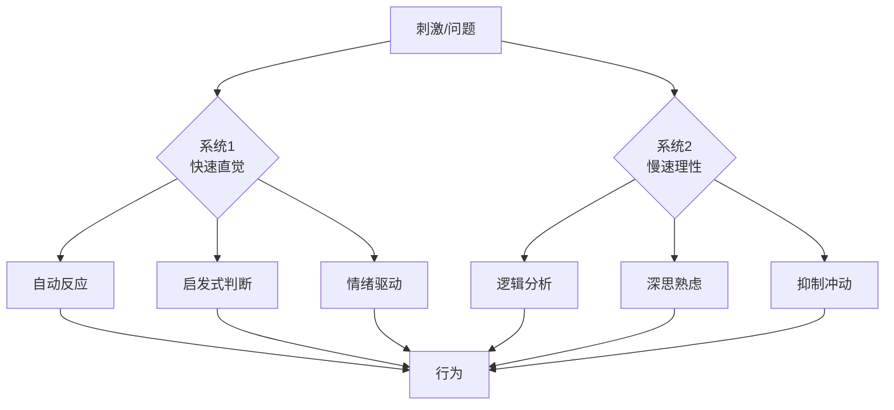
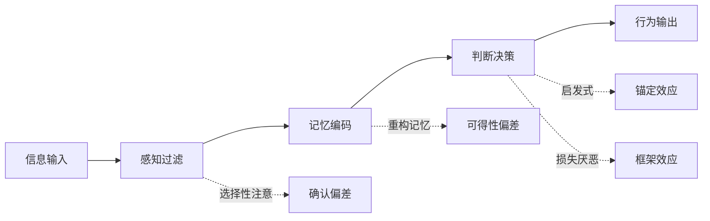
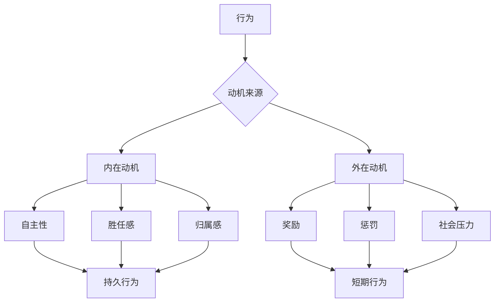
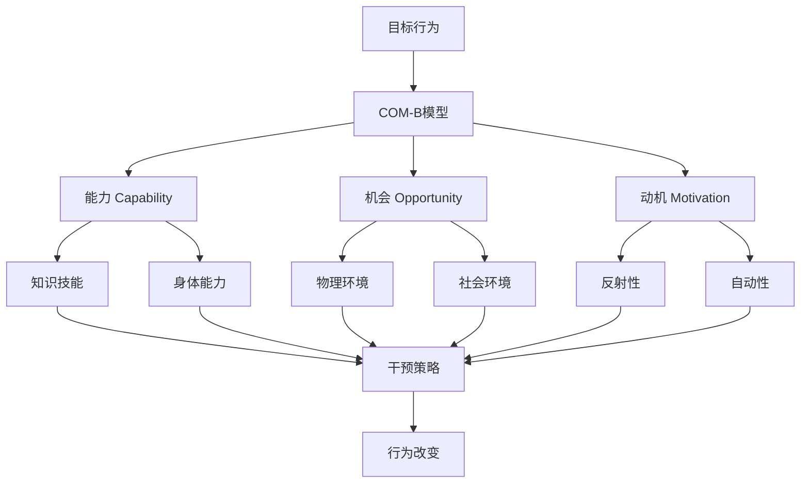
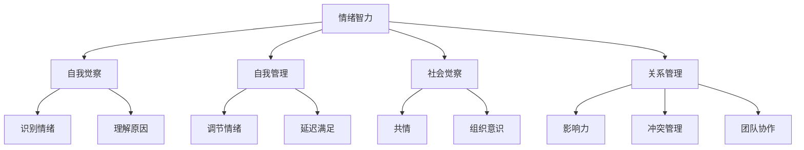

# 🧠 心理学思维方法论

> **医学门类** | **行为理解** | **认知偏差** | **动机分析**

---

## 📋 概述

**学科定义：** 研究心智、行为和情感的科学

**核心价值：** 提供理解人类行为、改善决策和促进改变的系统方法

---

## 🎯 外行人常误解的常识

### 误区 1：心理学就是读心术

**误解：** 心理学家能看透别人的想法

**事实：**
> 心理学的科学方法：
> - **观察行为**：通过外在表现推断内在状态
> - **实验验证**：控制变量测试因果关系
> - **统计分析**：从群体数据发现规律
> - **理论构建**：解释和预测行为
> 
> **心理学家不能：**
> - 准确猜测具体想法
> - 100% 预测个体行为
> - 不受自身偏见影响

---

### 误区 2：性格决定命运

**误解：** 人格特质固定不变，决定人生轨迹

**事实：**
> 现代心理学观点：
> - **人格可塑性**：性格可以改变，尤其年轻时
> - **情境力量**：环境对行为的影响常被低估
> - **成长型思维**：能力可通过努力发展
> - **神经可塑性**：大脑终身可以重组
> 
> **研究证据：**
> - 重大生活事件可改变人格
> - 刻意练习可培养新特质
> -  therapy 可有效改变行为模式

---

### 误区 3：潜意识控制一切

**误解：** 我们的大部分行为由潜意识驱动，无法控制

**事实：**
> 意识与潜意识的关系：
> - **双系统理论**：快速直觉（系统1）+ 慢速理性（系统2）
> - **自动化 vs 控制**：习惯是自动的，但可被意识干预
> - **元认知**：我们可以思考自己的思考
> - **自我调节**：通过策略影响潜意识过程
> 
> **关键洞察：**
> "了解潜意识不是为了被它控制，而是为了获得选择权。"

---

## 🔧 核心方法论

### 1. 双系统思维



**系统特征对比：**

| 维度 | 系统1（快思考） | 系统2（慢思考） |
|------|----------------|----------------|
| **速度** | 快速、自动 | 缓慢、费力 |
| **意识** | 无意识 | 有意识 |
| **能量** | 低能耗 | 高能耗 |
| **容量** | 并行处理 | 串行处理 |
| **错误** | 认知偏差 | 疲劳出错 |
| **训练** | 难以改变 | 可学习改进 |

**应用场景：**

**何时信任系统1：**
```
✅ 专业领域的直觉（专家模式识别）
✅ 熟悉情境的快速反应
✅ 社交线索的即时解读
✅ 创意灵感的涌现

示例：
- 棋大师一眼看出最佳走法
- 医生快速诊断常见病症
- 设计师直觉判断美感
```

**何时启用系统2：**
```
✅ 重要决策（投资、职业选择）
✅ 复杂问题（战略规划）
✅ 冲突情境（情绪激动时）
✅ 学习新技能

触发机制：
- 意识到可能出错
- 遇到异常情况
- 时间允许深入思考
-  stakes 很高
```

**优化策略：**
```
1. 识别系统1的陷阱
   - 列出常见认知偏差
   - 建立检查清单
   
2. 设计决策流程
   - 重要决策强制冷却期
   - 多角度审视问题
   - 寻求外部意见
   
3. 培养系统2肌肉
   - 冥想提升专注力
   - 刻意练习批判性思维
   - 学习概率和统计
```

---

### 2. 认知偏差识别



**高频认知偏差清单：**

**1. 确认偏差（Confirmation Bias）：**
```
现象：寻找支持自己观点的证据，忽略反面证据

示例：
- 只阅读认同的政治新闻
- 面试时只注意证实第一印象的信息
- 投资后只关注利好消息

对策：
- 主动寻找反面证据
- "魔鬼代言人"角色
- 预先承诺考虑多种可能性
```

**2. 可得性偏差（Availability Heuristic）：**
```
现象：根据容易回忆的例子判断频率

示例：
- 飞机失事新闻后害怕飞行（实际比开车安全）
- 高估恐怖袭击风险
- 低估心脏病风险（更常见但不那么轰动）

对策：
- 查阅统计数据
- 考虑基础概率
- 警惕生动案例的影响
```

**3. 锚定效应（Anchoring Effect）：**
```
现象：过度依赖首次接收的信息

示例：
- 标价¥1000打折到¥500感觉很便宜
- 谈判中第一个报价设定基调
- 绩效评估受年初预期影响

对策：
- 独立评估后再看参考点
- 多个锚点对比
- 意识到锚的存在
```

**4. 损失厌恶（Loss Aversion）：**
```
现象：损失带来的痛苦大于同等收益的快乐

研究发现：
- 损失的痛苦 ≈ 2倍于收益的快乐
- 人们更愿意避免损失而非获得收益

应用：
- 营销："不要错过"比"获得"更有效
- 变革管理：强调不改变的损失
- 投资：设置止损点克服持有亏损

对策：
- 从机会成本角度思考
- 长期视角评估
- 预承诺决策规则
```

**5. 沉没成本谬误（Sunk Cost Fallacy）：**
```
现象：因已投入成本而继续错误决策

示例：
- 看完烂电影因为买了票
- 继续失败项目因为已投入大量资源
- 维持糟糕关系因为在一起很久

对策：
- 问："如果从头开始，我还会这样做吗？"
- 关注未来收益，忽视过去投入
- 设置明确的退出标准
```

**偏差防御工具箱：**
```
1. 检查清单：决策前逐项核对
2. 外部视角：旁观者怎么看？
3. 事前验尸：假设失败，原因是什么？
4. 红队演练：专门挑战你的观点
5. 延迟决策：给系统2时间介入
```

---

### 3. 动机分析框架



**自我决定理论（SDT）：**

**三大基本心理需求：**

**1. 自主性（Autonomy）：**
```
定义：感到行为是自己选择的，而非被迫

满足方法：
- 提供选择和灵活性
- 解释任务的意义
- 承认感受和观点
- 最小化控制语言

破坏因素：
- 微观管理
- 威胁和压力
- 过度监控
- 强制性目标

应用：
- 员工激励：参与目标设定
- 教育：让学生选择项目主题
- 健康：强调个人选择而非命令
```

**2. 胜任感（Competence）：**
```
定义：感到能够有效应对挑战

满足方法：
- 适度挑战（最近发展区）
- 及时反馈
- 认可进步
- 提供支持资源

破坏因素：
- 任务过难或过易
- 模糊的标准
- 批评多于鼓励
- 缺乏成长机会

应用：
- 游戏设计：渐进难度
- 绩效管理：SMART目标
- 学习平台：即时反馈
```

**3. 归属感（Relatedness）：**
```
定义：感到与他人连接和被关心

满足方法：
- 建立社区
- 促进合作
- 表达关心
- 共享价值观

破坏因素：
- 孤立工作
- 竞争过度
- 缺乏认可
- 文化不匹配

应用：
- 团队建设活动
- mentorship 项目
- 用户社区运营
- 品牌社群
```

**动机类型对比：**

| 类型 | 来源 | 持久性 | 创造力影响 | 示例 |
|------|------|--------|-----------|------|
| **内在** | 兴趣、享受、意义 | 高 | 正面 | 因热爱而工作 |
| **内化外在** | 认同价值 | 中高 | 中性 | 为健康锻炼 |
| **外在调节** | 奖励/惩罚 | 低 | 负面 | 为奖金加班 |
| **无动机** | 无 | 无 | 无 | 被迫做不喜欢的事 |

**Overjustification Effect（过度理由效应）：**
```
现象：外在奖励削弱内在动机

经典实验：
- 儿童画画本来出于兴趣
- 给予奖励后，只在有奖励时画
- 奖励停止后，兴趣下降

启示：
- 谨慎使用外在奖励
- 强调内在价值
- 用信息性反馈代替控制性奖励
```

---

### 4. 行为改变技术



**COM-B 模型：**

**能力（Capability）：**
```
心理能力：
- 知识：知道做什么
- 技能：能够做到
- 记忆：记得去做

身体能力：
- 体力
- 协调性
- 健康状况

干预：
- 教育培训
- 技能培训
- 简化流程
- 辅助工具
```

**机会（Opportunity）：**
```
物理机会：
- 资源可获得性
- 时间可用性
- 环境便利性

社会机会：
- 社会规范
- 文化接受度
- 同伴支持

干预：
- 环境改造
- 政策调整
- 社会营销
- 社区支持
```

**动机（Motivation）：**
```
反射性动机：
- 计划
- 评估
- 信念
- 意图

自动性动机：
- 习惯
- 情绪反应
- 冲动
- 欲望

干预：
- 目标设定
- 反馈机制
- 激励机制
- 习惯养成
```

**行为改变技巧（BCTs）：**

**1. 目标设定：**
```
SMART原则：
- Specific：具体
- Measurable：可衡量
- Achievable：可实现
- Relevant：相关
- Time-bound：有时限

示例：
❌ "我要多运动"
✅ "每周三、五晚上7点跑步30分钟，持续8周"
```

**2. 行动计划（Implementation Intention）：**
```
格式：如果 [情境]，那么 [行为]

示例：
- 如果下班回家，那么立即换上运动鞋
- 如果想吃零食，那么先喝一杯水
- 如果感到焦虑，那么做3次深呼吸

效果：提高执行率 2-3 倍
```

**3. 反馈监控：**
```
方法：
- 行为追踪（App、日记）
- 可视化进度
- 定期回顾
- 调整策略

原理：
- 提高意识
- 强化承诺
- 及时纠偏
```

**4. 社会支持：**
```
形式：
- 伙伴系统
- 小组挑战
- 公开承诺
- 榜样示范

效果：
- 增加责任感
- 提供鼓励
- 分享经验
```

**5. 环境设计（Nudge）：**
```
原则：让好行为容易，坏行为困难

示例：
- 水果放在显眼处，零食藏起来
- 楼梯比电梯更显眼
- 默认选项设为健康选择
- 减少摩擦（一键下单健康餐）
```

---

### 5. 情绪智力（EQ）



**四大维度：**

**1. 自我觉察：**
```
能力：
- 识别自己的情绪
- 了解情绪触发点
- 认识优势和局限

练习：
- 情绪日记
- 正念冥想
- 360度反馈
- 反思实践

指标：
- 情绪粒度（区分细微情绪的能力）
- 身体信号识别
- 模式识别
```

**2. 自我管理：**
```
能力：
- 控制冲动
- 适应变化
- 保持积极
- 承担责任

技巧：
- 认知重评（换个角度看问题）
- 深呼吸和放松
- 问题解决导向
- 寻求支持

应用：
- 压力管理
- 冲突处理
- 决策质量
- 领导力
```

**3. 社会觉察：**
```
能力：
- 共情：理解他人感受
- 倾听：真正听到对方
- 观察：非语言线索
- 文化敏感

练习：
- 积极倾听
- 换位思考
- 观察肢体语言
- 提问而非假设

价值：
- 建立信任
- 有效沟通
- 团队合作
- 客户服务
```

**4. 关系管理：**
```
能力：
- 影响力：说服和激励
- 冲突管理：化解分歧
- 团队协作：促进合作
- 领导：引导他人

技巧：
- 清晰沟通
- 建设性反馈
- 协商谈判
- 庆祝成功

成果：
- 高效团队
- 良好关系
- 组织文化
- 个人影响力
```

---

## 💡 跨界应用

### 1. 产品设计中的行为心理学

```
问题：如何提高用户激活率？

心理学方法：
1. 降低认知负荷（系统1友好）
   - 简化 onboarding 流程
   - 默认最优选项
   - 渐进式披露功能
   
2. 利用社会证明
   - 显示用户数量
   - 展示好评和案例
   - "XXX人正在查看"
   
3. 损失厌恶 framing
   - "不要错过优惠" vs "获得优惠"
   - 限时倒计时
   - 库存紧张提示
   
4. 习惯养成循环
   - 触发：push notification
   - 行动：一键完成
   - 奖励：积分、徽章
   - 投入：个性化设置
   
5. 峰终定律（Peak-End Rule）
   - 创造惊喜时刻（Aha moment）
   - 确保结束体验良好
   - 用户记住的是峰值和结尾

案例：Duolingo
- 游戏化：连胜、等级、排行榜
- 微习惯：每天5分钟
- 损失厌恶：连胜中断提醒
- 社会比较：好友排名
- 结果：DAU 提升 300%
```

### 2. 团队管理中的动机激发

```
问题：如何提高团队 engagement？

心理学应用：
1. 满足三大心理需求
   - 自主性：弹性工作、自主决策
   - 胜任感：挑战性任务、成长机会
   - 归属感：团队活动、认可文化
   
2. 内在动机培养
   - 连接工作与意义
   - 展示影响和价值
   - 提供学习和成长
   - 避免过度外在奖励
   
3. 心理安全感
   - 允许犯错和学习
   - 鼓励不同意见
   - 透明沟通
   - 支持冒险
   
4. 反馈艺术
   - 及时、具体、建设性
   - 平衡正面和改进
   - 双向对话
   - 关注行为而非人格

案例：Google Project Aristotle
- 发现：心理安全感是高效团队第一要素
- 实践：团队规范、leader 脆弱性、包容文化
- 结果：团队绩效提升 25%
```

### 3. 个人决策中的认知偏差管理

```
问题：如何做出更好的投资和职业决策？

心理学工具：
1. 偏差检查清单
   - 我是否只看到支持我观点的信息？（确认偏差）
   - 我是否过度依赖第一个信息？（锚定效应）
   - 我是否因为害怕损失而不敢行动？（损失厌恶）
   - 我是否因为已投入而继续错误决策？（沉没成本）
   
2. 外部视角
   - 如果是朋友，我会给什么建议？
   - 行业基准是什么？
   - 类似案例的成功率是多少？
   
3. 事前验尸（Pre-mortem）
   - 假设一年后失败了，原因可能是什么？
   - 提前识别风险并制定应对
   - 减少过度自信
   
4. 决策日志
   - 记录决策时的思考和预期
   - 定期回顾实际结果
   - 校准判断能力
   - 从错误中学习

实践：
- 重大决策强制 24-72 小时冷却期
- 寻求至少 3 个不同角度的意见
- 写下决策理由，便于事后验证
- 建立个人决策框架和原则
```

---

## 📚 核心概念速查

| 概念 | 定义 | 应用场景 |
|------|------|---------|
| **双系统** | 快思考（直觉）vs 慢思考（理性） | 决策优化、偏差识别 |
| **确认偏差** | 寻找支持自己观点的证据 | 信息筛选、批判性思维 |
| **可得性偏差** | 根据易回忆例子判断频率 | 风险评估、概率判断 |
| **锚定效应** | 过度依赖首次信息 | 谈判、定价、评估 |
| **损失厌恶** | 损失痛苦 > 收益快乐 | 营销、变革管理、投资 |
| **自我决定理论** | 自主、胜任、归属三需求 | 动机激发、员工激励 |
| **COM-B模型** | 能力、机会、动机促行为 | 行为改变、产品设计 |
| **情绪智力** | 识别、理解、管理情绪 | 领导力、人际关系 |
| **成长型思维** | 能力可通过努力发展 | 学习、韧性、创新 |
| **峰终定律** | 记忆由峰值和结尾决定 | 用户体验、服务设计 |

---

## 🔗 延伸阅读

- 《思考，快与慢》- Daniel Kahneman
- 《影响力》- Robert Cialdini
- 《驱动力》- Daniel Pink
- 《原子习惯》- James Clear
- 《情商》- Daniel Goleman

---

**版本**: v1.0 | **更新日期**: 2026-05-02
