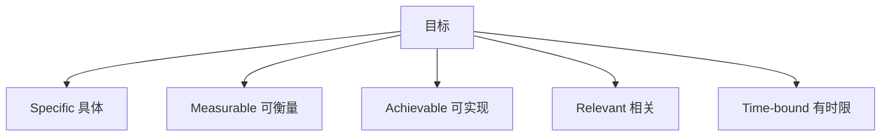
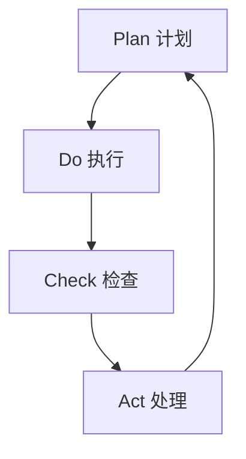
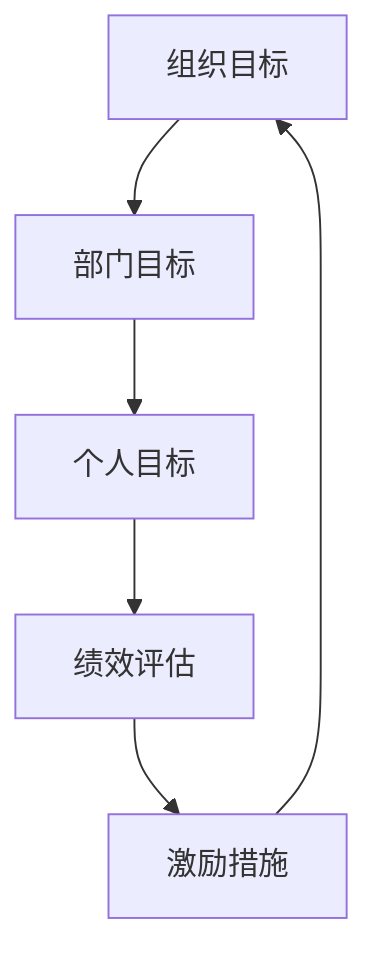
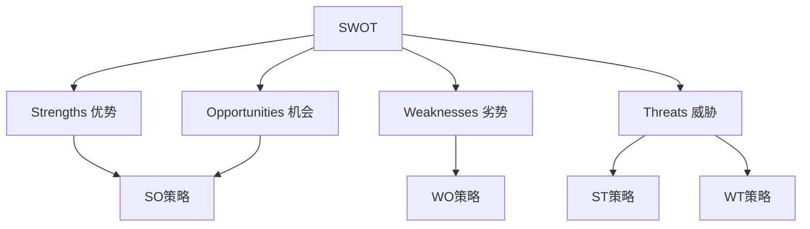
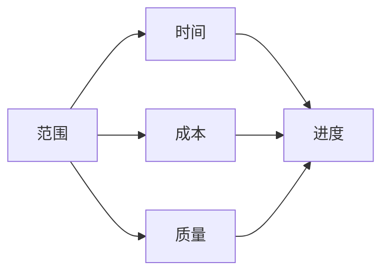

# 📊 管理学原理

> **管理学门类** | **计划组织** | **领导控制** | **系统管理**

---

## 📋 概述

**学科定义：** 研究组织管理活动规律和方法的学科

**核心价值：** 提供组织管理和资源协调的系统方法

---

## 🎯 外行人常误解的常识

### 误区 1：管理就是管人

**误解：** 管理就是让别人干活

**事实：**
> 管理的四大职能：
> - **计划**：确定目标和路径
> - **组织**：配置资源和人员
> - **领导**：激励和指导
> - **控制**：监督和纠偏

---

### 误区 2：管理有标准答案

**误解：** 有一套通用的管理方法

**事实：**
> 管理需要**权变**：
> - 不同情境需要不同方法
> - 没有最好的管理，只有最适合的管理
> - 管理是科学与艺术的结合

---

### 误区 3：效率等于效果

**误解：** 做得快就是做得好

**事实：**
> 效率和效果是两个维度：
> - 效率：正确地做事（做事的方式）
> - 效果：做正确的事（做事的目标）
> - 高效地做错误的事 = 更大的错误

---

## 🔧 核心方法论

### 1. SMART 目标



**SMART 原则：**
| 原则 | 说明 | 示例 |
|------|------|------|
| **S**pecific | 具体明确 | 提高销售额 → Q3销售额提升20% |
| **M**easurable | 可衡量 | 有明确的指标和数据 |
| **A**chievable | 可实现 | 目标合理，可以达到 |
| **R**elevant | 相关 | 与组织目标一致 |
| **T**ime-bound | 有时限 | 有明确的完成时间 |

---

### 2. PDCA 循环



**PDCA 循环：**
| 阶段 | 活动 | 输出 |
|------|------|------|
| **Plan** | 制定计划 | 目标、方案 |
| **Do** | 执行计划 | 执行结果 |
| **Check** | 检查效果 | 偏差分析 |
| **Act** | 改进优化 | 标准化或调整 |

---

### 3. 目标管理 (MBO)



**MBO 流程：**
```
1. 设定组织目标
2. 分解到部门目标
3. 分解到个人目标
4. 定期检查进度
5. 绩效评估
6. 奖励与改进
```

---

### 4. SWOT 分析



**SWOT 矩阵：**
|  | 机会 (O) | 威胁 (T) |
|--|---------|---------|
| **优势 (S)** | SO：利用优势抓住机会 | ST：利用优势应对威胁 |
| **劣势 (W)** | WO：克服劣势抓住机会 | WT：减少劣势回避威胁 |

---

### 5. 项目管理



**项目管理三角：**
| 维度 | 说明 | 工具 |
|------|------|------|
| **范围** | 做什么 | WBS |
| **时间** | 多久完成 | 甘特图 |
| **成本** | 花多少钱 | 预算表 |
| **质量** | 做到什么程度 | 质量标准 |

---

## 💡 跨界应用

### 1. 个人管理

```
传统思维：想到什么做什么

管理学思维：
1. 设定SMART目标
2. 制定计划（PDCA）
3. 分解任务（WBS）
4. 追踪进度
5. 定期复盘
```

### 2. 团队管理

```
传统思维：分配任务，监督执行

管理学思维：
1. 明确目标和期望
2. 合理分配任务
3. 提供必要资源
4. 激励和指导
5. 检查结果并反馈
```

### 3. 项目管理

```
传统思维：抓紧时间做完

管理学思维：
1. 明确项目范围
2. 制定详细计划
3. 分配资源和责任
4. 监控进度和风险
5. 及时调整计划
```

---

## 📚 核心概念速查

| 概念 | 定义 | 应用场景 |
|------|------|---------|
| **计划** | 确定目标和路径 | 目标设定 |
| **组织** | 配置资源和人员 | 组织设计 |
| **领导** | 激励和指导 | 团队管理 |
| **控制** | 监督和纠偏 | 过程管理 |
| **效率** | 正确地做事 | 流程优化 |
| **效果** | 做正确的事 | 目标管理 |
| **授权** | 委托权力和责任 | 团队赋能 |
| **激励** | 激发工作动力 | 员工管理 |

---

**版本**: v1.0 | **更新日期**: 2026-04-30
