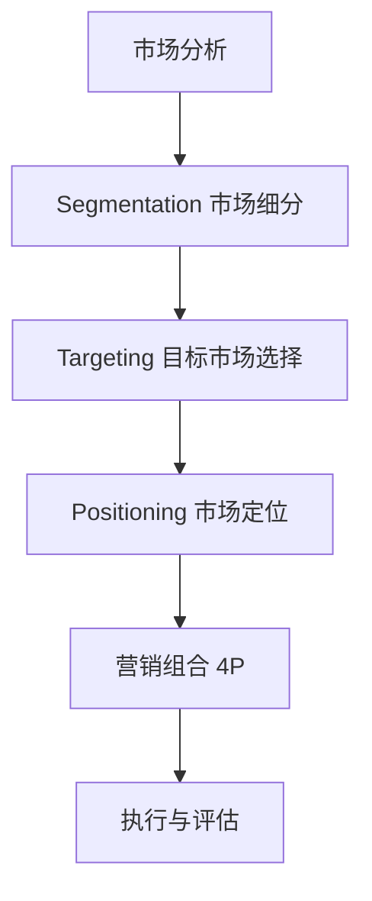
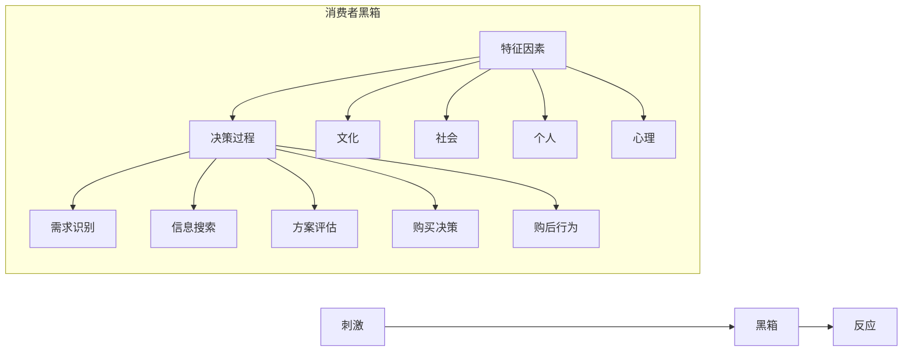
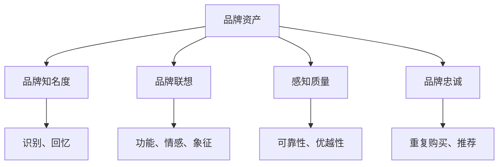
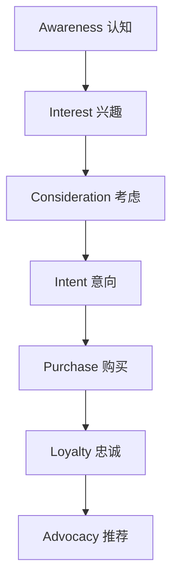
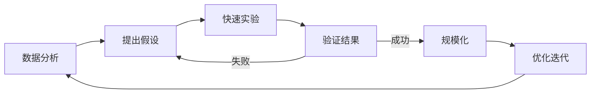

# 📈 市场营销思维方法论

> **管理学门类** | **消费者洞察** | **品牌战略** | **增长黑客**

---

## 📋 概述

**学科定义：** 研究如何识别、预测和满足客户需求以实现组织目标的学科

**核心价值：** 提供市场洞察、价值传递和客户关系管理的系统方法

---

## 🎯 外行人常误解的常识

### 误区 1：营销就是打广告

**误解：** 营销的主要工作是制作广告和促销活动

**事实：**
> 营销的完整流程（4P 理论）：
> - **Product（产品）**：创造客户需要的价值
> - **Price（价格）**：制定合理的定价策略
> - **Place（渠道）**：确保产品可获取
> - **Promotion（促销）**：沟通和推广
> 
> **广告只是 Promotion 的一小部分**
> 
> **Peter Drucker（管理学家）：**
> "营销的目的是让销售变得多余。"（通过深刻理解客户，产品自己会说话）

---

### 误区 2：最好的产品一定会成功

**误解：** 只要产品质量好，自然会有人买

**事实：**
> 市场成功的要素：
> - **市场时机**：太早或太晚都失败
> - **用户教育**：客户需要理解价值
> - **网络效应**：用户基数决定价值
> - **生态系统**：互补产品和服务
> - **品牌认知**：信任和情感连接
> 
> **案例：**
> - Betamax vs VHS：技术上 Betamax 更好，但 VHS 赢了市场
> - Google+ vs Facebook：Google 技术更强，但社交网络已锁定

---

### 误区 3：更多选择对客户更好

**误解：** 提供更多选项可以满足更多客户需求

**事实：**
> 选择过载效应（ Paradox of Choice ）：
> - **决策疲劳**：太多选项导致无法决策
> - **后悔增加**：担心选错降低满意度
> - **转化率下降**：选择越多，购买越少
> 
> **经典实验：**
> - 6 种果酱：30% 顾客购买
> - 24 种果酱：3% 顾客购买
> 
> **最佳实践：**
> - 提供 3-5 个核心选项
> - 明确推荐（"最受欢迎"、"性价比最高"）
> - 帮助客户缩小选择范围

---

## 🔧 核心方法论

### 1. STP 战略框架



**市场细分（Segmentation）：**

**细分维度：**

| 维度 | 变量示例 | 应用场景 |
|------|---------|---------|
| **人口统计** | 年龄、性别、收入、教育 | 大众消费品 |
| **地理** | 城市、气候、区域 | 本地化服务 |
| **心理** | 生活方式、价值观、个性 | 奢侈品、体验产品 |
| **行为** | 使用频率、忠诚度、利益追求 | SaaS、订阅服务 |

**细分方法：**
```
1. 自上而下：从大市场到小细分市场
   例：汽车市场 → 豪华车 → 电动豪华车
   
2. 自下而上：从特定群体扩展到更大市场
   例：极客手机 → 性能手机 → 主流市场
   
3. 聚类分析：基于数据自动发现细分
   例：电商用户行为聚类
```

**目标市场选择（Targeting）：**

**评估标准：**
```
1. 市场规模：足够大以支持业务
2. 增长潜力：未来发展空间
3. 竞争强度：是否有进入机会
4. 匹配度：是否符合公司能力
5. 可达性：能否有效触达
```

**目标策略：**
```
- 无差异营销：一个产品满足所有人（可口可乐早期）
- 差异化营销：不同产品针对不同细分（宝洁多品牌）
- 集中营销：专注一个细分市场（劳斯莱斯）
- 微营销：个性化定制（Nike By You）
```

**市场定位（Positioning）：**

**定位陈述模板：**
```
对于 [目标客户]，
[品牌] 是 [品类] 中
能够提供 [独特价值/利益点] 的品牌，
因为 [支持理由/证据]。

示例（Tesla）：
对于环保意识强的高收入消费者，
Tesla 是豪华电动车中
能够提供卓越性能和零排放驾驶体验的品牌，
因为其领先的电池技术和自动驾驶能力。
```

**定位图（ Perceptual Map ）：**
```
        高价
         |
    Apple | Tesla
         |
---------|--------- 高质量
         |
   Xiaomi | OnePlus
         |
        低价

→ 找到空白区域或差异化位置
```

---

### 2. 消费者行为洞察



**影响消费者行为的因素：**

**文化因素：**
```
- 文化价值观：个人主义 vs 集体主义
- 亚文化：年龄、宗教、种族
- 社会阶层：收入、教育、职业
- 文化趋势：健康意识、环保主义

应用：
- 中国市场：家庭导向、面子文化
- 西方市场：个人表达、便利性
```

**社会因素：**
```
- 参照群体：意见领袖、网红
- 家庭：决策角色（发起者、影响者、决策者、购买者、使用者）
- 社会角色：职业、地位
- 口碑：朋友推荐、在线评价

应用：
- influencer marketing：利用意见领袖
- 家庭套餐：针对家庭决策
- 用户评价：社会证明
```

**个人因素：**
```
- 年龄和生命周期：单身、新婚、满巢、空巢
- 职业和经济状况：可支配收入
- 生活方式：AIO（活动、兴趣、观点）
- 个性和自我概念：品牌个性匹配

应用：
- 人生阶段营销：婚礼、育儿、退休
-  psychographics ：基于生活方式细分
- 品牌人格：Apple = 创新、Nike = 激励
```

**心理因素：**
```
- 动机：Maslow 需求层次
- 感知：选择性注意、扭曲、保留
- 学习：经典条件反射、操作性条件反射
- 信念和态度：认知、情感、行为

应用：
- 动机营销：解决痛点、满足渴望
- 感知管理：包装、店面设计
- 习惯养成：奖励机制、重复曝光
```

---

### 3. 品牌资产构建



**品牌资产模型（ Aaker 模型）：**

**1. 品牌知名度：**
```
层级：
1. 无知名度：从未听说过
2. 品牌识别：看到能认出
3. 品牌回忆：能主动想起
4. 第一提及：品类第一个想到的
5. 主导品牌：唯一想到的

提升方法：
- 高频曝光：广告、内容营销
- 独特符号：Logo、口号、颜色
- 事件营销：赞助、活动
- 病毒传播：社交媒体

指标：
- 品牌搜索量
- 社交媒体提及
- 无提示回忆率
```

**2. 品牌联想：**
```
类型：
- 功能联想：产品特点、性能
- 情感联想：感受、情绪
- 象征联想：身份、价值观

示例（Apple）：
- 功能：易用、设计精美、生态整合
- 情感：愉悦、惊喜、归属
- 象征：创新、高端、创意人士

管理方法：
- 品牌故事：起源、使命、价值观
- 品牌体验：每个触点的感受
- 品牌合作：联名、跨界
- 品牌社区：用户群体认同
```

**3. 感知质量：**
```
维度：
- 性能：核心功能表现
- 特性：额外功能
- 可靠性：一致性、耐用性
- 符合性：符合标准
- 耐用性：使用寿命
- 服务性：售后服务
- 美学：外观设计
- 感知价值：性价比

提升策略：
- 质量保证：认证、保修
- 第三方背书：奖项、评测
- 用户证言：案例、评价
- 透明沟通：公开信息
```

**4. 品牌忠诚：**
```
忠诚层级：
1. 转换者：无忠诚，看价格
2. 满意者：满意但可能转换
3. 偏好者： prefer ，但有转换成本会换
4. 情感忠诚：喜欢品牌
5. 承诺忠诚：坚定拥护，主动推荐

培养方法：
- 会员计划：积分、等级、特权
- 个性化服务：定制化体验
- 社区建设：用户互动、UGC
- 情感连接：品牌故事、价值观共鸣

指标：
- NPS（净推荐值）
- 复购率
- 客户生命周期价值（CLV）
- 流失率
```

---

### 4. 数字营销漏斗



**各阶段策略：**

**1. Awareness（认知）：**
```
目标：让潜在客户知道你的存在

渠道：
- SEO：搜索引擎优化
- 内容营销：博客、视频、播客
- 社交媒体：微博、微信、抖音
- PR：媒体报道、新闻稿
- 展示广告： banner 、信息流

指标：
- 曝光量（ Impressions ）
-  reach （触达人数）
- 品牌搜索量
- 社交媒体粉丝增长
```

**2. Interest（兴趣）：**
```
目标：激发兴趣，吸引进一步了解

策略：
- 有价值的内容：教程、指南、案例
- lead magnet ：免费资源换取联系方式
- webinars ：在线研讨会
- email marketing ：培育线索
- retargeting ：重定向广告

指标：
- 网站访问量
- 页面停留时间
- 内容下载量
- email 订阅数
```

**3. Consideration（考虑）：**
```
目标：建立信任，成为备选方案

策略：
- 社会证明：客户评价、案例研究
- 比较内容：vs 竞品、优势分析
- 产品演示：试用、 demo
- 专家背书：评测、推荐
- FAQ：解答疑虑

指标：
- 产品页面访问
- demo 请求
- 咨询量
- 加入购物车
```

**4. Intent（意向）：**
```
目标：推动购买决策

策略：
- 限时优惠：紧迫感
- 免费试用：降低风险
- 保证政策：退款保证
- 对比工具：帮助决策
- 客服支持：实时聊天

指标：
- 加购率
- 结账开始率
- 优惠券使用
- 销售咨询转化
```

**5. Purchase（购买）：**
```
目标：完成交易

优化：
- 简化结账流程
- 多种支付方式
- 运费透明
- 移动端优化
- 弃购挽回 email

指标：
- 转化率
- 客单价
- 支付成功率
- 弃购率
```

**6. Loyalty（忠诚）：**
```
目标：促进复购

策略：
- 会员计划：积分、等级
- 个性化推荐：基于历史
- 专属优惠：老客户特权
- 优质客服：快速响应
- 产品更新：持续价值

指标：
- 复购率
- 客户留存率
- CLV（客户生命周期价值）
- 满意度评分
```

**7. Advocacy（推荐）：**
```
目标：让客户成为品牌大使

策略：
- 推荐计划：邀请好友得奖励
- UGC 活动：用户生成内容
- 社区建设：用户论坛、群组
- 品牌活动：线下聚会
- 共同创造：反馈产品改进

指标：
- NPS（净推荐值）
- 推荐次数
- 社交媒体分享
- 用户评价数量
```

---

### 5. 增长黑客方法



**AARRR 模型（海盗指标）：**

**Acquisition（获客）：**
```
策略：
- 内容营销：SEO、博客
- 病毒循环：邀请机制
- 合作伙伴：渠道合作
- 付费广告：精准投放

关键问题：
- 客户从哪里来？
- 哪个渠道 ROI 最高？
- CAC（获客成本）是多少？
```

**Activation（激活）：**
```
策略：
- onboarding ：引导新用户
- Aha moment ：快速体验核心价值
- 个性化：根据用户类型定制
- 游戏化：成就、进度条

关键问题：
- 用户体验到核心价值了吗？
- 新用户留存率如何？
- 激活的关键行为是什么？

示例（Facebook）：
- Aha moment：添加 7 个好友
- 策略：引导添加好友、导入通讯录
```

**Retention（留存）：**
```
策略：
- push notifications：提醒回访
- email 培育：有价值的内容
- 新功能发布：持续惊喜
- 社区参与：用户互动

关键问题：
- 用户多久回来一次？
- 留存曲线是否平缓？
- 哪些用户最容易流失？

指标：
- Day 1/7/30 留存率
- 活跃用户数（DAU/MAU）
- 使用频率和时长
```

**Revenue（变现）：**
```
策略：
- 定价优化：分层定价、动态定价
- upsell/cross-sell：升级、交叉销售
- 订阅模式：经常性收入
-  Freemium ：免费增值

关键问题：
- ARPU（每用户平均收入）是多少？
- 付费转化率如何？
- LTV/CAC 比率是否健康（>3:1）？
```

**Referral（推荐）：**
```
策略：
- 推荐奖励：双方获益
- 社交分享：一键分享
- 用户故事：成功案例
- 品牌社区：归属感

关键问题：
- K 因子（病毒系数）是否 >1？
- NPS 是多少？
- 用户愿意推荐吗？

公式：
K = 每个用户发出的邀请数 × 邀请转化率
K > 1：病毒增长
K < 1：需要其他获客渠道
```

---

## 💡 跨界应用

### 1. 个人品牌建设

```
问题：如何在职场中建立个人品牌？

营销方法：
1. 定位（ Positioning ）
   - 目标受众：谁需要了解你？
   - 独特价值：你的核心竞争力是什么？
   - 差异化：与他人有何不同？
   
   示例：
   "我是专注于 Laravel 生态的全栈开发者，
   擅长将复杂业务转化为优雅的代码解决方案。"
   
2. 内容营销
   - 技术博客：分享专业知识
   - GitHub：开源项目展示能力
   - LinkedIn：职业动态、行业见解
   - 演讲/培训：建立权威
   
3. 网络建设
   - 行业会议：面对面交流
   - 在线社区：Stack Overflow、知乎
   - mentorship：指导他人
   - 跨领域合作：扩大影响力
   
4. 社会证明
   - 客户/同事推荐
   - 项目案例展示
   -  certifications ：专业认证
   - 媒体报道：采访、文章
   
成果：
- 工作机会主动找上门
- 更高的议价能力
- 行业影响力
- 职业发展加速
```

### 2. 内部沟通的员工 engagement 

```
问题：如何提高员工对公司战略的理解和支持？

营销思维：
1. 内部细分
   - 不同部门关注点不同
   - 不同层级信息需求不同
   - 定制化沟通内容
   
2. 多渠道触达
   - town hall meetings ：高层直接沟通
   - 内部 newsletter ：定期更新
   - intranet ：信息中心
   - 团队会议：层层传达
   
3. 故事化沟通
   - 用故事代替数据
   - 客户案例：我们的工作如何帮助他人
   - 员工故事：榜样的力量
   - 愿景描绘：未来的样子
   
4. 双向沟通
   -  feedback channels ：匿名问卷、意见箱
   - Q&A sessions：答疑解惑
   - 共创工作坊：让员工参与决策
   - 认可计划：表彰贡献

案例： Salesforce
- Ohana Culture：家庭文化
- V2MOM：愿景、价值观、方法、障碍、衡量
- 全员参与战略制定
- 透明的信息共享
- 结果：高员工满意度、低流失率
```

### 3. 非营利组织的捐赠者关系管理

```
问题：如何增加捐赠并提高捐赠者留存？

营销方法：
1.  donor segmentation （捐赠者细分）
   - 首次捐赠者
   - 定期捐赠者
   - 大额捐赠者
   - 遗产捐赠者
   
2. 个性化沟通
   - 感谢信：及时、真诚、具体
   - 影响报告：您的捐款做了什么
   - 受益人故事：真实改变
   - 进展更新：项目里程碑
   
3. 参与度提升
   - 志愿者机会：亲身参与
   - 活动邀请： gala 、跑步活动
   - 独家内容：幕后故事
   - 社群建设：捐赠者社区
   
4. 升级路径
   - 首次捐赠 → 月度捐赠
   - 月度捐赠 → 年度大额
   - 大额捐赠 → 遗产规划
   - 捐赠者 → 倡导者（推荐他人）

指标：
- 捐赠者留存率
- 平均捐赠金额增长
- 捐赠频率
- 终身价值（ LTV ）

最佳实践：
- Donorbox：简化捐赠流程
- Charity: Water：100% 透明度
- Kiva：微贷款、可追踪影响
```

---

## 📚 核心概念速查

| 概念 | 定义 | 应用场景 |
|------|------|---------|
| **STP** | 细分、目标、定位 | 市场战略、产品定位 |
| **4P** | 产品、价格、渠道、促销 | 营销组合、战术规划 |
| **品牌资产** | 品牌的附加价值 | 品牌建设、估值 |
| **营销漏斗** | 客户旅程的各个阶段 | 转化优化、渠道管理 |
| **NPS** | 净推荐值 | 客户满意度、忠诚度 |
| **CAC** | 获客成本 | 预算分配、ROI 计算 |
| **LTV** | 客户生命周期价值 | 长期盈利、投资决策 |
| **增长黑客** | 数据驱动的快速实验 | 用户增长、产品优化 |
| **病毒系数** | 每个用户带来的新用户数 | 病毒营销、网络效应 |
| **A/B 测试** | 对比两个版本的性能 | 优化决策、数据驱动 |

---

## 🔗 延伸阅读

- 《营销管理》- Philip Kotler
- 《定位》- Al Ries & Jack Trout
- 《上瘾》- Nir Eyal
- 《增长黑客》- Sean Ellis
- 《影响力》- Robert Cialdini

---

**版本**: v1.0 | **更新日期**: 2026-05-02
