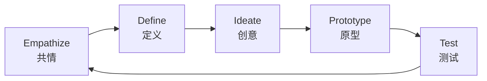
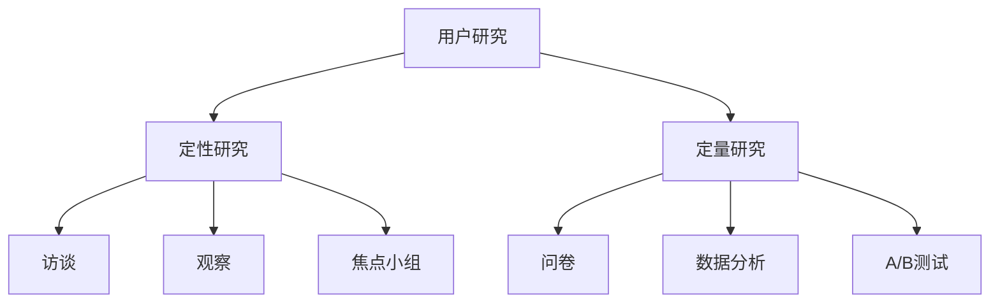
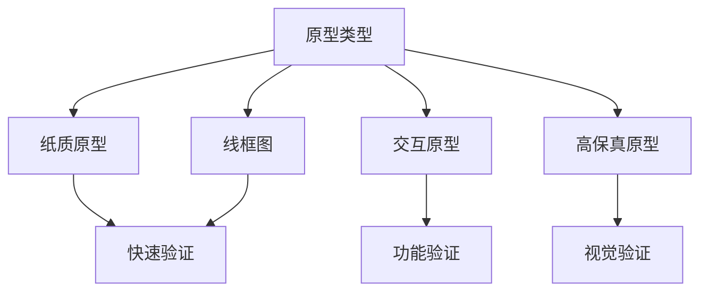
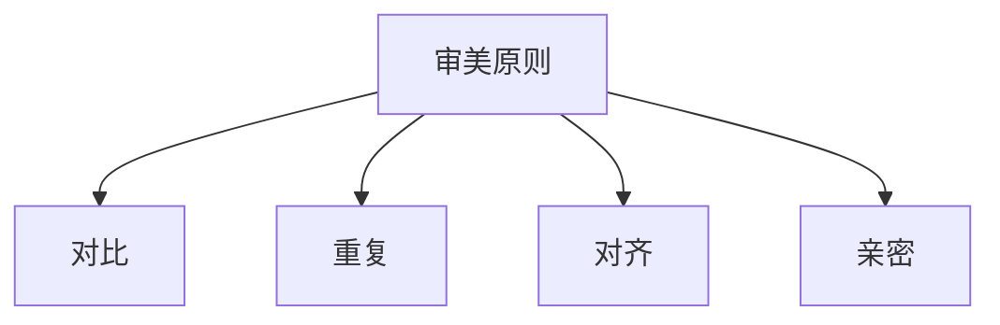
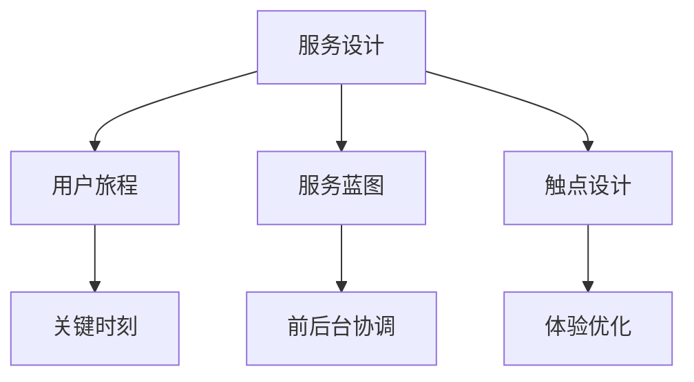

# 🎯 设计思维方法

> **艺术学门类** | **用户中心** | **创意方法** | **审美原则**

---

## 📋 概述

**学科定义：** 研究设计原理、方法、美学的学科

**核心价值：** 提供创新设计和用户体验的方法论

---

## 🎯 外行人常误解的常识

### 误区 1：设计就是美化

**误解：** 设计就是让东西好看

**事实：**
> 设计是**解决问题**：
> - 美观只是设计的一部分
> - 核心是解决用户问题
> - 好的设计是"看不见的设计"

---

### 误区 2：创意是天赋

**误解：** 创意是天生的，学不会

**事实：**
> 创意是**可以训练**的：
> - 创意有方法论
> - 可以通过练习提升
> - 创意 = 知识 × 方法 × 练习

---

### 误区 3：用户说的就是需求

**误解：** 用户说想要什么，就应该做什么

**事实：**
> 用户说的是**解决方案**，不是需求：
> - 用户可能不知道自己真正需要什么
> - 需要挖掘深层需求
> - 亨利·福特："如果我问顾客要什么，他们会说要更快的马"

---

## 🔧 核心方法论

### 1. 设计思维五步法



**设计思维流程：**
| 步骤 | 活动 | 输出 |
|------|------|------|
| **Empathize** | 理解用户 | 用户画像、同理心地图 |
| **Define** | 定义问题 | 问题陈述、设计挑战 |
| **Ideate** | 头脑风暴 | 创意方案列表 |
| **Prototype** | 快速原型 | 可交互原型 |
| **Test** | 用户测试 | 测试反馈、迭代方案 |

---

### 2. 用户研究方法



**用户研究方法：**
| 方法 | 类型 | 适用场景 |
|------|------|---------|
| **深度访谈** | 定性 | 理解用户动机 |
| **可用性测试** | 定性 | 发现使用问题 |
| **问卷调查** | 定量 | 验证假设 |
| **数据分析** | 定量 | 行为分析 |
| **A/B测试** | 定量 | 方案对比 |

---

### 3. 原型方法



**原型保真度：**
| 保真度 | 工具 | 用途 |
|--------|------|------|
| **低** | 纸笔 | 快速验证概念 |
| **中** | Figma/Axure | 功能验证 |
| **高** | 代码实现 | 最终验证 |

---

### 4. 审美原则



**设计四原则 (CRAP)：**
| 原则 | 说明 | 应用 |
|------|------|------|
| **Contrast** | 对比 | 突出重要元素 |
| **Repetition** | 重复 | 保持一致性 |
| **Alignment** | 对齐 | 整齐有序 |
| **Proximity** | 亲密 | 相关元素靠近 |

---

### 5. 服务设计



**服务设计工具：**
- 用户旅程图
- 服务蓝图
- 触点地图
- 利益相关者地图

---

## 💡 跨界应用

### 1. 产品设计

```
传统思维：这个功能怎么做？

设计思维：
1. 用户是谁？（Empathize）
2. 他们需要什么？（Define）
3. 有哪些解决方案？（Ideate）
4. 快速做个原型（Prototype）
5. 让用户测试（Test）
```

### 2. 流程优化

```
传统思维：这个流程哪里效率低？

设计思维：
1. 用户在这个流程中的感受是什么？
2. 他们的痛点在哪里？
3. 如何简化流程？
4. 设计新的流程原型
5. 测试新流程效果
```

### 3. 品牌设计

```
传统思维：设计一个好看的 Logo

设计思维：
1. 用户如何看待这个品牌？
2. 品牌的核心价值是什么？
3. 如何通过设计传达价值？
4. 设计多个方案
5. 用户测试哪个最有效
```

---

## 📚 核心概念速查

| 概念 | 定义 | 应用场景 |
|------|------|---------|
| **共情** | 理解用户感受 | 用户研究 |
| **原型** | 快速验证方案 | 概念验证 |
| **迭代** | 持续改进 | 产品优化 |
| **用户体验** | 用户的整体感受 | 产品设计 |
| **可用性** | 产品易用程度 | 产品评估 |
| **无障碍** | 特殊人群可用 | 包容设计 |
| **交互设计** | 人机交互方式 | 界面设计 |

---

**版本**: v1.0 | **更新日期**: 2026-04-30
