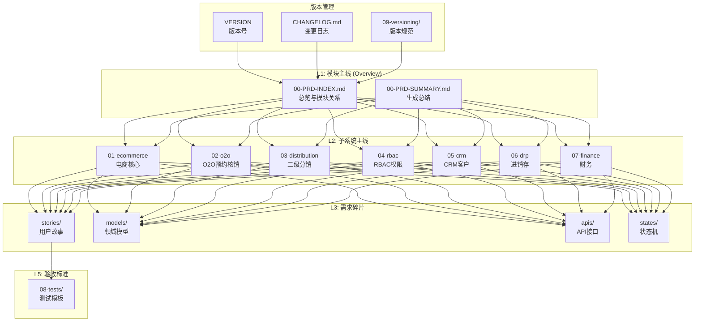

# 📋 企业级综合业务系统 PRD 文档索引

> **RAG 格式需求文档** | **金字塔结构** | **便于提示词碎片组装**

---

## 📑 文档结构



---

## 📊 子系统清单

| 编号 | 子系统 | 目录 | 实体数 | API数 | 用户故事 | 状态机 |
|------|--------|------|--------|-------|---------|--------|
| 01 | 电商核心 | `01-ecommerce/` | 5 | 14 | 8 | ✅ 订单状态机 |
| 02 | O2O预约核销 | `02-o2o/` | 3 | 8 | 6 | ✅ 预约状态机 |
| 03 | 二级分销 | `03-distribution/` | 4 | 7 | 6 | ❌ |
| 04 | RBAC权限 | `04-rbac/` | 6 | 12 | 6 | ❌ |
| 05 | CRM客户 | `05-crm/` | 4 | 11 | 6 | ❌ |
| 06 | 进销存 | `06-drp/` | 7 | 14 | 6 | ❌ |
| 07 | 财务 | `07-finance/` | 5 | 17 | 6 | ✅ 付款/发票状态机 |

---

## 🗂️ 文档目录规范

每个子系统目录包含以下文件：

```
01-ecommerce/
├── 01-module-overview.md      # 模块主线 (L2)
├── stories/
│   └── 01-user-stories.md     # 用户故事 (L3)
├── models/
│   └── domain-models.md       # 领域模型 (L4)
├── apis/
│   └── api-contracts.md       # API接口契约 (L4)
└── states/
    └── state-machines.md      # 状态机定义 (L4)
```

---

## 📁 完整文件清单

### 根目录文件

| 文件 | 说明 | 层级 |
|------|------|------|
| `00-PRD-INDEX.md` | 文档索引 | L1 |
| `00-PRD-SUMMARY.md` | 生成总结 | L1 |
| `CHANGELOG.md` | 变更日志 | 版本管理 |
| `VERSION` | 版本号 | 版本管理 |

### 共享文档

| 文件 | 说明 | 层级 |
|------|------|------|
| `08-tests/pest-test-templates.md` | Pest 测试模板 | L5 |
| `09-versioning/version-management.md` | 版本管理规范 | 版本管理 |

### 01-ecommerce 电商核心

| 文件 | 说明 | 层级 |
|------|------|------|
| `01-module-overview.md` | 模块概览 | L2 |
| `stories/01-user-stories.md` | 用户故事 (8个) | L3 |
| `models/domain-models.md` | 领域模型 | L4 |
| `apis/api-contracts.md` | API 契约 | L4 |
| `states/state-machines.md` | 状态机 | L4 |

### 02-o2o O2O预约核销

| 文件 | 说明 | 层级 |
|------|------|------|
| `01-module-overview.md` | 模块概览 | L2 |
| `stories/01-user-stories.md` | 用户故事 (6个) | L3 |
| `models/domain-models.md` | 领域模型 | L4 |
| `apis/api-contracts.md` | API 契约 | L4 |
| `states/state-machines.md` | 状态机 | L4 |

### 03-distribution 二级分销

| 文件 | 说明 | 层级 |
|------|------|------|
| `01-module-overview.md` | 模块概览 | L2 |
| `stories/01-user-stories.md` | 用户故事 (6个) | L3 |
| `models/domain-models.md` | 领域模型 | L4 |
| `apis/api-contracts.md` | API 契约 | L4 |

### 04-rbac RBAC权限

| 文件 | 说明 | 层级 |
|------|------|------|
| `01-module-overview.md` | 模块概览 | L2 |
| `stories/01-user-stories.md` | 用户故事 (6个) | L3 |
| `models/domain-models.md` | 领域模型 | L4 |
| `apis/api-contracts.md` | API 契约 | L4 |

### 05-crm CRM客户

| 文件 | 说明 | 层级 |
|------|------|------|
| `01-module-overview.md` | 模块概览 | L2 |
| `stories/01-user-stories.md` | 用户故事 (6个) | L3 |
| `models/domain-models.md` | 领域模型 | L4 |
| `apis/api-contracts.md` | API 契约 | L4 |

### 06-drp 进销存

| 文件 | 说明 | 层级 |
|------|------|------|
| `01-module-overview.md` | 模块概览 | L2 |
| `stories/01-user-stories.md` | 用户故事 (6个) | L3 |
| `models/domain-models.md` | 领域模型 | L4 |
| `apis/api-contracts.md` | API 契约 | L4 |

### 07-finance 财务

| 文件 | 说明 | 层级 |
|------|------|------|
| `01-module-overview.md` | 模块概览 | L2 |
| `stories/01-user-stories.md` | 用户故事 (6个) | L3 |
| `models/domain-models.md` | 领域模型 | L4 |
| `apis/api-contracts.md` | API 契约 | L4 |
| `states/state-machines.md` | 状态机 | L4 |

---

## 🔗 快速导航

### 按开发阶段
| 阶段 | 推荐阅读顺序 |
|------|-------------|
| **架构设计** | 00-PRD-INDEX → 各子系统 01-module-overview |
| **数据库设计** | 各子系统 models/domain-models |
| **API开发** | 各子系统 apis/api-contracts |
| **业务逻辑** | 各子系统 states/state-machines |
| **后台页面** | 各子系统 stories/user-stories |
| **测试编写** | 08-tests/pest-test-templates |

### 按提示词组装
| 任务类型 | 引用碎片 |
|---------|---------|
| 创建迁移文件 | models/domain-models + @template-migration-generation |
| 实现服务层 | states/state-machines + @template-service-layer |
| 构建API | apis/api-contracts + @template-dto-conversion |
| 生成Filament | stories/user-stories + @filament-ui-designer |
| 编写测试 | stories/user-stories + 08-tests/pest-test-templates |

---

## 📐 金字塔层级说明

### L1: 模块主线 (本文件)
- 系统整体架构
- 子系统关系与边界
- 核心业务流程概览

### L2: 子系统主线 (各子系统 01-module-overview.md)
- 子系统职责与边界
- 核心功能清单
- 与其他子系统的交互

### L3: 用户故事 (stories/)
- 以用户视角描述功能
- 包含验收标准
- 便于理解业务价值

### L4: 需求碎片 (models/apis/states/)
- 结构化、机器可读
- 可直接组装到提示词模板
- 便于生成代码

### L5: 验收标准 (08-tests/)
- Pest 测试用例模板
- 覆盖率要求
- 测试策略

---

## 🏷️ 标签索引

| 标签 | 相关文档 |
|------|---------|
| `#商品` | 01-ecommerce/models, 01-ecommerce/stories |
| `#订单` | 01-ecommerce/models, 01-ecommerce/states |
| `#预约` | 02-o2o/models, 02-o2o/states |
| `#分销` | 03-distribution/models, 03-distribution/stories |
| `#权限` | 04-rbac/models, 04-rbac/stories |
| `#客户` | 05-crm/models, 05-crm/stories |
| `#库存` | 06-drp/models, 06-drp/stories |
| `#财务` | 07-finance/models, 07-finance/states |
| `#测试` | 08-tests/pest-test-templates |

---

**版本**: v1.0.0 | **更新日期**: 2026-04-24
