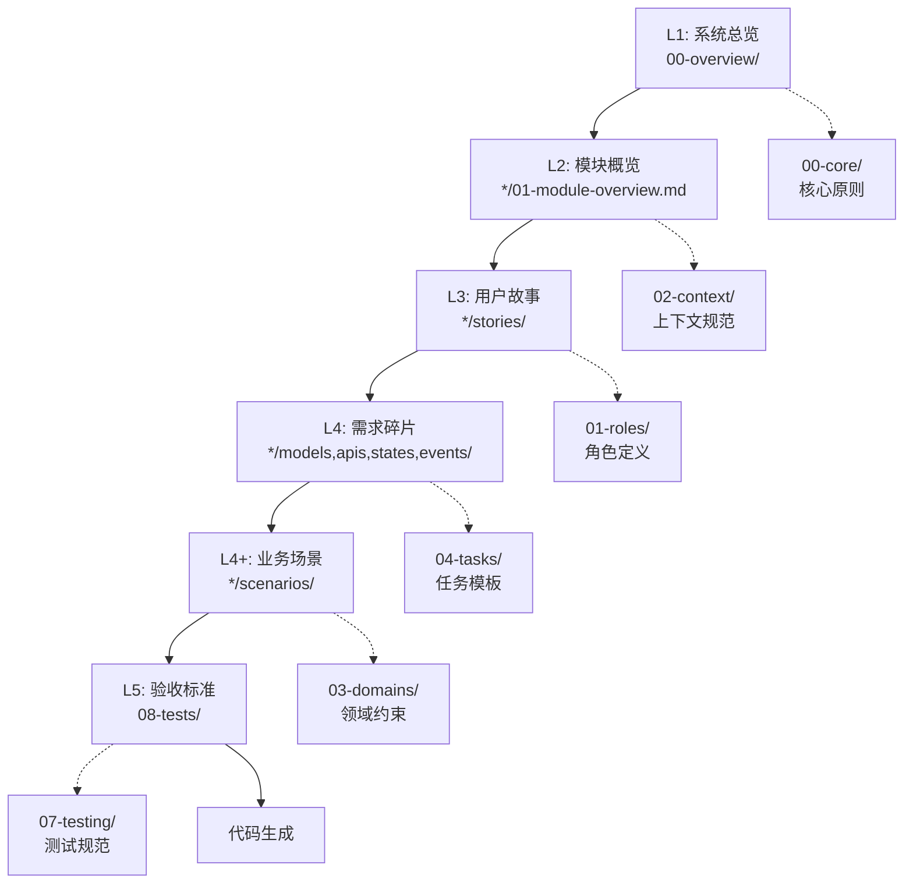

# 🏗️ PRD 与提示词库统一架构 (Unified Architecture)

**版本**: v2.0.0  
**设计目标**: PRD 文档 → 提示词组件 → 代码生成 全链路对齐  
**架构规范**: Laravel 12 + Filament 3.x + DDD 六边形架构

---

## 1. 统一目录结构

### 1.1 提示词库 (doc/prompts/)

```
doc/prompts/
├── 00-core/                          # L1: 核心原则（类型安全、TDD、DI、异常处理）
│   ├── type-safety-immutability.md
│   ├── tdd-guidelines.md
│   ├── dependency-injection.md
│   ├── error-handling.md
│   └── event-driven.md
│
├── 01-roles/                         # L3: 角色定义（Agent）
│   ├── system-architect.md
│   ├── product-architect.md
│   ├── trade-engineer.md
│   ├── asset-manager.md
│   ├── filament-ui-designer.md
│   ├── dba-expert.md
│   ├── security-expert.md
│   ├── qa-engineer.md
│   ├── devops-engineer.md
│   └── frontend-developer.md
│
├── 02-context/                       # L2: 上下文规范
│   ├── laravel-12-standards.md
│   ├── filament-best-practices.md
│   ├── ddd-architecture.md
│   └── project-metadata-injection.md
│
├── 03-domains/                       # L2+: 领域约束
│   ├── constraint-inventory-concurrency.md
│   ├── constraint-o2o-timeslot-locking.md
│   └── constraint-distribution-commission.md
│
├── 04-tasks/                         # L4: 任务模板
│   ├── template-migration-generation.md
│   ├── template-service-layer.md
│   ├── template-dto-conversion.md
│   ├── template-filament-resource.md
│   ├── template-form-request.md
│   ├── template-api-resource.md
│   └── template-event-listener.md
│
├── 05-workflows/                     # 工作流编排
│   ├── new-feature-workflow.md
│   └── code-review-workflow.md
│
├── 06-security/                      # 安全规范
│   ├── auth-sanctum.md
│   ├── authorization-gate.md
│   └── sql-injection-prevention.md
│
├── 07-testing/                       # 测试规范
│   ├── pest-unit-test.md
│   ├── pest-feature-test.md
│   └── test-data-factory.md
│
├── 08-assembly/                      # 组装公式
│   ├── assembly-formula.md
│   ├── meta-prompt-generator.md
│   └── prompt-composer.md
│
├── 09-contracts/                     # 跨模块契约（新增）
│   ├── domain-event-contracts.md
│   ├── api-versioning-contract.md
│   └── data-transfer-contract.md
│
└── 10-scenarios/                     # 业务场景模板（新增）
    ├── ecommerce-promotion.md
    ├── ecommerce-shipping.md
    ├── ecommerce-return-refund.md
    └── ecommerce-coupon.md
```

### 1.2 PRD 文档 (doc/PRD/)

```
doc/PRD/
├── 00-overview/                      # L1: 系统总览
│   ├── 00-system-overview.md         # 系统架构总览
│   ├── 01-domain-map.md              # 领域边界图
│   └── 02-event-catalog.md           # 事件目录（新增）
│
├── 01-ecommerce/                     # 电商核心模块
│   ├── 01-module-overview.md         # L2: 模块概览
│   ├── stories/                      # L3: 用户故事
│   │   └── 01-user-stories.md
│   ├── models/                       # L4: 领域模型
│   │   └── domain-models.md
│   ├── apis/                         # L4: API 契约
│   │   └── api-contracts.md
│   ├── states/                       # L4: 状态机
│   │   └── state-machines.md
│   ├── events/                       # L4: 领域事件（新增）
│   │   └── domain-events.md
│   └── scenarios/                    # L4: 业务场景（新增）
│       ├── promotion-scenario.md
│       ├── shipping-scenario.md
│       └── return-refund-scenario.md
│
├── 02-o2o/                           # O2O 预约核销模块
│   └── ...（同上结构）
│
├── 03-distribution/                  # 二级分销模块
│   └── ...（同上结构）
│
├── 04-rbac/                          # RBAC 权限模块
│   └── ...（同上结构）
│
├── 05-crm/                           # CRM 客户模块
│   └── ...（同上结构）
│
├── 06-drp/                           # 进销存模块
│   └── ...（同上结构）
│
├── 07-finance/                       # 财务模块
│   └── ...（同上结构）
│
├── 08-tests/                         # L5: 验收标准
│   └── pest-test-templates.md
│
├── 09-versioning/                    # 版本管理
│   └── version-management.md
│
└── CHANGELOG.md
```

---

## 2. 层级映射关系

| PRD 层级 | PRD 路径 | 提示词库路径 | 提示词层级 |
|---------|---------|------------|----------|
| **L1: 系统总览** | `00-overview/` | `00-core/` | 核心原则 |
| **L2: 模块概览** | `*/01-module-overview.md` | `02-context/` | 上下文规范 |
| **L3: 用户故事** | `*/stories/` | `01-roles/` | 角色定义 |
| **L4: 需求碎片** | `*/models,apis,states,events/` | `04-tasks/` | 任务模板 |
| **L4+: 业务场景** | `*/scenarios/` | `03-domains/` | 领域约束 |
| **L5: 验收标准** | `08-tests/` | `07-testing/` | 测试规范 |

---

## 3. 组装流程（从 PRD 到代码）



---

## 4. 组装公式（简化版）

```
完整 Prompt = L1(核心原则) + L2(上下文) + L3(角色) + L4(任务) + L4+(领域约束) + L5(验收)
```

### 组装示例：创建订单服务

```yaml
L1: 
  - "@type-safety-immutability"
  - "@dependency-injection"
  - "@event-driven"

L2:
  - "@laravel-12-standards"
  - "@ddd-architecture"

L3:
  - "@TradeEngineer"

L4:
  - "@template-service-layer"
  - "@template-dto-conversion"

L4+:
  - "@constraint-inventory-concurrency"

L5:
  - "@pest-feature-test"
```

---

## 5. 文档规范

### 5.1 元数据格式

每个 PRD 文档必须包含以下元数据：

```yaml
---
module: "ecommerce"
document_type: "user_stories"  # 或 domain_models, api_contracts, state_machines, domain_events, scenarios
version: "2.0"
layer: "L3"                    # L1-L5
prompt_fragments:              # 引用的提示词组件
  - "@TradeEngineer"
  - "@template-service-layer"
  - "@constraint-inventory-concurrency"
---
```

### 5.2 提示词片段引用格式

在 PRD 文档中引用提示词组件时，使用以下格式：

```yaml
prompt_fragments:
  roles:                       # L3: 角色
    - "@TradeEngineer"
  core:                        # L1: 核心原则
    - "@type-safety-immutability"
    - "@event-driven"
  context:                     # L2: 上下文
    - "@laravel-12-standards"
  tasks:                       # L4: 任务模板
    - "@template-service-layer"
  domains:                     # L4+: 领域约束
    - "@constraint-inventory-concurrency"
  testing:                     # L5: 测试
    - "@pest-feature-test"
```

---

**版本**: v2.0.0 | **更新日期**: 2026-04-27
