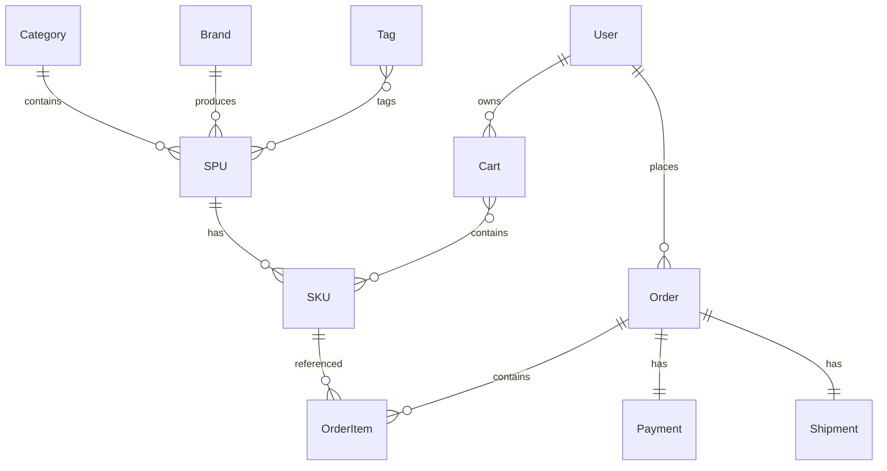
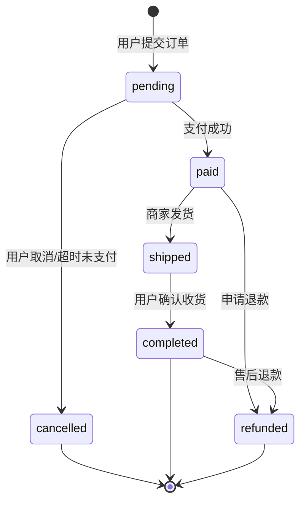
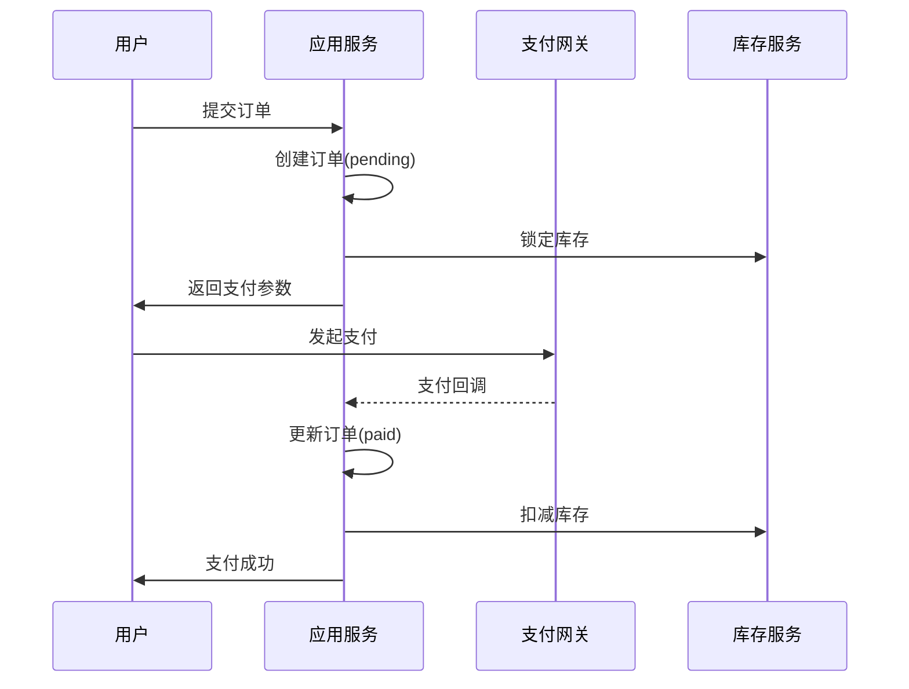

# 🛒 电商核心模块 (E-Commerce Core)

> **模块主线** | **L2: 子系统层级** | **RAG 友好格式**

---

## 📋 元数据

```yaml
module_id: "ecommerce"
module_name: "电商核心模块"
version: "1.0"
domain: "commerce"
priority: "P0"
dependencies: ["rbac", "drp", "distribution", "finance"]
dependents: ["distribution", "drp", "finance"]
```

---

## 🎯 模块职责

### 核心功能
1. **商品管理**: SPU/SKU 模型、分类、品牌、标签
2. **购物车**: 用户购物车管理、商品选择
3. **订单流程**: 订单创建、支付、发货、收货、售后
4. **支付集成**: 微信支付、支付宝支付

### 边界定义
- **负责**: 订单生命周期管理、支付回调处理
- **不负责**: 库存管理（→ DRP）、佣金计算（→ 分销）、发票开具（→ 财务）

---

## 📊 领域模型概览



### 核心实体清单

| 实体 | 说明 | 关联 |
|------|------|------|
| `Category` | 商品分类 | hasMany: SPU |
| `Brand` | 品牌 | hasMany: SPU |
| `SPU` | 标准产品单元 | hasMany: SKU, belongsTo: Category, Brand |
| `SKU` | 库存量单位 | belongsTo: SPU |
| `Tag` | 标签 | belongsToMany: SPU |
| `Cart` | 购物车 | belongsTo: User, SKU |
| `Order` | 订单 | belongsTo: User, hasMany: OrderItem |
| `OrderItem` | 订单明细 | belongsTo: Order, SKU |
| `Payment` | 支付记录 | belongsTo: Order |

---

## 🔄 核心业务流程

### 订单生命周期



### 支付流程



---

## 🔗 子系统交互

### 上游依赖
| 子系统 | 交互内容 | 交互方式 |
|--------|---------|---------|
| RBAC | 用户认证、权限验证 | 直接调用 |
| DRP | 库存查询、锁定、扣减 | 事件 + API |

### 下游通知
| 子系统 | 触发事件 | 用途 |
|--------|---------|------|
| 分销 | `OrderCompleted` | 计算佣金 |
| DRP | `OrderPaid` | 扣减库存 |
| 财务 | `OrderPaid` | 生成收款单 |
| CRM | `OrderCompleted` | 更新客户订单统计 |

---

## 📝 用户故事索引

| 编号 | 故事标题 | 优先级 | 文件 |
|------|---------|--------|------|
| US-EC-001 | 浏览商品列表 | P0 | [stories/01-user-stories.md#US-EC-001](stories/01-user-stories.md) |
| US-EC-002 | 查看商品详情 | P0 | [stories/01-user-stories.md#US-EC-002](stories/01-user-stories.md) |
| US-EC-003 | 添加购物车 | P0 | [stories/01-user-stories.md#US-EC-003](stories/01-user-stories.md) |
| US-EC-004 | 提交订单 | P0 | [stories/01-user-stories.md#US-EC-004](stories/01-user-stories.md) |
| US-EC-005 | 支付订单 | P0 | [stories/01-user-stories.md#US-EC-005](stories/01-user-stories.md) |
| US-EC-006 | 查看订单列表 | P0 | [stories/01-user-stories.md#US-EC-006](stories/01-user-stories.md) |
| US-EC-007 | 确认收货 | P1 | [stories/01-user-stories.md#US-EC-007](stories/01-user-stories.md) |
| US-EC-008 | 申请退款 | P1 | [stories/01-user-stories.md#US-EC-008](stories/01-user-stories.md) |

---

## 📦 需求碎片索引

### 领域模型
- [SPU 模型](models/domain-models.md#spu)
- [SKU 模型](models/domain-models.md#sku)
- [购物车模型](models/domain-models.md#cart)
- [订单模型](models/domain-models.md#order)
- [订单明细模型](models/domain-models.md#order-item)

### API 接口
- [商品相关接口](apis/api-contracts.md#商品接口)
- [购物车接口](apis/api-contracts.md#购物车接口)
- [订单接口](apis/api-contracts.md#订单接口)
- [支付接口](apis/api-contracts.md#支付接口)

### 状态机
- [订单状态机](states/state-machines.md#order-state-machine)

---

## ✅ 验收标准

### 功能验收
- [ ] 用户可以浏览商品列表和详情
- [ ] 用户可以添加商品到购物车
- [ ] 用户可以创建订单并完成支付
- [ ] 用户可以查看订单状态
- [ ] 用户可以确认收货和申请退款
- [ ] 管理员可以发货和处理退款

### 性能验收
- [ ] 商品列表页响应时间 < 500ms
- [ ] 订单创建接口响应时间 < 1s
- [ ] 支付回调处理时间 < 2s

### 安全验收
- [ ] 支付回调验证签名
- [ ] 订单金额服务端计算
- [ ] 库存扣减并发安全

---

**版本**: v1.0 | **更新日期**: 2026-04-24
