# 🗄️ 电商核心模块 - 领域模型

> **L4: 需求碎片层级** | **RAG 友好格式** | **可直接组装到提示词**

---

## 📋 元数据

```yaml
module: "ecommerce"
document_type: "domain_models"
version: "1.0"
entities_count: 9
relations_count: 15
```

---

## 📦 SPU (标准产品单元)

### 模型定义

```yaml
entity: SPU
table: spus
description: "标准产品单元，代表一类商品"
aggregate_root: true
soft_deletes: true

fields:
  - name: id
    type: int
    db_type: bigint
    primary: true
    auto_increment: true
    comment: "主键ID"

  - name: code
    type: string
    db_type: varchar(64)
    unique: true
    nullable: false
    comment: "SPU编码，如 SP20260424001"

  - name: name
    type: string
    db_type: varchar(255)
    nullable: false
    index: true
    comment: "商品名称"

  - name: category_id
    type: int
    db_type: bigint
    foreign: { table: categories, column: id, on_delete: restrict }
    index: true
    comment: "分类ID"

  - name: brand_id
    type: int
    db_type: bigint
    foreign: { table: brands, column: id, on_delete: set_null }
    nullable: true
    index: true
    comment: "品牌ID"

  - name: description
    type: string
    db_type: text
    nullable: true
    comment: "商品描述"

  - name: images
    type: array
    db_type: json
    default: "[]"
    comment: "商品图片URL列表"

  - name: sort_order
    type: int
    db_type: int
    default: 0
    comment: "排序权重"

  - name: status
    type: string
    db_type: enum
    values: [draft, pending, active, inactive]
    default: draft
    index: true
    comment: "状态: 草稿/待审核/上架/下架"

  - name: view_count
    type: int
    db_type: int
    default: 0
    comment: "浏览量"

  - name: created_at
    type: Carbon
    db_type: timestamp
    comment: "创建时间"

  - name: updated_at
    type: Carbon
    db_type: timestamp
    comment: "更新时间"

  - name: deleted_at
    type: Carbon
    db_type: timestamp
    nullable: true
    comment: "软删除时间"

indexes:
  - name: idx_spus_category
    fields: [category_id]
    type: btree
  - name: idx_spus_brand
    fields: [brand_id]
    type: btree
  - name: idx_spus_status
    fields: [status, sort_order]
    type: btree

relations:
  - type: hasMany
    model: SKU
    foreign_key: spu_id
    description: "一个SPU有多个SKU"

  - type: belongsTo
    model: Category
    foreign_key: category_id
    description: "所属分类"

  - type: belongsTo
    model: Brand
    foreign_key: brand_id
    description: "所属品牌"

  - type: belongsToMany
    model: Tag
    table: spu_tag
    foreign_key: spu_id
    related_key: tag_id
    description: "商品标签"

business_rules:
  - "只有 status=active 的商品可被用户浏览"
  - "删除分类时，SPU 的 category_id 设为 null"
  - "删除品牌时，SPU 的 brand_id 设为 null"

prompt_fragment: |
  # SPU 模型生成任务
  
  ## 角色
  @ProductArchitect
  
  ## 任务
  创建 SPU (标准产品单元) 的 Eloquent 模型和迁移文件。
  
  ## 字段要求
  - code: varchar(64), unique, 商品编码
  - name: varchar(255), required, 商品名称
  - category_id: bigint, foreign key to categories
  - brand_id: bigint, foreign key to brands, nullable
  - description: text, nullable, 商品描述
  - images: json, default [], 图片列表
  - status: enum(draft,pending,active,inactive), default draft
  - 软删除支持
```

---

## 📦 SKU (库存量单位)

### 模型定义

```yaml
entity: SKU
table: skus
description: "库存量单位，代表具体的商品规格组合"
aggregate_root: false
soft_deletes: false

fields:
  - name: id
    type: int
    db_type: bigint
    primary: true
    comment: "主键ID"

  - name: spu_id
    type: int
    db_type: bigint
    foreign: { table: spus, column: id, on_delete: cascade }
    nullable: false
    index: true
    comment: "所属SPU ID"

  - name: code
    type: string
    db_type: varchar(64)
    unique: true
    nullable: false
    comment: "SKU编码，如 SK20260424001-R-L"

  - name: specs
    type: array
    db_type: json
    nullable: false
    comment: "规格组合 JSON，如 {\"颜色\":\"红色\",\"尺寸\":\"L\"}"

  - name: price
    type: float
    db_type: decimal(10,2)
    nullable: false
    comment: "销售价格"

  - name: cost_price
    type: float
    db_type: decimal(10,2)
    nullable: true
    comment: "成本价格（仅管理员可见）"

  - name: stock
    type: int
    db_type: int
    default: 0
    comment: "总库存数量"

  - name: locked_stock
    type: int
    db_type: int
    default: 0
    comment: "锁定库存（已下单未付款）"

  - name: alert_stock
    type: int
    db_type: int
    default: 10
    comment: "库存预警阈值"

  - name: weight
    type: float
    db_type: decimal(8,2)
    nullable: true
    comment: "重量(kg)，用于运费计算"

  - name: status
    type: string
    db_type: enum
    values: [active, inactive]
    default: active
    comment: "状态: 上架/下架"

  - name: created_at
    type: Carbon
    db_type: timestamp
    comment: "创建时间"

  - name: updated_at
    type: Carbon
    db_type: timestamp
    comment: "更新时间"

indexes:
  - name: idx_skus_spu
    fields: [spu_id]
    type: btree
  - name: idx_skus_code
    fields: [code]
    type: btree
    unique: true

relations:
  - type: belongsTo
    model: SPU
    foreign_key: spu_id
    description: "所属SPU"

computed:
  - name: available_stock
    expression: "stock - locked_stock"
    comment: "可用库存"

  - name: specs_text
    expression: "implode specs with separator"
    comment: "规格文本，如 '红色 / L'"

business_rules:
  - "available_stock = stock - locked_stock"
  - "锁定库存不能超过总库存"
  - "库存低于 alert_stock 时触发预警"
  - "价格必须大于0"

prompt_fragment: |
  # SKU 模型生成任务
  @ProductArchitect
  
  创建 SKU 模型和迁移，包含 specs JSON 字段和库存管理字段。
```

---

## 🛒 Cart (购物车)

### 模型定义

```yaml
entity: Cart
table: carts
description: "用户购物车"
aggregate_root: false
soft_deletes: false

fields:
  - name: id
    type: int
    db_type: bigint
    primary: true
    comment: "主键ID"

  - name: user_id
    type: int
    db_type: bigint
    foreign: { table: users, column: id, on_delete: cascade }
    nullable: false
    index: true
    comment: "用户ID"

  - name: sku_id
    type: int
    db_type: bigint
    foreign: { table: skus, column: id, on_delete: cascade }
    nullable: false
    comment: "SKU ID"

  - name: quantity
    type: int
    db_type: int
    default: 1
    comment: "数量"

  - name: selected
    type: bool
    db_type: boolean
    default: true
    comment: "是否选中（用于结算）"

  - name: created_at
    type: Carbon
    db_type: timestamp
    comment: "创建时间"

  - name: updated_at
    type: Carbon
    db_type: timestamp
    comment: "更新时间"

indexes:
  - name: idx_carts_user
    fields: [user_id]
    type: btree
  - name: idx_carts_user_sku
    fields: [user_id, sku_id]
    type: btree
    unique: true

relations:
  - type: belongsTo
    model: User
    foreign_key: user_id

  - type: belongsTo
    model: SKU
    foreign_key: sku_id

business_rules:
  - "同一用户同一SKU只能有一条记录"
  - "添加重复SKU时合并数量"
  - "最大购物车条目数: 100"

prompt_fragment: |
  # Cart 模型生成任务
  @ProductArchitect
  
  创建购物车模型，包含用户和SKU关联。
```

---

## 📦 Order (订单)

### 模型定义

```yaml
entity: Order
table: orders
description: "订单主表"
aggregate_root: true
soft_deletes: true

fields:
  - name: id
    type: int
    db_type: bigint
    primary: true
    comment: "主键ID"

  - name: order_sn
    type: string
    db_type: varchar(64)
    unique: true
    nullable: false
    comment: "订单编号，格式: ORD + YYYYMMDD + 6位序列"

  - name: user_id
    type: int
    db_type: bigint
    foreign: { table: users, column: id, on_delete: restrict }
    nullable: false
    index: true
    comment: "用户ID"

  - name: status
    type: string
    db_type: enum
    values: [pending, paid, shipped, completed, cancelled, refunded]
    default: pending
    index: true
    comment: "订单状态"

  - name: total_amount
    type: float
    db_type: decimal(10,2)
    nullable: false
    comment: "商品总额"

  - name: discount_amount
    type: float
    db_type: decimal(10,2)
    default: 0
    comment: "优惠金额"

  - name: shipping_fee
    type: float
    db_type: decimal(10,2)
    default: 0
    comment: "运费"

  - name: pay_amount
    type: float
    db_type: decimal(10,2)
    nullable: false
    comment: "实付金额 = total_amount - discount_amount + shipping_fee"

  - name: shipping_info
    type: array
    db_type: json
    nullable: true
    comment: "收货信息 {name, phone, province, city, district, address}"

  - name: remark
    type: string
    db_type: varchar(500)
    nullable: true
    comment: "用户备注"

  - name: admin_remark
    type: string
    db_type: varchar(500)
    nullable: true
    comment: "管理员备注"

  - name: paid_at
    type: Carbon
    db_type: timestamp
    nullable: true
    comment: "支付时间"

  - name: shipped_at
    type: Carbon
    db_type: timestamp
    nullable: true
    comment: "发货时间"

  - name: completed_at
    type: Carbon
    db_type: timestamp
    nullable: true
    comment: "完成时间"

  - name: cancelled_at
    type: Carbon
    db_type: timestamp
    nullable: true
    comment: "取消时间"

  - name: created_at
    type: Carbon
    db_type: timestamp
    comment: "创建时间"

  - name: updated_at
    type: Carbon
    db_type: timestamp
    comment: "更新时间"

  - name: deleted_at
    type: Carbon
    db_type: timestamp
    nullable: true
    comment: "软删除时间"

indexes:
  - name: idx_orders_sn
    fields: [order_sn]
    type: btree
    unique: true
  - name: idx_orders_user_status
    fields: [user_id, status]
    type: btree
  - name: idx_orders_status_time
    fields: [status, created_at]
    type: btree

relations:
  - type: belongsTo
    model: User
    foreign_key: user_id

  - type: hasMany
    model: OrderItem
    foreign_key: order_id

  - type: hasOne
    model: Payment
    foreign_key: order_id

business_rules:
  - "pay_amount 必须等于 total_amount - discount_amount + shipping_fee"
  - "订单号必须唯一"
  - "只有 pending 状态可取消"
  - "只有 paid 状态可发货"

prompt_fragment: |
  # Order 模型生成任务
  @TradeEngineer
  
  创建订单模型，包含状态字段和金额字段，支持软删除。
```

---

## 📦 OrderItem (订单明细)

### 模型定义

```yaml
entity: OrderItem
table: order_items
description: "订单商品明细（快照）"
aggregate_root: false
soft_deletes: false

fields:
  - name: id
    type: int
    db_type: bigint
    primary: true
    comment: "主键ID"

  - name: order_id
    type: int
    db_type: bigint
    foreign: { table: orders, column: id, on_delete: cascade }
    nullable: false
    index: true
    comment: "订单ID"

  - name: spu_id
    type: int
    db_type: bigint
    foreign: { table: spus, column: id, on_delete: restrict }
    nullable: false
    comment: "SPU ID"

  - name: sku_id
    type: int
    db_type: bigint
    foreign: { table: skus, column: id, on_delete: restrict }
    nullable: false
    comment: "SKU ID"

  - name: name
    type: string
    db_type: varchar(255)
    nullable: false
    comment: "商品名称（快照）"

  - name: specs
    type: array
    db_type: json
    nullable: true
    comment: "规格信息（快照）"

  - name: image
    type: string
    db_type: varchar(500)
    nullable: true
    comment: "商品图片（快照）"

  - name: price
    type: float
    db_type: decimal(10,2)
    nullable: false
    comment: "单价（快照）"

  - name: quantity
    type: int
    db_type: int
    nullable: false
    comment: "购买数量"

  - name: total_amount
    type: float
    db_type: decimal(10,2)
    nullable: false
    comment: "小计 = price × quantity"

  - name: refund_status
    type: string
    db_type: enum
    values: [none, partial, full]
    default: none
    comment: "退款状态"

  - name: refund_amount
    type: float
    db_type: decimal(10,2)
    default: 0
    comment: "已退款金额"

  - name: created_at
    type: Carbon
    db_type: timestamp
    comment: "创建时间"

indexes:
  - name: idx_order_items_order
    fields: [order_id]
    type: btree
  - name: idx_order_items_sku
    fields: [sku_id]
    type: btree

relations:
  - type: belongsTo
    model: Order
    foreign_key: order_id

  - type: belongsTo
    model: SPU
    foreign_key: spu_id

  - type: belongsTo
    model: SKU
    foreign_key: sku_id

business_rules:
  - "必须保存下单时的商品信息快照"
  - "total_amount = price × quantity"
  - "退款金额不能超过 total_amount"

prompt_fragment: |
  # OrderItem 模型生成任务
  @TradeEngineer
  
  创建订单明细模型，包含商品快照字段。
```

---

## 🔗 关系图

```mermaid
erDiagram
    Category ||--o{ SPU : "has many"
    Brand ||--o{ SPU : "has many"
    SPU ||--o{ SKU : "has many"
    SPU }o--o{ Tag : "belongs to many"
    
    User ||--o{ Cart : "has many"
    Cart }o--|| SKU : "belongs to"
    
    User ||--o{ Order : "places"
    Order ||--o{ OrderItem : "contains"
    Order ||--|| Payment : "has"
    Order ||--|| Shipment : "has"
    
    SPU ||--o{ OrderItem : "referenced in"
    SKU ||--o{ OrderItem : "referenced in"
```



---

## 📊 字段统计

| 实体 | 字段数 | 索引数 | 外键数 | JSON字段 |
|------|--------|--------|--------|----------|
| SPU | 13 | 4 | 2 | 1 |
| SKU | 13 | 2 | 1 | 1 |
| Cart | 7 | 2 | 2 | 0 |
| Order | 19 | 3 | 1 | 1 |
| OrderItem | 14 | 2 | 3 | 1 |

---

## 🔧 迁移生成提示词

```markdown
# 任务：生成电商核心模块迁移文件

## 角色
@ProductArchitect @DBAExpert

## 上下文
- 数据库: MySQL 8.0
- 框架: Laravel 12

## 任务列表
请按以下顺序生成迁移文件：

1. create_categories_table
2. create_brands_table
3. create_tags_table
4. create_spus_table
5. create_skus_table
6. create_carts_table
7. create_orders_table
8. create_order_items_table

## 通用要求
- 主键使用 id() (BigInt, auto-increment)
- 时间戳使用 timestamps()
- 软删除使用 softDeletes()
- 金额字段使用 decimal(10,2)
- JSON 字段使用 json 类型
- 所有字段添加 comment()
- 外键显式定义并设置 onDelete 策略

## 输出格式
请为每个表提供完整的 up() 和 down() 方法。
```

---

**版本**: v1.0 | **更新日期**: 2026-04-24
