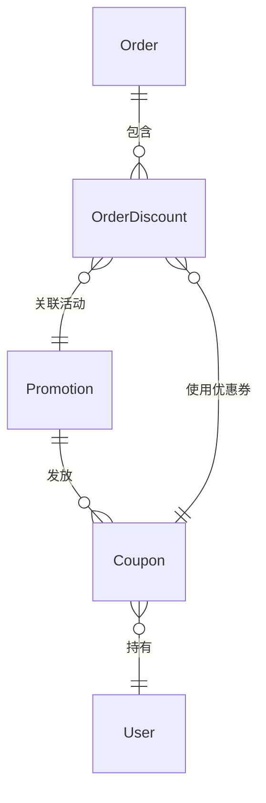
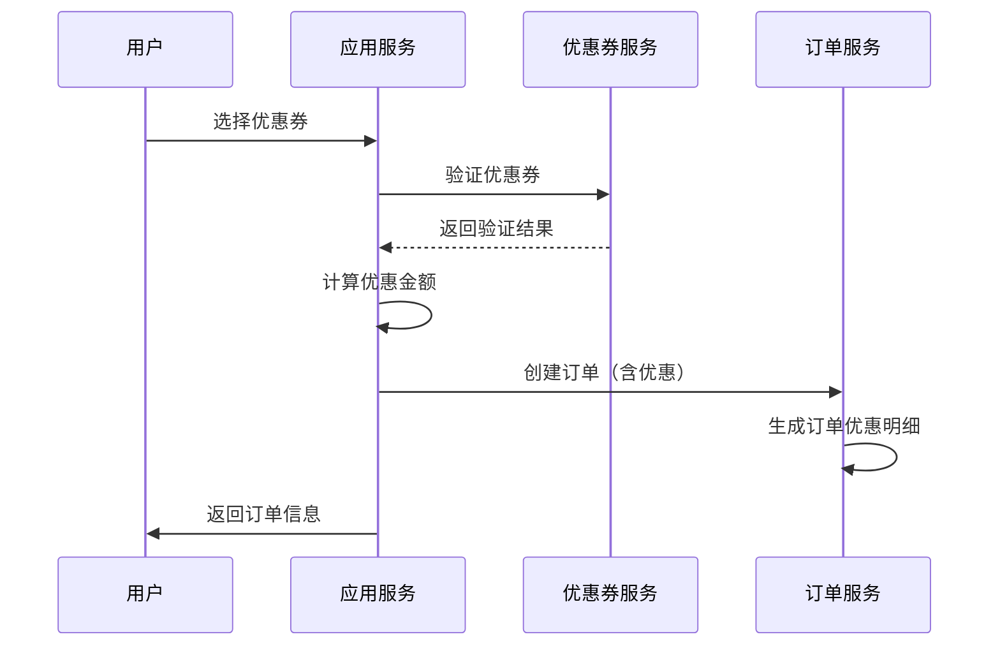

# 📦 电商促销场景

> **L4: 业务场景层级** | **RAG 友好格式** | **可直接组装到提示词**

---

## 📋 元数据

```yaml
module: "ecommerce"
document_type: "scenario"
scenario: "promotion"
version: "2.0"
entities: 3
api_count: 4
```

---

## 🎯 场景概述

促销系统是电商的核心营销能力，需要支持：
- 优惠券（满减券、折扣券、免运费券）
- 满减活动（满额减、满件减）
- 限时折扣
- 组合促销

---

## 📊 领域模型

### 核心实体

| 实体 | 说明 | 关联 |
|------|------|------|
| `Promotion` | 促销活动 | hasMany: Coupon |
| `Coupon` | 优惠券实例 | belongsTo: Promotion, User |
| `OrderDiscount` | 订单优惠明细 | belongsTo: Order, Promotion, Coupon |

### ER 图



---

## 🔄 核心业务流程

### 优惠券使用流程



---

## 📦 需求碎片索引

### 领域模型
- [Promotion 模型](../../../prompts/cards/10-scenarios/ecommerce-promotion.md#promotion)
- [Coupon 模型](../../../prompts/cards/10-scenarios/ecommerce-promotion.md#coupon)
- [OrderDiscount 模型](../../../prompts/cards/10-scenarios/ecommerce-promotion.md#orderdiscount)

### API 接口
- [获取可用优惠券](../../../prompts/cards/10-scenarios/ecommerce-promotion.md#api-接口契约)
- [应用优惠券](../../../prompts/cards/10-scenarios/ecommerce-promotion.md#api-接口契约)

### 提示词模板
- [促销场景模板](../../../prompts/cards/10-scenarios/ecommerce-promotion.md#5-提示词模板)

---

## ✅ 验收标准

### 功能验收
- [ ] 用户可以查看可用优惠券列表
- [ ] 用户可以在下单时应用优惠券
- [ ] 系统正确计算优惠金额
- [ ] 优惠券使用后状态更新为已使用
- [ ] 过期优惠券自动失效

### 业务规则验收
- [ ] 每张优惠券只能使用一次
- [ ] 优惠券有最低消费门槛
- [ ] 优惠券有有效期限制
- [ ] 订单取消后优惠券可恢复

---

**版本**: v2.0.0 | **更新日期**: 2026-04-27
