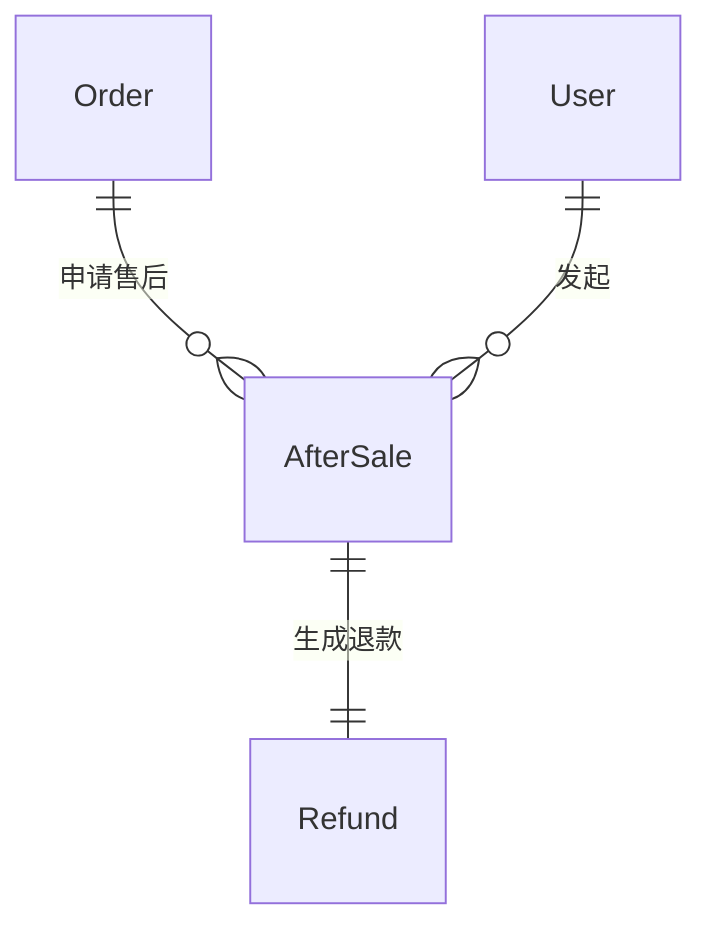
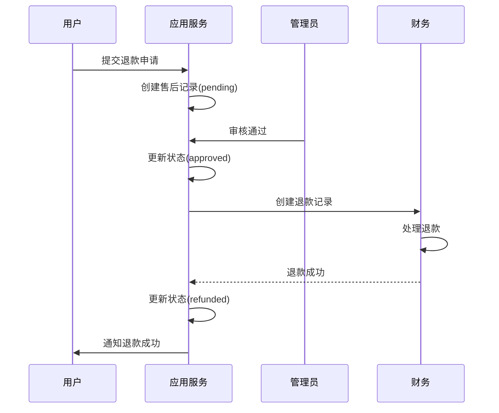
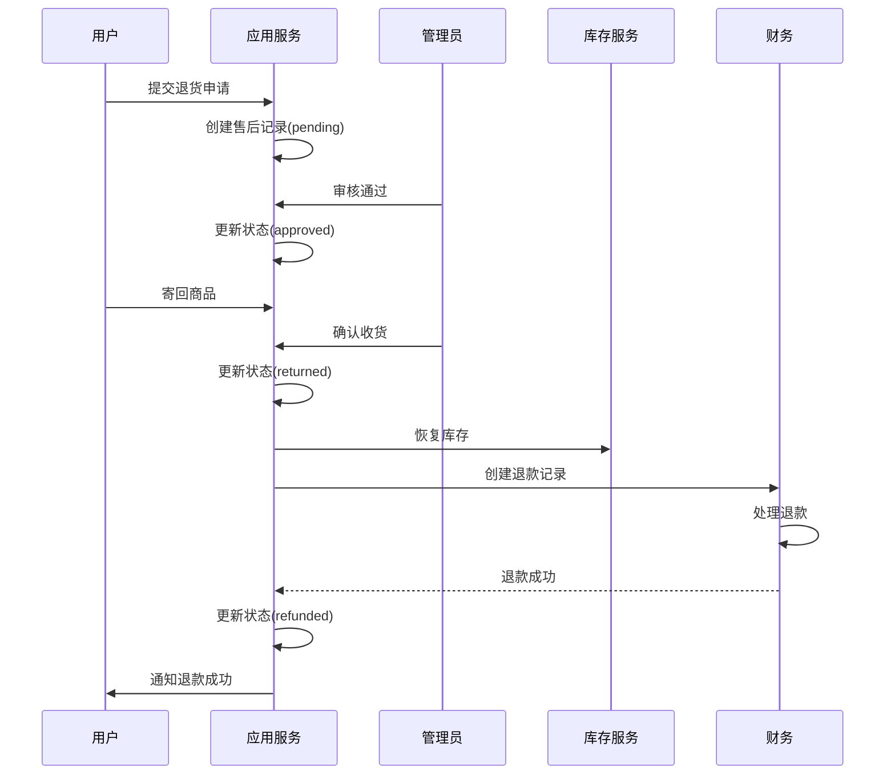

# 🔄 电商退货退款场景

> **L4: 业务场景层级** | **RAG 友好格式** | **可直接组装到提示词**

---

## 📋 元数据

```yaml
module: "ecommerce"
document_type: "scenario"
scenario: "return_refund"
version: "2.0"
entities: 2
api_count: 3
```

---

## 🎯 场景概述

退货退款系统需要支持：
- 退货申请（仅退款、退货退款）
- 退款审核
- 退货物流
- 退款处理
- 售后保障

---

## 📊 领域模型

### 核心实体

| 实体 | 说明 | 关联 |
|------|------|------|
| `AfterSale` | 售后申请 | belongsTo: Order, User |
| `Refund` | 退款记录 | belongsTo: AfterSale, Order |

### ER 图



---

## 🔄 核心业务流程

### 仅退款流程



### 退货退款流程



---

## 📦 需求碎片索引

### 领域模型
- [AfterSale 模型](../../../prompts/cards/10-scenarios/ecommerce-return-refund.md#21-售后申请表)
- [Refund 模型](../../../prompts/cards/10-scenarios/ecommerce-return-refund.md#22-退款记录表)

### API 接口
- [申请售后](../../../prompts/cards/10-scenarios/ecommerce-return-refund.md#41-申请售后)
- [审核售后](../../../prompts/cards/10-scenarios/ecommerce-return-refund.md#42-审核售后)
- [处理退款](../../../prompts/cards/10-scenarios/ecommerce-return-refund.md#43-处理退款)

### 提示词模板
- [退货退款场景模板](../../../prompts/cards/10-scenarios/ecommerce-return-refund.md#5-提示词模板)

---

## ✅ 验收标准

### 功能验收
- [ ] 用户可以提交售后申请
- [ ] 管理员可以审核售后申请
- [ ] 系统自动处理退款
- [ ] 退货后自动恢复库存

### 业务规则验收
- [ ] 退款金额不能超过实付金额
- [ ] 已发货订单需退货后才能退款
- [ ] 退款原路返回
- [ ] 退款后佣金自动取消

---

**版本**: v2.0.0 | **更新日期**: 2026-04-27
