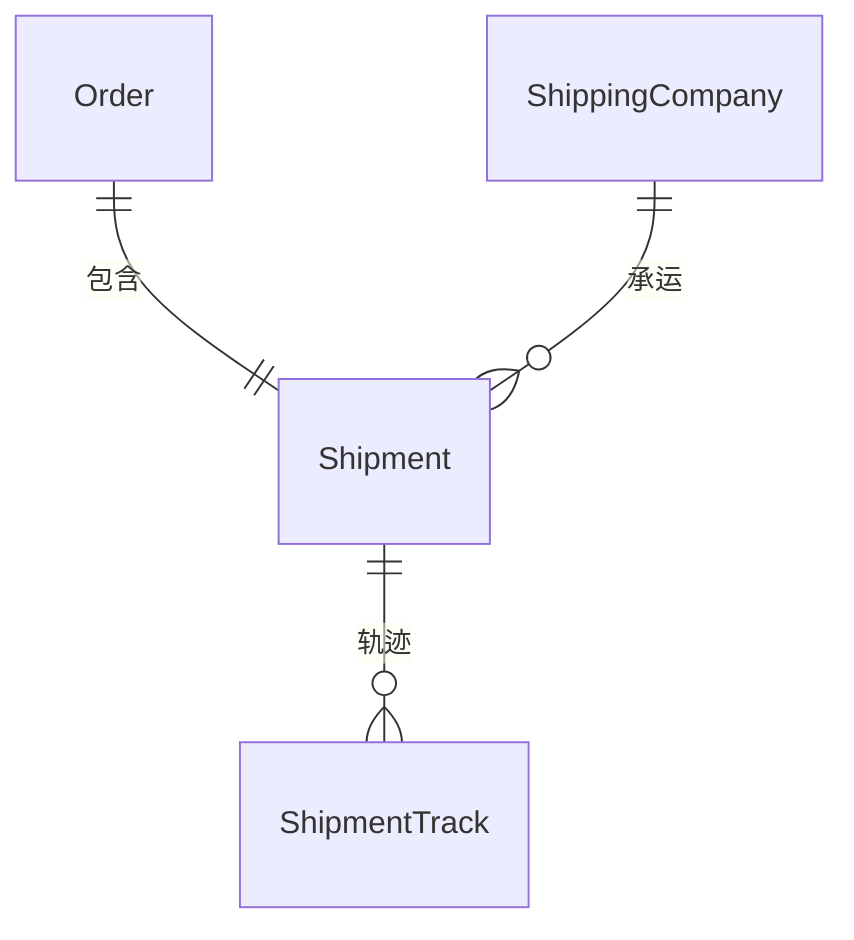
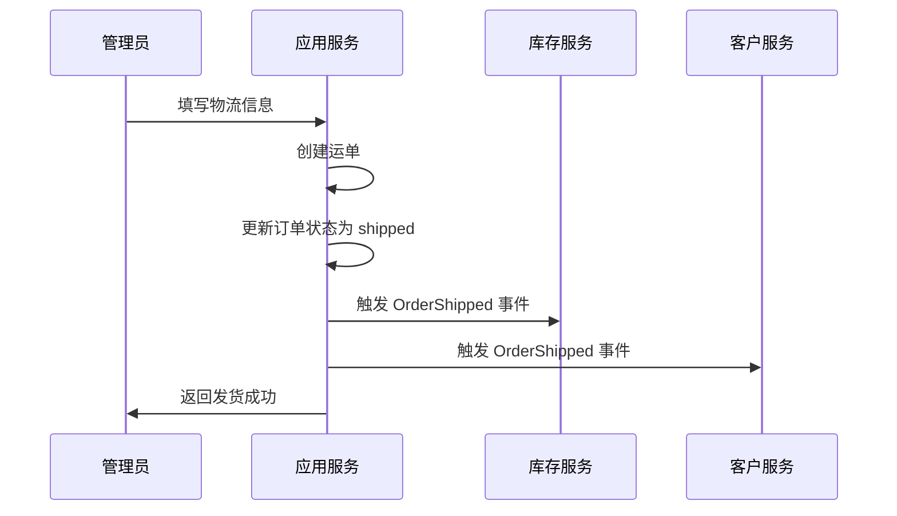

# 🚚 电商物流场景

> **L4: 业务场景层级** | **RAG 友好格式** | **可直接组装到提示词**

---

## 📋 元数据

```yaml
module: "ecommerce"
document_type: "scenario"
scenario: "shipping"
version: "2.0"
entities: 4
api_count: 3
```

---

## 🎯 场景概述

物流系统需要支持：
- 运费模板（按重量、按件、按区域）
- 物流公司对接
- 运单管理
- 物流轨迹查询

---

## 📊 领域模型

### 核心实体

| 实体 | 说明 | 关联 |
|------|------|------|
| `ShippingTemplate` | 运费模板 | - |
| `ShippingCompany` | 物流公司 | - |
| `Shipment` | 运单 | belongsTo: Order, ShippingCompany |
| `ShipmentTrack` | 物流轨迹 | belongsTo: Shipment |

### ER 图



---

## 🔄 核心业务流程

### 发货流程



---

## 📦 需求碎片索引

### 领域模型
- [ShippingTemplate 模型](../../../prompts/cards/10-scenarios/ecommerce-shipping.md#21-运费模板表)
- [ShippingCompany 模型](../../../prompts/cards/10-scenarios/ecommerce-shipping.md#22-物流公司表)
- [Shipment 模型](../../../prompts/cards/10-scenarios/ecommerce-shipping.md#23-运单表)
- [ShipmentTrack 模型](../../../prompts/cards/10-scenarios/ecommerce-shipping.md#24-物流轨迹表)

### API 接口
- [发货接口](../../../prompts/cards/10-scenarios/ecommerce-shipping.md#41-发货)
- [查询物流轨迹](../../../prompts/cards/10-scenarios/ecommerce-shipping.md#42-查询物流轨迹)

### 提示词模板
- [物流场景模板](../../../prompts/cards/10-scenarios/ecommerce-shipping.md#5-提示词模板)

---

## ✅ 验收标准

### 功能验收
- [ ] 管理员可以创建运单并发货
- [ ] 用户可以查看物流轨迹
- [ ] 系统自动计算运费
- [ ] 物流轨迹自动同步

### 业务规则验收
- [ ] 运费根据运费模板计算
- [ ] 满额包邮规则生效
- [ ] 物流轨迹实时更新
- [ ] 签收后自动完成订单

---

**版本**: v2.0.0 | **更新日期**: 2026-04-27
