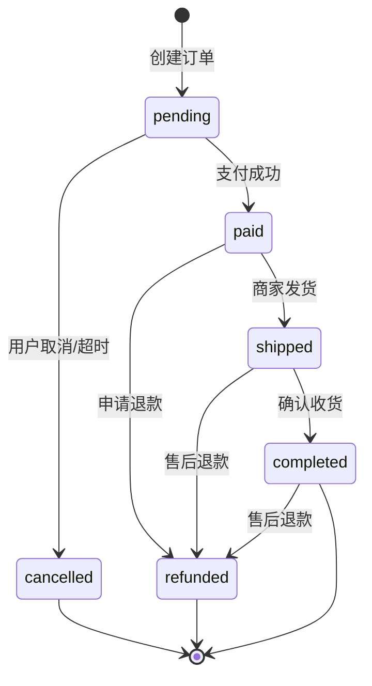
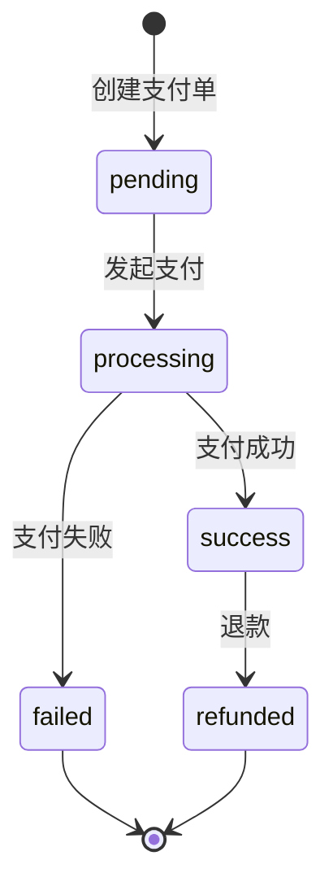

# 🔄 电商核心模块 - 状态机定义

> **L4: 需求碎片层级** | **RAG 友好格式** | **可直接组装到提示词**

---

## 📋 元数据

```yaml
module: "ecommerce"
document_type: "state_machines"
version: "1.0"
entities_with_state: 2
total_states: 11
total_transitions: 12
```

---

## 📦 订单状态机 (Order State Machine)

### 状态定义

```yaml
entity: Order
table: orders
state_field: status
state_machine_package: "spatie/laravel-model-states"

states:
  - name: pending
    label: "待支付"
    color: warning
    description: "订单已创建，等待用户支付"
    initial: true

  - name: paid
    label: "已支付"
    color: info
    description: "支付成功，等待商家发货"

  - name: shipped
    label: "已发货"
    color: primary
    description: "商家已发货，等待用户确认收货"

  - name: completed
    label: "已完成"
    color: success
    description: "用户确认收货，订单完成"

  - name: cancelled
    label: "已取消"
    color: secondary
    description: "订单被取消（用户取消或超时）"

  - name: refunded
    label: "已退款"
    color: danger
    description: "订单已退款"
```

### 状态流转定义

```yaml
transitions:
  # 待支付 -> 已支付
  - from: pending
    to: paid
    event: OrderPaid
    description: "支付成功"
    trigger: "支付回调"
    guard:
      - "支付金额等于订单金额"
      - "支付签名验证通过"
    actions:
      - "设置 paid_at 为当前时间"
      - "扣减库存：locked_quantity -> quantity"
      - "清空锁定库存"
      - "触发 OrderPaid 事件"
      - "通知 CRM 更新客户订单统计"
    transition_class: "App\States\Order\Transition\PendingToPaid"

  # 待支付 -> 已取消（用户取消）
  - from: pending
    to: cancelled
    event: OrderCancelled
    description: "用户取消订单"
    trigger: "用户操作"
    guard:
      - "订单状态为 pending"
      - "订单属于当前用户"
    actions:
      - "设置 cancelled_at 为当前时间"
      - "释放锁定库存：locked_quantity = 0"
      - "触发 OrderCancelled 事件"
    transition_class: "App\States\Order\Transition\PendingToCancelled"

  # 待支付 -> 已取消（超时）
  - from: pending
    to: cancelled
    event: OrderTimeout
    description: "订单超时未支付"
    trigger: "定时任务（30分钟）"
    guard:
      - "订单创建时间超过30分钟"
      - "订单状态仍为 pending"
    actions:
      - "设置 cancelled_at 为当前时间"
      - "释放锁定库存"
      - "触发 OrderTimeoutCancelled 事件"
    transition_class: "App\States\Order\Transition\PendingToCancelledByTimeout"

  # 已支付 -> 已发货
  - from: paid
    to: shipped
    event: OrderShipped
    description: "商家发货"
    trigger: "管理员操作"
    guard:
      - "订单状态为 paid"
      - "管理员有发货权限"
    actions:
      - "设置 shipped_at 为当前时间"
      - "保存物流单号"
      - "触发 OrderShipped 事件"
      - "通知用户发货"
    transition_class: "App\States\Order\Transition\PaidToShipped"

  # 已支付 -> 已退款（退款）
  - from: paid
    to: refunded
    event: OrderRefunded
    description: "申请退款"
    trigger: "用户申请或管理员操作"
    guard:
      - "订单状态为 paid"
    actions:
      - "恢复库存：quantity += locked_quantity"
      - "清空锁定库存"
      - "触发 OrderRefunded 事件"
      - "通知财务模块处理退款"
    transition_class: "App\States\Order\Transition\PaidToRefunded"

  # 已发货 -> 已完成（确认收货）
  - from: shipped
    to: completed
    event: OrderCompleted
    description: "用户确认收货"
    trigger: "用户操作或自动确认（15天）"
    guard:
      - "订单状态为 shipped"
    actions:
      - "设置 completed_at 为当前时间"
      - "触发 OrderCompleted 事件"
      - "触发分销佣金计算"
      - "通知 CRM 更新客户订单统计"
    transition_class: "App\States\Order\Transition\ShippedToCompleted"

  # 已发货 -> 已退款（售后退款）
  - from: shipped
    to: refunded
    event: OrderRefunded
    description: "售后退款"
    trigger: "管理员操作"
    guard:
      - "订单状态为 shipped"
      - "管理员有退款权限"
    actions:
      - "计算退款金额（可能部分退款）"
      - "触发 OrderRefunded 事件"
      - "通知财务模块处理退款"
    transition_class: "App\States\Order\Transition\ShippedToRefunded"

  # 已完成 -> 已退款（售后退款）
  - from: completed
    to: refunded
    event: OrderRefunded
    description: "售后退款"
    trigger: "管理员操作"
    guard:
      - "订单状态为 completed"
      - "在售后期限内（默认7天）"
      - "管理员有退款权限"
    actions:
      - "计算退款金额"
      - "扣减或取消对应分销佣金"
      - "触发 OrderRefunded 事件"
      - "通知财务模块处理退款"
    transition_class: "App\States\Order\Transition\CompletedToRefunded"
```

### 状态流转图



### 事件定义

```yaml
events:
  - name: OrderPaid
    description: "订单支付成功"
    payload:
      order_id: integer
      payment_id: integer
      amount: decimal
      paid_at: datetime

  - name: OrderCancelled
    description: "订单被取消"
    payload:
      order_id: integer
      reason: string
      cancelled_by: integer
      cancelled_at: datetime

  - name: OrderTimeout
    description: "订单超时"
    payload:
      order_id: integer
      timeout_minutes: integer

  - name: OrderShipped
    description: "订单发货"
    payload:
      order_id: integer
      shipping_company: string
      tracking_number: string
      shipped_by: integer

  - name: OrderCompleted
    description: "订单完成"
    payload:
      order_id: integer
      completed_at: datetime
      auto_completed: boolean

  - name: OrderRefunded
    description: "订单退款"
    payload:
      order_id: integer
      refund_amount: decimal
      refund_reason: string
      refunded_by: integer
```

### 监听器定义

```yaml
listeners:
  - name: HandleOrderPaid
    event: OrderPaid
    description: "处理订单支付成功"
    actions:
      - "发送支付成功通知"
      - "扣减库存"
      - "更新客户统计"

  - name: HandleOrderCompleted
    event: OrderCompleted
    description: "处理订单完成"
    actions:
      - "计算分销佣金"
      - "发送完成通知"
      - "更新客户统计"

  - name: HandleOrderRefunded
    event: OrderRefunded
    description: "处理订单退款"
    actions:
      - "恢复库存"
      - "取消分销佣金"
      - "生成退款单"
      - "发送退款通知"
```

---

## 💳 支付状态机 (Payment State Machine)

### 状态定义

```yaml
entity: Payment
table: payments
state_field: status

states:
  - name: pending
    label: "待支付"
    initial: true

  - name: processing
    label: "处理中"

  - name: success
    label: "支付成功"

  - name: failed
    label: "支付失败"

  - name: refunded
    label: "已退款"
```

### 状态流转

```yaml
transitions:
  - from: pending
    to: processing
    event: PaymentProcessing
    description: "开始处理支付"

  - from: processing
    to: success
    event: PaymentSuccess
    description: "支付成功"
    actions:
      - "触发 OrderPaid 事件"

  - from: processing
    to: failed
    event: PaymentFailed
    description: "支付失败"
    actions:
      - "记录失败原因"

  - from: success
    to: refunded
    event: PaymentRefunded
    description: "退款"
```

### 状态流转图



---

## 🔧 状态机生成提示词模板

```markdown
# 任务：生成订单状态机

## 角色
@TradeEngineer

## 依赖
- 包: spatie/laravel-model-states

## 任务
请为 Order 模型创建状态机实现：

### 1. 状态类
创建以下状态类，继承自 Spatie\States\State：
- App\States\Order\Pending
- App\States\Order\Paid
- App\States\Order\Shipped
- App\States\Order\Completed
- App\States\Order\Cancelled
- App\States\Order\Refunded

### 2. 转换类
为每个状态流转创建转换类：
- PendingToPaid
- PendingToCancelled
- PaidToShipped
- PaidToRefunded
- ShippedToCompleted
- ShippedToRefunded
- CompletedToRefunded

### 3. 事件类
创建 OrderPaid, OrderCancelled, OrderShipped, OrderCompleted, OrderRefunded 事件。

### 4. 监听器
创建 HandleOrderPaid, HandleOrderCompleted, HandleOrderRefunded 监听器。

## 输出要求
- 所有类必须有完整类型声明
- 转换类必须包含 guard 和 handle 方法
- 监听器保持单一职责
```

---

## 📊 状态机汇总

| 实体 | 状态数 | 转移数 | 初始状态 | 终态 |
|------|--------|--------|---------|------|
| Order | 6 | 8 | pending | cancelled, completed, refunded |
| Payment | 5 | 5 | pending | failed, refunded |

---

**版本**: v1.0 | **更新日期**: 2026-04-24
