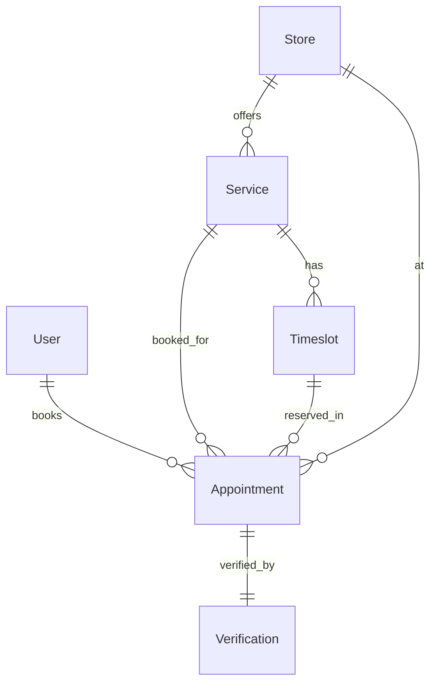
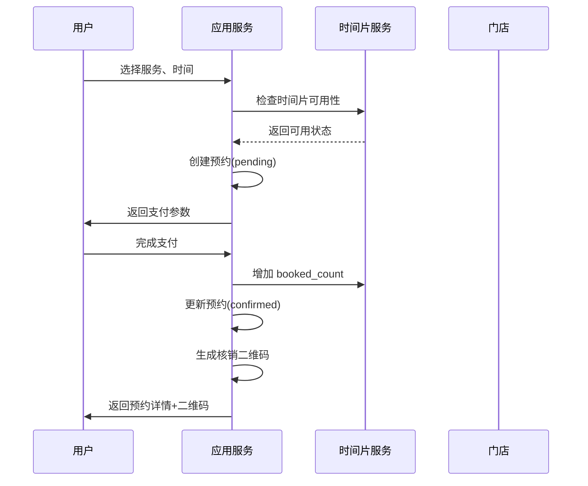
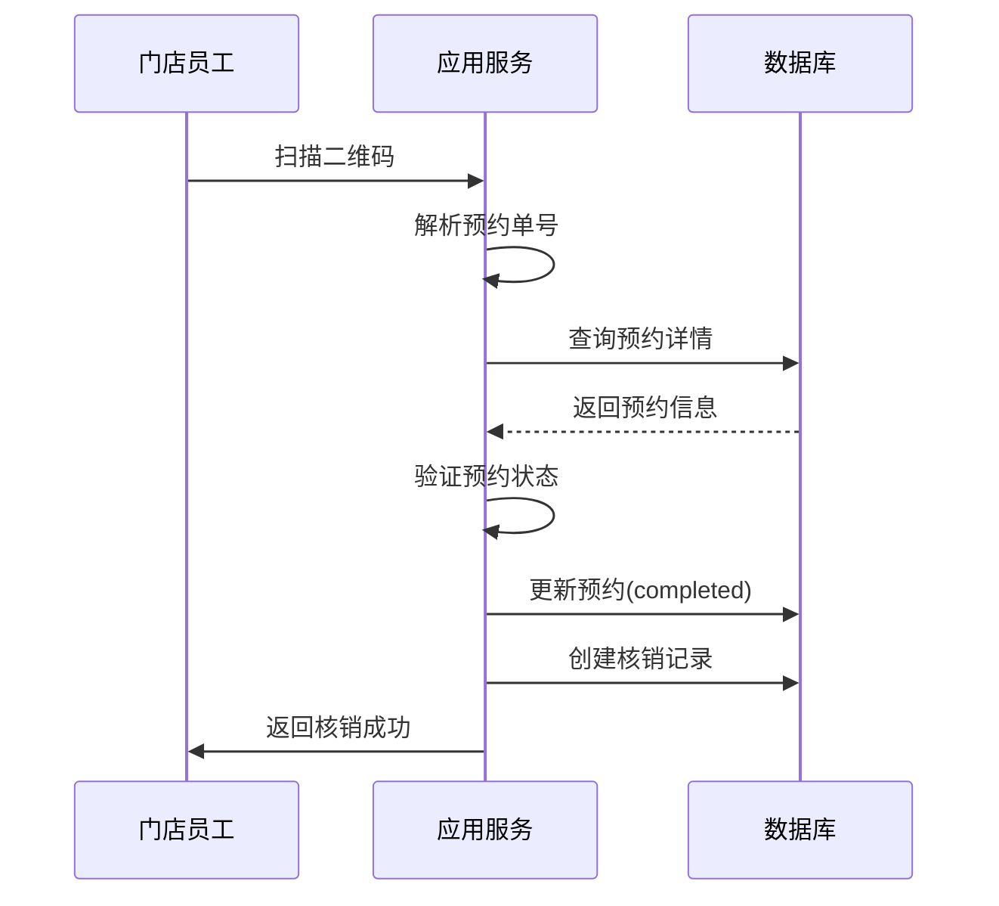

# 🏪 O2O 预约核销模块

> **模块主线** | **L2: 子系统层级** | **RAG 友好格式**

---

## 📋 元数据

```yaml
module_id: "o2o"
module_name: "O2O预约核销模块"
version: "1.0"
domain: "o2o"
priority: "P0"
dependencies: ["rbac", "crm"]
dependents: ["crm", "finance"]
```

---

## 🎯 模块职责

### 核心功能
1. **服务管理**: 门店服务项目管理、价格、时长配置
2. **时间片管理**: 时间片创建、容量控制、并发安全
3. **预约流程**: 用户预约、支付、取消、改期
4. **核销系统**: 二维码生成、扫码核销、核销记录

### 边界定义
- **负责**: 预约全生命周期管理、时间片并发控制、核销流程
- **不负责**: 支付处理（→ 电商支付模块）、客户管理（→ CRM）

---

## 📊 领域模型概览



### 核心实体清单

| 实体 | 说明 | 关联 |
|------|------|------|
| `Store` | 门店信息 | hasMany: Service |
| `Service` | 服务项目 | belongsTo: Store, hasMany: Timeslot |
| `Timeslot` | 时间片 | belongsTo: Service |
| `Appointment` | 预约记录 | belongsTo: User, Service, Timeslot, Store |
| `Verification` | 核销记录 | belongsTo: Appointment |

---

## 🔄 核心业务流程

### 预约流程



### 核销流程



---

## 🔗 子系统交互

### 上游依赖
| 子系统 | 交互内容 | 交互方式 |
|--------|---------|---------|
| RBAC | 员工权限验证 | 直接调用 |

### 下游通知
| 子系统 | 触发事件 | 用途 |
|--------|---------|------|
| CRM | `AppointmentCompleted` | 更新客户消费记录 |
| 财务 | `AppointmentCompleted` | 生成服务收入 |

---

## 📦 需求碎片索引

### 领域模型
- [Service 模型](models/domain-models.md#service)
- [Timeslot 模型](models/domain-models.md#timeslot)
- [Appointment 模型](models/domain-models.md#appointment)

### API 接口
- [服务列表接口](apis/api-contracts.md#服务接口)
- [预约接口](apis/api-contracts.md#预约接口)
- [核销接口](apis/api-contracts.md#核销接口)

### 状态机
- [预约状态机](states/state-machines.md#appointment-state-machine)

### 领域约束
- [时间片并发控制](models/domain-models.md#时间片并发控制)

---

## ✅ 验收标准

### 功能验收
- [ ] 用户可以浏览服务列表和详情
- [ ] 用户可以选择时间片并创建预约
- [ ] 用户可以查看预约详情和二维码
- [ ] 用户可以取消预约
- [ ] 门店员工可以扫码核销
- [ ] 系统防止时间片超卖

### 性能验收
- [ ] 时间片查询响应时间 < 200ms
- [ ] 预约创建并发安全（无超卖）
- [ ] 二维码生成时间 < 100ms

### 安全验收
- [ ] 时间片并发使用 SQL 锁
- [ ] 核销接口需要门店员工权限
- [ ] 二维码包含签名验证

---

**版本**: v1.0 | **更新日期**: 2026-04-24
