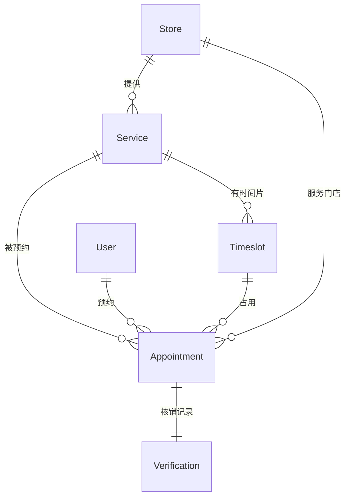

# 🗄️ O2O 预约核销模块 - 领域模型

> **L4: 需求碎片层级** | **RAG 友好格式** | **可直接组装到提示词**

---

## 📋 元数据

```yaml
module: "o2o"
document_type: "domain_models"
version: "1.0"
entities_count: 5
```

---

## 🏪 Service (服务项目)

### 模型定义

```yaml
entity: Service
table: services
description: "可预约的服务项目"
aggregate_root: true
soft_deletes: false

fields:
  - name: id
    type: int
    db_type: bigint
    primary: true
    comment: "主键ID"

  - name: store_id
    type: int
    db_type: bigint
    foreign: { table: stores, column: id, on_delete: cascade }
    nullable: false
    index: true
    comment: "门店ID"

  - name: name
    type: string
    db_type: varchar(255)
    nullable: false
    comment: "服务名称"

  - name: description
    type: string
    db_type: text
    nullable: true
    comment: "服务描述"

  - name: duration
    type: int
    db_type: int
    nullable: false
    comment: "服务时长(分钟)"

  - name: price
    type: float
    db_type: decimal(10,2)
    nullable: false
    comment: "服务价格"

  - name: max_capacity
    type: int
    db_type: int
    default: 1
    comment: "单时段最大预约数"

  - name: advance_booking_days
    type: int
    db_type: int
    default: 7
    comment: "可提前预约天数"

  - name: images
    type: array
    db_type: json
    default: "[]"
    comment: "服务图片"

  - name: status
    type: string
    db_type: enum
    values: [active, inactive]
    default: active
    comment: "状态"

  - name: created_at
    type: Carbon
    db_type: timestamp
    comment: "创建时间"

  - name: updated_at
    type: Carbon
    db_type: timestamp
    comment: "更新时间"

indexes:
  - name: idx_services_store
    fields: [store_id]
    type: btree

relations:
  - type: belongsTo
    model: Store
    foreign_key: store_id

  - type: hasMany
    model: Timeslot
    foreign_key: service_id

  - type: hasMany
    model: Appointment
    foreign_key: service_id

business_rules:
  - "只有 status=active 的服务可被预约"
  - "max_capacity 必须大于 0"
  - "duration 必须大于 0"

prompt_fragment: |
  # Service 模型生成任务
  @ProductArchitect
  
  创建 O2O 服务项目模型，包含门店关联、价格、时长、容量配置。
```

---

## ⏰ Timeslot (时间片)

### 模型定义

```yaml
entity: Timeslot
table: timeslots
description: "预约时间片，用于并发控制"
aggregate_root: false
soft_deletes: false

fields:
  - name: id
    type: int
    db_type: bigint
    primary: true
    comment: "主键ID"

  - name: service_id
    type: int
    db_type: bigint
    foreign: { table: services, column: id, on_delete: cascade }
    nullable: false
    comment: "服务ID"

  - name: date
    type: Carbon
    db_type: date
    nullable: false
    comment: "预约日期"

  - name: start_time
    type: string
    db_type: time
    nullable: false
    comment: "开始时间"

  - name: end_time
    type: string
    db_type: time
    nullable: false
    comment: "结束时间"

  - name: max_capacity
    type: int
    db_type: int
    nullable: false
    comment: "最大容量"

  - name: booked_count
    type: int
    db_type: int
    default: 0
    comment: "已预约数量"

  - name: status
    type: string
    db_type: enum
    values: [available, full, cancelled]
    default: available
    comment: "状态"

  - name: created_at
    type: Carbon
    db_type: timestamp
    comment: "创建时间"

  - name: updated_at
    type: Carbon
    db_type: timestamp
    comment: "更新时间"

indexes:
  - name: idx_timeslots_service_date
    fields: [service_id, date]
    type: btree
  - name: idx_timeslots_unique
    fields: [service_id, date, start_time]
    type: btree
    unique: true

relations:
  - type: belongsTo
    model: Service
    foreign_key: service_id

  - type: hasMany
    model: Appointment
    foreign_key: timeslot_id

computed:
  - name: available_count
    expression: "max_capacity - booked_count"
    comment: "可用名额"

business_rules:
  - "booked_count 不能超过 max_capacity"
  - "时间片不能重叠"
  - "状态自动更新：booked_count >= max_capacity 时设为 full"

constraints:
  - "CHECK (booked_count >= 0)"
  - "CHECK (booked_count <= max_capacity)"
  - "CHECK (end_time > start_time)"

concurrency_control:
  description: "时间片并发控制规则"
  rules:
    - rule: "SQL 级锁"
      code: "$slot = Timeslot::where('id', $timeslotId)->lockForUpdate()->firstOrFail();"
    - rule: "容量校验"
      code: "if ($slot->booked_count >= $slot->max_capacity) { throw new TimeslotFullException(); }"
    - rule: "原子更新"
      code: "$slot->increment('booked_count');"

prompt_fragment: |
  # Timeslot 模型生成任务
  @ProductArchitect @TradeEngineer
  
  创建时间片模型，包含并发控制字段和约束。
  使用 lockForUpdate() 实现并发安全。
```

---

## 📅 Appointment (预约记录)

### 模型定义

```yaml
entity: Appointment
table: appointments
description: "用户预约记录"
aggregate_root: true
soft_deletes: false

fields:
  - name: id
    type: int
    db_type: bigint
    primary: true
    comment: "主键ID"

  - name: appointment_no
    type: string
    db_type: varchar(64)
    unique: true
    nullable: false
    comment: "预约单号，格式: APT + YYYYMMDD + 6位序列"

  - name: user_id
    type: int
    db_type: bigint
    foreign: { table: users, column: id, on_delete: cascade }
    nullable: false
    index: true
    comment: "用户ID"

  - name: service_id
    type: int
    db_type: bigint
    foreign: { table: services, column: id, on_delete: restrict }
    nullable: false
    index: true
    comment: "服务ID"

  - name: timeslot_id
    type: int
    db_type: bigint
    foreign: { table: timeslots, column: id, on_delete: restrict }
    nullable: false
    comment: "时间片ID"

  - name: store_id
    type: int
    db_type: bigint
    foreign: { table: stores, column: id, on_delete: restrict }
    nullable: false
    comment: "门店ID"

  - name: quantity
    type: int
    db_type: int
    default: 1
    comment: "预约数量"

  - name: total_amount
    type: float
    db_type: decimal(10,2)
    nullable: false
    comment: "总金额 = service.price × quantity"

  - name: status
    type: string
    db_type: enum
    values: [pending, confirmed, completed, cancelled, no_show]
    default: pending
    index: true
    comment: "预约状态"

  - name: qr_code
    type: string
    db_type: varchar(500)
    nullable: true
    comment: "核销二维码数据（加密）"

  - name: verified_at
    type: Carbon
    db_type: timestamp
    nullable: true
    comment: "核销时间"

  - name: verified_by
    type: int
    db_type: bigint
    nullable: true
    comment: "核销人ID（门店员工）"

  - name: remark
    type: string
    db_type: varchar(500)
    nullable: true
    comment: "用户备注"

  - name: cancel_reason
    type: string
    db_type: varchar(500)
    nullable: true
    comment: "取消原因"

  - name: created_at
    type: Carbon
    db_type: timestamp
    comment: "创建时间"

  - name: updated_at
    type: Carbon
    db_type: timestamp
    comment: "更新时间"

indexes:
  - name: idx_appointments_no
    fields: [appointment_no]
    type: btree
    unique: true
  - name: idx_appointments_user
    fields: [user_id, status]
    type: btree
  - name: idx_appointments_service_date
    fields: [service_id, timeslot_id]
    type: btree

relations:
  - type: belongsTo
    model: User
    foreign_key: user_id

  - type: belongsTo
    model: Service
    foreign_key: service_id

  - type: belongsTo
    model: Timeslot
    foreign_key: timeslot_id

  - type: belongsTo
    model: Store
    foreign_key: store_id

  - type: hasOne
    model: Verification
    foreign_key: appointment_id

business_rules:
  - "预约单号必须唯一"
  - "total_amount = service.price × quantity"
  - "只有 pending 和 confirmed 状态可取消"
  - "只有 confirmed 状态可核销"

prompt_fragment: |
  # Appointment 模型生成任务
  @TradeEngineer
  
  创建预约记录模型，包含状态字段、二维码字段、核销字段。
```

---

## ✅ Verification (核销记录)

### 模型定义

```yaml
entity: Verification
table: verifications
description: "预约核销记录"
aggregate_root: false
soft_deletes: false

fields:
  - name: id
    type: int
    db_type: bigint
    primary: true
    comment: "主键ID"

  - name: appointment_id
    type: int
    db_type: bigint
    foreign: { table: appointments, column: id, on_delete: cascade }
    nullable: false
    unique: true
    comment: "预约ID"

  - name: store_id
    type: int
    db_type: bigint
    foreign: { table: stores, column: id, on_delete: restrict }
    nullable: false
    comment: "核销门店ID"

  - name: verified_by
    type: int
    db_type: bigint
    foreign: { table: users, column: id, on_delete: restrict }
    nullable: false
    comment: "核销人ID"

  - name: verified_at
    type: Carbon
    db_type: timestamp
    nullable: false
    comment: "核销时间"

  - name: verification_method
    type: string
    db_type: enum
    values: [qrcode, manual, code]
    default: qrcode
    comment: "核销方式"

  - name: device_info
    type: string
    db_type: varchar(255)
    nullable: true
    comment: "核销设备信息"

  - name: remark
    type: string
    db_type: varchar(500)
    nullable: true
    comment: "核销备注"

  - name: created_at
    type: Carbon
    db_type: timestamp
    comment: "创建时间"

indexes:
  - name: idx_verifications_appointment
    fields: [appointment_id]
    type: btree
    unique: true
  - name: idx_verifications_store
    fields: [store_id, verified_at]
    type: btree

relations:
  - type: belongsTo
    model: Appointment
    foreign_key: appointment_id

  - type: belongsTo
    model: Store
    foreign_key: store_id

business_rules:
  - "一个预约只能核销一次"
  - "核销人必须是门店员工"

prompt_fragment: |
  # Verification 模型生成任务
  @TradeEngineer
  
  创建核销记录模型，记录核销详情。
```

---

## 🔗 关系图



---

## 📊 字段统计

| 实体 | 字段数 | 索引数 | 外键数 | JSON字段 |
|------|--------|--------|--------|----------|
| Service | 12 | 1 | 1 | 1 |
| Timeslot | 10 | 2 | 1 | 0 |
| Appointment | 16 | 3 | 4 | 0 |
| Verification | 9 | 2 | 2 | 0 |

---

## 🔧 迁移生成提示词

```markdown
# 任务：生成 O2O 预约模块迁移文件

## 角色
@ProductArchitect @TradeEngineer

## 任务列表
请按以下顺序生成迁移文件：

1. create_services_table
2. create_timeslots_table
3. create_appointments_table
4. create_verifications_table

## 通用要求
- 主键使用 id() (BigInt, auto-increment)
- 时间戳使用 timestamps()
- 金额字段使用 decimal(10,2)
- JSON 字段使用 json 类型
- 所有字段添加 comment()
- 外键显式定义并设置 onDelete 策略
- timeslots 表添加 CHECK 约束

## 并发控制要求
- timeslots 表的 booked_count 必须有 CHECK (booked_count >= 0 AND booked_count <= max_capacity)
- appointments 表的 appointment_no 必须唯一

## 输出格式
请为每个表提供完整的 up() 和 down() 方法。
```

---

**版本**: v1.0 | **更新日期**: 2026-04-24
