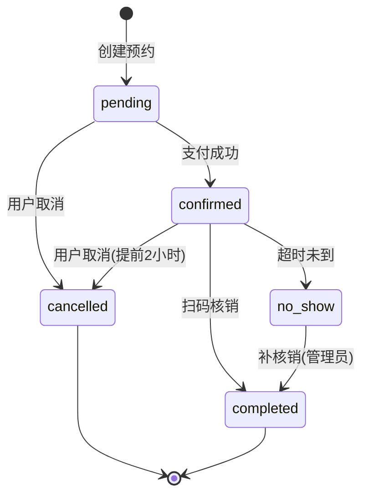

# 🔄 O2O 预约核销模块 - 状态机定义

> **L4: 需求碎片层级** | **RAG 友好格式** | **可直接组装到提示词**

---

## 📋 元数据

```yaml
module: "o2o"
document_type: "state_machines"
version: "1.0"
entities_with_state: 1
total_states: 5
total_transitions: 6
```

---

## 📅 Appointment 状态机 (预约状态机)

### 状态定义

```yaml
entity: Appointment
table: appointments
state_field: status
state_machine_package: "spatie/laravel-model-states"

states:
  - name: pending
    label: "待确认"
    color: warning
    description: "预约已创建，等待支付确认"
    initial: true

  - name: confirmed
    label: "已确认"
    color: success
    description: "已支付或确认，等待到店核销"

  - name: completed
    label: "已完成"
    color: primary
    description: "已核销，服务完成"

  - name: cancelled
    label: "已取消"
    color: secondary
    description: "预约被取消"

  - name: no_show
    label: "未到店"
    color: danger
    description: "超过预约时间未核销"
```

### 状态流转定义

```yaml
transitions:
  # 待确认 -> 已确认（支付成功）
  - from: pending
    to: confirmed
    event: AppointmentConfirmed
    description: "支付成功或系统确认"
    trigger: "支付回调/自动确认"
    guard:
      - "预约状态为 pending"
    actions:
      - "设置 confirmed_at 为当前时间"
      - "增加 timeslot booked_count"
      - "生成核销二维码"
      - "触发 AppointmentConfirmed 事件"
    transition_class: "App\States\Appointment\PendingToConfirmed"

  # 待确认 -> 已取消（用户取消）
  - from: pending
    to: cancelled
    event: AppointmentCancelled
    description: "用户取消预约"
    trigger: "用户操作"
    guard:
      - "预约状态为 pending"
    actions:
      - "设置 cancelled_at 为当前时间"
      - "设置 cancel_reason"
      - "触发 AppointmentCancelled 事件"
    transition_class: "App\States\Appointment\PendingToCancelled"

  # 已确认 -> 已完成（核销）
  - from: confirmed
    to: completed
    event: AppointmentCompleted
    description: "扫码核销成功"
    trigger: "门店员工核销"
    guard:
      - "预约状态为 confirmed"
      - "当前时间在预约时间范围内"
    actions:
      - "设置 verified_at 为当前时间"
      - "设置 verified_by"
      - "创建 Verification 记录"
      - "触发 AppointmentCompleted 事件"
      - "通知 CRM 更新客户消费"
    transition_class: "App\States\Appointment\ConfirmedToCompleted"

  # 已确认 -> 已取消（用户取消）
  - from: confirmed
    to: cancelled
    event: AppointmentCancelled
    description: "用户取消已确认预约"
    trigger: "用户操作"
    guard:
      - "预约状态为 confirmed"
      - "在预约时间前 2 小时以上"
    actions:
      - "减少 timeslot booked_count"
      - "设置 cancelled_at 和 cancel_reason"
      - "触发退款流程"
      - "触发 AppointmentCancelled 事件"
    transition_class: "App\States\Appointment\ConfirmedToCancelled"

  # 已确认 -> 未到店（超时自动）
  - from: confirmed
    to: no_show
    event: AppointmentNoShow
    description: "超过预约时间未到店"
    trigger: "定时任务（预约结束时间 + 1小时）"
    guard:
      - "预约状态为 confirmed"
      - "当前时间 > 预约结束时间 + 1小时"
    actions:
      - "减少 timeslot booked_count"
      - "触发 AppointmentNoShow 事件"
      - "不退款或部分退款（按规则）"
    transition_class: "App\States\Appointment\ConfirmedToNoShow"

  # 已确认 -> 已完成（手动标记未到店后完成）
  - from: no_show
    to: completed
    event: AppointmentCompleted
    description: "补核销（特殊情况）"
    trigger: "管理员操作"
    guard:
      - "预约状态为 no_show"
      - "管理员有特殊权限"
    actions:
      - "设置 verified_at"
      - "创建 Verification 记录（标记为补核销）"
    transition_class: "App\States\Appointment\NoShowToCompleted"
```

### 状态流转图



### 事件定义

```yaml
events:
  - name: AppointmentConfirmed
    description: "预约确认（支付成功）"
    payload:
      appointment_id: integer
      confirmed_at: datetime

  - name: AppointmentCancelled
    description: "预约取消"
    payload:
      appointment_id: integer
      cancel_reason: string
      cancelled_by: integer
      need_refund: boolean

  - name: AppointmentCompleted
    description: "预约完成（核销）"
    payload:
      appointment_id: integer
      verified_by: integer
      verified_at: datetime
      verification_method: string

  - name: AppointmentNoShow
    description: "未到店"
    payload:
      appointment_id: integer
      timeslot_end_time: datetime
```

### 监听器定义

```yaml
listeners:
  - name: HandleAppointmentConfirmed
    event: AppointmentConfirmed
    description: "处理预约确认"
    actions:
      - "发送确认通知给用户"
      - "通知门店有新预约"

  - name: HandleAppointmentCompleted
    event: AppointmentCompleted
    description: "处理预约完成"
    actions:
      - "更新 CRM 客户消费记录"
      - "发送完成通知给用户"
      - "记录服务收入到财务模块"

  - name: HandleAppointmentCancelled
    event: AppointmentCancelled
    description: "处理预约取消"
    actions:
      - "发送取消通知"
      - "如有需要，触发退款流程"

  - name: HandleAppointmentNoShow
    event: AppointmentNoShow
    description: "处理未到店"
    actions:
      - "发送未到店通知"
      - "按规则处理退款"
```

---

## 🔧 状态机生成提示词模板

```markdown
# 任务：生成预约状态机

## 角色
@TradeEngineer

## 依赖
- 包: spatie/laravel-model-states

## 任务
请为 Appointment 模型创建状态机实现：

### 1. 状态类
创建以下状态类，继承自 Spatie\States\State：
- App\States\Appointment\Pending
- App\States\Appointment\Confirmed
- App\States\Appointment\Completed
- App\States\Appointment\Cancelled
- App\States\Appointment\NoShow

### 2. 转换类
为每个状态流转创建转换类：
- PendingToConfirmed
- PendingToCancelled
- ConfirmedToCompleted
- ConfirmedToCancelled
- ConfirmedToNoShow
- NoShowToCompleted

### 3. 事件类
创建 AppointmentConfirmed, AppointmentCancelled, AppointmentCompleted, AppointmentNoShow 事件。

### 4. 监听器
创建 HandleAppointmentConfirmed, HandleAppointmentCompleted, HandleAppointmentCancelled, HandleAppointmentNoShow 监听器。

## 输出要求
- 所有类必须有完整类型声明
- 转换类必须包含 guard 和 handle 方法
- ConfirmedToCancelled 需检查提前取消时间（2小时）
- ConfirmedToNoShow 由定时任务触发
```

---

## 📊 状态机汇总

| 实体 | 状态数 | 转移数 | 初始状态 | 终态 |
|------|--------|--------|---------|------|
| Appointment | 5 | 6 | pending | completed, cancelled |

---

## ⏰ 定时任务

```yaml
scheduled_tasks:
  - name: CheckNoShowAppointments
    description: "检查未到店预约"
    schedule: "每5分钟"
    logic: |
      1. 查询 confirmed 状态且结束时间已超过1小时的预约
      2. 触发 AppointmentNoShow 事件
      3. 状态转换为 no_show

  - name: AutoConfirmPendingAppointments
    description: "自动确认待支付预约"
    schedule: "每分钟"
    logic: |
      1. 查询 pending 状态且创建时间超过30分钟的预约
      2. 状态转换为 cancelled（超时取消）
```

---

**版本**: v1.0 | **更新日期**: 2026-04-24
