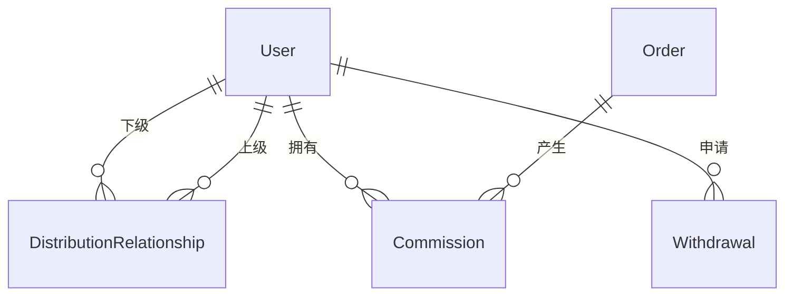
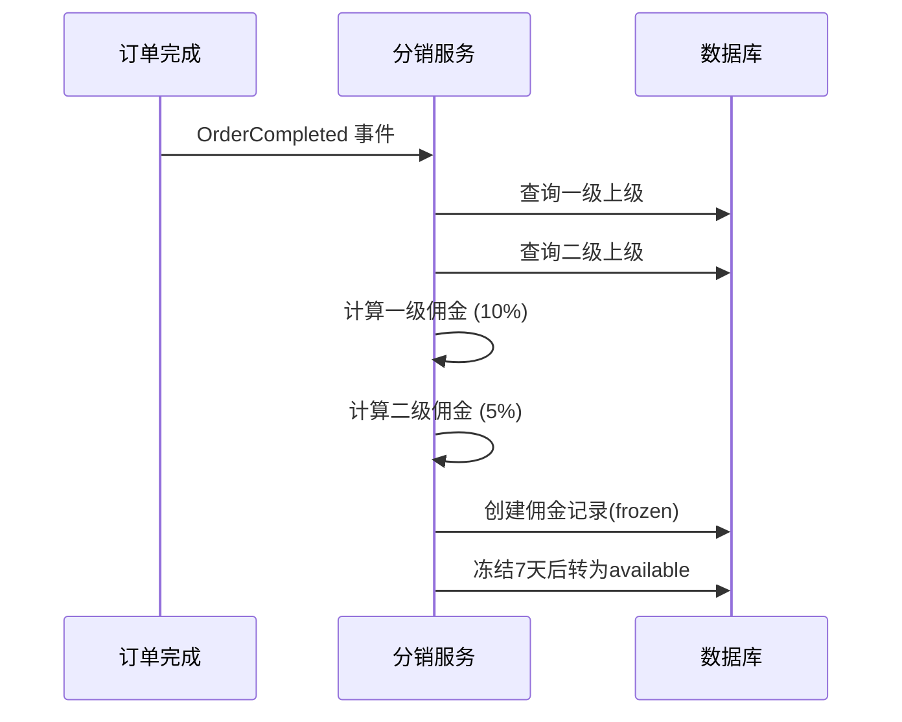
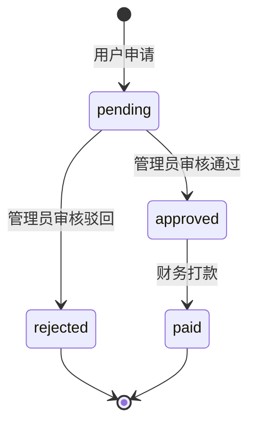

# 💰 二级分销模块 (Distribution)

> **模块主线** | **L2: 子系统层级** | **RAG 友好格式**

---

## 📋 元数据

```yaml
module_id: "distribution"
module_name: "二级分销模块"
version: "1.0"
domain: "distribution"
priority: "P1"
dependencies: ["ecommerce", "rbac"]
dependents: ["finance"]
```

---

## 🎯 模块职责

### 核心功能
1. **分销关系**: 用户上下级关系绑定（最多2级）
2. **佣金计算**: 基于订单金额的佣金自动计算
3. **佣金管理**: 冻结、释放、扣减佣金
4. **提现管理**: 提现申请、审核、打款

### 边界定义
- **负责**: 分销关系管理、佣金计算与状态管理、提现流程
- **不负责**: 订单处理（→ 电商）、支付打款（→ 财务）

---

## 📊 领域模型概览



### 核心实体清单

| 实体 | 说明 | 关联 |
|------|------|------|
| `DistributionRelationship` | 分销关系 | belongsTo: User (x2) |
| `Commission` | 佣金记录 | belongsTo: User, Order |
| `DistributionConfig` | 分销配置 | - |
| `Withdrawal` | 提现申请 | belongsTo: User |

---

## 🔄 核心业务流程

### 佣金计算流程



### 提现流程



---

## 📦 需求碎片索引

### 领域模型
- [DistributionRelationship 模型](models/domain-models.md#distributionrelationship)
- [Commission 模型](models/domain-models.md#commission)
- [DistributionConfig 模型](models/domain-models.md#distributionconfig)
- [Withdrawal 模型](models/domain-models.md#withdrawal)

### API 接口
- [分销中心接口](apis/api-contracts.md#分销接口)
- [佣金接口](apis/api-contracts.md#佣金接口)
- [提现接口](apis/api-contracts.md#提现接口)

### 业务规则
- [佣金计算规则](models/domain-models.md#佣金计算规则)

---

## ✅ 验收标准

### 功能验收
- [ ] 用户可以绑定上下级关系
- [ ] 订单完成后自动计算佣金
- [ ] 佣金冻结期后自动释放
- [ ] 用户可以申请提现
- [ ] 管理员可以审核提现
- [ ] 财务可以打款

### 业务规则验收
- [ ] 一级佣金比例 10%，二级 5%
- [ ] 佣金冻结期 7 天
- [ ] 提现最低金额 100 元
- [ ] 退款订单取消对应佣金

---

**版本**: v1.0 | **更新日期**: 2026-04-24
