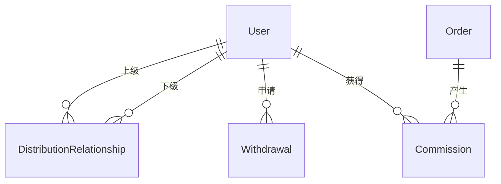

# 🗄️ 二级分销模块 - 领域模型

> **L4: 需求碎片层级** | **RAG 友好格式** | **可直接组装到提示词**

---

## 📋 元数据

```yaml
module: "distribution"
document_type: "domain_models"
version: "1.0"
entities_count: 4
```

---

## 🔗 DistributionRelationship (分销关系)

### 模型定义

```yaml
entity: DistributionRelationship
table: distribution_relationships
description: "用户分销上下级关系（最多2级）"
aggregate_root: false
soft_deletes: false

fields:
  - name: id
    type: int
    db_type: bigint
    primary: true
    comment: "主键ID"

  - name: user_id
    type: int
    db_type: bigint
    foreign: { table: users, column: id, on_delete: cascade }
    nullable: false
    comment: "用户ID（下级）"

  - name: parent_id
    type: int
    db_type: bigint
    foreign: { table: users, column: id, on_delete: cascade }
    nullable: false
    comment: "上级用户ID"

  - name: level
    type: int
    db_type: tinyint
    nullable: false
    comment: "层级：1=直接上级，2=间接上级"

  - name: path
    type: string
    db_type: varchar(255)
    nullable: true
    comment: "关系路径，如 1,2,3"

  - name: created_at
    type: Carbon
    db_type: timestamp
    comment: "创建时间"

indexes:
  - name: idx_dist_user_level
    fields: [user_id, level]
    type: btree
    unique: true
  - name: idx_dist_parent
    fields: [parent_id]
    type: btree

relations:
  - type: belongsTo
    model: User
    foreign_key: user_id
    relation: "child"

  - type: belongsTo
    model: User
    foreign_key: parent_id
    relation: "parent"

constraints:
  - "UNIQUE (user_id, level)"
  - "CHECK (level IN (1, 2))"
  - "CHECK (user_id != parent_id)"

business_rules:
  - "一个用户只能有一个直接上级（level=1）"
  - "一个用户只能有一个间接上级（level=2）"
  - "不能形成循环关系"

prompt_fragment: |
  # DistributionRelationship 模型生成任务
  @AssetManager
  
  创建分销关系模型，支持最多2级上下级关系。
```

---

## 💰 Commission (佣金记录)

### 模型定义

```yaml
entity: Commission
table: commissions
description: "分销佣金记录"
aggregate_root: true
soft_deletes: false

fields:
  - name: id
    type: int
    db_type: bigint
    primary: true
    comment: "主键ID"

  - name: order_id
    type: int
    db_type: bigint
    foreign: { table: orders, column: id, on_delete: cascade }
    nullable: false
    comment: "订单ID"

  - name: user_id
    type: int
    db_type: bigint
    foreign: { table: users, column: id, on_delete: cascade }
    nullable: false
    comment: "佣金归属用户"

  - name: level
    type: int
    db_type: tinyint
    nullable: false
    comment: "分销层级（1或2）"

  - name: order_amount
    type: float
    db_type: decimal(10,2)
    nullable: false
    comment: "订单金额（用于计算佣金）"

  - name: rate
    type: float
    db_type: decimal(5,4)
    nullable: false
    comment: "佣金比例（如0.1000表示10%）"

  - name: amount
    type: float
    db_type: decimal(10,2)
    nullable: false
    comment: "佣金金额 = order_amount × rate"

  - name: status
    type: string
    db_type: enum
    values: [frozen, available, paid, cancelled]
    default: frozen
    index: true
    comment: "佣金状态"

  - name: frozen_until
    type: Carbon
    db_type: date
    nullable: true
    comment: "冻结截止日期"

  - name: paid_at
    type: Carbon
    db_type: timestamp
    nullable: true
    comment: "发放时间"

  - name: order_completed_at
    type: Carbon
    db_type: timestamp
    nullable: true
    comment: "订单完成时间"

  - name: created_at
    type: Carbon
    db_type: timestamp
    comment: "创建时间"

  - name: updated_at
    type: Carbon
    db_type: timestamp
    comment: "更新时间"

indexes:
  - name: idx_commissions_user_status
    fields: [user_id, status]
    type: btree
  - name: idx_commissions_order_level
    fields: [order_id, level]
    type: btree
    unique: true
  - name: idx_commissions_frozen_until
    fields: [frozen_until, status]
    type: btree

relations:
  - type: belongsTo
    model: Order
    foreign_key: order_id

  - type: belongsTo
    model: User
    foreign_key: user_id

constraints:
  - "UNIQUE (order_id, level)"
  - "CHECK (level IN (1, 2))"
  - "CHECK (rate > 0 AND rate <= 1)"
  - "CHECK (amount >= 0)"

business_rules:
  - "佣金 = order_amount × rate"
  - "一级佣金默认10%，二级默认5%"
  - "冻结期结束后自动转为 available"
  - "退款订单的佣金状态转为 cancelled"

prompt_fragment: |
  # Commission 模型生成任务
  @AssetManager
  
  创建佣金记录模型，包含冻结、发放状态管理。
```

---

## ⚙️ DistributionConfig (分销配置)

### 模型定义

```yaml
entity: DistributionConfig
table: distribution_configs
description: "分销比例配置"
aggregate_root: false
soft_deletes: false

fields:
  - name: id
    type: int
    db_type: bigint
    primary: true
    comment: "主键ID"

  - name: level
    type: int
    db_type: tinyint
    nullable: false
    comment: "层级（1或2）"

  - name: rate
    type: float
    db_type: decimal(5,4)
    nullable: false
    comment: "佣金比例（如0.1000表示10%）"

  - name: frozen_days
    type: int
    db_type: int
    default: 7
    comment: "冻结天数"

  - name: min_withdrawal
    type: float
    db_type: decimal(10,2)
    default: 100
    comment: "最低提现金额"

  - name: is_active
    type: bool
    db_type: boolean
    default: true
    comment: "是否启用"

  - name: updated_at
    type: Carbon
    db_type: timestamp
    comment: "更新时间"

constraints:
  - "UNIQUE (level)"
  - "CHECK (level IN (1, 2))"
  - "CHECK (rate > 0 AND rate <= 1)"
  - "CHECK (frozen_days >= 0)"
  - "CHECK (min_withdrawal >= 0)"

business_rules:
  - "每个层级只有一条配置记录"
  - "修改配置不影响已生成的佣金"

prompt_fragment: |
  # DistributionConfig 模型生成任务
  @AssetManager
  
  创建分销配置模型，存储佣金比例和提现规则。
```

---

## 💸 Withdrawal (提现申请)

### 模型定义

```yaml
entity: Withdrawal
table: withdrawals
description: "佣金提现申请"
aggregate_root: true
soft_deletes: false

fields:
  - name: id
    type: int
    db_type: bigint
    primary: true
    comment: "主键ID"

  - name: withdrawal_no
    type: string
    db_type: varchar(64)
    unique: true
    nullable: false
    comment: "提现单号，格式: WD + YYYYMMDD + 6位序列"

  - name: user_id
    type: int
    db_type: bigint
    foreign: { table: users, column: id, on_delete: cascade }
    nullable: false
    index: true
    comment: "用户ID"

  - name: amount
    type: float
    db_type: decimal(10,2)
    nullable: false
    comment: "提现金额"

  - name: commission_ids
    type: array
    db_type: json
    nullable: false
    comment: "关联佣金ID列表"

  - name: status
    type: string
    db_type: enum
    values: [pending, approved, rejected, paid]
    default: pending
    index: true
    comment: "提现状态"

  - name: bank_info
    type: array
    db_type: json
    nullable: false
    comment: "收款信息 {bank_name, account_no, account_name}"

  - name: audit_user_id
    type: int
    db_type: bigint
    nullable: true
    comment: "审核人ID"

  - name: audit_at
    type: Carbon
    db_type: timestamp
    nullable: true
    comment: "审核时间"

  - name: audit_remark
    type: string
    db_type: varchar(500)
    nullable: true
    comment: "审核备注"

  - name: paid_at
    type: Carbon
    db_type: timestamp
    nullable: true
    comment: "打款时间"

  - name: paid_by
    type: int
    db_type: bigint
    nullable: true
    comment: "打款人ID"

  - name: created_at
    type: Carbon
    db_type: timestamp
    comment: "创建时间"

  - name: updated_at
    type: Carbon
    db_type: timestamp
    comment: "更新时间"

indexes:
  - name: idx_withdrawals_no
    fields: [withdrawal_no]
    type: btree
    unique: true
  - name: idx_withdrawals_user_status
    fields: [user_id, status]
    type: btree

relations:
  - type: belongsTo
    model: User
    foreign_key: user_id

constraints:
  - "CHECK (amount > 0)"

business_rules:
  - "提现金额必须 >= 最低提现金额"
  - "提现金额不能超过可用佣金总额"
  - "提现单号必须唯一"

prompt_fragment: |
  # Withdrawal 模型生成任务
  @AssetManager
  
  创建提现申请模型，包含审核和打款流程。
```

---

## 🔗 关系图



---

## 📊 字段统计

| 实体 | 字段数 | 索引数 | 外键数 | JSON字段 |
|------|--------|--------|--------|----------|
| DistributionRelationship | 6 | 2 | 2 | 0 |
| Commission | 13 | 3 | 2 | 0 |
| DistributionConfig | 7 | 0 | 0 | 0 |
| Withdrawal | 14 | 2 | 1 | 2 |

---

## 🔧 迁移生成提示词

```markdown
# 任务：生成分销模块迁移文件

## 角色
@AssetManager @DBAExpert

## 任务列表
请按以下顺序生成迁移文件：

1. create_distribution_relationships_table
2. create_distribution_configs_table
3. create_commissions_table
4. create_withdrawals_table

## 通用要求
- 金额字段使用 decimal(10,2)
- 佣金比例使用 decimal(5,4)
- JSON 字段用于存储 commission_ids 和 bank_info
- 添加必要的 CHECK 约束

## 输出格式
请为每个表提供完整的 up() 和 down() 方法。
```

---

**版本**: v1.0 | **更新日期**: 2026-04-24
