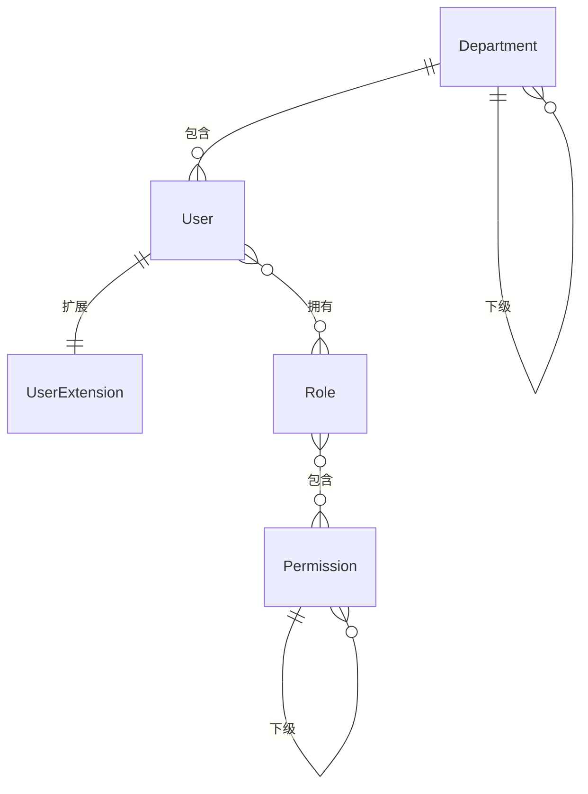

# 🔐 RBAC 权限管理模块

> **模块主线** | **L2: 子系统层级** | **RAG 友好格式**

---

## 📋 元数据

```yaml
module_id: "rbac"
module_name: "RBAC权限管理模块"
version: "1.0"
domain: "system"
priority: "P0"
dependencies: []
dependents: ["ecommerce", "o2o", "distribution", "crm", "drp", "finance"]
```

---

## 🎯 模块职责

### 核心功能
1. **用户管理**: 用户CRUD、状态管理、部门分配
2. **角色管理**: 角色CRUD、角色分配
3. **权限管理**: 权限树管理、菜单/按钮/API权限
4. **部门管理**: 组织架构管理
5. **认证授权**: 登录认证、Token管理

### 边界定义
- **负责**: 所有模块的认证与授权
- **不负责**: 业务数据管理（各业务模块）

---

## 📊 领域模型概览



### 核心实体清单

| 实体 | 说明 | 关联 |
|------|------|------|
| `UserExtension` | 用户扩展信息 | belongsTo: User, Department |
| `Department` | 部门 | belongsTo: Department (self) |
| `Role` | 角色 | belongsToMany: Permission, User |
| `Permission` | 权限 | belongsToMany: Role (self) |

---

## 🔗 子系统交互

### 被依赖关系
所有业务模块都依赖 RBAC 进行：
- 用户认证（Sanctum Token）
- 权限验证（Gate::authorize）
- 角色检查（Spatie Permission）

---

## 📦 需求碎片索引

### 领域模型
- [UserExtension 模型](models/domain-models.md#userextension)
- [Department 模型](models/domain-models.md#department)
- [Role 模型](models/domain-models.md#role)
- [Permission 模型](models/domain-models.md#permission)

### API 接口
- [认证接口](apis/api-contracts.md#认证接口)
- [用户管理接口](apis/api-contracts.md#用户管理接口)
- [角色管理接口](apis/api-contracts.md#角色管理接口)
- [权限管理接口](apis/api-contracts.md#权限管理接口)

### 权限树
- [权限树结构](models/domain-models.md#权限树结构)

---

## ✅ 验收标准

### 功能验收
- [ ] 管理员可以创建/编辑/删除用户
- [ ] 管理员可以创建/编辑/删除角色
- [ ] 管理员可以分配角色给用户
- [ ] 管理员可以管理权限树
- [ ] 用户可以登录获取Token
- [ ] API 接口根据权限控制访问

---

**版本**: v1.0 | **更新日期**: 2026-04-24
