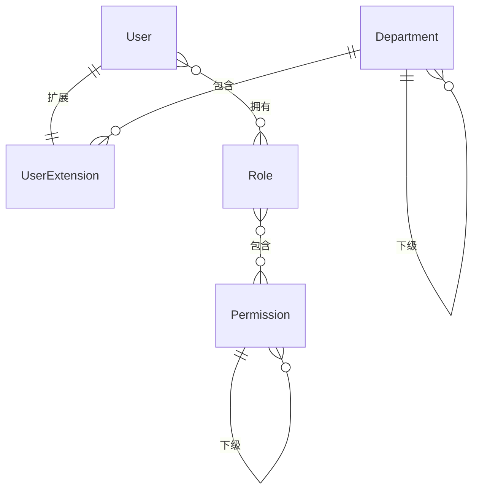

# 🗄️ RBAC 权限管理模块 - 领域模型

> **L4: 需求碎片层级** | **RAG 友好格式** | **可直接组装到提示词**

---

## 📋 元数据

```yaml
module: "rbac"
document_type: "domain_models"
version: "1.0"
entities_count: 6
```

---

## 👤 UserExtension (用户扩展)

### 模型定义

```yaml
entity: UserExtension
table: user_extensions
description: "用户扩展信息（关联权限）"
aggregate_root: false
soft_deletes: false

fields:
  - name: id
    type: int
    db_type: bigint
    primary: true
    comment: "主键ID"

  - name: user_id
    type: int
    db_type: bigint
    foreign: { table: users, column: id, on_delete: cascade }
    unique: true
    nullable: false
    comment: "用户ID"

  - name: department_id
    type: int
    db_type: bigint
    foreign: { table: departments, column: id, on_delete: set_null }
    nullable: true
    comment: "部门ID"

  - name: position
    type: string
    db_type: varchar(100)
    nullable: true
    comment: "职位"

  - name: phone
    type: string
    db_type: varchar(20)
    nullable: true
    comment: "手机号"

  - name: avatar
    type: string
    db_type: varchar(500)
    nullable: true
    comment: "头像URL"

  - name: is_admin
    type: bool
    db_type: boolean
    default: false
    comment: "是否超级管理员"

  - name: status
    type: string
    db_type: enum
    values: [active, inactive, locked]
    default: active
    comment: "状态"

  - name: last_login_at
    type: Carbon
    db_type: timestamp
    nullable: true
    comment: "最后登录时间"

  - name: last_login_ip
    type: string
    db_type: varchar(45)
    nullable: true
    comment: "最后登录IP"

  - name: created_at
    type: Carbon
    db_type: timestamp
    comment: "创建时间"

  - name: updated_at
    type: Carbon
    db_type: timestamp
    comment: "更新时间"

relations:
  - type: belongsTo
    model: User
    foreign_key: user_id

  - type: belongsTo
    model: Department
    foreign_key: department_id

business_rules:
  - "每个用户只有一条扩展记录"
  - "is_admin=true 的用户拥有所有权限"

prompt_fragment: |
  # UserExtension 模型生成任务
  @SecurityExpert
  
  创建用户扩展模型，关联部门和登录信息。
```

---

## 🏢 Department (部门)

### 模型定义

```yaml
entity: Department
table: departments
description: "组织部门（树形结构）"
aggregate_root: false
soft_deletes: false

fields:
  - name: id
    type: int
    db_type: bigint
    primary: true
    comment: "主键ID"

  - name: parent_id
    type: int
    db_type: bigint
    foreign: { table: departments, column: id, on_delete: cascade }
    nullable: true
    index: true
    comment: "上级部门ID"

  - name: name
    type: string
    db_type: varchar(100)
    nullable: false
    comment: "部门名称"

  - name: code
    type: string
    db_type: varchar(50)
    unique: true
    nullable: false
    comment: "部门编码"

  - name: sort
    type: int
    db_type: int
    default: 0
    comment: "排序"

  - name: status
    type: string
    db_type: enum
    values: [active, inactive]
    default: active
    comment: "状态"

  - name: created_at
    type: Carbon
    db_type: timestamp
    comment: "创建时间"

  - name: updated_at
    type: Carbon
    db_type: timestamp
    comment: "更新时间"

indexes:
  - name: idx_departments_parent
    fields: [parent_id]
    type: btree
  - name: idx_departments_code
    fields: [code]
    type: btree
    unique: true

relations:
  - type: belongsTo
    model: Department
    foreign_key: parent_id
    relation: "parent"

  - type: hasMany
    model: Department
    foreign_key: parent_id
    relation: "children"

  - type: hasMany
    model: UserExtension
    foreign_key: department_id

business_rules:
  - "部门编码必须唯一"
  - "树形结构，支持无限层级"

prompt_fragment: |
  # Department 模型生成任务
  @SystemArchitect
  
  创建部门模型，支持树形结构。
```

---

## 👥 Role (角色)

### 模型定义

```yaml
entity: Role
table: roles
description: "系统角色"
aggregate_root: false
soft_deletes: false

fields:
  - name: id
    type: int
    db_type: bigint
    primary: true
    comment: "主键ID"

  - name: name
    type: string
    db_type: varchar(100)
    unique: true
    nullable: false
    comment: "角色名称"

  - name: code
    type: string
    db_type: varchar(50)
    unique: true
    nullable: false
    comment: "角色编码，如 admin, editor, operator"

  - name: description
    type: string
    db_type: varchar(255)
    nullable: true
    comment: "角色描述"

  - name: is_system
    type: bool
    db_type: boolean
    default: false
    comment: "是否系统内置（不可删除）"

  - name: sort
    type: int
    db_type: int
    default: 0
    comment: "排序"

  - name: status
    type: string
    db_type: enum
    values: [active, inactive]
    default: active
    comment: "状态"

  - name: created_at
    type: Carbon
    db_type: timestamp
    comment: "创建时间"

  - name: updated_at
    type: Carbon
    db_type: timestamp
    comment: "更新时间"

indexes:
  - name: idx_roles_code
    fields: [code]
    type: btree
    unique: true

relations:
  - type: belongsToMany
    model: Permission
    table: role_has_permissions
    foreign_key: role_id
    related_key: permission_id

  - type: belongsToMany
    model: User
    table: model_has_roles
    foreign_key: role_id
    related_key: model_id

business_rules:
  - "系统内置角色不可删除"
  - "角色编码必须唯一"

prompt_fragment: |
  # Role 模型生成任务
  @SecurityExpert
  
  创建角色模型，支持权限关联。
```

---

## 🔑 Permission (权限)

### 模型定义

```yaml
entity: Permission
table: permissions
description: "系统权限（菜单/按钮/API）"
aggregate_root: false
soft_deletes: false

fields:
  - name: id
    type: int
    db_type: bigint
    primary: true
    comment: "主键ID"

  - name: parent_id
    type: int
    db_type: bigint
    foreign: { table: permissions, column: id, on_delete: cascade }
    nullable: true
    index: true
    comment: "上级权限ID"

  - name: name
    type: string
    db_type: varchar(100)
    nullable: false
    comment: "权限名称"

  - name: code
    type: string
    db_type: varchar(100)
    unique: true
    nullable: false
    comment: "权限编码，如 order:view, order:create"

  - name: type
    type: string
    db_type: enum
    values: [menu, button, api]
    nullable: false
    comment: "权限类型：菜单/按钮/API"

  - name: path
    type: string
    db_type: varchar(255)
    nullable: true
    comment: "路由路径（菜单类型）"

  - name: component
    type: string
    db_type: varchar(255)
    nullable: true
    comment: "组件路径（菜单类型）"

  - name: icon
    type: string
    db_type: varchar(100)
    nullable: true
    comment: "图标（菜单类型）"

  - name: sort
    type: int
    db_type: int
    default: 0
    comment: "排序"

  - name: status
    type: string
    db_type: enum
    values: [active, inactive]
    default: active
    comment: "状态"

  - name: created_at
    type: Carbon
    db_type: timestamp
    comment: "创建时间"

  - name: updated_at
    type: Carbon
    db_type: timestamp
    comment: "更新时间"

indexes:
  - name: idx_permissions_code
    fields: [code]
    type: btree
    unique: true
  - name: idx_permissions_parent
    fields: [parent_id]
    type: btree
  - name: idx_permissions_type
    fields: [type]
    type: btree

relations:
  - type: belongsTo
    model: Permission
    foreign_key: parent_id
    relation: "parent"

  - type: hasMany
    model: Permission
    foreign_key: parent_id
    relation: "children"

  - type: belongsToMany
    model: Role
    table: role_has_permissions
    foreign_key: permission_id
    related_key: role_id

business_rules:
  - "权限编码必须唯一"
  - "支持无限层级的权限树"

prompt_fragment: |
  # Permission 模型生成任务
  @SecurityExpert
  
  创建权限模型，支持菜单/按钮/API 三种类型和树形结构。
```

---

## 🔗 关系图



---

## 📊 字段统计

| 实体 | 字段数 | 索引数 | 外键数 |
|------|--------|--------|--------|
| UserExtension | 12 | 0 | 2 |
| Department | 8 | 2 | 1 |
| Role | 9 | 1 | 0 |
| Permission | 12 | 3 | 1 |

---

**版本**: v1.0 | **更新日期**: 2026-04-24
