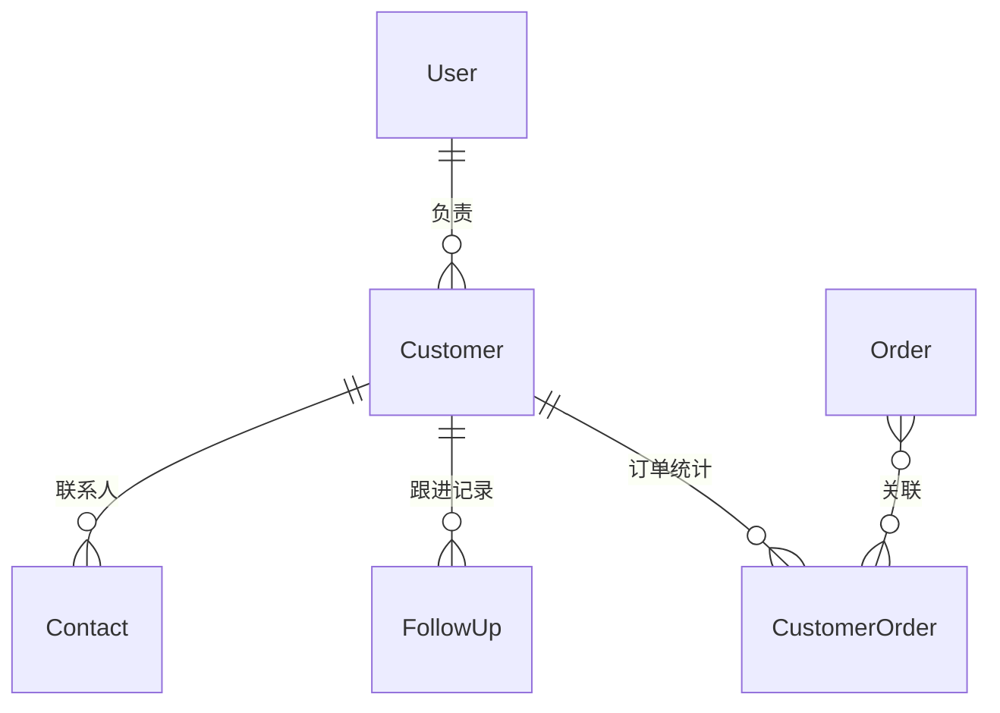

# 👥 CRM 客户关系管理模块

> **模块主线** | **L2: 子系统层级** | **RAG 友好格式**

---

## 📋 元数据

```yaml
module_id: "crm"
module_name: "CRM客户关系管理模块"
version: "1.0"
domain: "crm"
priority: "P1"
dependencies: ["rbac"]
dependents: []
```

---

## 🎯 模块职责

### 核心功能
1. **客户管理**: 客户信息CRUD、等级分类、标签管理
2. **联系人管理**: 多联系人管理、主联系人标记
3. **跟进记录**: 跟进方式、内容、附件、下次跟进时间
4. **客户统计**: 订单统计、消费金额、跟进统计

### 边界定义
- **负责**: 客户信息管理、跟进记录、客户分析
- **不负责**: 订单创建（→ 电商）、预约（→ O2O）

---

## 📊 领域模型概览



### 核心实体清单

| 实体 | 说明 | 关联 |
|------|------|------|
| `Customer` | 客户信息 | belongsTo: User (owner) |
| `Contact` | 联系人 | belongsTo: Customer |
| `FollowUp` | 跟进记录 | belongsTo: Customer, User |
| `CustomerOrder` | 客户订单统计 | belongsTo: Customer, Order |

---

## 📦 需求碎片索引

### 领域模型
- [Customer 模型](models/domain-models.md#customer)
- [Contact 模型](models/domain-models.md#contact)
- [FollowUp 模型](models/domain-models.md#followup)

### API 接口
- [客户管理接口](apis/api-contracts.md#客户接口)
- [跟进记录接口](apis/api-contracts.md#跟进接口)

---

## ✅ 验收标准

### 功能验收
- [ ] 销售可以创建/编辑客户
- [ ] 销售可以添加联系人
- [ ] 销售可以记录跟进
- [ ] 销售可以查看客户统计
- [ ] 订单完成后自动更新客户统计

---

**版本**: v1.0 | **更新日期**: 2026-04-24
