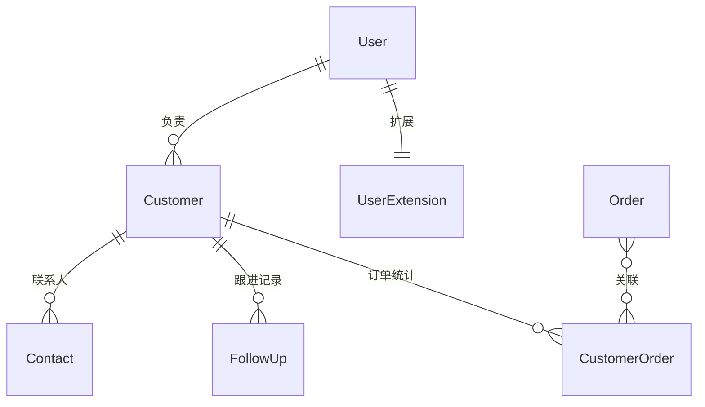

# 🗄️ CRM 客户关系管理模块 - 领域模型

> **L4: 需求碎片层级** | **RAG 友好格式** | **可直接组装到提示词**

---

## 📋 元数据

```yaml
module: "crm"
document_type: "domain_models"
version: "1.0"
entities_count: 4
```

---

## 👥 Customer (客户)

### 模型定义

```yaml
entity: Customer
table: customers
description: "客户信息"
aggregate_root: true
soft_deletes: true

fields:
  - name: id
    type: int
    db_type: bigint
    primary: true
    comment: "主键ID"

  - name: user_id
    type: int
    db_type: bigint
    foreign: { table: users, column: id, on_delete: set_null }
    nullable: true
    index: true
    comment: "关联用户ID（如有注册）"

  - name: name
    type: string
    db_type: varchar(100)
    nullable: false
    comment: "客户名称"

  - name: type
    type: string
    db_type: enum
    values: [individual, enterprise]
    default: individual
    comment: "客户类型：个人/企业"

  - name: phone
    type: string
    db_type: varchar(20)
    nullable: true
    index: true
    comment: "联系电话"

  - name: email
    type: string
    db_type: varchar(100)
    nullable: true
    comment: "邮箱"

  - name: company
    type: string
    db_type: varchar(255)
    nullable: true
    comment: "公司名称（企业客户）"

  - name: address
    type: array
    db_type: json
    nullable: true
    comment: "地址信息 {province, city, district, address}"

  - name: source
    type: string
    db_type: enum
    values: [register, recommend, activity, other]
    default: register
    comment: "客户来源"

  - name: level
    type: string
    db_type: enum
    values: [A, B, C, D]
    default: C
    index: true
    comment: "客户等级"

  - name: owner_id
    type: int
    db_type: bigint
    foreign: { table: users, column: id, on_delete: set_null }
    nullable: true
    index: true
    comment: "负责人ID"

  - name: tags
    type: array
    db_type: json
    default: "[]"
    comment: "客户标签"

  - name: status
    type: string
    db_type: enum
    values: [active, inactive, lost]
    default: active
    index: true
    comment: "客户状态"

  - name: total_orders
    type: int
    db_type: int
    default: 0
    comment: "累计订单数"

  - name: total_amount
    type: float
    db_type: decimal(12,2)
    default: 0
    comment: "累计消费金额"

  - name: last_contact_at
    type: Carbon
    db_type: timestamp
    nullable: true
    comment: "最后联系时间"

  - name: last_order_at
    type: Carbon
    db_type: timestamp
    nullable: true
    comment: "最后下单时间"

  - name: created_at
    type: Carbon
    db_type: timestamp
    comment: "创建时间"

  - name: updated_at
    type: Carbon
    db_type: timestamp
    comment: "更新时间"

  - name: deleted_at
    type: Carbon
    db_type: timestamp
    nullable: true
    comment: "软删除时间"

indexes:
  - name: idx_customers_user
    fields: [user_id]
    type: btree
  - name: idx_customers_owner
    fields: [owner_id]
    type: btree
  - name: idx_customers_level
    fields: [level, status]
    type: btree
  - name: idx_customers_phone
    fields: [phone]
    type: btree

relations:
  - type: belongsTo
    model: User
    foreign_key: user_id

  - type: belongsTo
    model: User
    foreign_key: owner_id
    relation: "owner"

  - type: hasMany
    model: Contact
    foreign_key: customer_id

  - type: hasMany
    model: FollowUp
    foreign_key: customer_id

business_rules:
  - "客户名称必填"
  - "企业客户必须填写 company"
  - "total_orders 和 total_amount 通过订单统计自动更新"

prompt_fragment: |
  # Customer 模型生成任务
  @SystemArchitect
  
  创建客户模型，包含等级、标签、统计字段。
```

---

## 📞 Contact (联系人)

### 模型定义

```yaml
entity: Contact
table: contacts
description: "客户联系人"
aggregate_root: false
soft_deletes: false

fields:
  - name: id
    type: int
    db_type: bigint
    primary: true
    comment: "主键ID"

  - name: customer_id
    type: int
    db_type: bigint
    foreign: { table: customers, column: id, on_delete: cascade }
    nullable: false
    index: true
    comment: "客户ID"

  - name: name
    type: string
    db_type: varchar(100)
    nullable: false
    comment: "联系人姓名"

  - name: position
    type: string
    db_type: varchar(100)
    nullable: true
    comment: "职位"

  - name: phone
    type: string
    db_type: varchar(20)
    nullable: true
    comment: "电话"

  - name: email
    type: string
    db_type: varchar(100)
    nullable: true
    comment: "邮箱"

  - name: is_primary
    type: bool
    db_type: boolean
    default: false
    comment: "是否主联系人"

  - name: remark
    type: string
    db_type: varchar(500)
    nullable: true
    comment: "备注"

  - name: created_at
    type: Carbon
    db_type: timestamp
    comment: "创建时间"

indexes:
  - name: idx_contacts_customer
    fields: [customer_id]
    type: btree

relations:
  - type: belongsTo
    model: Customer
    foreign_key: customer_id

business_rules:
  - "每个客户至少有一个主联系人"
  - "设置主联系人时，同客户其他联系人取消主标记"

prompt_fragment: |
  # Contact 模型生成任务
  @SystemArchitect
  
  创建联系人模型，支持主联系人标记。
```

---

## 📝 FollowUp (跟进记录)

### 模型定义

```yaml
entity: FollowUp
table: follow_ups
description: "客户跟进记录"
aggregate_root: false
soft_deletes: false

fields:
  - name: id
    type: int
    db_type: bigint
    primary: true
    comment: "主键ID"

  - name: customer_id
    type: int
    db_type: bigint
    foreign: { table: customers, column: id, on_delete: cascade }
    nullable: false
    index: true
    comment: "客户ID"

  - name: user_id
    type: int
    db_type: bigint
    foreign: { table: users, column: id, on_delete: cascade }
    nullable: false
    comment: "跟进人ID"

  - name: type
    type: string
    db_type: enum
    values: [phone, email, visit, wechat, other]
    nullable: false
    comment: "跟进方式"

  - name: content
    type: string
    db_type: text
    nullable: false
    comment: "跟进内容"

  - name: next_time
    type: Carbon
    db_type: timestamp
    nullable: true
    comment: "下次跟进时间"

  - name: attachments
    type: array
    db_type: json
    default: "[]"
    comment: "附件URL列表"

  - name: created_at
    type: Carbon
    db_type: timestamp
    comment: "创建时间"

indexes:
  - name: idx_follow_ups_customer
    fields: [customer_id, created_at]
    type: btree
  - name: idx_follow_ups_user
    fields: [user_id]
    type: btree
  - name: idx_follow_ups_next_time
    fields: [next_time]
    type: btree

relations:
  - type: belongsTo
    model: Customer
    foreign_key: customer_id

  - type: belongsTo
    model: User
    foreign_key: user_id

business_rules:
  - "跟进后自动更新客户的 last_contact_at"
  - "next_time 用于提醒下次跟进"

prompt_fragment: |
  # FollowUp 模型生成任务
  @SystemArchitect
  
  创建跟进记录模型，支持提醒功能。
```

---

## 📊 CustomerOrder (客户订单统计)

### 模型定义

```yaml
entity: CustomerOrder
table: customer_orders
description: "客户订单统计（用于快速查询）"
aggregate_root: false
soft_deletes: false

fields:
  - name: id
    type: int
    db_type: bigint
    primary: true
    comment: "主键ID"

  - name: customer_id
    type: int
    db_type: bigint
    foreign: { table: customers, column: id, on_delete: cascade }
    nullable: false
    index: true
    comment: "客户ID"

  - name: order_id
    type: int
    db_type: bigint
    foreign: { table: orders, column: id, on_delete: cascade }
    nullable: false
    comment: "订单ID"

  - name: amount
    type: float
    db_type: decimal(10,2)
    nullable: false
    comment: "订单金额"

  - name: created_at
    type: Carbon
    db_type: timestamp
    comment: "创建时间"

indexes:
  - name: idx_customer_orders_customer
    fields: [customer_id]
    type: btree
  - name: idx_customer_orders_order
    fields: [order_id]
    type: btree
    unique: true

relations:
  - type: belongsTo
    model: Customer
    foreign_key: customer_id

  - type: belongsTo
    model: Order
    foreign_key: order_id

business_rules:
  - "订单完成后自动创建记录"
  - "用于快速统计客户的订单数和消费总额"

prompt_fragment: |
  # CustomerOrder 模型生成任务
  @SystemArchitect
  
  创建客户订单统计模型，用于快速聚合查询。
```

---

## 🔗 关系图



---

**版本**: v1.0 | **更新日期**: 2026-04-24
