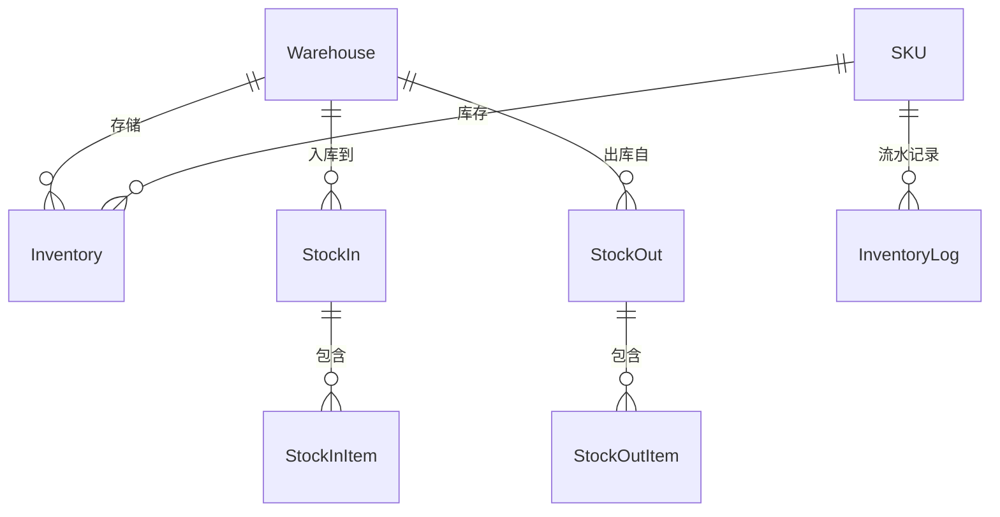
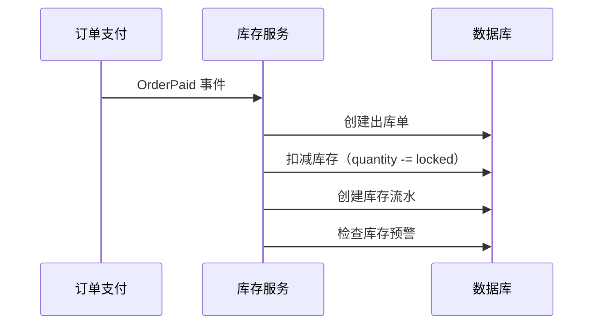

# 📦 DRP 进销存管理模块

> **模块主线** | **L2: 子系统层级** | **RAG 友好格式**

---

## 📋 元数据

```yaml
module_id: "drp"
module_name: "DRP进销存管理模块"
version: "1.0"
domain: "supply_chain"
priority: "P1"
dependencies: ["ecommerce", "rbac"]
dependents: ["finance"]
```

---

## 🎯 模块职责

### 核心功能
1. **仓库管理**: 仓库CRUD、类型管理
2. **库存管理**: 库存查询、预警、并发控制
3. **入库管理**: 采购入库、退货入库、调拨入库
4. **出库管理**: 订单出库、调拨出库、报废出库
5. **库存流水**: 变动记录、追溯查询

### 边界定义
- **负责**: 库存管理、出入库流程、库存并发控制
- **不负责**: 订单创建（→ 电商）、财务核算（→ 财务）

---

## 📊 领域模型概览



### 核心实体清单

| 实体 | 说明 | 关联 |
|------|------|------|
| `Warehouse` | 仓库 | - |
| `Inventory` | 库存 | belongsTo: SKU, Warehouse |
| `StockIn` | 入库单 | belongsTo: Warehouse |
| `StockInItem` | 入库明细 | belongsTo: StockIn, SKU |
| `StockOut` | 出库单 | belongsTo: Warehouse |
| `StockOutItem` | 出库明细 | belongsTo: StockOut, SKU |
| `InventoryLog` | 库存流水 | belongsTo: SKU, Warehouse |

---

## 🔄 核心业务流程

### 订单出库流程



### 库存并发控制

```yaml
constraint: "库存并发控制"
rules:
  - "下单锁定: locked_quantity += order_quantity"
  - "发货扣减: quantity -= order_quantity, locked_quantity -= order_quantity"
  - "取消释放: locked_quantity -= order_quantity"
  - "使用乐观锁或悲观锁防止超卖"
```

---

## 📦 需求碎片索引

### 领域模型
- [Warehouse 模型](models/domain-models.md#warehouse)
- [Inventory 模型](models/domain-models.md#inventory)
- [StockIn/StockOut 模型](models/domain-models.md#stockin-stockout)

### API 接口
- [仓库管理接口](apis/api-contracts.md#仓库接口)
- [库存查询接口](apis/api-contracts.md#库存接口)
- [出入库接口](apis/api-contracts.md#出入库接口)

### 领域约束
- [库存并发控制](models/domain-models.md#库存并发控制)

---

## ✅ 验收标准

### 功能验收
- [ ] 管理员可以管理仓库
- [ ] 管理员可以查看库存列表
- [ ] 管理员可以创建入库单
- [ ] 管理员可以创建出库单
- [ ] 系统自动记录库存流水
- [ ] 库存低于预警值时触发通知

### 并发安全验收
- [ ] 库存扣减无超卖
- [ ] 库存流水准确可追溯
- [ ] 并发操作无数据不一致

---

**版本**: v1.0 | **更新日期**: 2026-04-24
