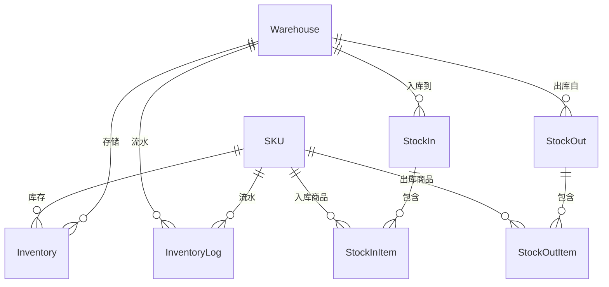

# 🗄️ DRP 进销存管理模块 - 领域模型

> **L4: 需求碎片层级** | **RAG 友好格式** | **可直接组装到提示词**

---

## 📋 元数据

```yaml
module: "drp"
document_type: "domain_models"
version: "1.0"
entities_count: 7
```

---

## 🏭 Warehouse (仓库)

### 模型定义

```yaml
entity: Warehouse
table: warehouses
description: "仓库信息"
aggregate_root: true
soft_deletes: false

fields:
  - name: id
    type: int
    db_type: bigint
    primary: true
    comment: "主键ID"

  - name: name
    type: string
    db_type: varchar(100)
    nullable: false
    comment: "仓库名称"

  - name: code
    type: string
    db_type: varchar(50)
    unique: true
    nullable: false
    comment: "仓库编码"

  - name: type
    type: string
    db_type: enum
    values: [central, regional, store]
    default: central
    comment: "仓库类型：中央仓/区域仓/门店仓"

  - name: address
    type: string
    db_type: varchar(255)
    nullable: true
    comment: "仓库地址"

  - name: contact
    type: string
    db_type: varchar(100)
    nullable: true
    comment: "联系人"

  - name: phone
    type: string
    db_type: varchar(20)
    nullable: true
    comment: "联系电话"

  - name: is_default
    type: bool
    db_type: boolean
    default: false
    comment: "是否默认仓库"

  - name: status
    type: string
    db_type: enum
    values: [active, inactive]
    default: active
    comment: "状态"

  - name: created_at
    type: Carbon
    db_type: timestamp
    comment: "创建时间"

  - name: updated_at
    type: Carbon
    db_type: timestamp
    comment: "更新时间"

indexes:
  - name: idx_warehouses_code
    fields: [code]
    type: btree
    unique: true

relations:
  - type: hasMany
    model: Inventory
    foreign_key: warehouse_id

business_rules:
  - "仓库编码必须唯一"
  - "只能有一个默认仓库"

prompt_fragment: |
  # Warehouse 模型生成任务
  @ProductArchitect @DBAExpert
  
  创建仓库模型，支持多种仓库类型。
```

---

## 📦 Inventory (库存)

### 模型定义

```yaml
entity: Inventory
table: inventories
description: "商品库存（按仓库+SKU）"
aggregate_root: false
soft_deletes: false

fields:
  - name: id
    type: int
    db_type: bigint
    primary: true
    comment: "主键ID"

  - name: sku_id
    type: int
    db_type: bigint
    foreign: { table: skus, column: id, on_delete: cascade }
    nullable: false
    comment: "SKU ID"

  - name: warehouse_id
    type: int
    db_type: bigint
    foreign: { table: warehouses, column: id, on_delete: cascade }
    nullable: false
    comment: "仓库ID"

  - name: quantity
    type: int
    db_type: int
    default: 0
    comment: "实际库存数量"

  - name: locked_quantity
    type: int
    db_type: int
    default: 0
    comment: "锁定库存（已下单未发货）"

  - name: alert_stock
    type: int
    db_type: int
    default: 10
    comment: "库存预警阈值"

  - name: updated_at
    type: Carbon
    db_type: timestamp
    comment: "更新时间"

indexes:
  - name: idx_inventories_sku_warehouse
    fields: [sku_id, warehouse_id]
    type: btree
    unique: true
  - name: idx_inventories_alert
    fields: [quantity, alert_stock]
    type: btree

relations:
  - type: belongsTo
    model: SKU
    foreign_key: sku_id

  - type: belongsTo
    model: Warehouse
    foreign_key: warehouse_id

computed:
  - name: available_quantity
    expression: "quantity - locked_quantity"
    comment: "可用库存"

constraints:
  - "CHECK (quantity >= 0)"
  - "CHECK (locked_quantity >= 0)"
  - "CHECK (locked_quantity <= quantity)"

business_rules:
  - "available_quantity = quantity - locked_quantity"
  - "库存低于 alert_stock 时触发预警"
  - "使用乐观锁或悲观锁防止超卖"

concurrency_control:
  description: "库存并发控制"
  rules:
    - rule: "乐观锁扣减"
      code: "Inventory::where('id', $id)->where('quantity', '>=', $quantity)->decrement('quantity', $quantity);"
    - rule: "悲观锁扣减"
      code: "$inventory = Inventory::where('id', $id)->lockForUpdate()->first();"
    - rule: "锁定库存"
      code: "$inventory->increment('locked_quantity', $quantity);"
    - rule: "释放锁定"
      code: "$inventory->decrement('locked_quantity', $quantity);"

prompt_fragment: |
  # Inventory 模型生成任务
  @ProductArchitect @TradeEngineer
  
  创建库存模型，包含并发控制字段和约束。
```

---

## 📥 StockIn (入库单)

### 模型定义

```yaml
entity: StockIn
table: stock_ins
description: "入库单"
aggregate_root: true
soft_deletes: false

fields:
  - name: id
    type: int
    db_type: bigint
    primary: true
    comment: "主键ID"

  - name: stock_in_no
    type: string
    db_type: varchar(64)
    unique: true
    nullable: false
    comment: "入库单号"

  - name: warehouse_id
    type: int
    db_type: bigint
    foreign: { table: warehouses, column: id, on_delete: restrict }
    nullable: false
    comment: "目标仓库"

  - name: type
    type: string
    db_type: enum
    values: [purchase, return, transfer, adjust, other]
    nullable: false
    comment: "入库类型"

  - name: source_id
    type: int
    db_type: bigint
    nullable: true
    comment: "来源单号ID"

  - name: status
    type: string
    db_type: enum
    values: [draft, pending, completed, cancelled]
    default: draft
    comment: "状态"

  - name: total_quantity
    type: int
    db_type: int
    default: 0
    comment: "总数量"

  - name: total_amount
    type: float
    db_type: decimal(12,2)
    default: 0
    comment: "总金额"

  - name: remark
    type: string
    db_type: varchar(500)
    nullable: true
    comment: "备注"

  - name: operator_id
    type: int
    db_type: bigint
    foreign: { table: users, column: id, on_delete: restrict }
    nullable: false
    comment: "操作人"

  - name: confirmed_at
    type: Carbon
    db_type: timestamp
    nullable: true
    comment: "确认入库时间"

  - name: created_at
    type: Carbon
    db_type: timestamp
    comment: "创建时间"

  - name: updated_at
    type: Carbon
    db_type: timestamp
    comment: "更新时间"

indexes:
  - name: idx_stock_ins_no
    fields: [stock_in_no]
    type: btree
    unique: true
  - name: idx_stock_ins_warehouse_status
    fields: [warehouse_id, status]
    type: btree

relations:
  - type: belongsTo
    model: Warehouse
    foreign_key: warehouse_id

  - type: hasMany
    model: StockInItem
    foreign_key: stock_in_id

business_rules:
  - "入库单号必须唯一"
  - "确认入库后增加库存数量"

prompt_fragment: |
  # StockIn 模型生成任务
  @ProductArchitect
  
  创建入库单模型，支持多种入库类型。
```

---

## 📥 StockInItem (入库明细)

### 模型定义

```yaml
entity: StockInItem
table: stock_in_items
description: "入库单明细"
aggregate_root: false
soft_deletes: false

fields:
  - name: id
    type: int
    db_type: bigint
    primary: true
    comment: "主键ID"

  - name: stock_in_id
    type: int
    db_type: bigint
    foreign: { table: stock_ins, column: id, on_delete: cascade }
    nullable: false
    comment: "入库单ID"

  - name: sku_id
    type: int
    db_type: bigint
    foreign: { table: skus, column: id, on_delete: restrict }
    nullable: false
    comment: "SKU ID"

  - name: quantity
    type: int
    db_type: int
    nullable: false
    comment: "入库数量"

  - name: cost_price
    type: float
    db_type: decimal(10,2)
    nullable: false
    comment: "成本价"

  - name: created_at
    type: Carbon
    db_type: timestamp
    comment: "创建时间"

indexes:
  - name: idx_stock_in_items_stock_in
    fields: [stock_in_id]
    type: btree

relations:
  - type: belongsTo
    model: StockIn
    foreign_key: stock_in_id

  - type: belongsTo
    model: SKU
    foreign_key: sku_id

business_rules:
  - "入库数量必须大于0"
  - "成本价必须大于等于0"

prompt_fragment: |
  # StockInItem 模型生成任务
  @ProductArchitect
```

---

## 📤 StockOut (出库单)

### 模型定义

```yaml
entity: StockOut
table: stock_outs
description: "出库单"
aggregate_root: true
soft_deletes: false

fields:
  - name: id
    type: int
    db_type: bigint
    primary: true
    comment: "主键ID"

  - name: stock_out_no
    type: string
    db_type: varchar(64)
    unique: true
    nullable: false
    comment: "出库单号"

  - name: warehouse_id
    type: int
    db_type: bigint
    foreign: { table: warehouses, column: id, on_delete: restrict }
    nullable: false
    comment: "来源仓库"

  - name: type
    type: string
    db_type: enum
    values: [order, transfer, scrap, other]
    nullable: false
    comment: "出库类型"

  - name: source_id
    type: int
    db_type: bigint
    nullable: true
    comment: "来源单号ID（如订单ID）"

  - name: status
    type: string
    db_type: enum
    values: [draft, pending, shipped, completed, cancelled]
    default: draft
    comment: "状态"

  - name: total_quantity
    type: int
    db_type: int
    default: 0
    comment: "总数量"

  - name: remark
    type: string
    db_type: varchar(500)
    nullable: true
    comment: "备注"

  - name: operator_id
    type: int
    db_type: bigint
    foreign: { table: users, column: id, on_delete: restrict }
    nullable: false
    comment: "操作人"

  - name: shipped_at
    type: Carbon
    db_type: timestamp
    nullable: true
    comment: "出库时间"

  - name: created_at
    type: Carbon
    db_type: timestamp
    comment: "创建时间"

  - name: updated_at
    type: Carbon
    db_type: timestamp
    comment: "更新时间"

indexes:
  - name: idx_stock_outs_no
    fields: [stock_out_no]
    type: btree
    unique: true
  - name: idx_stock_outs_warehouse_status
    fields: [warehouse_id, status]
    type: btree
  - name: idx_stock_outs_source
    fields: [type, source_id]
    type: btree

relations:
  - type: belongsTo
    model: Warehouse
    foreign_key: warehouse_id

  - type: hasMany
    model: StockOutItem
    foreign_key: stock_out_id

business_rules:
  - "出库单号必须唯一"
  - "出库后扣减库存"

prompt_fragment: |
  # StockOut 模型生成任务
  @ProductArchitect @TradeEngineer
  
  创建出库单模型，支持订单出库、调拨出库等类型。
```

---

## 📤 StockOutItem (出库明细)

### 模型定义

```yaml
entity: StockOutItem
table: stock_out_items
description: "出库单明细"
aggregate_root: false
soft_deletes: false

fields:
  - name: id
    type: int
    db_type: bigint
    primary: true
    comment: "主键ID"

  - name: stock_out_id
    type: int
    db_type: bigint
    foreign: { table: stock_outs, column: id, on_delete: cascade }
    nullable: false
    comment: "出库单ID"

  - name: sku_id
    type: int
    db_type: bigint
    foreign: { table: skus, column: id, on_delete: restrict }
    nullable: false
    comment: "SKU ID"

  - name: quantity
    type: int
    db_type: int
    nullable: false
    comment: "出库数量"

  - name: created_at
    type: Carbon
    db_type: timestamp
    comment: "创建时间"

indexes:
  - name: idx_stock_out_items_stock_out
    fields: [stock_out_id]
    type: btree

relations:
  - type: belongsTo
    model: StockOut
    foreign_key: stock_out_id

  - type: belongsTo
    model: SKU
    foreign_key: sku_id

prompt_fragment: |
  # StockOutItem 模型生成任务
  @ProductArchitect
```

---

## 📋 InventoryLog (库存流水)

### 模型定义

```yaml
entity: InventoryLog
table: inventory_logs
description: "库存变动流水记录"
aggregate_root: false
soft_deletes: false

fields:
  - name: id
    type: int
    db_type: bigint
    primary: true
    comment: "主键ID"

  - name: sku_id
    type: int
    db_type: bigint
    foreign: { table: skus, column: id, on_delete: cascade }
    nullable: false
    comment: "SKU ID"

  - name: warehouse_id
    type: int
    db_type: bigint
    foreign: { table: warehouses, column: id, on_delete: cascade }
    nullable: false
    comment: "仓库ID"

  - name: type
    type: string
    db_type: enum
    values: [stock_in, stock_out, lock, unlock, adjust]
    nullable: false
    comment: "变动类型"

  - name: quantity_before
    type: int
    db_type: int
    nullable: false
    comment: "变动前数量"

  - name: quantity_change
    type: int
    db_type: int
    nullable: false
    comment: "变动数量（正数增加，负数减少）"

  - name: quantity_after
    type: int
    db_type: int
    nullable: false
    comment: "变动后数量"

  - name: source_type
    type: string
    db_type: varchar(50)
    nullable: false
    comment: "来源类型（如 stock_in, stock_out, order）"

  - name: source_id
    type: int
    db_type: bigint
    nullable: false
    comment: "来源ID"

  - name: operator_id
    type: int
    db_type: bigint
    foreign: { table: users, column: id, on_delete: set_null }
    nullable: true
    comment: "操作人"

  - name: remark
    type: string
    db_type: varchar(500)
    nullable: true
    comment: "备注"

  - name: created_at
    type: Carbon
    db_type: timestamp
    comment: "创建时间"

indexes:
  - name: idx_inventory_logs_sku_warehouse
    fields: [sku_id, warehouse_id]
    type: btree
  - name: idx_inventory_logs_source
    fields: [source_type, source_id]
    type: btree
  - name: idx_inventory_logs_created
    fields: [created_at]
    type: btree

relations:
  - type: belongsTo
    model: SKU
    foreign_key: sku_id

  - type: belongsTo
    model: Warehouse
    foreign_key: warehouse_id

business_rules:
  - "流水记录只增不改，不可删除"
  - "quantity_after = quantity_before + quantity_change"

prompt_fragment: |
  # InventoryLog 模型生成任务
  @ProductArchitect @DBAExpert
  
  创建库存流水模型，用于追溯库存变动历史。
```

---

## 🔗 关系图



---

**版本**: v1.0 | **更新日期**: 2026-04-24
