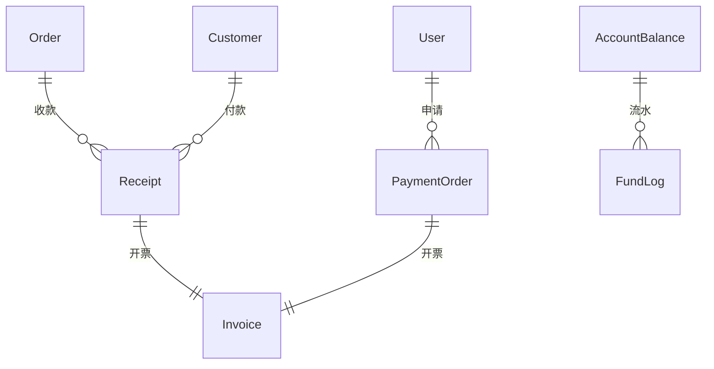
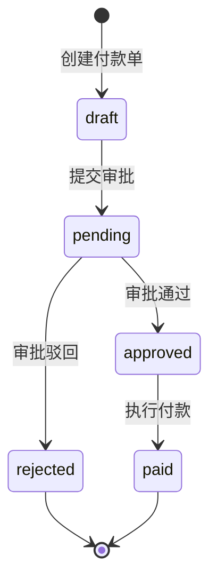
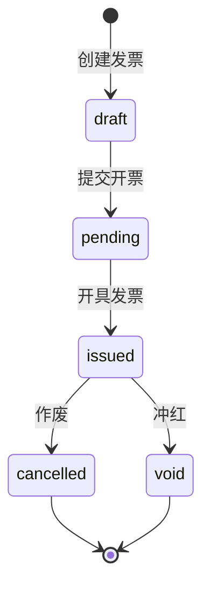

# 💵 财务收付款与发票模块

> **模块主线** | **L2: 子系统层级** | **RAG 友好格式**

---

## 📋 元数据

```yaml
module_id: "finance"
module_name: "财务收付款与发票模块"
version: "1.0"
domain: "finance"
priority: "P1"
dependencies: ["ecommerce", "distribution", "drp", "rbac"]
dependents: []
```

---

## 🎯 模块职责

### 核心功能
1. **收款管理**: 订单收款确认、手动收款
2. **付款管理**: 付款申请、审批流程、执行付款
3. **发票管理**: 开票申请、发票开具、冲红作废
4. **账户管理**: 多账户余额、资金流水
5. **财务报表**: 收入/支出/利润报表

### 边界定义
- **负责**: 收付款流程、发票管理、账户流水
- **不负责**: 订单创建（→ 电商）、佣金计算（→ 分销）

---

## 📊 领域模型概览



### 核心实体清单

| 实体 | 说明 | 关联 |
|------|------|------|
| `Receipt` | 收款单 | belongsTo: Customer, Order |
| `PaymentOrder` | 付款单 | belongsTo: User |
| `Invoice` | 发票 | belongsTo: Customer/Supplier |
| `AccountBalance` | 账户余额 | - |
| `FundLog` | 资金流水 | belongsTo: AccountBalance |

---

## 🔄 核心业务流程

### 付款审批流程



### 发票流程



---

## 📦 需求碎片索引

### 领域模型
- [Receipt 模型](models/domain-models.md#receipt)
- [PaymentOrder 模型](models/domain-models.md#paymentorder)
- [Invoice 模型](models/domain-models.md#invoice)
- [AccountBalance 模型](models/domain-models.md#accountbalance)

### API 接口
- [收款接口](apis/api-contracts.md#收款接口)
- [付款接口](apis/api-contracts.md#付款接口)
- [发票接口](apis/api-contracts.md#发票接口)
- [报表接口](apis/api-contracts.md#报表接口)

### 状态机
- [付款单状态机](states/state-machines.md#paymentorder-state-machine)
- [发票状态机](states/state-machines.md#invoice-state-machine)

---

## ✅ 验收标准

### 功能验收
- [ ] 财务可以确认收款
- [ ] 用户可以创建付款申请
- [ ] 管理员可以审批付款
- [ ] 财务可以执行付款
- [ ] 财务可以开具发票
- [ ] 财务可以冲红/作废发票
- [ ] 可以查看账户余额和流水
- [ ] 可以生成财务报表

### 安全验收
- [ ] 付款操作需要审批权限
- [ ] 资金操作使用事务保护
- [ ] 资金流水不可修改

---

**版本**: v1.0 | **更新日期**: 2026-04-24
