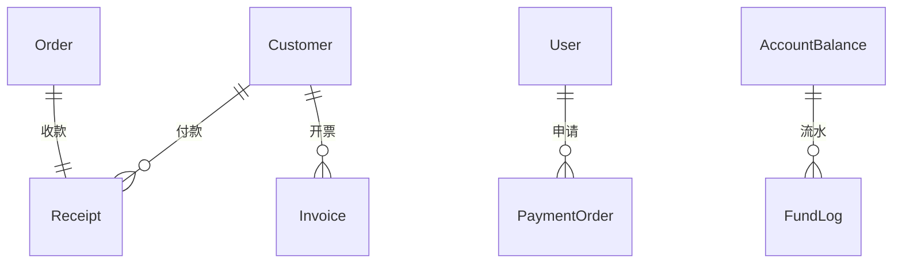

# 🗄️ 财务收付款与发票模块 - 领域模型

> **L4: 需求碎片层级** | **RAG 友好格式** | **可直接组装到提示词**

---

## 📋 元数据

```yaml
module: "finance"
document_type: "domain_models"
version: "1.0"
entities_count: 5
```

---

## 💰 Receipt (收款单)

### 模型定义

```yaml
entity: Receipt
table: receipts
description: "收款单"
aggregate_root: true
soft_deletes: false

fields:
  - name: id
    type: int
    db_type: bigint
    primary: true
    comment: "主键ID"

  - name: receipt_no
    type: string
    db_type: varchar(64)
    unique: true
    nullable: false
    comment: "收款单号"

  - name: customer_id
    type: int
    db_type: bigint
    foreign: { table: customers, column: id, on_delete: set_null }
    nullable: true
    comment: "客户ID"

  - name: order_id
    type: int
    db_type: bigint
    foreign: { table: orders, column: id, on_delete: set_null }
    nullable: true
    comment: "关联订单ID"

  - name: amount
    type: float
    db_type: decimal(10,2)
    nullable: false
    comment: "收款金额"

  - name: payment_method
    type: string
    db_type: enum
    values: [wechat, alipay, bank, cash, other]
    nullable: false
    comment: "收款方式"

  - name: status
    type: string
    db_type: enum
    values: [pending, confirmed, cancelled]
    default: pending
    comment: "状态"

  - name: payer_name
    type: string
    db_type: varchar(100)
    nullable: true
    comment: "付款人"

  - name: remark
    type: string
    db_type: varchar(500)
    nullable: true
    comment: "备注"

  - name: confirmed_by
    type: int
    db_type: bigint
    nullable: true
    comment: "确认人ID"

  - name: confirmed_at
    type: Carbon
    db_type: timestamp
    nullable: true
    comment: "确认时间"

  - name: created_at
    type: Carbon
    db_type: timestamp
    comment: "创建时间"

  - name: updated_at
    type: Carbon
    db_type: timestamp
    comment: "更新时间"

indexes:
  - name: idx_receipts_no
    fields: [receipt_no]
    type: btree
    unique: true
  - name: idx_receipts_order
    fields: [order_id]
    type: btree
  - name: idx_receipts_status
    fields: [status]
    type: btree

relations:
  - type: belongsTo
    model: Customer
    foreign_key: customer_id

  - type: belongsTo
    model: Order
    foreign_key: order_id

business_rules:
  - "收款单号必须唯一"
  - "确认收款后增加账户余额"

prompt_fragment: |
  # Receipt 模型生成任务
  @AssetManager
  
  创建收款单模型，支持多种收款方式。
```

---

## 💸 PaymentOrder (付款单)

### 模型定义

```yaml
entity: PaymentOrder
table: payment_orders
description: "付款单（含审批流程）"
aggregate_root: true
soft_deletes: false

fields:
  - name: id
    type: int
    db_type: bigint
    primary: true
    comment: "主键ID"

  - name: payment_no
    type: string
    db_type: varchar(64)
    unique: true
    nullable: false
    comment: "付款单号"

  - name: supplier_id
    type: int
    db_type: bigint
    nullable: true
    comment: "供应商ID"

  - name: type
    type: string
    db_type: enum
    values: [purchase, expense, refund, commission, salary, other]
    nullable: false
    comment: "付款类型"

  - name: amount
    type: float
    db_type: decimal(10,2)
    nullable: false
    comment: "付款金额"

  - name: payment_method
    type: string
    db_type: enum
    values: [bank, wechat, alipay, cash, other]
    nullable: false
    comment: "付款方式"

  - name: status
    type: string
    db_type: enum
    values: [draft, pending, approved, paid, rejected]
    default: draft
    index: true
    comment: "状态"

  - name: payee_name
    type: string
    db_type: varchar(100)
    nullable: false
    comment: "收款人"

  - name: bank_info
    type: array
    db_type: json
    nullable: true
    comment: "银行信息 {bank_name, account_no, branch}"

  - name: remark
    type: string
    db_type: varchar(500)
    nullable: true
    comment: "备注"

  - name: applicant_id
    type: int
    db_type: bigint
    foreign: { table: users, column: id, on_delete: restrict }
    nullable: false
    comment: "申请人ID"

  - name: approver_id
    type: int
    db_type: bigint
    nullable: true
    comment: "审批人ID"

  - name: approved_at
    type: Carbon
    db_type: timestamp
    nullable: true
    comment: "审批时间"

  - name: reject_reason
    type: string
    db_type: varchar(500)
    nullable: true
    comment: "驳回原因"

  - name: paid_at
    type: Carbon
    db_type: timestamp
    nullable: true
    comment: "付款时间"

  - name: paid_by
    type: int
    db_type: bigint
    nullable: true
    comment: "付款人ID"

  - name: created_at
    type: Carbon
    db_type: timestamp
    comment: "创建时间"

  - name: updated_at
    type: Carbon
    db_type: timestamp
    comment: "更新时间"

indexes:
  - name: idx_payment_orders_no
    fields: [payment_no]
    type: btree
    unique: true
  - name: idx_payment_orders_status
    fields: [status]
    type: btree

relations:
  - type: belongsTo
    model: User
    foreign_key: applicant_id

constraints:
  - "CHECK (amount > 0)"

business_rules:
  - "付款单号必须唯一"
  - "只有 approved 状态可执行付款"
  - "付款后扣减账户余额"

prompt_fragment: |
  # PaymentOrder 模型生成任务
  @AssetManager
  
  创建付款单模型，包含完整的审批流程。
```

---

## 🧾 Invoice (发票)

### 模型定义

```yaml
entity: Invoice
table: invoices
description: "发票"
aggregate_root: true
soft_deletes: false

fields:
  - name: id
    type: int
    db_type: bigint
    primary: true
    comment: "主键ID"

  - name: invoice_no
    type: string
    db_type: varchar(64)
    unique: true
    nullable: false
    comment: "发票号"

  - name: type
    type: string
    db_type: enum
    values: [special, normal, electronic]
    nullable: false
    comment: "发票类型：专票/普票/电子"

  - name: direction
    type: string
    db_type: enum
    values: [sales, purchase]
    nullable: false
    comment: "开票方向：销项/进项"

  - name: customer_id
    type: int
    db_type: bigint
    foreign: { table: customers, column: id, on_delete: set_null }
    nullable: true
    comment: "客户ID（销项）"

  - name: order_id
    type: int
    db_type: bigint
    nullable: true
    comment: "关联订单ID"

  - name: title
    type: string
    db_type: varchar(255)
    nullable: false
    comment: "发票抬头"

  - name: tax_no
    type: string
    db_type: varchar(50)
    nullable: false
    comment: "税号"

  - name: address
    type: string
    db_type: varchar(255)
    nullable: true
    comment: "地址"

  - name: bank
    type: string
    db_type: varchar(100)
    nullable: true
    comment: "开户银行"

  - name: bank_account
    type: string
    db_type: varchar(50)
    nullable: true
    comment: "银行账号"

  - name: amount
    type: float
    db_type: decimal(10,2)
    nullable: false
    comment: "金额（不含税）"

  - name: tax_rate
    type: float
    db_type: decimal(5,4)
    nullable: false
    comment: "税率（如0.13表示13%）"

  - name: tax_amount
    type: float
    db_type: decimal(10,2)
    nullable: false
    comment: "税额"

  - name: total_amount
    type: float
    db_type: decimal(10,2)
    nullable: false
    comment: "价税合计"

  - name: items
    type: array
    db_type: json
    nullable: false
    comment: "发票明细 [{name, quantity, unit_price, amount}]"

  - name: status
    type: string
    db_type: enum
    values: [draft, pending, issued, cancelled, void]
    default: draft
    index: true
    comment: "状态"

  - name: issued_at
    type: Carbon
    db_type: timestamp
    nullable: true
    comment: "开票时间"

  - name: void_at
    type: Carbon
    db_type: timestamp
    nullable: true
    comment: "作废/冲红时间"

  - name: remark
    type: string
    db_type: varchar(500)
    nullable: true
    comment: "备注"

  - name: created_by
    type: int
    db_type: bigint
    foreign: { table: users, column: id, on_delete: restrict }
    nullable: false
    comment: "创建人"

  - name: created_at
    type: Carbon
    db_type: timestamp
    comment: "创建时间"

  - name: updated_at
    type: Carbon
    db_type: timestamp
    comment: "更新时间"

indexes:
  - name: idx_invoices_no
    fields: [invoice_no]
    type: btree
    unique: true
  - name: idx_invoices_direction_status
    fields: [direction, status]
    type: btree

constraints:
  - "CHECK (amount >= 0)"
  - "CHECK (tax_rate >= 0 AND tax_rate <= 1)"
  - "CHECK (tax_amount = amount * tax_rate)"
  - "CHECK (total_amount = amount + tax_amount)"

business_rules:
  - "发票号必须唯一"
  - "税额 = 金额 × 税率"
  - "价税合计 = 金额 + 税额"
  - "已开票发票只能作废或冲红"

prompt_fragment: |
  # Invoice 模型生成任务
  @AssetManager
  
  创建发票模型，支持专票/普票/电子发票。
```

---

## 💳 AccountBalance (账户余额)

### 模型定义

```yaml
entity: AccountBalance
table: account_balances
description: "账户余额"
aggregate_root: true
soft_deletes: false

fields:
  - name: id
    type: int
    db_type: bigint
    primary: true
    comment: "主键ID"

  - name: account_type
    type: string
    db_type: enum
    values: [wechat, alipay, bank, cash]
    nullable: false
    comment: "账户类型"

  - name: account_name
    type: string
    db_type: varchar(100)
    nullable: false
    comment: "账户名称"

  - name: account_no
    type: string
    db_type: varchar(100)
    nullable: true
    comment: "账号"

  - name: balance
    type: float
    db_type: decimal(15,2)
    default: 0
    comment: "当前余额"

  - name: currency
    type: string
    db_type: varchar(10)
    default: "CNY"
    comment: "币种"

  - name: status
    type: string
    db_type: enum
    values: [active, frozen, closed]
    default: active
    comment: "状态"

  - name: updated_at
    type: Carbon
    db_type: timestamp
    comment: "更新时间"

constraints:
  - "CHECK (balance >= 0)"

business_rules:
  - "余额不能为负数"
  - "资金操作必须使用事务保护"
  - "每次变动必须记录流水"

prompt_fragment: |
  # AccountBalance 模型生成任务
  @AssetManager
  
  创建账户余额模型，支持多账户类型。
```

---

## 📒 FundLog (资金流水)

### 模型定义

```yaml
entity: FundLog
table: fund_logs
description: "资金流水记录"
aggregate_root: false
soft_deletes: false

fields:
  - name: id
    type: int
    db_type: bigint
    primary: true
    comment: "主键ID"

  - name: account_id
    type: int
    db_type: bigint
    foreign: { table: account_balances, column: id, on_delete: cascade }
    nullable: false
    comment: "账户ID"

  - name: type
    type: string
    db_type: enum
    values: [income, expense, transfer]
    nullable: false
    comment: "流水类型"

  - name: direction
    type: string
    db_type: enum
    values: [credit, debit]
    nullable: false
    comment: "方向：收入/支出"

  - name: amount
    type: float
    db_type: decimal(10,2)
    nullable: false
    comment: "金额"

  - name: balance_before
    type: float
    db_type: decimal(15,2)
    nullable: false
    comment: "变动前余额"

  - name: balance_after
    type: float
    db_type: decimal(15,2)
    nullable: false
    comment: "变动后余额"

  - name: source_type
    type: string
    db_type: varchar(50)
    nullable: false
    comment: "来源类型（receipt/payment_order/commission）"

  - name: source_id
    type: int
    db_type: bigint
    nullable: false
    comment: "来源ID"

  - name: remark
    type: string
    db_type: varchar(500)
    nullable: true
    comment: "备注"

  - name: operator_id
    type: int
    db_type: bigint
    foreign: { table: users, column: id, on_delete: set_null }
    nullable: true
    comment: "操作人"

  - name: created_at
    type: Carbon
    db_type: timestamp
    comment: "创建时间"

indexes:
  - name: idx_fund_logs_account
    fields: [account_id, created_at]
    type: btree
  - name: idx_fund_logs_source
    fields: [source_type, source_id]
    type: btree

constraints:
  - "CHECK (balance_after >= 0)"

business_rules:
  - "流水记录只增不改，不可删除"
  - "balance_after = balance_before + amount（收入为正，支出为负）"

prompt_fragment: |
  # FundLog 模型生成任务
  @AssetManager @DBAExpert
  
  创建资金流水模型，用于追溯账户变动历史。
```

---

## 🔗 关系图



---

**版本**: v1.0 | **更新日期**: 2026-04-24
