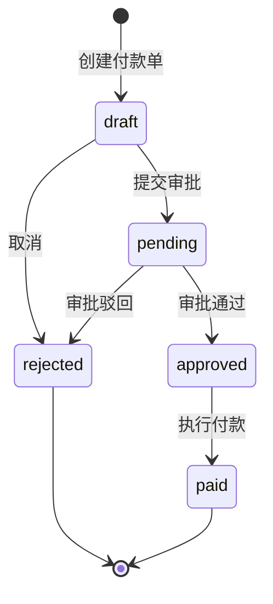
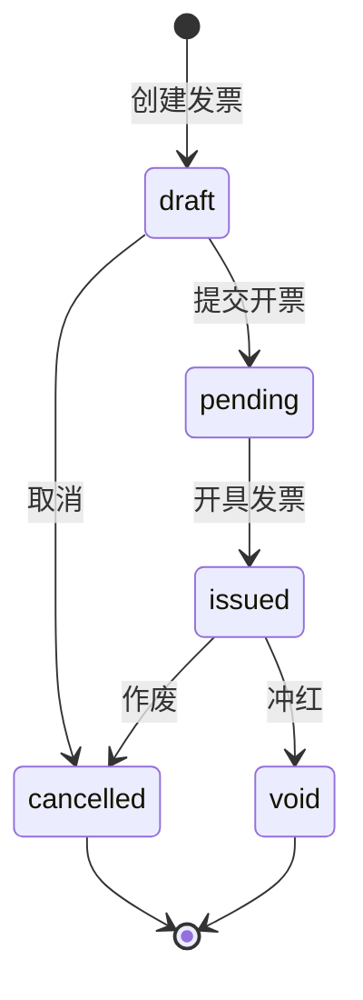

# 🔄 财务模块 - 状态机定义

> **L4: 需求碎片层级** | **RAG 友好格式** | **可直接组装到提示词**

---

## 📋 元数据

```yaml
module: "finance"
document_type: "state_machines"
version: "1.0"
entities_with_state: 2
total_states: 10
```

---

## 💸 PaymentOrder 状态机 (付款单状态机)

### 状态定义

```yaml
entity: PaymentOrder
table: payment_orders
state_field: status

states:
  - name: draft
    label: "草稿"
    color: secondary
    description: "付款单已创建，待提交"
    initial: true

  - name: pending
    label: "待审批"
    color: warning
    description: "已提交，等待审批"

  - name: approved
    label: "已审批"
    color: info
    description: "审批通过，待付款"

  - name: paid
    label: "已付款"
    color: success
    description: "已执行付款"

  - name: rejected
    label: "已驳回"
    color: danger
    description: "审批被驳回"
```

### 状态流转定义

```yaml
transitions:
  # 草稿 -> 待审批
  - from: draft
    to: pending
    event: PaymentOrderSubmitted
    description: "提交审批"
    trigger: "用户操作"
    guard:
      - "付款单状态为 draft"
      - "必填字段已填写"
    actions:
      - "触发 PaymentOrderSubmitted 事件"
    transition_class: "App\States\PaymentOrder\DraftToPending"

  # 待审批 -> 已审批
  - from: pending
    to: approved
    event: PaymentOrderApproved
    description: "审批通过"
    trigger: "管理员操作"
    guard:
      - "付款单状态为 pending"
      - "审批人有审批权限"
    actions:
      - "设置 approver_id"
      - "设置 approved_at"
      - "触发 PaymentOrderApproved 事件"
    transition_class: "App\States\PaymentOrder\PendingToApproved"

  # 待审批 -> 已驳回
  - from: pending
    to: rejected
    event: PaymentOrderRejected
    description: "审批驳回"
    trigger: "管理员操作"
    guard:
      - "付款单状态为 pending"
      - "驳回原因非空"
    actions:
      - "设置 approver_id"
      - "设置 reject_reason"
      - "触发 PaymentOrderRejected 事件"
    transition_class: "App\States\PaymentOrder\PendingToRejected"

  # 已审批 -> 已付款
  - from: approved
    to: paid
    event: PaymentOrderPaid
    description: "执行付款"
    trigger: "财务操作"
    guard:
      - "付款单状态为 approved"
      - "财务有付款权限"
    actions:
      - "设置 paid_at"
      - "设置 paid_by"
      - "扣减账户余额"
      - "创建资金流水"
      - "触发 PaymentOrderPaid 事件"
    transition_class: "App\States\PaymentOrder\ApprovedToPaid"

  # 草稿 -> 已取消
  - from: draft
    to: rejected
    event: PaymentOrderCancelled
    description: "取消付款单"
    trigger: "用户操作"
    guard:
      - "付款单状态为 draft"
    actions:
      - "触发 PaymentOrderCancelled 事件"
```

### 状态流转图



---

## 🧾 Invoice 状态机 (发票状态机)

### 状态定义

```yaml
entity: Invoice
table: invoices
state_field: status

states:
  - name: draft
    label: "草稿"
    color: secondary
    description: "发票已创建，待提交"
    initial: true

  - name: pending
    label: "待开票"
    color: warning
    description: "已提交，等待开票"

  - name: issued
    label: "已开票"
    color: success
    description: "发票已开具"

  - name: cancelled
    label: "已作废"
    color: danger
    description: "发票已作废"

  - name: void
    label: "已冲红"
    color: danger
    description: "发票已冲红"
```

### 状态流转定义

```yaml
transitions:
  # 草稿 -> 待开票
  - from: draft
    to: pending
    event: InvoiceSubmitted
    description: "提交开票申请"
    trigger: "用户操作"
    guard:
      - "发票状态为 draft"
      - "发票信息完整"
    actions:
      - "触发 InvoiceSubmitted 事件"
    transition_class: "App\States\Invoice\DraftToPending"

  # 待开票 -> 已开票
  - from: pending
    to: issued
    event: InvoiceIssued
    description: "开具发票"
    trigger: "财务操作"
    guard:
      - "发票状态为 pending"
      - "财务有开票权限"
    actions:
      - "设置 issued_at"
      - "生成发票号（如需要）"
      - "触发 InvoiceIssued 事件"
    transition_class: "App\States\Invoice\PendingToIssued"

  # 已开票 -> 已作废
  - from: issued
    to: cancelled
    event: InvoiceCancelled
    description: "作废发票"
    trigger: "财务操作"
    guard:
      - "发票状态为 issued"
      - "在作废期限内（当月）"
    actions:
      - "设置 void_at"
      - "触发 InvoiceCancelled 事件"
    transition_class: "App\States\Invoice\IssuedToCancelled"

  # 已开票 -> 已冲红
  - from: issued
    to: void
    event: InvoiceVoided
    description: "冲红发票"
    trigger: "财务操作"
    guard:
      - "发票状态为 issued"
    actions:
      - "设置 void_at"
      - "生成红字发票信息"
      - "触发 InvoiceVoided 事件"
    transition_class: "App\States\Invoice\IssuedToVoid"

  # 草稿 -> 已取消
  - from: draft
    to: cancelled
    event: InvoiceCancelled
    description: "取消发票"
    trigger: "用户操作"
    guard:
      - "发票状态为 draft"
    actions:
      - "触发 InvoiceCancelled 事件"
```

### 状态流转图



---

## 📊 状态机汇总

| 实体 | 状态数 | 转移数 | 初始状态 | 终态 |
|------|--------|--------|---------|------|
| PaymentOrder | 5 | 5 | draft | paid, rejected |
| Invoice | 5 | 5 | draft | cancelled, void |

---

**版本**: v1.0 | **更新日期**: 2026-04-24
