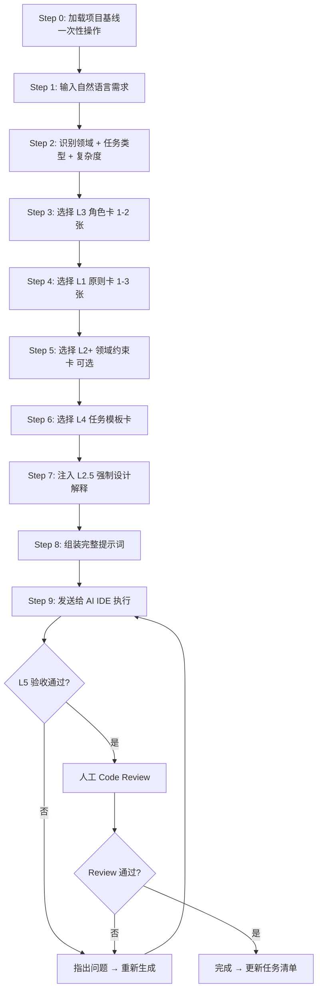
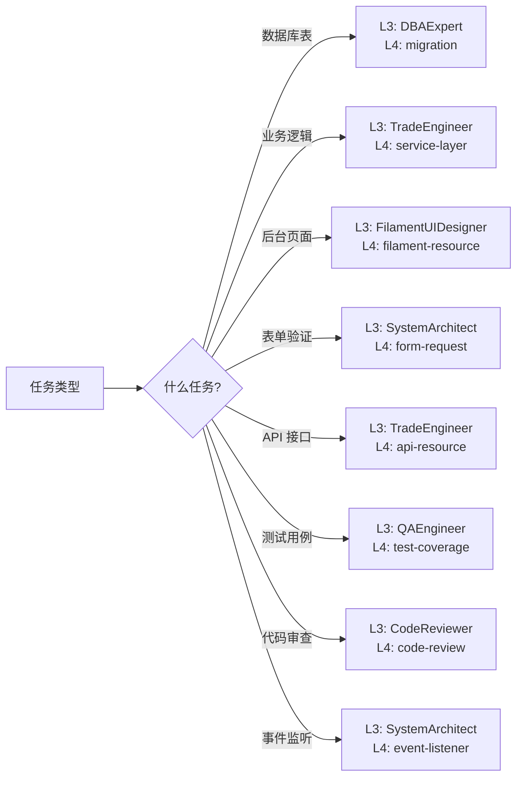
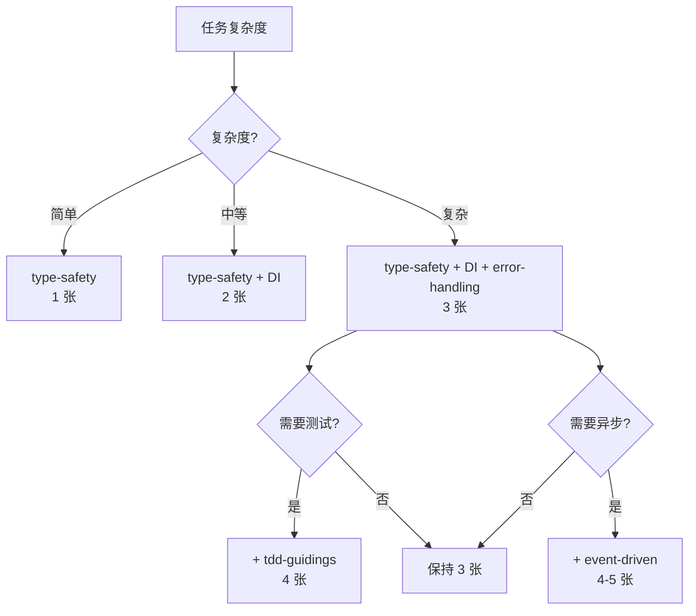
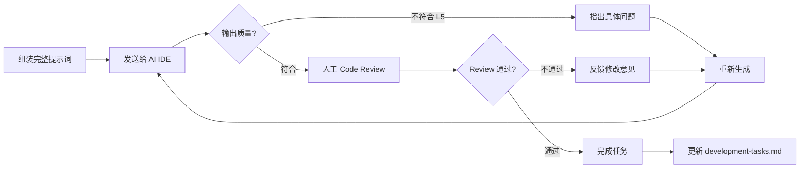

# 📚 提示词卡片流程化开发最佳实践

> **版本**: v3.0 | **最后更新**: 2026-06-07

---

## 目录

```
doc/
├── README.md                 ← 你在这里
├── prompts/
│   ├── cards/                # 提示词卡片库（58 张）
│   ├── 00-init.md            # 项目初始化指南
│   ├── 01-design.md          # 原始设计方案
│   ├── 02-design-optimized.md# P9 优化方案
│   ├── 03-evaluation-report.md # 评估报告
│   └── examples/             # 示例文件
│       ├── project-baseline.md    # 项目基线模板
│       └── assembly-examples.md   # 完整组装示例
└── development-tasks.md      # 开发任务清单（需创建）
```

---

## 快速开始

### 1 分钟上手

```
# 首次对话：加载项目基线
发送 project-baseline.md 内容到 AI IDE

# 开发任务：选择卡片
1. 看 README.md → 根据任务类型选择角色卡
2. 看 assembly-formula.md → 按 L0→L5 组装
3. 发送给 AI IDE 执行
```

### 3 分钟上手

```
# 使用母提示词自动组装
1. 发送 meta-prompt-generator.md 给 AI
2. 输入："为后台添加商品管理功能"
3. AI 自动检索卡片并组装完整提示词
4. 执行 → 审查 → 迭代
```

---

## 核心概念

### 什么是提示词卡片？

提示词卡片是**可组合的 AI 指令碎片**，每张卡片负责一个维度：

```
完整 AI 指令 = 项目上下文 + 核心原则 + 角色 + 领域约束 + 任务模板 + 验收标准
               └────── L0 ──────┘ └─ L1 ──┘ └─ L3 ─┘ └─ L2+ ─┘ └─── L4 ───┘ └─ L5 ──┘
```

每张卡片独立存在，可自由组合。

### 为什么使用卡片？

| 痛点 | 卡片化解决 |
|------|-----------|
| 每次重复说明项目上下文 | L0 一次性注入，后续复用 |
| AI 写代码不解释为什么 | L2.5 强制设计解释 |
| 风格不统一 | L1 核心原则统一约束 |
| 遗漏关键环节 | L5 验收标准强制检查 |
| 协作效率低 | 卡片可复用，新人快速上手 |

---

## 工作流概览



---

## 五层组装模型

```
完整 Prompt = L0 + L1 + L2 + L2.5(强制) + L3 + L4 + L5
```

| 层级 | 名称 | 内容 | 说明 |
|------|------|------|------|
| **L0** | 项目上下文 | 技术栈、已有模型、代码约定 | 一次性加载，后续复用 |
| **L1** | 核心原则 | 类型安全、DI、异常处理、TDD | 根据复杂度选择 |
| **L2** | 上下文规范 | Laravel 12 标准、Filament 规范 | 根据任务类型选择 |
| **L2.5** | 设计原理解释 | 强制要求 AI 先解释方案再写代码 | **始终必须** |
| **L3** | 角色注入 | 交易工程师、UI 设计师等 | 选择 1-2 个角色 |
| **L4** | 任务模板 | Migration、Service、Resource 等 | 根据输出类型选择 |
| **L5** | 验收标准 | 自动生成，按任务类型定制 | 检查清单 |

---

## 卡片索引

### L1 核心原则 (5 张)

| 卡片 | 何时使用 | 关键词 |
|------|---------|--------|
| type-safety-immutability | 所有 PHP 文件 | 类型、readonly、DTO |
| dependency-injection | Service/Repository 类 | DI、构造函数、注入 |
| error-handling | 业务逻辑校验 | 异常、错误、Exception |
| event-driven | 跨模块通信 | 事件、监听、异步 |
| tdd-guidelines | 核心业务逻辑 | TDD、测试、覆盖率 |

### L3 角色定义 (12 张)

| 角色 | 负责领域 | 关键词 |
|------|---------|--------|
| system-architect | 架构设计、DDD | 架构、模块划分、DDD |
| product-architect | 商品 SPU/SKU | 商品、SKU、库存 |
| trade-engineer | 订单、支付 | 订单、支付、状态机 |
| asset-manager | 余额、佣金 | 余额、佣金、提现 |
| filament-ui-designer | 后台管理 | Filament、CRUD、表格 |
| dba-expert | 数据库设计 | 迁移、索引、性能 |
| qa-engineer | 测试 | 测试、用例、覆盖率 |
| devops-engineer | 部署运维 | Docker、CI/CD、监控 |
| security-expert | 安全认证 | 权限、认证、安全 |
| frontend-developer | Livewire/Inertia | Livewire、Inertia、Tailwind |
| code-reviewer | 代码审查 | 审查、Review、质量 |
| tech-interviewer | 设计解释 | L2.5、方案、为什么 |

### L2+ 领域约束 (4 张)

| 约束 | 适用场景 |
|------|---------|
| constraint-distribution-commission | 多级分销、佣金计算 |
| constraint-o2o-timeslot-locking | O2O 预约、时间片 |
| constraint-inventory-concurrency | 秒杀、抢购、高并发 |
| constraint-rbac-hierarchy | 角色权限、多级管理 |

### L4 任务模板 (15 张)

| 模板 | 输出内容 |
|------|---------|
| template-migration-generation | 数据库迁移文件 |
| template-service-layer | 业务服务类 |
| template-dto-conversion | DTO 数据传输对象 |
| template-filament-resource | Filament 后台页面 |
| template-form-request | 表单验证类 |
| template-api-resource | API 响应格式化 |
| template-event-listener | 事件监听器 |
| template-test-coverage | 测试用例 |
| template-technical-interview | 技术方案面试引导 |
| template-code-review | 代码审查报告 |
| template-requirement-analysis | 需求分析报告 |
| template-test-design | 测试设计文档 |
| template-architecture-design | 架构设计文档 |
| template-database-design | 数据库设计文档 |
| template-php-development | PHP 开发规范讲解 |

---

## 组装选择指南

### 按任务类型选择



### 按复杂度选择原则



---

## 实际案例

### 案例 1: 创建商品管理后台

**输入**：为后台添加商品管理功能

```
L1: type-safety + DI + error-handling
L2: laravel-12-standards + filament-best-practices
L3: ProductArchitect + FilamentUIDesigner
L4: template-migration + template-service-layer + template-filament-resource
L2.5: tech-interviewer
```

### 案例 2: 实现分销佣金计算

**输入**：实现三级分销佣金自动计算

```
L1: type-safety + DI + error-handling
L2: laravel-12-standards
L3: AssetManager + TradeEngineer
L2+: constraint-distribution-commission
L4: template-service-layer + template-event-listener
L2.5: tech-interviewer
```

### 案例 3: 添加支付回调处理

**输入**：实现微信支付回调处理

```
L1: type-safety + DI + error-handling + tdd
L2: laravel-12-standards
L3: TradeEngineer + SecurityExpert
L4: template-service-layer + template-event-listener + template-test-coverage
L2.5: tech-interviewer
```

---

## 执行流程详解

### Step 0: 加载项目基线（一次性）

在项目首次对话时，发送项目基线信息：

```markdown
# 项目基线
## 技术栈
- Laravel 12.x + Filament 3.x + PHP 8.4+
- MySQL 8.0 + Redis + Horizon
- 认证: 多守卫 (customer/admin) + Sanctum
- 权限: spatie/laravel-permission
- 代码规范: Pint + PHPStan Level 5 + Pest

## 代码约定
- 命名空间: App\Domains\<Domain>\
- DTO: App\DTOs\<Domain>\
- 事件: App\Events\<Domain>\
- 监听器: App\Listeners\<Domain>\
- Filament: app/Filament/Resources/<Domain>/

## 已有模型
- Customer (app/Models)
- Admin (app/Models)

## 已有模块
- 用户认证 (注册/登录/多守卫)
```

**持久化方案**：
- Cursor: 写入 `.cursorrules`
- Trae: 写入 `.traerm`
- Lingma: 写入项目级规则配置

### Step 1-7: 卡片组装

参考 `cards/08-assembly/assembly-formula.md` 中的组装公式。

### Step 8-9: 执行与审查



---

## 提高效率的技巧

### 技巧 1: 基线持久化

```
# .cursorrules (Cursor 示例)
# 项目编码规则 - 自动加载

## 项目基线
- Laravel 12 + Filament 3.x + PHP 8.4
- 命名空间: App\Domains\<Domain>\
- DTO: App\DTOs\<Domain>\
- 代码规范: strict_types + 返回类型声明 + DI

## 强制规则
1. 所有 PHP 文件首行 declare(strict_types=1)
2. 所有方法必须声明返回类型
3. DTO 使用 readonly class
4. Service 使用构造函数注入
5. 金额使用 DECIMAL(12,4)
6. Filament 表格必须使用 withCount 避免 N+1
7. 测试必须使用 Pest
8. 所有业务逻辑先解释方案再写代码
```

### 技巧 2: 分步骤生成

新建模块分 4 步走，每步提示词简短、质量高：

```
第 1 步: Migration → 数据库表结构设计
第 2 步: Model + Service → 业务逻辑
第 3 步: Filament Resource → 后台界面
第 4 步: Test → 测试用例
```

### 技巧 3: 迭代提示词精简

修改已有功能时，用更短的提示词：

```markdown
# 精简迭代指令
在刚才的 ProductResource 基础上：
1. 添加状态筛选下拉框
2. 添加批量删除操作
3. 商品名称列添加搜索
4. 金额列使用货币格式化

仅修改涉及的配置，其他保持不变。
```

### 技巧 4: 维护任务清单

创建 `doc/development-tasks.md` 跟踪开发进度：

```markdown
# 开发任务清单

## 电商域 (Commerce)
- [x] products 表 Migration
- [x] categories 表 Migration
- [x] Product Model
- [ ] Product Filament Resource
- [ ] SKU 规格管理
- [ ] 库存扣减 Service
- [ ] 下单 Service

## 分销域 (Distribution)
- [ ] 分销商模型
- [ ] 佣金计算 Service
```

### 技巧 5: 批量 vs 单次

| 场景 | 策略 |
|------|------|
| 新建模块（5+ 文件） | 分 4 步走：Migration → Model → Service → Resource |
| 修改单个文件 | 单次完整组装 |
| 代码审查 | 一次性审查整个模块 |
| 添加字段 | 只组装 Migration + Model + Resource 对应卡片 |

---

## 常见问题

### Q: 每次都要重新加载基线吗？

**A**: 不需要。持久化到 `.cursorrules` 后，每次对话自动加载。首次加载一次即可。

### Q: L2.5 设计解释可以跳过吗？

**A**: **不建议跳过**。这是 v3.0 最关键的改进。跳过 L2.5 会导致：
- AI 直接写代码，不解释为什么
- 设计决策没有经过思考
- 返工率增加 30-50%

### Q: 12 张角色卡都要用吗？

**A**: 每个任务只用 1-2 张。选择指南见 `cards/README.md`。

### Q: 领域约束卡什么时候用？

**A**: 当任务涉及对应的业务领域时使用。例如：
- 涉及分销 → `constraint-distribution-commission`
- 涉及预约 → `constraint-o2o-timeslot-locking`

### Q: 如何评估卡片质量？

**A**: 看 L5 验收标准是否覆盖了关键质量维度：
- 类型声明完整性
- 设计解释充分性
- 异常处理
- 并发安全
- 测试覆盖

---

## 版本历史

| 版本 | 日期 | 变更 |
|------|------|------|
| v3.0 | 2026-06-07 | 引入 L2.5 强制设计解释，统一格式，扩充到 58 张 |
| v2.0 | 2026-04-24 | 基于 MiMo 评估报告优化，新增多张卡片 |
| v1.0 | 2026-03-01 | 初始版本 |

---

**版本**: v3.0 | **最后更新**: 2026-06-07
