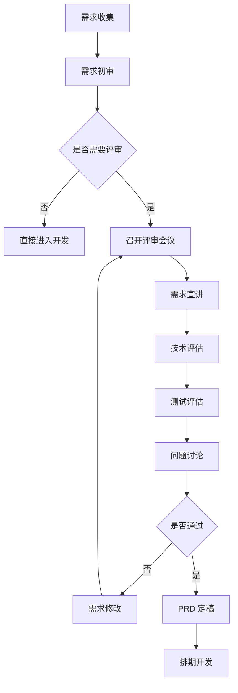

# 📋 需求评审规范

> **产品阶段** | **确保需求质量** | **减少返工**

---

## 📋 概述

**目标：** 确保需求清晰、完整、可执行

**参与角色：**
- 产品经理（需求提出者）
- 架构师（技术可行性评估）
- 开发者（实现复杂度评估）
- 测试工程师（可测试性评估）

---

## 🎯 评审流程



---

## 📝 评审检查清单

### 1. 需求完整性

| 检查项 | 说明 | 状态 |
|--------|------|------|
| 业务背景 | 为什么要做这个需求？ | ⬜ |
| 目标用户 | 谁会使用这个功能？ | ⬜ |
| 核心功能 | 具体要做什么？ | ⬜ |
| 验收标准 | 如何验证需求完成？ | ⬜ |
| 优先级 | P0/P1/P2 | ⬜ |

### 2. 技术可行性

| 检查项 | 说明 | 状态 |
|--------|------|------|
| 技术方案 | 如何实现？ | ⬜ |
| 性能要求 | 并发量、响应时间 | ⬜ |
| 安全要求 | 权限控制、数据安全 | ⬜ |
| 依赖服务 | 需要哪些外部服务？ | ⬜ |
| 风险评估 | 有哪些风险？ | ⬜ |

### 3. 可测试性

| 检查项 | 说明 | 状态 |
|--------|------|------|
| 验收标准 | 是否可量化？ | ⬜ |
| 测试场景 | 有哪些边界情况？ | ⬜ |
| 测试数据 | 需要哪些测试数据？ | ⬜ |
| 回归影响 | 会影响哪些现有功能？ | ⬜ |

### 4. 资源评估

| 检查项 | 说明 | 状态 |
|--------|------|------|
| 开发工时 | 需要多少开发时间？ | ⬜ |
| 测试工时 | 需要多少测试时间？ | ⬜ |
| 依赖资源 | 需要哪些外部资源？ | ⬜ |
| 上线时间 | 期望的上线时间？ | ⬜ |

---

## 📊 评审模板

```markdown
# 需求评审记录

## 基本信息
- 需求名称: {name}
- 评审日期: {date}
- 参与人员: {participants}
- 评审结论: 通过/有条件通过/不通过

## 需求概述
{需求的简要描述}

## 评审问题

### 问题 1
- **问题描述**: {描述}
- **讨论结论**: {结论}
- **责任人**: {person}
- **完成时间**: {date}

### 问题 2
...

## 技术评估
- **实现方案**: {方案}
- **预估工时**: {hours}
- **技术风险**: {risk}

## 测试评估
- **测试范围**: {scope}
- **预估工时**: {hours}
- **回归影响**: {impact}

## 行动项
| 序号 | 行动项 | 责任人 | 截止时间 |
|------|--------|--------|---------|
| 1 | {action} | {person} | {date} |
| 2 | {action} | {person} | {date} |

## 结论
{评审结论和后续安排}
```

---

## 💡 最佳实践

### 评审前

1. **提前准备**：提前 1 天发送 PRD 给评审人员
2. **明确目标**：评审会议要有明确的议程和目标
3. **控制规模**：单次评审不超过 2 小时

### 评审中

1. **聚焦重点**：讨论核心问题，避免细节争论
2. **记录问题**：实时记录所有问题和结论
3. **明确责任**：每个行动项都要有责任人和截止时间

### 评审后

1. **输出文档**：24 小时内输出评审记录
2. **跟踪执行**：跟进每个行动项的完成情况
3. **更新 PRD**：根据评审结果更新 PRD

---

## 🔧 工具推荐

| 工具 | 用途 | 推荐度 |
|------|------|--------|
| 飞书文档 | PRD 编写、评审记录 | ⭐⭐⭐⭐⭐ |
| 腾讯会议 | 远程评审 | ⭐⭐⭐⭐ |
| Trello | 行动项跟踪 | ⭐⭐⭐⭐ |
| Figma | 原型设计 | ⭐⭐⭐⭐⭐ |

---

**版本**: v1.0 | **更新日期**: 2026-04-30
