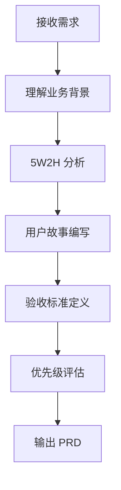
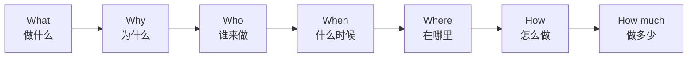
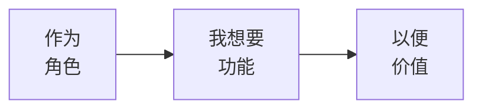
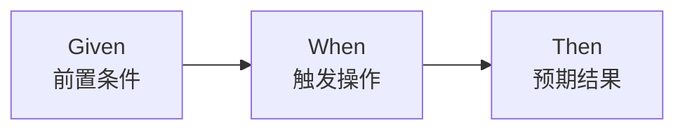

# 📋 需求分析规范

> **产品阶段** | **将需求转化为可执行方案** | **专业分析方法论**

---

## 📋 概述

**目标：** 将业务需求转化为清晰的技术实现方案

**核心方法：**
- 5W2H 分析法
- 用户故事
- 验收标准（Given-When-Then）
- 需求优先级评估

---

## 🎯 分析流程



---

## 📚 专业知识讲解

### 5W2H 分析法



**应用示例：**

| 要素 | 问题 | 订单管理需求示例 |
|------|------|-----------------|
| What | 是什么？ | 订单管理系统 |
| Why | 为什么做？ | 提升订单处理效率 |
| Who | 谁用？ | 管理员、用户 |
| When | 什么时候？ | 2 周内上线 |
| Where | 在哪里？ | Web 端 |
| How | 怎么做？ | Laravel + Filament |
| How much | 做多少？ | 3 个核心模块 |

### 用户故事三要素



**标准格式：**
```
作为 <角色>
我想要 <功能>
以便 <价值>
```

**示例：**
```
作为 管理员
我想要 查看订单列表
以便 及时处理订单
```

### 验收标准 (Given-When-Then)



**标准格式：**
```
Given <前置条件>
When  <触发操作>
Then  <预期结果>
```

**示例：**
```
Given 订单状态为 pending
When  管理员点击"发货"按钮
Then  订单状态变为 shipped
```

### 需求优先级评估 (MoSCoW)

| 优先级 | 说明 | 占比 |
|--------|------|------|
| **Must have** | 必须有 | 60% |
| **Should have** | 应该有 | 20% |
| **Could have** | 可以有 | 15% |
| **Won't have** | 不做 | 5% |

---

## 📝 分析模板

```markdown
# 需求分析报告

## 📋 基本信息
- 需求名称: {name}
- 分析人: {person}
- 分析日期: {date}

## 🎯 业务目标
{用一句话描述业务目标}

## 👥 目标用户
| 用户角色 | 使用场景 | 核心需求 |
|---------|---------|---------|
| {role} | {scenario} | {need} |

## 📦 功能范围
### Must have（必须有）
1. {feature 1}
2. {feature 2}

### Should have（应该有）
1. {feature 1}

### Could have（可以有）
1. {feature 1}

### Won't have（不做）
1. {exclusion 1}

## 📊 用户故事

### US-001: {标题}
**作为** {role}
**我想要** {feature}
**以便** {value}

**验收标准：**
- Given {条件1}
- When {操作1}
- Then {结果1}

- Given {条件2}
- When {操作2}
- Then {结果2}

## 🔧 技术约束
- 性能要求: {requirements}
- 安全要求: {requirements}
- 兼容性要求: {requirements}

## ⚠️ 风险评估
| 风险 | 影响 | 缓解措施 |
|------|------|---------|
| {risk} | {impact} | {mitigation} |

## 📅 里程碑
| 里程碑 | 时间 | 交付物 |
|--------|------|--------|
| 需求评审 | {date} | PRD 文档 |
| 架构设计 | {date} | 架构文档 |
| 开发完成 | {date} | 代码 |
| 测试完成 | {date} | 测试报告 |
| 上线 | {date} | 生产环境 |
```

---

## 💡 最佳实践

### 分析原则

1. **用户为中心**：始终从用户角度思考
2. **量化需求**：用数据说话，避免模糊描述
3. **明确边界**：清楚做什么，更清楚不做什么
4. **验证需求**：通过用户访谈验证假设
5. **迭代优化**：需求是演进的，不是一次性的

### 常见陷阱

| 陷阱 | 说明 | 解决方案 |
|------|------|---------|
| **需求模糊** | "做个好用的系统" | 量化需求，明确指标 |
| **需求镀金** | 过度设计 | 聚焦核心需求 |
| **需求蔓延** | 范围不断扩大 | 明确边界 |
| **假设需求** | 没有验证就开发 | 用户访谈验证 |

---

**版本**: v1.0 | **更新日期**: 2026-04-30
