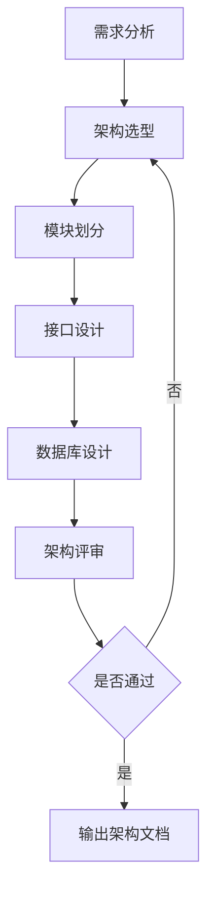
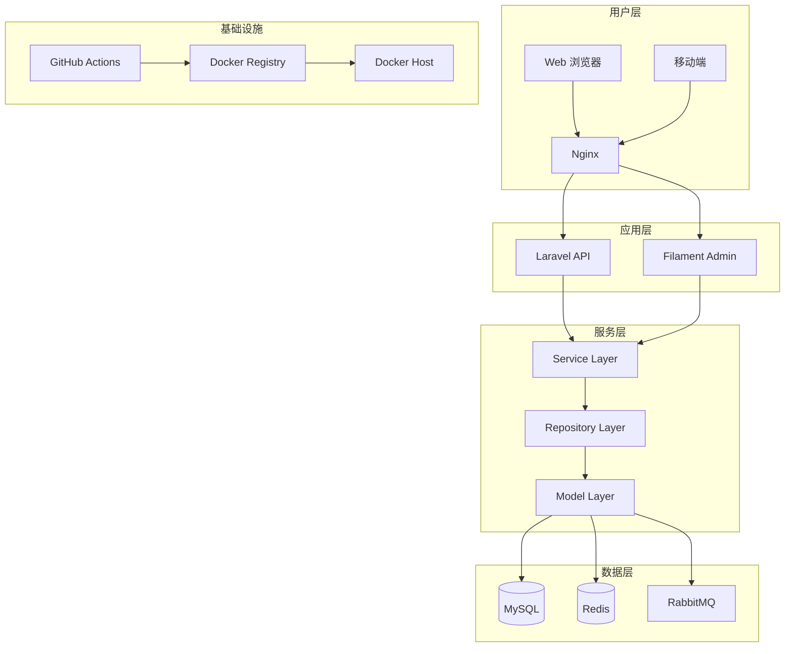
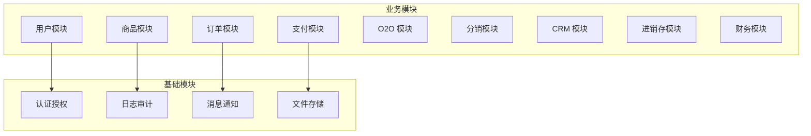
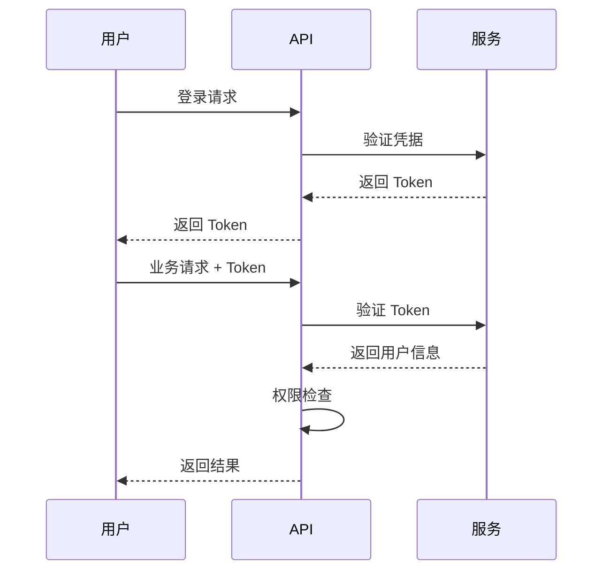
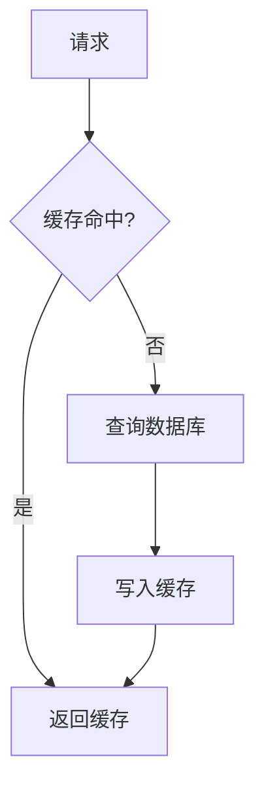

# 🏗️ 系统架构设计规范

> **架构阶段** | **一人公司 Web 项目** | **Laravel 12 + Filament 3.x**

---

## 📋 概述

**技术栈：**
- 后端：Laravel 12 + PHP 8.2
- 前端：Vue 3 + Vite + TailwindCSS
- 数据库：MySQL 8.0 + Redis 7.0
- 消息队列：RabbitMQ
- 部署：Docker + Docker Compose

---

## 🎯 架构设计流程



---

## 🏛️ 系统架构图

### 整体架构



### 模块划分



---

## 📁 目录结构规范

### 后端目录结构

```
app/
├── Domains/                    # 领域层
│   ├── User/                   # 用户域
│   │   ├── Models/
│   │   ├── Services/
│   │   ├── Events/
│   │   └── Exceptions/
│   ├── Product/                # 商品域
│   ├── Order/                  # 订单域
│   └── ...
│
├── Infrastructure/             # 基础设施层
│   ├── Repositories/
│   ├── Services/
│   └── Events/
│
├── Filament/                   # Filament 后台
│   ├── Resources/
│   ├── Widgets/
│   └── Pages/
│
├── Http/                       # HTTP 层
│   ├── Controllers/
│   ├── Requests/
│   └── Middleware/
│
└── Console/                    # 命令行
    └── Commands/
```

### 前端目录结构

```
resources/
├── js/
│   ├── components/             # 组件
│   ├── composables/            # 组合式函数
│   ├── pages/                  # 页面
│   ├── stores/                 # 状态管理
│   ├── api/                    # API 调用
│   └── utils/                  # 工具函数
│
├── views/                      # Blade 视图
└── css/                        # 样式文件
```

---

## 🔌 接口设计规范

### RESTful API 设计

```yaml
# 资源命名
GET    /api/v1/products          # 获取商品列表
GET    /api/v1/products/{id}     # 获取商品详情
POST   /api/v1/products          # 创建商品
PUT    /api/v1/products/{id}     # 更新商品
DELETE /api/v1/products/{id}     # 删除商品

# 嵌套资源
GET    /api/v1/products/{id}/skus  # 获取商品的 SKU 列表
```

### 响应格式

```json
{
    "success": true,
    "data": {},
    "meta": {
        "current_page": 1,
        "per_page": 15,
        "total": 100
    }
}
```

### 错误响应

```json
{
    "success": false,
    "message": "验证失败",
    "errors": {
        "name": ["名称不能为空"],
        "price": ["价格必须大于0"]
    }
}
```

---

## 🔒 安全设计

### 认证授权



### 安全措施

| 层级 | 措施 | 说明 |
|------|------|------|
| **传输层** | HTTPS | 全站 HTTPS |
| **认证层** | JWT Token | 无状态认证 |
| **授权层** | RBAC | 角色权限控制 |
| **数据层** | 参数验证 | 输入验证 |
| **SQL** | 预编译语句 | 防止 SQL 注入 |
| **输出** | XSS 过滤 | 防止 XSS 攻击 |

---

## 📊 性能设计

### 缓存策略



### 缓存层级

| 层级 | 技术 | 场景 |
|------|------|------|
| **L1** | OPcache | PHP 代码缓存 |
| **L2** | Redis | 数据缓存 |
| **L3** | CDN | 静态资源缓存 |

### 性能指标

| 指标 | 目标 | 说明 |
|------|------|------|
| **API 响应时间** | < 200ms | P95 |
| **页面加载时间** | < 2s | 首屏加载 |
| **数据库查询** | < 50ms | 单次查询 |
| **并发用户** | > 1000 | 同时在线 |

---

## 📋 架构决策记录 (ADR)

### ADR 模板

```markdown
# ADR-{序号}: {标题}

## 状态
{提议/接受/废弃/替代}

## 上下文
{描述决策背景}

## 决策
{描述决策内容}

## 理由
{说明为什么这样决策}

## 后果
{说明决策带来的影响}
```

### 示例：选择 Laravel 框架

```markdown
# ADR-001: 选择 Laravel 框架

## 状态
接受

## 上下文
需要选择一个 PHP Web 框架来开发电商系统。

## 决策
选择 Laravel 12 作为后端框架。

## 理由
1. Laravel 生态完善，有丰富的扩展包
2. 文档完善，社区活跃
3. 内置认证、队列、缓存等功能
4. Filament 后台管理框架支持良好

## 后果
1. 开发效率高
2. 维护成本低
3. 团队学习曲线平缓
```

---

## 📊 架构评审清单

| 检查项 | 说明 | 状态 |
|--------|------|------|
| 模块划分 | 职责是否清晰？ | ⬜ |
| 接口设计 | 是否符合 RESTful？ | ⬜ |
| 数据模型 | 是否满足范式？ | ⬜ |
| 安全设计 | 是否有安全漏洞？ | ⬜ |
| 性能设计 | 是否满足性能要求？ | ⬜ |
| 可扩展性 | 是否易于扩展？ | ⬜ |
| 可维护性 | 是否易于维护？ | ⬜ |

---

**版本**: v1.0 | **更新日期**: 2026-04-30
